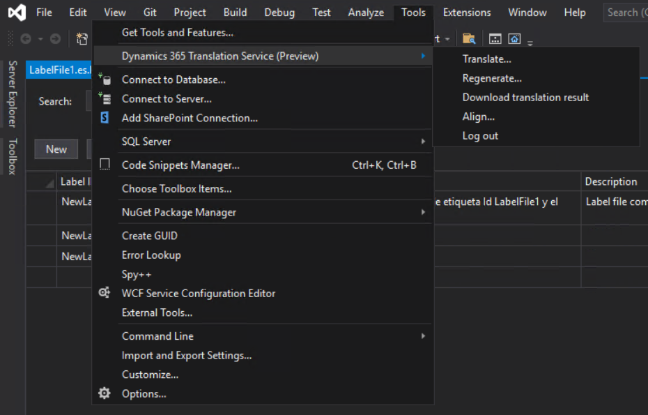
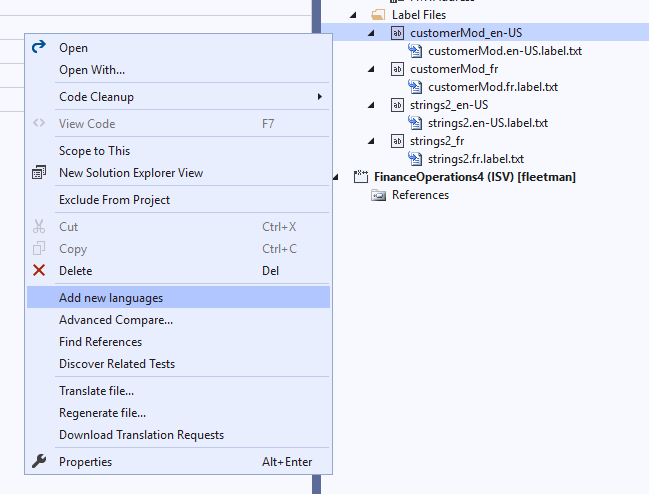
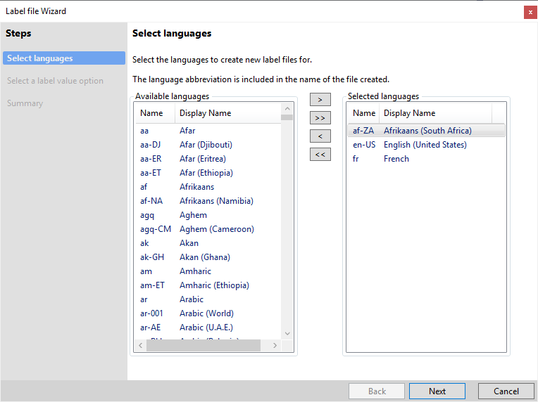
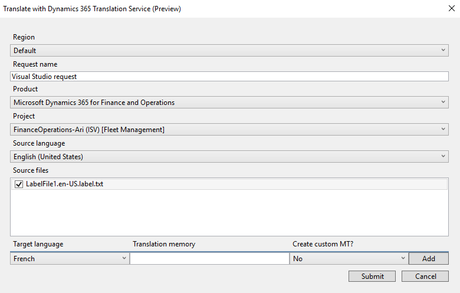
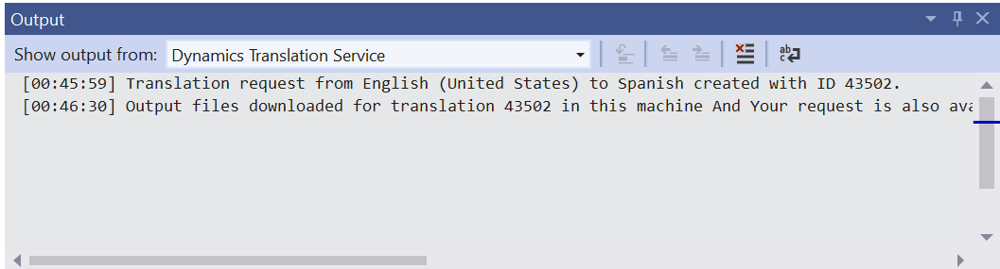
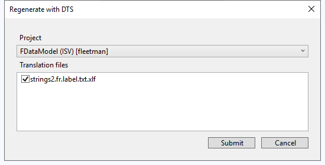

---
# required metadata

title: Dynamics 365 Translation Service Visual Studio extension (Private Preview)
description: This topic explains how to integrate the Microsoft Dynamics 365 Translation Service (DTS) extension for Visual Studio into your Visual Studio workflow.
author: abmotgi
ms.date: 12/13/2021
ms.topic: article
audience: IT Pro
ms.reviewer: sericks
ROBOTS: NOINDEX, NOFOLLOW
ms.search.region: Global
ms.author: abmotgi
ms.search.validFrom: 2021-12-13

---

# Dynamics 365 Translation Service Visual Studio extension (Private Preview)

[!include[banner](../includes/banner.md)]
[!include[preview banner](../includes/preview-banner.md)]

The Microsoft Dynamics 365 Translation Service (DTS) extension for Visual Studio lets developers perform actions in DTS directly from their Visual Studio integrated development environment (IDE). For example, you can translate user interface (UI) files and regenerate the translations. For more information about the supported functionality, see [Dynamics 365 Translation Service overview](translation-service-overview.md).

To use the DTS Visual Studio extension, you must have access to Microsoft Dynamics Lifecycle Services (LCS). Additionally, the extension is intended primarily to support the development workflow for Finance and Operations apps in Visual Studio. For more information, see [Development and administration for Finance and Operations apps](/dynamics365/fin-ops-core/dev-itpro/).

> [!NOTE]
> The DTS Visual Studio extension is available only as a private preview. Because DTS is currently deployed only in the United States, your data might be processed and stored outside your geopolitical boundary.

## Installing the extension

Before you can download the DTS Visual Studio extension, you must request access to the private preview. After access is granted, you can download the Visual Studio extension from [Visual Studio Marketplace](https://marketplace.visualstudio.com/).

Download and install the extension to your Visual Studio development environment. After you install the extension, the **Tools** menu should include new commands that were added from DTS.

## Using the extension

### Sign in to DTS

Before you can start to use the DTS Visual Studio extension, you must authenticate with LCS. You will automatically be prompted to sign in after you run the translation or regeneration command while you're in a signed-out state.

### Access the DTS commands

The DTS commands can be accessed in two ways:

- Select **Tools** on the main toolbar, and then select a DTS command on the menu. Four DTS commands are available: **Translate with DTS**, **Regenerate with DTS**, **Download Translation Requests**, and **Log out of DTS**.

    

- Select and hold (or right-click) a file in your solution, and then select a DTS command on the shortcut menu.

## Features

### Translation workflow

Before you translate any resource files, you should have the resource files for both the source language and the target language. If you already have the resource files for the source language, you can create the files for the target language by selecting and holding (or right-clicking) a source resource node and then selecting **Add new languages**.

The **Label file** wizard appears. Complete this wizard to create new label files for your desired languages. For guidance on using the label file wizard, see [How to: Create a Label File](/dynamicsax-2012/developer/how-to-create-a-label-file).

You're now ready to create a new translation request. On the **Tools** menu, select **Translate with DTS**. Alternatively, select and hold (or right-click) a resource file in Solution Explorer, and then select **Translate with DTS**. A dialog box appears, where you can configure the new translation request.

The following table describes the fields in the **Translate with DTS** dialog box.

| Field              | Required | Description |
|--------------------|----------|-------------|
| Request name       | Yes | Enter a name for the request. |
| Product            | Yes | Select the product type. |
| Project            | Yes | Select the project that contains the resource files. |
| Source language    | Yes | Select the language of the source files. |
| Source files       | Yes | Select one or more resource files for translation. This field lists all resource files that are referenced in the selected project. |
| Target language    | Yes | 
Select a language to translate the source files into.

<strong>Note:</strong> You can translate only into a target language that a resource file already exists for. Language names that are shown in bold are General Availability (GA) languages for Microsoft Dynamics products. Therefore, product-specific machine translation (MT) models are available in those languages, and the MT model is trained on the terminology for Microsoft Dynamics. For non-GA languages, the MT model uses the general domain training.
 |
| Translation memory | No | Add the translation memory files for a specific target language. (The value is the zip file that contains translation memories for recycling.) |
| Create custom MT?  | No | Select whether you want to use the uploaded translation memory to create a custom MT model. |

When you've finished configuring the translation request, select **Submit** to send it to DTS. After a short time, the **Output** window will show the status of the request. When the request is completed, output files (translation memory files and translated resource files) are downloaded. These output files are put in the appropriate language subfolder for the module.

If Visual Studio is closed before the output files are downloaded, you can manually download the files by selecting **Download Translation Request Results** on the **Tools** menu.

### Regeneration workflow

We recommend that you review and edit the translations that DTS provides. The XML Localization Interchange File Format (XLIFF) files will be in the same directory as their corresponding translated resource files. For more information about how to edit XLIFF files, see [Translation memory files](use-translation-service-tm.md).

When you've finished reviewing and editing the XLIFF translation files, you can regenerate the translated native format files. On the **Tools** menu, select **Regenerate with DTS**. Alternatively, select and hold (or right-click) a resource file in Solution Explorer, and then select **Regenerate with DTS**. A dialog box appears, where you can configure the regeneration request.

The following table describes the fields in the **Regenerate with DTS** dialog box.

| Input             | Required | Description |
|-------------------|----------|-------------|
| Project           | Yes | Select the project that is associated with the revised translation memories. |
| Translation files | Yes | 
Select one or more revised translation memory files. The files in the list are automatically identified and are the result of previous DTS translation requests.

Each revised translation memory file (.xlf file) that you select is used to regenerate the corresponding target native file. For example, **ExampleLabel.es.label.txt.xlf** will regenerate **ExampleLabel.es.label.txt**.
 |

When you've finished configuring the regeneration request, select **Submit** to send it to DTS. The **Output** window will show the status of the request. When the request is completed, output files (translation memory files and target translated files) are downloaded.
