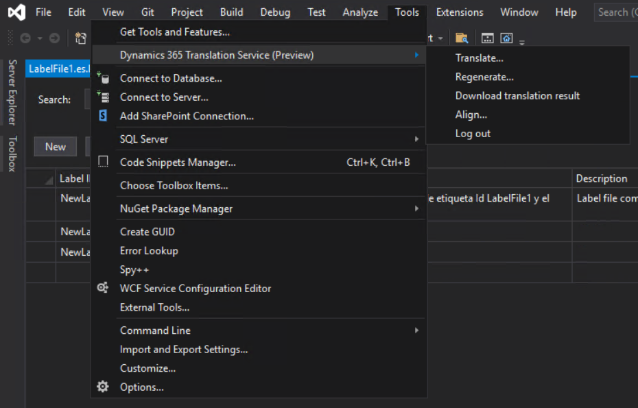
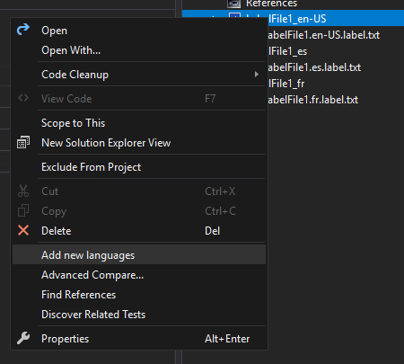
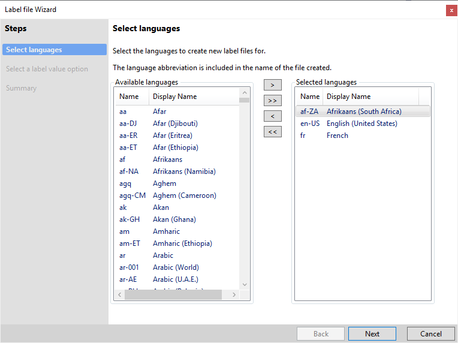
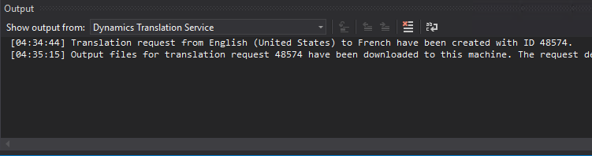
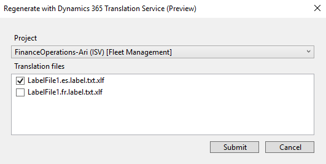

---
# required metadata

title: Dynamics 365 Translation Service Visual Studio extension
description: This article explains how to integrate the Microsoft Dynamics 365 Translation Service Visual Studio IDE extension into your Visual Studio workflow.
author: abmotgi
manager: 
ms.date: 
ms.topic: article
ms.prod: 
ms.service: dynamics-ax-applications
ms.technology: 

# optional metadata

# ms.search.form:
audience: IT Pro
# ms.devlang: 
ms.reviewer: sericks
ms.search.scope: Operations
# ms.tgt_pltfrm: 
# ms.custom:
ms.search.region: Global
# ms.search.industry:
ms.author: abmotgi
ms.search.validFrom: 2021-10-08
ms.dyn365.ops.version: 10.0.13
---

# Dynamics 365 Translation Service Visual Studio extension (Private Preview)
[!include[banner](../includes/banner.md)]

The Dynamics 365 Translation Service (DTS) extension for Microsoft Visual Studio lets developers perform actions in Microsoft Dynamics 365 Translation Service, directly from their Visual Studio IDE. For example, you can translate user interface files and regenerate the translations. For more information about the supported functionality, see [Dynamics 365 Translation Service overview](https://docs.microsoft.com/dynamics365/fin-ops-core/dev-itpro/lifecycle-services/translation-service-overview).

To use the DTS Visual Studio extension, you must have access to Dynamics Lifecycle Services. Additionally, the extension is primarily built to support the Microsoft Dynamics 365 Finance and Operations development workflow in Visual Studio. For more information, see [Development and administration for Finance and Operations apps](https://docs.microsoft.com/dynamics365/fin-ops-core/dev-itpro/).

>[!NOTE]
>The DTS extension for Visual Studio is available only as a private preview. Because DTS is currently deployed only in the United States, your data might be processed and stored outside your geopolitical boundary.

## Installing the Extension
Before you can download the DTS Visual Studio extension, you must first request access to the private preview. Once you've been granted access, you can download the Visual Studio extension from the Visual Studio Marketplace.

Download and install the extension to your Visual Studio development environment. Once you've installed the extension, you should see new menu items added from DTS under the Tools menu.

## Using the extension
### Log in to DTS
Before you can start using the DTS Visual Studio extension, you must authenticate with Dynamics Lifecycle Services. You will automatically be prompted to log in after running the translation or regeneration command in a logged out state.

### Accessing the DTS commands
The DTS commands can be accessed in two different ways. You can select the **Tools** menu from the main ribbon, and you'll see options for translating and regenerating files. 

You can also access the DTS commands by right clicking a file in your solution.

## Features
## Translate with DTS

| Input              | Required | Description | Notes |
|--------------------|----------|-------------|-------|
| Request name       |  Yes  |  Enter a name for the request.           |      |
| Product            |  Yes  | The product type.             |  Finance and Operations or Retail  |
| Project            |  Yes  |  The project containing the resource files.  | If your solution has multiple projects, you can use this dropdown to select the correct one.      |
| Source language    |  Yes  |    Language of the source file(s).   |       |
| Source files       |  Yes  |    Resource files for translation.       | The source file list will be populated with resource files referenced within the selected project. You may select one or more.       |
| Target language    |  Yes  |     Languages for source files to be translated into.        | You may only translate into a target language for which a resource file already exists. Language names that are shown in bold are General Availability (GA) languages for Microsoft Dynamics products. Therefore, product-specific machine translation (MT) models are available in those languages, and the MT model is trained on the terminology for Microsoft Dynamics. For non-GA languages, the MT model uses the general domain training.     |
| Translation memory |  No   | Translation memory file(s) for a particular target langauge. |  .zip file containing TMs for recycling.    |
| Train MT with TM?  |  No   |     Option to create a custom MT with the uploaded translation memory.        |       |

## Translation workflow

Before translating any resource files, you should have both the source language and target language resource files. If you already have the resource files for the source language, you can create the target language files by right-clicking on a source resource node and selecting "add new languages". 

This will open the label file wizard, allowing you to create new label files for your desired languages.

Now you are ready to create a new translation request. You can access the translation command from the main ribbon at `Tools > Translate with DTS...` with DTS or by right-clicking a resource file in the solution explorer. Upon running the command, a dialog window will appear, allowing you to configure the new translation request.

Fill in each field, using the table above for guidance. After you have configured the request, use the submit button to send the request to DTS. Shortly after, you'll see the status of the request from the output window. Upon completion, translation memory files and translated resource files will be downloaded. The output files will be placed in the appropriate language subfolder for the module.

If Visual Studio is closed before the results are downloaded, you can manually download them using the download pending requests menu item found at `Tools > Download Translation Request Results` . 

## Regenerate with DTS
| Input             | Required | Description | Notes |
|-------------------|----------|-------------|-------|
| Project           |  Yes  |  The project associated with the revised translation memories.           |       |
| Translation files |  Yes  |     Revised translation memory file(s).    | These files are identified automatically and are the result of previous DTS translation requests.      |

## Regeneration workflow

We recommend that you review and edit the translations that DTS provides. The XLIFF files will be in the same directory as their corresponding translated resource files.  For more information about how to edit the XLIFF file, see [Translation memory files](https://docs.microsoft.com/dynamics365/fin-ops-core/dev-itpro/lifecycle-services/use-translation-service-tm).

After you've finished review and editing the XLIFF translation files, you may use the regenerate command to regenerate the translated native format files. You can access the regenerate command from the main ribbon at  `Tools > Regenerate with DTS...` with DTS or by right-clicking a resource file in the solution explorer. 
Upon running the command, a dialog window will appear allowing you to configure the regeneration request. Select one or more translation memory (.xlf) you modified to regenerate the respective target native file. (Ex: ‘ExampleLabel.es.label.txt.xlf’ will regenerate ‘ExampleLabel.es.label.txt’).

The Output window will show the status of the DTS request.​

Once the request is completed, output files (translation memory and target translated file) will be downloaded.

