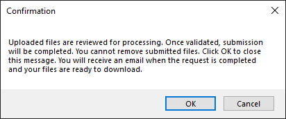
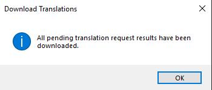
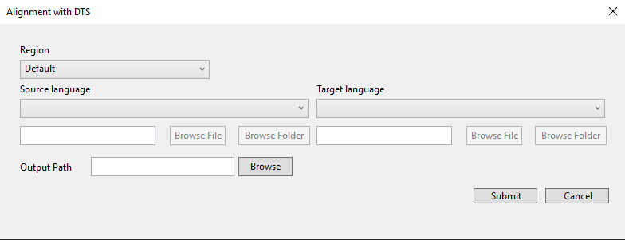
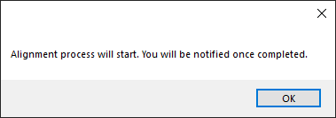
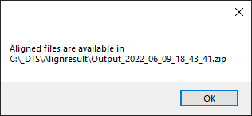

# Dynamics 365 Translation Service Visual Studio extension

[!include[banner](../includes/banner.md)]

The Microsoft Dynamics 365 Translation Service (DTS) extension for Visual Studio lets finance and operations developers perform actions in DTS directly from their Visual Studio integrated development environment (IDE). For example, you can translate user interface (UI) files and regenerate the translations. For more information about the supported functionality, see [Dynamics 365 Translation Service overview](translation-service-overview.md).

To use the DTS Visual Studio extension, you must have access to Microsoft Dynamics Lifecycle Services (LCS). Additionally, the extension is intended primarily to support the development workflow for finance and operations apps in Visual Studio. For more information, see [Development and administration for finance and operations apps](/dynamics365/fin-ops-core/dev-itpro/). 

## Installing the extension

You can download the Visual Studio extension from [Visual Studio Marketplace](https://marketplace.visualstudio.com/).

Download and install the extension to your Visual Studio development environment. After you install the extension, the **Tools** menu should include new commands that were added from DTS. This extension only supports finance and operations app localization.

## Using the extension

### Sign in to DTS

Before you can start to use the DTS Visual Studio extension, you must authenticate with LCS. You will automatically be prompted to sign in after running any command while you're in a signed-out state.

### Access the DTS commands

The DTS commands can be accessed in two ways:

- Select **Tools** on the main toolbar, select **Dynamics 365 Translation Service**, and then select a DTS command from the menu. Five DTS commands are available: **Translate**, **Regenerate**, **Download translation result**, **Align**, and **Log out**.

    

- Select and hold (or right-click) a file in your solution, and then select a DTS command on the shortcut menu.

## Features

### Translation workflow

Before you translate any resource files, you should have the resource files for both the source language and the target language. If you already have the resource files for the source language, you can create the files for the target language by selecting and holding (or right-clicking) a source resource node and then selecting **Add new languages**.

The **Label File Wizard** appears. Complete this wizard to create new label files for your desired languages. For guidance on using the label file wizard, see [How to: Create a Label File](/dynamicsax-2012/developer/how-to-create-a-label-file).

You're now ready to create a new translation request. On the **Tools** menu, select **Dynamics 365 Translation Services**, and then select **Translate**. A dialog box appears, where you can configure the new translation request.

The following table describes the fields in the **Translate with Dynamics 365 Translation Service** dialog box.

| Field              | Required | Description |
|--------------------|----------|-------------|
| Region             | Yes | Leave the default value, unless it is required to change. |
| Request name       | Yes | Enter a name for the request. |
| Product            | Yes | Select the product type. |
| Project            | Yes | Select the project that contains the resource files. |
| Source language    | Yes | Select the language of the source files. |
| Source files       | Yes | Select one or more resource files for translation. This field lists all resource files that are referenced in the selected project. |
| Target language    | Yes | 
Select a language to translate the source files into.

<strong>Note:</strong> You can translate only into a target language that a resource file already exists for. Language names that are shown in bold are General Availability (GA) languages for Microsoft Dynamics products. Therefore, product-specific translation memories (TM) and machine translation (MT) models are available in those languages.  The MT models are trained on the terminology for Microsoft Dynamics. For non-GA languages, the general domain MT models are used.
 |
| Translation memory | No | Add the translation memory files for a specific target language. (The value is the zip file that contains translation memories for recycling.) |
| Create custom MT?  | No | Select whether you want to use the uploaded translation memory to create a custom MT model. |

When you've finished configuring the translation request, select **Submit** to send it to DTS. You will receive a confirmation window stating the next steps.

After a short time, the Output window will show the status of the request (unless the **Create custom MT?** option is selected). 

When the request is completed, you will see a Download Translation window stating that the output files (translation memory files and translated resource files) have been downloaded. These output files are put in the appropriate language subfolder for the module.

If Visual Studio is closed before the output files are downloaded, you can manually download the files by selecting **Download translation results** on the **Tools** menu.

### Regeneration workflow

We recommend that you review and edit the translations that DTS provides. The XML Localization Interchange File Format (XLIFF) files will be in the same directory as their corresponding translated resource files. For more information about how to edit XLIFF files, see [Translation memory files](use-translation-service-tm.md).

When you've finished reviewing and editing the XLIFF translation files, you can regenerate the translated native format files. On the **Tools** menu, select **Dynamics 365 Translation Services**, and then select **Regenerate**. A dialog box appears, where you can configure the regeneration request.

The following table describes the fields in the **Regenerate** dialog box.

| Input             | Required | Description |
|-------------------|----------|-------------|
| Project           | Yes | Select the project that is associated with the revised translation memories. |
| Translation files | Yes | 
Select one or more revised translation memory files. The files in the list are automatically identified and are the result of previous DTS translation requests.

Each revised translation memory file (.xlf file) that you select is used to regenerate the corresponding target native file. For example, **ExampleLabel.es.label.txt.xlf** will regenerate **ExampleLabel.es.label.txt**.
 |

When you've finished configuring the regeneration request, select **Submit** to send it to DTS. The **Output** window will show the status of the request. When the request is completed, you will see a Download Translation window stating that output files (translation memory files and target translated files) have been downloaded by overwriting the previous outputs.

### Creating a translation memory (alignment)

If you have label resource files that were previously translated, you can recycle the translation for a newer version of the source files by creating a translation memory (TM) that uses XLIFF.

On the **Tools** menu, select **Dynamics 365 Translation Services**, and then select **Align**. A dialog box appears, where you can configure the alignment request.

| Field              | Required | Description |
|--------------------|----------|-------------|
| Region             | Yes | Leave the default value, unless it is required to change. |
| Source Language    | Yes | Select the language of the source files. Select a label file or folder containing the label files. |
| Target Language    | Yes | Select the language of the target files and upload the file or folder. |
| Output Path        | Yes | Select the output path. |

When you have finished configuring the alignment request, select **Submit** to send it to DTS. You will be notified that the process has started.

The **Output** window will show the status of the request. When the request is completed, you will see a window stating that output files are available.

