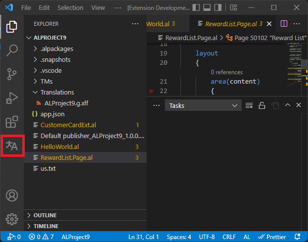
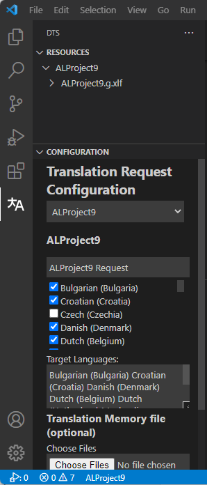
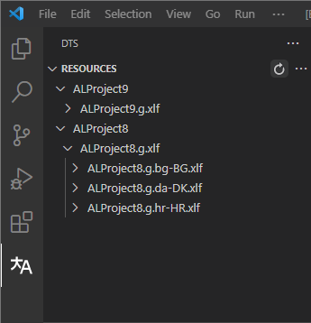
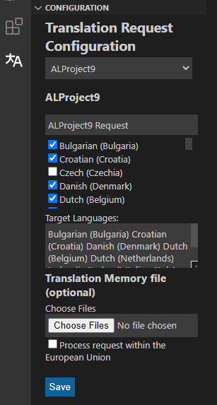
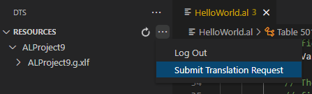
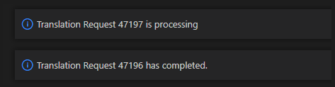
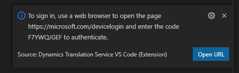
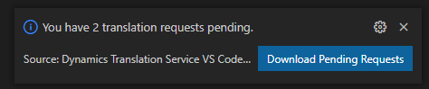

# Dynamics 365 Translation Service Visual Studio Code extension

[!include[banner](../includes/banner.md)]

The Microsoft Dynamics 365 Translation Service (DTS) extension for Visual Studio Code (VS Code) lets users interact with DTS from the VS Code editor. This extension was created for Dynamics 365 Business Central users who develop extensions in AL. It provides a user interface (UI) for creating, submitting, and retrieving new DTS translation requests.

Before you start, you should be familiar with development in AL. You should also know how to work with translation files in the Business Central development environment. For more information, see the following topics:

- [Developing extensions in AL](/dynamics365/business-central/dev-itpro/developer/devenv-dev-overview)
- [Working with translation files](/dynamics365/business-central/dev-itpro/developer/devenv-work-with-translation-files)

## Install VS Code and the DTS extension

If you haven't already done so, install [VS Code](https://code.visualstudio.com/).

Next, install the DTS extension for VS Code from the Visual Studio Marketplace. For more information about how to install extensions, see [Extension Marketplace](https://code.visualstudio.com/docs/editor/extension-marketplace).

## Access the DTS extension

The extension is only functional from inside an AL workspace. You may have multiple AL Projects in a workspace, but each project should follow the directory structure shown below. Before using the extension, you should generate your translation files which will populate the Translations folder. If you don't yet have any translation files, see [Working with translation files](/dynamics365/business-central/dev-itpro/developer/devenv-work-with-translation-files) for information about how to generate them.

 To access the extension, select the DTS icon in the Activity Bar on the side of the VS Code window, as shown below.

The DTS view is opened. It consists of the resource file explorer and the translation request configuration view. Note that the resources view will be empty if no valid translation files are found under the Translations Folder.

## Resource file explorer

The resource file explorer provides a tree view that you can use to navigate your project's resources.

The following illustration shows an example where you're working with multiple AL project folders in one workspace. To view the translation files for a given source XLIFF, select the source node to expand it. You can also use the **Refresh** button if the tree view wasn't automatically updated after a translation job.

## Configure translation requests

Follow these steps to configure a translation request.

1. In the translation request configuration view, select the AL project that you want to configure. Unless you're working with multiple AL project folders in one workspace, only one project will be available.
2. In the **Target Languages** list, select the target languages.
3. If you have any XLIFF files to recycle, you can add them by using the **Choose Files** button.
4. If you want all data to be processed in the European Union (EU), select the **Process request within the European Union** checkbox.
5. Select **Save**.

## Submit translation requests

Before you submit a new translation request, make sure that you've saved the configuration for translation requests. That configuration will be used for all future requests, unless it's overridden by a new save operation.

To submit a new request, select the ellipsis button (**...**) in the resource file explorer, and then select **Submit Translation Request** on the menu.

 

You will receive a notification when the processing of the request begins and another notification when it's completed.

Each translation file is written to the folder where the source translation file is located.

## Authentication

If you aren't signed in, you're prompted to authenticate. Make a note of the authentication code in the prompt, and then select **Open URL**.

A new web browser window should be opened. If a new browser window isn't opened, open one, and then, in the address bar, enter the URL from the prompt. In the browser window, enter the authentication code. You will be redirected to a sign-in page. Sign in by using your credentials.

## Pending requests

If you terminate your VS Code session before all translation requests have been downloaded, you will receive a notification that lets you download the completed requests.

