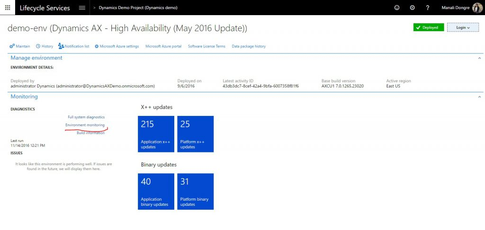

---
# required metadata

title: Monitoring and diagnostics tools in Lifecycle Services (LCS)
description: This topic describes the tools that Microsoft Dynamics Lifecycle Services provides to help you monitor, diagnose, and analyze the health of the environments.
author: angelmarshall
ms.date: 08/23/2021
ms.topic: article
ms.prod: 
ms.technology: 

# optional metadata

# ms.search.form: 
# ROBOTS: 
audience: Developer, IT Pro
# ms.devlang: 
ms.reviewer: sericks
# ms.tgt_pltfrm: 
ms.custom: 267184
ms.assetid: eb056816-ccf4-43a5-aed3-cf72543353de
ms.search.region: Global
# ms.search.industry: 
ms.author: tsmarsha
ms.search.validFrom: 2016-11-30
ms.dyn365.ops.version: Version 1611

---

# Monitoring and diagnostics tools in Lifecycle Services (LCS)

[!include [banner](../includes/banner.md)]

This topic describes the various tools that Microsoft Dynamics Lifecycle Services (LCS) provides to help you monitor, diagnose, and analyze the health of the Finance and Operations environments that you manage.

To have a successful onboarding experience to the cloud service, you must know the health of your environments at all times. You must also be able to troubleshoot any health issues that occur. Microsoft Dynamics Lifecycle Services (LCS), which is the administration center, contains a collection of monitoring and diagnostics tools that can help to ensure that you have an accurate view of the environments that you manage.

## Telemetry data

The telemetry data that is the basis of the Monitoring and diagnostics portal in LCS has three primary use cases: monitoring, diagnostics, and analytics. 

### Monitoring

In business operations software, you should always know whether your environment is up and running, so that it can perform business operations. You should also be able to easily view the health of the environment through LCS. Microsoft supports two types of monitoring capabilities:

- **Availability monitoring** – This type of monitoring performs a check against the environment to make sure that it's available at all times. If the check fails, the Microsoft Service Engineering team is immediately notified.
- **Health monitoring** – In addition to availability checks, some basic health checks must be performed. These health checks span various components, such as Application Object Server (AOS), Batch Framework, Data Management Framework, Microsoft Azure SQL, and Management Reporter. These checks are done based on multiple data sources, such as the telemetry that is collected from the environments, checks that are done by a watchdog service that continuously monitors the environment, and CPU counters and other system-level counters that the environment emits. Some health checks are self-healing and are mitigated immediately. However, other health checks are reported to the Microsoft Service Engineering team for investigation.

### Diagnostics

When a user reports an issue, you can use various tools in LCS for troubleshooting. The rich set of telemetry data helps you build a storyboard view that shows what that user and other users were doing when the issue was reported. In addition to user activity tracking, a rich set of SQL data is available for performance troubleshooting.

### Analytics

Analytics is another critical use case for the telemetry data that is collected. Currently, only Microsoft can perform analytics, so that it can gauge and understand feature usage and performance through Microsoft Power BI.

## Responsibilities

For a managed cloud service such as Finance and Operations, Microsoft is responsible for actively monitoring the health of production environments at all times. If a customer's environment is affected by an issue, the Microsoft Service Engineering team is immediately alerted. The team will start to investigate the issue and will work with you to find a resolution. However, you're responsible for proactively or reactively monitoring and troubleshooting the health of non-production environments.

## Access the Monitoring and diagnostics portal

1. Open LCS, and navigate to the appropriate project.
2. In the **Environments** section, select the environment to view, and then select **Full details**.
3. On the environment details page, select **Environment monitoring** to open the Monitoring and diagnostics portal. 

## Tools

Several tools and resources are available in the Monitoring and diagnostics portal. 

> [!NOTE]
> Not all environments contain all the tools. The following table shows the tools that are available for each type of environment.

<table>
<thead>
<tr>
<th>Environment type</th>
<th>Tools</th>
</tr>
</thead>
<tbody>
<tr>
<td>Production systems</td>
<td><ul>
<li>Activity monitoring</li>
<li>Environment monitoring</li>
<li>SQL insights</li>
<li>System diagnostics</li>
</ul></td>
</tr>
<tr>
<td>User acceptance testing (UAT)/sandbox</td>
<td><ul>
<li>Activity monitoring</li>
<li>SQL insights</li>
<li>System diagnostics</li>
</ul></td>
</tr>
<tr>
<td>Demo/build</td>
<td><ul>
<li>Activity monitoring</li>
<li>System diagnostics</li>
</ul></td>
</tr>
<tr>
<td>Environments deployed in customer/partner subscriptions</td>
<td><ul>
<li>System diagnostics</li>
</ul></td>
</tr>
</tbody>
</table>

### Monitoring dashboard

On the **Environment monitoring** page, select the **Health metrics** tab to view the **Monitoring** dashboard. Health metrics are collected for every machine and component. These health metrics include CPU usage, available memory, errors logged per second, and batch heartbeat. You're alerted about any abnormalities in the metrics. Although some alerts are self-healing, the Microsoft Service Engineering team will investigate the cause of other alerts and then take action to mitigate them. You can view the health monitors for a specific area to see what is occurring.

### Activity monitoring

On the **Environment monitoring** page, select the **Activity** tab to use the Activity monitoring tool. This tool provides a storyboard view that shows what you or another user was doing during a specific period. 

- The **User interaction** chart shows a user's activities on various machines in the environment and the SQL utilization trend.
- The **User load** section shows all the system users. Each chart shows the time that the user spent on a specific machine.
- The **Activity load** section shows the activities that were performed on each machine. If you hover over an activity, you see the Form:Control:Action as a tuple. For example, if you look at LedgerJournal:New:Click in this section, you can see that user A opened the **LedgerJournals** page and selected the **New** button to create a new journal entry.
- The **User activity** grid shows the various activities that users performed, based on their session timestamp.

You can use the filters on this page to narrow the information logs. Here are some of the filters that are available:

- **Time duration** – Go back 60 minutes from the selected date and time.
- **User** – View a specific user's activities.
- **Search terms** – Create a search that is based on the issue that is being investigated.

> [!NOTE]
> The page doesn't load data by default. To load the data that is required in order to show the page, you must select the time duration and then select **Submit time**.

> [!IMPORTANT]
> The Activity monitoring tool retains data for only 30 days.

### Raw information logs

For advanced troubleshooting, you can view raw information logs. You can use a set of predefined queries to get raw logs for an issue. You can then export the logs to do more advanced analysis. The following types of queries are available:

- Slow queries
- Deadlocks
- Crashes
- Financial reporting issues

For information about how to use Azure Data Explorer with raw information logs, see [Use Azure Data Explorer to query raw information logs](azure-data-explorer.md).

### SQL insights

The Monitoring and diagnostics portal also includes advanced SQL troubleshooting tools to enable performance analysis. Some of these tools are similar to the DynPerf tool that was used for SQL troubleshooting in Microsoft Dynamics AX 2012. For more details, see [Performance troubleshooting using tools in Lifecycle Services (LCS)](performancetroubleshooting.md).

[!INCLUDE[footer-include](../../../includes/footer-banner.md)]
