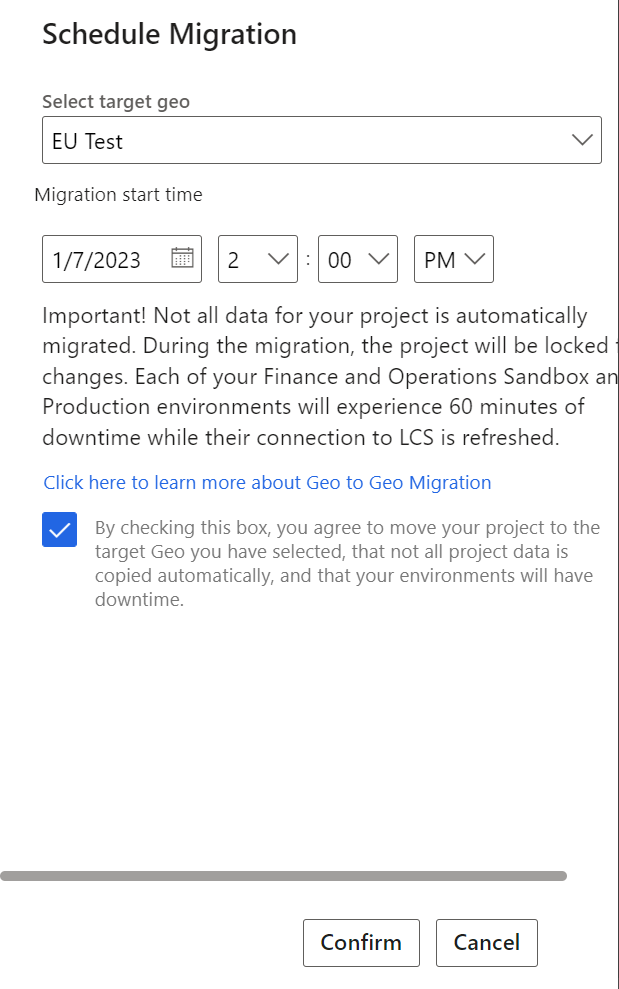

---
# required metadata

title: Project migration manager
description: This article explains how to use the Project migration manager to move your project from one Microsoft Dynamics Lifecycle Services geography to another.
author: LaneSwenka
ms.date: 04/21/2023
ms.topic: article
ms.prod:
ms.technology:

# optional metadata

# ms.search.form:
# ROBOTS:
audience: IT Pro, Developer
# ms.devlang:
ms.reviewer: sericks
# ms.tgt_pltfrm:
ms.custom: 257614
ms.assetid: 558598db-937e-4bfe-80c7-a861be021db1
ms.search.region: Global
# ms.search.industry:
ms.author: laswenka
ms.search.validFrom: 2016-09-30
ms.dyn365.ops.version: AX 7.0.0

---

# Project migration manager

[!include [banner](../includes/banner.md)]
[!include [banner](../includes/preview-banner.md)]

The Microsoft Dynamics Lifecycle Services Project migration manager lets you move your project data from one geography (or geo) to another geography that Lifecycle Services supports. This article describes the terminology and supported scenarios for this functionality, and provides answers to frequently asked questions.

## Move projects to new geographies

The Project migration manager lets you move your Lifecycle Services project from one geography to another geography that meets your requirements. However, it's important that you understand why you might want to move your project in this way.

Originally, Lifecycle Services supported only one instance (<https://lcs.dynamics.com/>), which served as the global endpoint for all customers. However, because of recent regulatory trends across the industry, customers and software vendors are now required to keep data within a geographic boundary. Therefore, Lifecycle Services has started to deploy geography-specific instances, so that customers can have all their project data in the desired location. For more information about the different geographies that are available, see [Dynamics 365 Finance, Supply Chain Management, and Commerce in local geographies](/dynamics365/fin-ops-core/dev-itpro/deployment/deployment-options-geo).

> [!NOTE]
> During the preview, new geographies will be supported over time starting with "EU". For a full list of geographies that will become available, visit [Dynamics 365 Finance, Supply Chain Management, and Commerce in local geographies](/dynamics365/fin-ops-core/dev-itpro/deployment/deployment-options-geo). 

There are some limitations to this functionality in terms of all the data that is automatically transferred. These limitations will be described later in this article.

## Data that can be transferred between instances

The Project migration manager can be used to transfer data within cloud implementation projects and partner projects for Finance and Operations apps. Other types of projects aren't yet supported.

The following table shows the data that can be transferred between instances and the actions that can be used to transfer it.

| Migration method | Feature | Details |
|------------------|---------|---------|
| Automated | Business process modeler | |
| Automated | Methodologies | The state of the methodology isn't migrated. You can manually complete stages as required in the target project. |
| Automated | Commerce | Metadata is moved for the Commerce Scale Unit (CSU) and other Commerce functionality.  This doesn't migrate the CSU, but rather ensures it'is available for use in the target project.  |
| Automated | Self-service environments | Metadata is moved for the Sandbox and Production environments.  This doesn't migrate the actual environment to a new geography, but rather ensures it's available for use in the target project for applying updates, database movement, and other admin activities. |
| Automated | Subscription estimator | |
| Automated | Project onboarding | |
| Automated | Project settings | Azure connectors aren't migrated.  Update schedules are migrated, but paused updates aren't.  These aspects can be manually configured in the target project. |
| Automated | Support | |
| Automated | Work items | |
| Automated | Organization users | Only users who were in the source project are created as organization users in the target Lifecycle Services geography. |
| Automated | Project users | Only project owners from the tenant that owns the source project are migrated to the target Lifecycle Services project. | 
| Automated | Asset library | Only the last application or merged software deployable package asset that was applied to your sandbox or production environments is automatically migrated. |
| Manual | Asset library | You'll be able to download and manually upload assets in the target project. You don't have to move all assets. You can move only assets that you require. |
| Manual | Self-service environments | Sandbox and production environments will remain in their current deployed region and aren't affected by the Project migration manager. They'll have the same environment IDs but will be in a new project. If you must move your environment to a different region, follow the [Geo-to-geo migrations](/dynamics365/fin-ops-core/dev-itpro/deployment/geo-to-geo-migrations) article.|
| Manual | Cloud-hosted environments | Azure connectors can be manually reconfigured, and new environments can be deployed in the target after migration. After migration, the source project will be locked but you'll still be allowed to delete cloud-hosted environments from the source to clean up the older project. |
| Manual | Project users | Remaining users must be added manually by project owners. |
| Not supported | System diagnostics | System diagnostics data can't be exported. However, new diagnostics will be generated from your environments in the target project after migration. |
| Not supported | Upgrade analysis | This feature is deprecated.  Upgrade analysis data can't be exported. |
| Not supported | Globalization | Regulatory alerts aren't transferrable between projects. |
| Not supported | Code upgrade | Code upgrade data can't be exported. However, you can start a new code upgrade in the target project after migration. |
| Not supported | Translation service | Translation service data can't be exported. However, you can start a new translation request in the target project after migration. |
| Not supported | Environment history | History isn't transferred for environments, they start new in the target project.  However, you can access and download the history from the source project using the **Export to excel** button from each history page. |

You're responsible for migrating data that requires manual migration. However, you aren't required to migrate any or all of this data. You might choose to migrate only your most recent assets from the Asset library. Alternatively, you might choose to re-create developer cloud-hosted environments, for example, in the target project.

## Start your project migration

1. On the navigation menu, select **Project migration manager**.

>[!NOTE]
>You must be a project owner to migrate a project, In addition, your account must be in the tenant that owns the project.

2. Select **New** to start a new migration request.
3. In the **Schedule Migration** dialog box, select a target geography that meets your specifications.

4. Select a migration start time in the future. This step will begin the migration of your project, and several aspects of the project will become read-only.
5. Select the checkbox to agree to the terms and continue.

After the migration is scheduled, you can cancel it by selecting it on the Project migration manager list page and then selecting **Delete**.

### Validations

The Project migration manager performs several validations:

- All project environments (sandbox and production) must be on supported versions before a migration is scheduled.
- When a migration begins, all environments must be in a **Deployed** state. Any other state will cancel the migration.
- All migrations must be scheduled in the future.
- Only one migration can be scheduled at a time.
- Migration can be done for cloud implementation projects, and partner projects. 
- A migration can be deleted or canceled only if it hasn't yet begun.
- Commerce isn't available in all target geographies. If you have Commerce components enabled, your migration won't be scheduled if you're migrating to one of the target geographies where Commerce isn't available.

### Before the migration begins

Emails will be sent to all project owners to notify them that a migration has been scheduled. These emails will include the date when the migration begins. During preview, emails might not be sent.

Banners will also be shown across the source project to indicate that an upcoming migration has been scheduled.

You can cancel the migration at any time before it begins.

### During the migration

A new Lifecycle Services project is created in the target geography.  This will provide you with a new LCS Project ID and URL.  The migration can take up to two hours depending on the size of the data that is automatically transferred.

While the migration is in progress, a banner will be shown across the source and target projects to indicate that they are participating in a migration. The projects will be locked for changes until either the migration is successfully completed, or it fails and is rolled back.

If any customization, service, or quality updates are scheduled during your migration, they'll automatically be canceled.

The LCS project and other information must be updated in the Sandbox and Production environments.  This will incur an environment restart which could take up to one hour on each environment.

### After the migration

After the migration is completed you'll receive an email stating the success of the migration, or the reason for the failure. During preview, emails might not be sent.  Upon successful migration, you should manually transfer any additional assets and settings from the old project to the new project, that weren't automatically transferred. In addition, you'll have to reconfigure the update calendar for automatic updates and resubmit any pause requests that you previously entered.

You should attend to any project data that wasn't automatically transferred and that you require in the new project.  

The source project is then locked after successful migration, and data will be in read-only mode.  If you still have cloud-hosted environments deployed on the source project, you'll still be allowed to deallocate and delete them despite the source project being locked.  This is to allow for cleaning up any resources as required on the source project.

Microsoft will store the source project for up to one year until it will be automatically deleted.  You can delete the source project sooner to remove the data from the source geography.

## Frequently asked questions (FAQ)

This section provides answers to some common questions.

### My sandbox and production environments are already in my desired geography (for example, Europe). Why is there downtime when I move my Lifecycle Services project to EU?

Finance and operations apps store metadata that includes the connection to the Lifecycle Services project that the apps were created from. When you migrate your project to a new geography, such as Lifecycle Services Europe, the connection information must be updated in those environments. This update requires an environment restart, which can take up to an hour.

### Which geographies are available for me to choose from?

For the initial preview, the first target region that is supported is EU. Over time, Microsoft will add support for all Lifecycle Services geographies. For more information about the different geographies that are available, see [Dynamics 365 Finance, Supply Chain Management, and Commerce in local geographies](/dynamics365/fin-ops-core/dev-itpro/deployment/deployment-options-geo).

### What happens to the source project after migration is completed?

The source project remains available for up to one year, in read-only mode. Although you can download assets, you can't make any other changes. You also can't manage the environments from the source project. After one year, the source project and its data are deleted. You can delete the project sooner if you've moved all your required data to the target project and no longer want data to reside in the source geography.

### What if I want to go back to my source geography after migration is successfully completed?

The software doesn't support this option. You'll have to open a support ticket so that the product engineering group can help you.

### What happens if my migration is canceled or rolled back?

Your source project will be unlocked, and you'll receive an email notification that the migration wasn't successfully completed. Open a support ticket, and we'll help you.

### I'm currently a First Release customer. Will I still be a First Release customer after migration?

First release is a program that only exists in the US-based public cloud instance of Lifecycle Services.  It isn't available in the other geographies at this time.  If you were previously part of the First Release program and are migrating to another geography, you won't be on the First Release program after migration.

[!INCLUDE[footer-include](../../../includes/footer-banner.md)]
