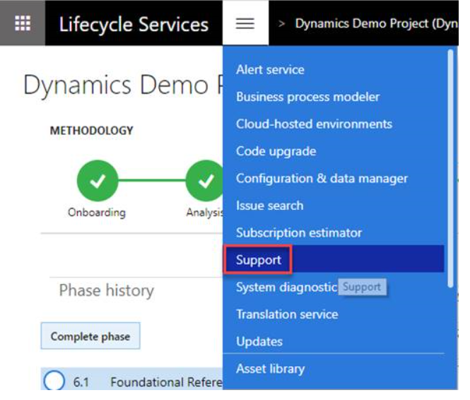
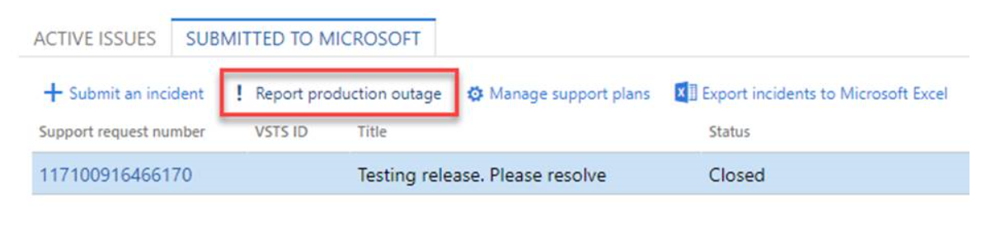

# Report a production outage

[!include[banner](../includes/banner.md)]

Lifecycle Services (LCS) has a feature called **Report production outage**. This feature is available to all customers who have purchased one or more Dynamics 365 finance and operations apps and have implementation projects with a production environment deployed in LCS. This feature provides a quick and effective channel to escalate issues to Microsoft Support in the event that the services in a production environment are degraded or become unavailable.

Following mutually inclusive conditions, a production outage can be defined as one or more system-wide issues on a live production environment that impact multiple users and prevent your business from performing daily operations.

## Reporting flow
The following list shows the order in which an issue should be handled:

1. In a live production environment, a customer experiences an outage or other situation with prevents business from continuing.
2. The customer reports a production outage issue by using the LCS Support portal.
3. The customer selects a production outage issue and provides additional information.
4. A Microsoft support engineer acknowledges the production outage ticket within 30 minutes of submission and begins to immediately collaborate with stakeholders to investigate and resolve the issue.
5. A support engineer contacts the customer to provide a status update.

## Access and availability
All users who have been added to a customer's implementation project have access to this feature. This includes project owners, organization admins, team members, and environment managers.

This feature is available for:
- Dynamics 365 Finance
- Dynamics 365 Supply Chain Management
- Environments that are managed by Microsoft
- A production environment in the LCS project
- All support plans

## Report a production outage
To report a production outage, follow these steps:

1. Log in to your LCS project.  
2. From the hamburger menu, click **Support**. 

  
  
3. On the **Submitted To Microsoft** tab, click **Report production outage**.

  
  
4. Confirm the production outage, select the outage scenario from the drop-down list, and then click **Continue**.
5. Add a title and details about the outage, and then click **Next**.
6. Provide contact information, and then click **Next**.
7. Click **Done**. 

If you're unable to report a production outage in LCS, [phone support](cloud-powered-support-lcs.md#phone-support) is available. 

> [!Note]
> If you don't see your situation listed in the outage scenarios, enter a support incident through LCS. During the initial investigation by a Microsoft support engineer, if it is found that the situation does not meet the current list of production outage scenarios, the support incident will be transferred to the correct support team and service-level agreement (SLA)  based on your current support plan.

[!INCLUDE[footer-include](../../../includes/footer-banner.md)]
