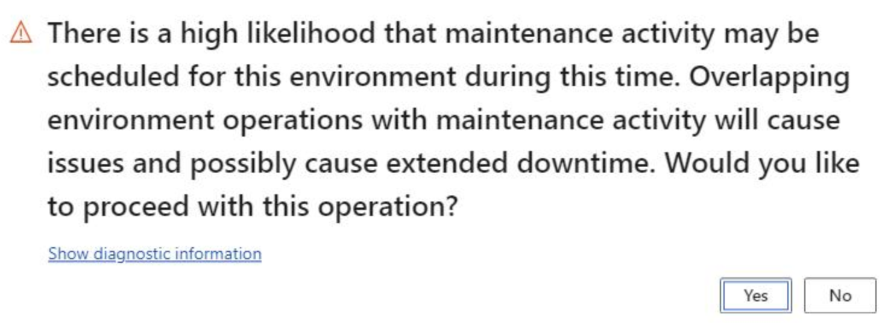

# Submit service requests to the Dynamics Service Engineering team

[!include [banner](../includes/banner.md)]
[!include [LCS deprecation](../includes/lcs-deprecation.md)]

A service request is a ticket that you use to request that the Dynamics Service Engineering (DSE) team perform a predefined set of tasks on your environments.

> [!NOTE]
> Service requests are only required for environments that are **Microsoft-managed**. Most environments are self-service. For more information about environment types, see [Cloud deployment overview](../deployment/cloud-deployment-overview.md).

> Do not use service requests for product issues. If you encounter a situation that doesn't fit into any of the tasks that are described in this article, submit a support ticket instead. For more information about support tickets, see [Get support for finance and operations apps or Lifecycle Services (LCS)](../../fin-ops/lcs/lcs-support.md).

You can use Microsoft Dynamics Lifecycle Services (LCS) to submit service requests directly to the DSE team. You can also view which requests have been submitted, executed, and canceled for your environments.

## View service requests

There are two ways to view service requests:

- On the project dashboard, in the **Environments** section, select **Service requests**.

    

- Select the **Menu** button and select **Work items**. On the **Work items** page select the **Service requests** tab.

    

By default, the **Service requests** tab on the **Work items** page lists all requests that are currently active and requests that have been denied. However, you can use the filter options to show canceled and finished requests too.

After you submit a request, it has a status of **Requested**. Before the DSE team acts on the request, it might ask for clarification by entering a comment in the **Comment** field. For example, you might receive a comment from the DSE team if you request deployment of a production environment, but the data center differs from the data center where your sandbox environments are deployed. Carefully review the comments, and provide any required clarification in your own comment. To view the details of a specific request, or to submit comments for a service request, select the request ID.

If you signed up for LCS notifications, you receive an email when the status of a service request changes or a comment is entered.

If you submit a service request to the DSE team, and the action is outside the team's scope, the service request will be denied. In this case, the reason for the denial and suggestions for further action are provided. For some typical examples of service requests that the DSE team will deny, see the "Denied service requests" section later in this article.

## Create service requests

There are two ways to create a service request: automatically and on demand.

- **Automatically** – A service request is automatically created when you request deployment of an environment, or an application of a package.
- **On demand** – A service request is manually created when you enter a request for a database point-in-time restore, and some other services.

### Automatically create a service request

- **Environment deployment** – To set up deployment options and submit a request to the DSE team to deploy a new environment, in the **Environments** section, select **Configure**.
- **Package application** – To apply a package to the production environment, on the **Environment details** page, select **Maintain**, select the package to apply, and then select **Schedule**. For more information, see [Apply updates to cloud environments](../deployment/apply-deployable-package-system.md).

    > [!IMPORTANT]
    > If your scheduled time overlaps with a [planned maintenance window](./planned-maintenance-window-faq.md), you will receive the following warning message. 
    >
    > 
    >
    > If you choose to continue deploying the package, the package deployment operation will be rolled-back in the event of conflict, as planned maintenance takes priority.
    >
    > This restriction is appliable to **Microsoft-managed IAAS environments** only. 
    

### Create a service request on demand
Service requests that are created on demand aren't explicitly accepted by the DSE team. They will be addressed during the specified downtime window unless the DSE team has entered a comment in the request or has had to deny the request. For details, review the comments in the service request.

Microsoft frequently reviews all incoming service requests. By selecting the correct type of service request for your scenario, you help the DSE team handle the request in a timely manner.

1. On the **Work items** page, on the **Service requests** tab, select **Add**.
2. In the **Create request** dialog box, select the type of service request to create. The options on the page then reflect the specific type of request that you selected.

   - **Sandbox point-in-time restore request** – Select this request type to restore a *non-production* database to a specific point in time. For more information, see [Database movement operations home page](../database/dbmovement-operations.md).

        > [!NOTE]
        > If you need to restore a *production* database to a previous point-in-time during the cutover phase, select the **Production point-in-time restore request** type. If you need to restore a production database when you're already live in operations, submit a support ticket through LCS.

   - **Database refresh request** – Select this request type to refresh a database from a production environment to a sandbox environment, or from one sandbox environment to another. For more information, see [Refresh database](../database/database-refresh.md).  *This request type is being retired on January 31, 2019*.

        > [!NOTE]
        > If you need to refresh a database from a sandbox environment to a production environment during the cutover phase, select the **Sandbox to Production** type.

    - **Sandbox to Production** - Perform a database refresh of your configuration data to a production environment during the cutover phase. For more information, see [Database movement operations home page](../database/dbmovement-operations.md).

   - **Other request** – You need to use the **Other request** type exactly as described here. If you word a request in a way that isn't clear to the DSE team, the team will enter a comment to ask for clarification, and your request will be delayed. If you use the **Other request** type for any request that isn't listed below, the request will be denied. Select this request type to request that the DSE team perform one of the following actions:

      - Turn on maintenance mode in a production environment. For more information, see [Maintenance mode](../sysadmin/maintenance-mode.md).
      - Tenant move of a live Production environment. Request the Microsoft Service Engineering team to move the Production database and Azure Blob Storage from the old tenant to the new tenant if you are moving tenant on a live Production environment. Make sure that you only request this service when you are ready with all prerequisites. For more details, see [Move LCS implementation projects to different Microsoft Entra tenants](../../fin-ops/get-started/move-lcs-implementation-project-tenant.md).
      - Define explicit Internet Protocol (IP) safe list rules in a production environment.
        
        > [!NOTE]
        > Support for explicit safe list rules is deprecated for self-service environments. For more information, see [Removed or deprecated platform features](../get-started/removed-deprecated-features-platform-updates.md#explicit-safe-lists-for-self-service-environments).
        
      - Request that Microsoft Power BI Embedded be activated in a sandbox environment, Standard Acceptance Test environment, or production environment if you receive the following message: "Power BI embedded isn't enabled. Please contact your system administrator."

### Commonly denied service requests

Here are some typical examples of service requests that will be denied:

- You submit a request of the **Other request** type for one of the following actions, but you should have submitted a support ticket instead:

    - You want to activate a new subscription estimate after you're live in production or after you've requested a production environment.
    - You want to reset the Financial reporting data mart in a release that is earlier than Microsoft Dynamics 365 for Finance and Operations Financial reporting release 7.2.6.0.
    - You want to restore a production database after go-live.
    - You encountered an issue after the DSE team did an application upgrade.

- You submit a request of the **Other request** type for an action that you should have requested through a different request type. Examples include a database refresh in a non-production environment.
- You submit a request of the **Other request** type for an action that you should perform yourself. Examples include a database upgrade in a development environment.

## Service request types and SLAs

| Service request type           | Applicable environments | Requested service | Lead time | Downtime |
|--------------------------------|-------------------------|-------------------|-----------|----------|
| Environment deployment         | Any | Environment deployment | Service level agreement (SLA): within two business days | |
| Package application            | Production | Deployable package application | Five hours | Five hours |
| Sandbox point-in-time restore | Any Tier 2 or higher sandbox | Database point-in-time restore | Five hours | Four hours |
| Production point-in-time restore | Production | Database point-in-time restore | Based on data volume | Based on data volume |
| Sandbox to Production          | Tier 2 or higher sandbox to Production | Sandbox to Production | Five hours | Four hours |
| Other                          | Production | Maintenance mode | Five hours | Not applicable, because the customer indicates in the service request when the environment should be taken out of maintenance mode again |
|                                | Production | IP safe list rules | Five hours | Two hours |
|                                | Production | Power BI Embedded | Five hours | Two hours |

[!INCLUDE[footer-include](../../../includes/footer-banner.md)]