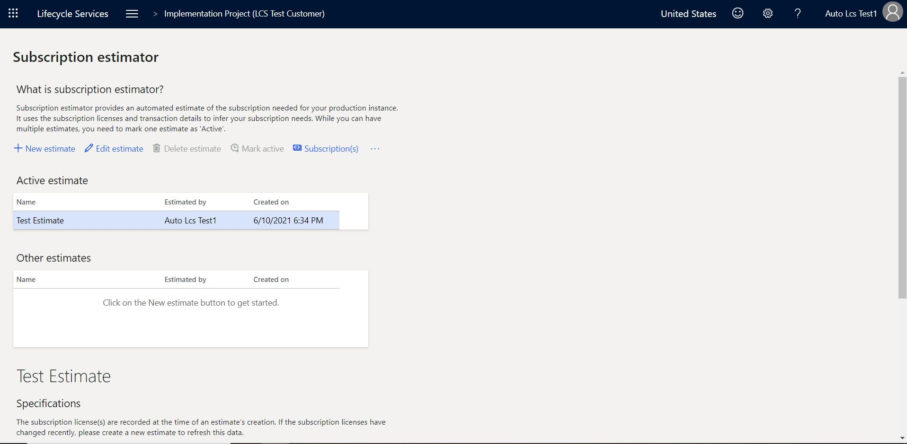
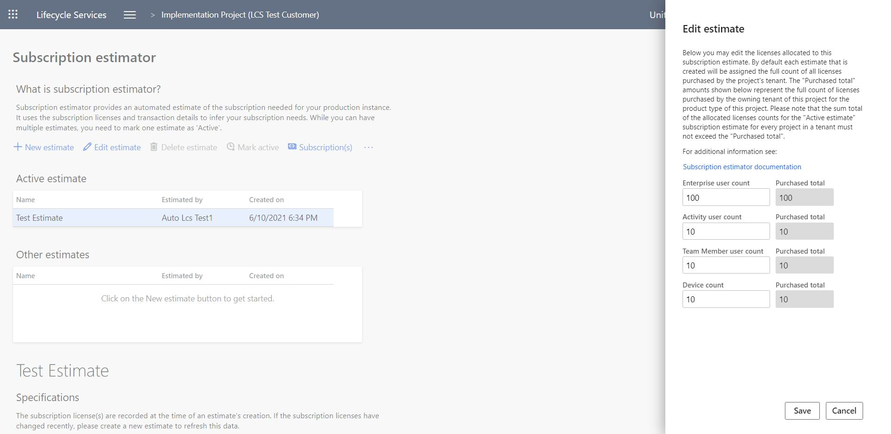

# Subscription estimator in Lifecycle Services (LCS)

[!include [banner](../includes/banner.md)]

Subscription estimator is a tool that is available in Microsoft Dynamics Lifecycle Services (LCS). Microsoft uses this tool to estimate the initial size of the production environment that must be provisioned for a customer. Before customers can request deployment of a production environment, they must estimate their peak workloads in terms of transaction counts and then upload that information to LCS. By using the details of user licenses and transaction counts to infer subscription requirements, the Subscription estimator tool helps ensure that the provisioned environment meets the customer's business requirements.

Follow these steps to use the Subscription estimator tool.

1. In LCS, open the project that is associated with the implementation project.
2. At the top of the page, select the hamburger icon, and then select **Subscription estimator**.

    

3. Download the sample usage profile.
4. Answer the required questions on each tab. If you're a Commerce customer, be sure to answer the questions on the **Retail and Commerce** tab.
5. Save the usage profile locally.
6. To upload the usage profile, select **New estimate**, name the estimate, and then upload the usage profile.
7. After the upload is completed, select **Mark as Active** to activate an estimate. An active estimate is required in order to configure a production deployment.

When there is a valid active estimate, the **Configure** button becomes available. You can use this button to request a production environment deployment.

## Edit the estimate for multiple implementation projects

To edit the estimate for multiple implementation projects, follow these steps.

1. Open the Subscription estimator tool for each implementation project.
2. Edit the active subscription estimate to apply the license allocation for each project. To edit a subscription estimate in the Subscription estimator tool, select it, and then select **Edit estimate**.

    

3. In the **Edit estimate** dialog box, enter the license count for each type of finance and operations license. By default, when every subscription estimate is created, the full count of all purchased licenses is assigned to it. Customers can't allocate more than the total number of licenses to a single estimate. Additionally, they can't reduce the allocated number so that it's less than the minimum number that the Dynamics 365 Licensing policy requires.

    

4. Select **Save**.
5. A message box warns you that updates to an active estimate might cause the size of your production environment to change. Select **Yes** to confirm that you want to continue with the update.

    

> [!NOTE]
> Although you can have multiple estimates, one estimate must be marked as **Active**. After the production environment has been deployed, or after deployment of the environment has received sign-off, the active estimate is locked. If you make any additional changes to the active estimate or mark a new estimate as **Active**, you might cause the production environment to be resized.

## Frequently asked questions

### Why isn't the Configure button for deploying a production environment available, even though there is an active estimate? And why does a warning message appear in the Action Center on the project dashboard?

If you have multiple implementation projects, the **Configure** button might not be available, and a warning message in the Action center might indicate that the number of licenses is insufficient. The **Edit estimate** button in the Subscription estimator tool lets you edit an active subscription estimate and apply the desired license allocation for that project.

### Why does an error occur when I mark an estimate as Active?

When you mark an estimate as **Active**, you might receive the following error message:

*Estimate created but does not meet requirements*

This error occurs if transaction lines that are entered aren't within the limits of the Subscription estimation tool. To resolve this error, create a support request, and attach the usage profile. Your instance can then be manually sized.

### How can I update my subscription if my production environment is deployed?

The [Subscription estimator](subscription-estimator.md) is a required step before you request production. Although you can have multiple estimates, one estimate must be marked as **Active**. The active subscription estimate is used to size the production environment. After the production environment has been deployed, or after deployment of the environment has received sign-off, the active estimate is locked. To edit an active subscription estimate, select the **Edit estimate** button in the Subscription estimator tool to update your license allocation.

### What should I do to activate my subscription estimate if I have multiple projects in the same tenant?

When you're implementing several projects in the same tenant, a warning message in the Action center in LCS might state, "subscription estimate is not complete." This warning will indicate that the total number of estimated users for all implementation projects should not exceed the number of purchased licenses. This situation can occur if the total users in the active subscription estimates exceed the tenant license count of the same type. To edit the active subscription estimate, select the **Edit estimate** button in the Subscription estimator tool to update your license allocation.

> [!NOTE]
> FastTrack solutions architects aren't involved in uploading or updating the Subscription estimator. If you identify any warnings about the Subscription estimator in LCS, follow the instructions in this article. If you continue to have issues, contact Microsoft Support.

If you receive any other error message or encounter other issues, create a support request, and attach your active estimate so that the Support team can address the issue.

## Additional resources

[Subscriptions, LCS projects, and Microsoft Entra tenants FAQ](../../fin-ops/get-started/subscription-overview.md)

[!INCLUDE[footer-include](../../../includes/footer-banner.md)]