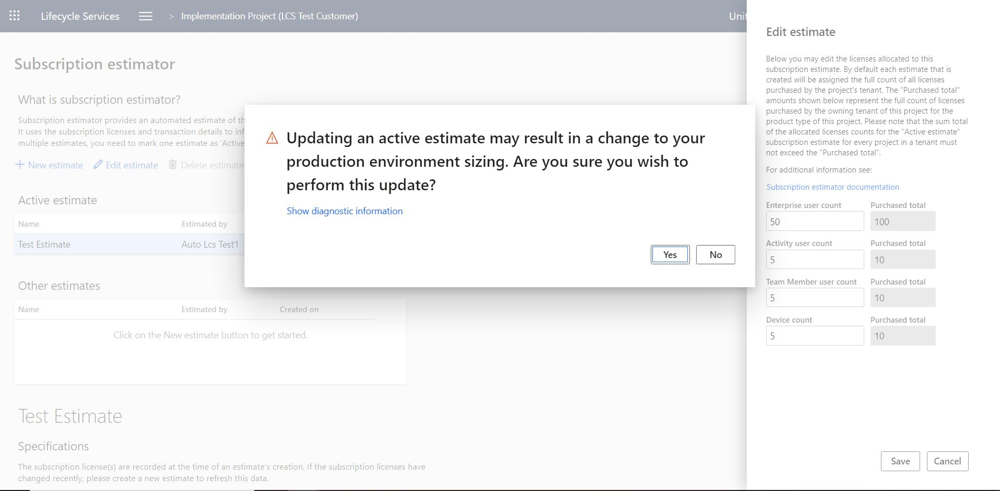

---
# required metadata

title: Subscription estimator in Lifecycle Services (LCS)
description: This topic explains how to use the Subscription estimator tool that is available in Lifecycle Services (LCS).
author: angelmarshall
ms.date: 01/21/2022
ms.topic: article
ms.prod: 
ms.technology: 

# optional metadata

# ms.search.form: 
# ROBOTS: 
audience: Developer, IT Pro
# ms.devlang: 
ms.reviewer: sericks
# ms.tgt_pltfrm: 
ms.custom: 
ms.assetid: 
ms.search.region: Global
# ms.search.industry: 
ms.author: tsmarsha
ms.search.validFrom: 2016-02-28
ms.dyn365.ops.version: Platform update 12

---
# Subscription estimator in Lifecycle Services (LCS)

[!include [banner](../includes/banner.md)]

Subscription estimator is a tool that is available in Microsoft Dynamics Lifecycle Services (LCS). Microsoft uses this tool to estimate the initial size of the production environment that must be provisioned for a customer. Before customers can request deployment of a production environment, they must estimate their peak workloads in terms of transaction counts and then upload that information to LCS. By using the details of user licenses and transaction counts to infer subscription requirements, the Subscription estimator tool helps ensure that the provisioned environment meets the customer's business requirements.

Follow these steps to use the Subscription estimator tool.

1. In LCS, open the project that is associated with the implementation project.
2. At the top of the page, select the hamburger icon, and then select **Subscription estimator**.

    

3. Download the sample usage profile.
4. Answer the required questions on each tab. If you're a Commerce customer, be sure to answer the questions on the **Retail and Commerce** tab.
5. Save the usage profile locally.
6. To upload the usage profile, select **New estimate**, name the estimate, and then upload the usage profile.
7. After the upload is completed, select **Mark as Active** to activate an estimate. An active estimate is required in order to configure a production deployment.

When there is a valid active estimate, the **Configure** button becomes available. You can use this button to request a production environment deployment.

## Edit the estimate for multiple implementation projects

To edit the estimate for multiple implementation projects, follow these steps:

1. Visit the Subscription Estimator tool for each implementation project. Edit the active subscription estimate to apply the license allocation for each project.
2. A subscription estimate can be edited in the Subscription estimator tool by selecting an estimate and then selecting the **Edit estimate** button.
    
3. Enter the license count for each type of Finance and Operations license in the dialog box. By default, every subscription estimate will be created with the full count of all purchased licenses assigned to it. Customers cannot allocate more than the total number of licenses to a single estimate and cannot reduce the allocated amount to less than the minimum required by the Dynamics 365 Licensing policy.
    
4. Select **Save**. Read and agree to the warning information.  
    

[!NOTE] Although you can have multiple estimates, one estimate must be marked as Active. After the production environment has been deployed, or deployment of the environment has received sign-off, the active estimate is locked. Any further changes to the active estimate or marking a new estimate as active may cause the production environment to be resized.

## Frequently asked questions

### Why isn't the **Configure** button for deploying a production environment available, even though there is an active estimate? And why does a warning message appear in the Action Center on the project dashboard?

If you have multiple implementation projects, the **Configure** button might not be enabled and a warning message will appear in the Action Center regarding an insufficient number of licenses. With the Edit estimate function, you can  edit an active subscription estimate within the Subscription Estimator tool to apply the desired license allocation for that project.

### Why does an error occur when I mark an estimate as **Active**?

When you mark an estimate as **Active**, you might receive the following error message:

*Estimate created but does not meet requirements*

This error occurs if transaction lines that are entered aren't within the limits of the Subscription estimation tool. To resolve this error, create a support request, and attach the usage profile. Your instance can then be manually sized.

### How can I update my subscription if my production environment is deployed?

The [Subscription estimator](subscription-estimator.md) is a required step before requesting production. Although you can have multiple estimates, one estimate must be marked as  **Active**. The active subscription estimate is used to size the production environment. After the production environment has been deployed, or deployment of the environment has received sign-off, the active estimate is locked. To edit an active subscription estimate, select the Edit estimate function within the Subscription Estimator tool to update your license allocation.

### What should I do to activate my subscription estimate if I have multiple projects in the same tenant?

When you are implementing several projects in the same tenant, a warning indicating "*subscription estimate is not complete*" may appear in the Action Center of LCS. This error will indicate that the total number of estimated users for all implementation projects should not exceed the number of purchased licenses. This may happen if the sum of users on the active subscription estimates is superior to the tenant license count of the same type. To edit active subscription estimate, select the Edit estimate function within the Subscription Estimator tool to update your license allocation.

> [!NOTE]
> FastTrack Solutions architects are not involved in uploading or updating the Subscription Estimator. If you identify any warnings regarding the Subscription Estimator in LCS, follow the instructions in this topic. If you continue to have issues, contact Microsoft Support.

If you receive any other error message or encounter other issues, create a support request, and attach your active estimate so that the Support team can address the issue.

## Additional resources

[Subscriptions, LCS projects, and Azure Active Directory tenants FAQ](../../fin-ops/get-started/subscription-overview.md)

[!INCLUDE[footer-include](../../../includes/footer-banner.md)]
