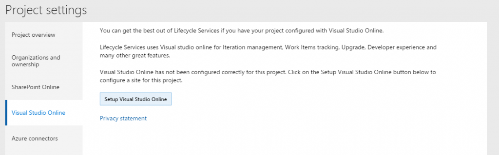
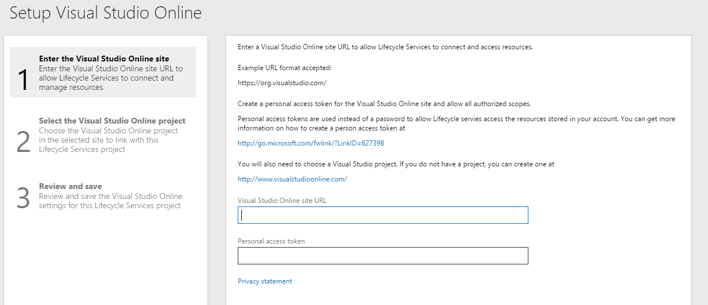
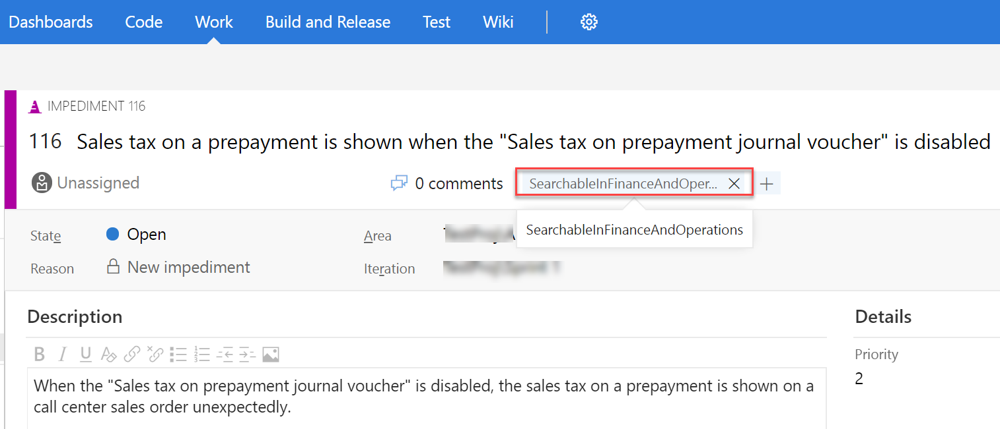

# Set up technical support for finance and operations apps 
[!include [banner](../includes/banner.md)]

## Prerequisites

Before you can set up technical support, you must acquire a Microsoft Azure Active Directory (Azure AD) account. This account is created when you set up a subscription for one of the finance and operations apps.

## Create an Azure DevOps project
The **Support** tile in a Lifecycle Services (LCS) project uses Azure DevOps to store issues that are submitted through the client and issues that are manually created from the **Support** tile in LCS. This functionality requires that an Azure DevOps project be configured in the LCS project that you want to use for support. All users who need to use the **Support** tile to submit an issue must have access to the Azure DevOps project, and must authorize LCS to access Azure DevOps on their own behalf. Most users don't have access to LCS or Azure DevOps. Therefore, in the Azure DevOps project, you should create a special system account that can be used to submit issues.

### Create a new Azure DevOps project

1.  Go to <https://www.visualstudio.com/>.
2.  Click **Sign in** in the upper-right corner.
3.  Sign in by using an AAD account that is in the tenant that your subscription is linked to. If the browser already has your credentials, you won't see the sign-in page and should instead click your name in the upper-right corner.
4.  On the right side of the page, under **Accounts**, click **Create a free account now**.
5.  Specify an account URL, and then click **Create Account**.
6.  Name your project, and specify a process template. Your project should now be created.

### Add users to the Azure DevOps project

1.  In the upper-left corner, click **Team Services**.
2.  On the **Users** tab, click **Add**, and invite users who will use the Support experience to the Azure DevOps account. For each user that you invite, select either **Basic** or **Stakeholder**.
3.  In the upper-left corner, click **Team Services**.
4.  Click **Browse**, and browse to the project that you created in the previous procedure.
5.  In the **Members** section of the project home page, click **Add**, and add the users that you invited in step 2.

### Create the Support system user

1.  Create a new user in your Azure AD tenant, and enter a descriptive name, such as **LcsCpsSystemAccount**.
2.  In the upper-left corner, click **Team Services**.
3.  On the **Users** tab, click **Add**, and invite the system user that you created in step 1. For this user, select **Stakeholder**.
4.  In the upper-left corner, click **Team Services** again.
5.  Click **Browse**, and browse to the project that you created earlier.
6.  In the **Members** section of the project home page, click **Add**, and add the system user.

### Retrieve the personal access token for the Support system user

1.  Sign out of Team Services by clicking the user name in the upper-right corner and then clicking **Sign out**.
2.  Sign in to Team Services by using the Support system account that you created in the previous procedure.
3.  In the upper-right corner, click the user name, and then click **My profile**.
4.  On the **Security** tab, on the **Personal access tokens** tab, click **Add**.
5.  Enter a description, such as **LCS Support system account**.
6.  Select an expiration date of one year.
7.  Click **Selected scopes**, and the select **Work items (read and write)**.
8.  Click **Create token**.
9.  Copy the token and paste it in a safe location because it won't be accessible after you move away from the page.

## Configure LCS
1.  Sign in to LCS by using an account that has the **Owner** role for the LCS project that the application is deployed in.
2.  Open the project in LCS.
3.  Click **Project settings**, and then click the **Azure DevOps** link.

    
    
    

4.  Click **Setup Azure DevOps**.
5.  In the **Azure DevOps site URL** field, enter the URL of the Azure DevOps project that you created in the previous section.

    > [!NOTE]
    > LCS requires entering the Azure DevOps root URL in the legacy format. The legacy format is `https://ACCOUNT.visualstudio.com` and `https://contoso.visualstudio.com`.

6.  In the **Personal access token** field, enter the personal access token that you created in the previous section. 

    

7.  Click **Continue**.
8.  Select the VSO project to use, and then click **Continue**.
9.  Click **Save**.
10. Click **Authorize**.
11. In the confirmation message box, click **OK**.
12. Sign in to Visual Studio Online.
13. Click **Accept**.

## Create an issue 
The Support experience has been updated to show updates that are published by Microsoft. In the client, on the top bar, click **?**, and then click **Support**. 

> [!WARNING]
> If you have an on-premises deployment, the option to search for existing issues and submit a support incident from the on-premises client to your Azure DevOps project is not available.

 

> [!NOTE]
> If you haven’t already connected to Lifecycle Services (LCS), a dialog box will display where you can connect. Click the link to connect before proceeding. 
    

### Search for a fix

After you connect to LCS, you can search for existing Microsoft published updates and fixes. Enter your issue in the **Search** box and press **Enter**. 

> [!NOTE]
> If you don't want the functionality to search for existing fixes enabled for all users, you can remove the **SearchExistingFixes** duty from the System user role and add it to only those roles which you want to have this functionality. Search results are based on the Microsoft Issue Search data that is relevant to your environment. Fixes that you have already installed will not be included in your search results. To view a specific result, click the link to view the details. 

Based on the duties assigned to you, you will see either the **Download view** or the **Request view**. 

- **Download view** - By default, this view is only available to system administrators. From this view, you can directly download the hotfix. 

    > [!NOTE]
    > The duty **DownloadHotfix** controls the ability to directly download fixes from LCS rather than requesting them. Only system administrators will have access to it by default. If you want to assign this duty to users other than system administrators, you can do so by adding the duty to the selected roles. 
    
- **Request view** - By default, this view is available to all users who are not system administrators. From this view, you can make a request to download the hotfix. After you submit your request to download the hotfix, a work item will be created in the Azure DevOps project that is associated to your LCS project. The customer IT admin can view all requested hotfixes by clicking the **Support** tile in LCS and then clicking the **Hotfix requests** tab.

### Search for project work items in Azure DevOps

The Azure DevOps administrator can publish project work items to your organization users by tagging the work items with **#SearchableInFinanceAndOperations**. The tagged work items will be searchable for users from the client support search box. The search result will include tagged Azure DevOps work items in addition to Microsoft published updates and fixes. The following graphic shows a tagged Azure DevOps work item for publishing.

When you search for published Azure DevOps work items using the support search box, search results show the work item's type, title, state, and description in a new browser tab with **view** mode.  Users with proper permissions can edit the work item in Azure DevOps. The following graphic shows the search result of a published Azure DevOps work item.

> [!NOTE]
> The published Azure DevOps work items are only visible to your organization's users.  

### Create and submit a new issue
If you don’t see a fix in the search results, you can create a new issue by clicking **Create**. This is the same functionality that is available for previous releases and is documented in earlier procedures.

## Work with issues in LCS

### View issues
In the LCS **Support** tile, issues are stored as work items in the Azure DevOps project that is associated with the LCS project. Specifically, issues are stored as work items of the **Issue** or **Impediment** type, depending on the type of Azure DevOps project, in the **AxAndLcsGeneratedIssues** area. Every work item of one of those types in that area will be included in the list of issues in the **Support** tile. If an issue is modified in Azure DevOps, the changes will be reflected in Support issues. Issues can be assigned to any user in the Azure DevOps project. Users don't need to have access to LCS to work with issues in Azure DevOps.

1.  Go to [lcs.dynamics.com,](https://lcs.dynamics.com/en/) and sign in.
2.  Open the LCS project that is associated with the environment that you want to view issues for.
3.  Click the **Support** tile. A list of the issues that have been created appears.

    

### Edit issues
1.  In the **Issues** grid, click the title of an issue.
2.  If necessary, sign in to Azure DevOps by using an account that has access to the Azure DevOps project that you set up in the first section of this article, **Create an Azure DevOps project**. 

    > [!NOTE]
    > There is an issue in Azure DevOps, where the link to edit work items doesn't work correctly if sign-in is required. If you see the **Assigned to me** query after you sign in to Azure DevOps, go back to LCS, and click the title of the issue in the issue grid again.

3.  The Azure DevOps editor opens. Edit the issue, and then save your changes. The changes will be reflected in the **Support** tile.

### Submit an issue to Microsoft

You can submit issues to Microsoft support. When you submit an issue to Microsoft, the information and attachments in the issue can be included in the Microsoft support incident. 

LCS users must have a valid Microsoft support plan to submit issues to Microsoft. If you have trouble submitting issues to Microsoft, work with your administrator to make sure that your LCS credentials are added to or associated with your organization's support plan with Microsoft Partner Source Business Center.

1.  In the **Issue** grid, select the issue to submit to Microsoft, and then click **Submit to Microsoft**.
2.  If your account is associated with multiple support organizations, select the organization to use to create the Microsoft support incident.
3.  Use **Issue search** to verify that your issue hasn't already been solved.
4.  If **Issue search** doesn't provide a solution to your issue, click **Create incident** at the bottom of the page.
5.  Share diagnostic data with the Microsoft support team. By providing version information, your issues can be resolved more quickly.
6.  Describe your issue, provide your contact information, and then click **Submit**.

## Support settings 

> [!NOTE]
> The information in this section is not applicable to on-premises deployments. 

When you deploy your application from Lifecycle Services, no configuration is required, because the Support tool automatically saves any issues to the same LCS project that finance and operations was deployed from. To verify the LCS project that Support uses, go to **System administration** > **Setup** > **System parameters**, and then click **Help** > **Support Contact**. 

## Prevent users from creating issues from the client
By default, the System user role has the privilege, *SysLCSCPSIssueEntry* assigned. This privilege controls access to the **Contact your support team** menu item on the Help menu. If you want to prevent users from being able to create and submit issues from the client, remove this privilege from the System user role.

[!INCLUDE[footer-include](../../../includes/footer-banner.md)]
