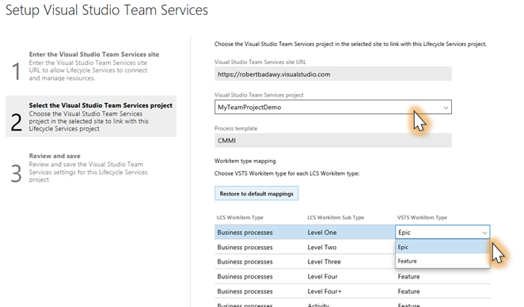
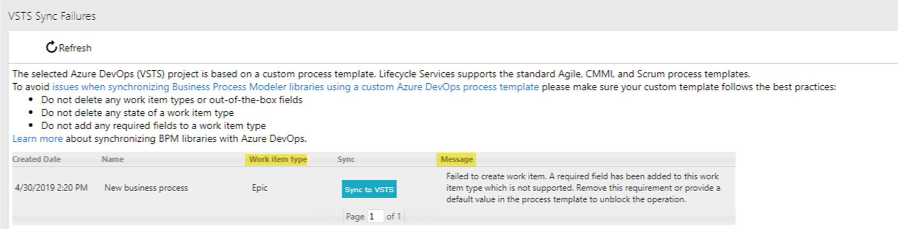

# Synchronize BPM libraries with Azure DevOps

[!include [banner](../includes/banner.md)]

You start the implementation stage of a project by synchronizing a Business process modeler (BPM) library with your project in Microsoft Azure DevOps. In this way, you can review processes and associate requirements with business processes. By synchronizing a BPM library with an Azure DevOps project, you can also track the progress of your implementation project in Azure DevOps, and can associate various work items with requirements and business processes. These work items include bugs, tasks, backlog items, tests, and documents.

Currently, BPM-Azure DevOps synchronization doesn't support custom work item types or synchronizing business processes with custom work item types. If you try either of these, you will receive a warning. If you choose to ignore the warning and attempt an Azure DevOps sync with a custom template, you can avoid synchronization issues by verifying the following for the template:
- Does not delete any work item type
- Does not delete any state of a work item type
- Does not add any required fields to a work item type

To learn more about Azure DevOps, go to [www.visualstudio.com/team-services](https://www.visualstudio.com/team-services).

## LCS project settings: Set up Azure DevOps

If you've already set up Azure DevOps from Microsoft Dynamics Lifecycle Services (LCS), you can skip the procedures in this section.

### Create a personal access token

To connect to an Azure DevOps project, LCS is authenticated by using a personal access token. Follow these steps to create a personal access token in Azure DevOps.

1. Go to <https://www.visualstudio.com>, sign in, and find your Azure DevOps project.
2. In the upper-right corner, hold the pointer over your name, and then, on the menu that appears, select **Security**.
3. Select **Add** to create a new personal access token.
4. Enter a name for the token, and then specify how long the token should last.
5. Select **Create Token**.
6. Copy the token to your clipboard.

    > [!NOTE]
    > You won't be able to find the token details again after you complete this step and move away from the page. Therefore, make sure that you've copied the token before you move away from the page.

### Configure your LCS project to connect to Azure DevOps

1. In your LCS project, select the **Project settings** tile.
2. Select **Azure DevOps**, and then select **Setup Azure DevOps**. This configuration is required by many LCS tools. If you've already configured LCS to connect to your Azure DevOps project, you can either skip this procedure or select **Change** to change the existing configuration.
3. Enter the root URL for your Azure DevOps account, and the personal access token that you created earlier, and then select **Continue**.
4. Select your Azure DevOps project.

    > [!NOTE]
    > LCS requires entering the Azure DevOps root URL in the legacy format. The legacy format is `https://ACCOUNT.visualstudio.com` and `https://contoso.visualstudio.com`.

5. Specify the mapping between LCS/BPM items and the associated Azure DevOps work item types.

    

6. Select **Continue**, review your changes, and then select **Save**.

## Synchronize a BPM library with an Azure DevOps project

After you've set up the connection between the LCS project and an Azure DevOps project, you can synchronize a BPM library with the Azure DevOps project. When you synchronize a BPM library with an Azure DevOps project, an Azure DevOps work item is created for each business process line in the BPM library. In addition, the hierarchy of business processes in BPM is reflected in the hierarchy of work items in Azure DevOps. The type of work items that are created in Azure DevOps depends on the settings of your LCS project.

This synchronization is a one-way synchronization. Changes in LCS are reflected in Azure DevOps, but changes in Azure DevOps aren't reflected in LCS.

The following information is synchronized:

- Business process names
- Business process descriptions
- Keywords (as tags)
- Countries or regions (as tags)
- Industries (as tags)

To synchronize a BPM library with an Azure DevOps project, on the **Business process libraries** page, on the tile for the library that you want to synchronize, select the ellipsis button (…), and then select **Azure DevOps sync**.

You can also start Azure DevOps synchronization from the toolbar in a BPM library. Select the ellipsis button (…), and then select **Azure DevOps sync**.

> [!NOTE]
> BPM localization is not supported. If you edit in the new BPM client in any language other than EN-US, your changes will only display when you view the BPM in the language in which the changes were made. To view any changes made in EN-US, you must synchronize with Visual Studio Team Server before the changes will display.

## Turn off synchronization of BPM with Azure DevOps

To turn off synchronization, on the **Business process libraries** page, select the library that you want to stop synchronizing, select the ellipsis button (…), and then unselect **Azure DevOps sync**.

## Review processes and add requirements

During the project phase where you're gathering requirements, you can use the BPM library to review business processes and tasks, and to identify requirements. In BPM, you can mark business processes as reviewed to track the review process.

To mark a process or one of its children processes as reviewed, select the process in BPM, and then, in the right pane, on the **Overview** tab, select **Mark as reviewed**.

When a business process is marked as reviewed, the **Reviewed** column is updated. This column shows the following information:

- A fraction indicates how many direct child processes have been reviewed.
- A symbol indicates how completely the process and its child processes have been reviewed:

   - **Green check mark** – The process and all its childr processes have been fully reviewed.
   - **Yellow circle** – The process and its child processes have been partially reviewed.
   - **Red dash** – The process and its child processes haven't been reviewed.

    

While you're reviewing a business process that is connected to Azure DevOps, you can add a requirement directly to your Azure DevOps project.

1. Select a business process.
2. In the right pane, on the **Requirements** tab, select **Add requirement**.
3. Enter a name, description, and type, and then select **Create**.

    In Azure DevOps, a requirement work item is created that is associated with the current business process.

To go to the Azure DevOps work items that are associated with the current business process, on the **Requirements** tab, select the appropriate links.

## Common syncing errors

If the BPM to Azure DevOps synchronization fails, you will see the failed process name, work item type, and an error message. 

Here are some common causes and suggested actions to resolve the error.

| **Possible cause** | **Error message** | **Suggested solution** | 
|---------|--------|--------|
| Required field added | Failed to create work item. A required field has been added to this work item type, which is not supported. Remove this requirement or provide a default value in the process template to unblock the operation. | Remove the required field or provide a default value. | 
| Work item type disabled | Failed to create work item. The work item type has been disabled in the process template. Enable the work item type to unblock the operation. | Enable the work item type in the process template |  
| Couldn't find work item to update | Failed to update work item. The work item does not exist, or you do not have permissions to read it. Check the PAT configuration in the project settings or restore the work item if it has been deleted directly from the DevOps project. | Restore the work item from the recycle bin if it was deleted, or create a new Personal Access Token (PAT) and make sure that it has full permissions. |  
| Personal Access Token is expired | Failed to sync with Visual Studio Team Services. The request response is: Unauthorized. Please check that the PAT is setup correctly and still valid, try again and contact support if the error persists. | Create a new Personal Access Token (PAT) from Azure DevOps and update the PAT value in your LCS Project settings. | 
| Generic error | Failed to sync with Visual Studio Team Services. The request response is: {0}. Please check that the PAT is setup correctly and still valid, try again and contact support if the error persists. | Contact customer support with the request response that caused the syncing error. | 

[!INCLUDE[footer-include](../../../includes/footer-banner.md)]
