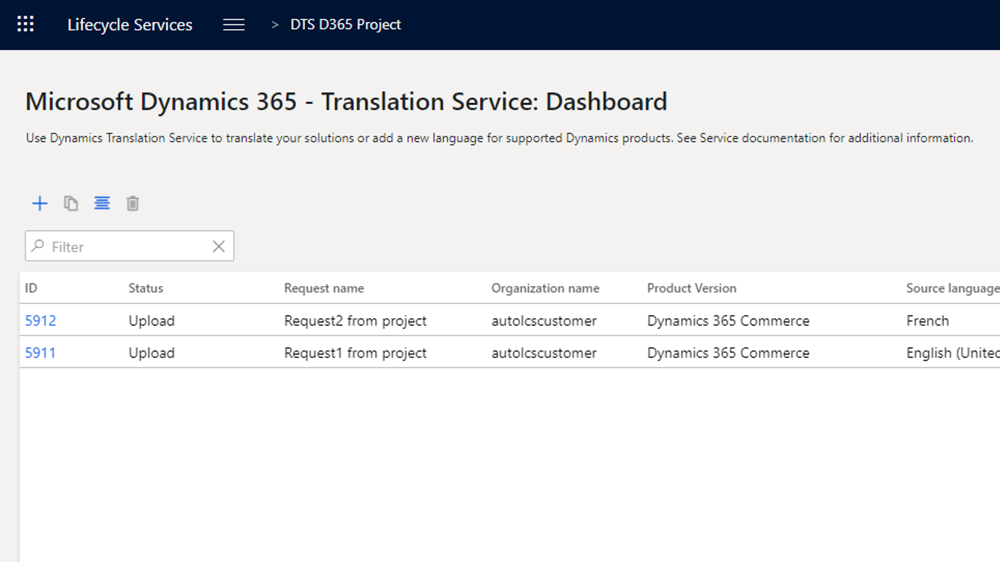

---
# required metadata

title: Dynamics 365 Translation Service overview
description: This topic provides information about the Microsoft Dynamics 365 Translation Service (DTS). DTS is designed to enhance the experience for partners and ISVs when they translate their solutions or add a new language for supported Microsoft Dynamics products.
author: ejcho
manager: AnnBe
ms.date: 07/23/2019
ms.topic: article
ms.prod: 
ms.service: dynamics-ax-platform
ms.technology: 

# optional metadata

# ms.search.form: 
# ROBOTS: 
audience: Developer, IT Pro
# ms.devlang: 
ms.reviewer: sericks
ms.search.scope: Operations
# ms.tgt_pltfrm: 
ms.custom: 6154
ms.assetid: ejchoGIT
ms.search.region: Global
# ms.search.industry: 
ms.author: ejchoGIT
ms.search.validFrom: 2016-02-28
ms.dyn365.ops.version: AX 7.0.0

---

# Dynamics 365 Translation Service overview

[!include [banner](../includes/banner.md)]

The Microsoft Dynamics 365 Translation Service (DTS) is hosted in Microsoft Dynamics Lifecycle Services (LCS). It's designed to enhance the experience for partners and independent software vendors (ISVs) when they translate their solutions or add a new language for [supported Dynamics products](./translation-service-overview.md#supported-products).

DTS uses a machine translation (MT) system that is custom-trained for [Microsoft General Availability (GA) languages](./translation-service-overview.md#glossary) to maximize the quality of the translation output. DTS also supports translation recycling from the linguistic assets of Microsoft Dynamics and partners/ISVs. Therefore, identical strings are translated one time and then consistently reused.

The following illustration shows, at a high level, how the service works.

## Recycling existing translations
Existing linguistic assets can be recycled only when the assets are uploaded in a zip file that contains translation memory (TM) files that use Localization Interchange File Format (XLIFF). For more information, see [Translation memory files](./use-translation-service-tm.md).

## Custom-trained MT system
DTS uses a Microsoft Translator service and a custom translator to customize Microsoft Translator’s advanced neural machine translation for Microsoft Dynamics products. The custom-trained MT system can only be used for GA languages, unless partners upload XLIFF TM files that contain more than 10,000 translation units (TUs). (A TU typically contains a source string, translation, state, state qualifier, and note.) In those cases, DTS creates a custom-trained MT system that is specific to the translation request that the XLIFF TM files are submitted for.

> [!NOTE]
> Microsoft Translator supports the text translation through the Microsoft Translator Text API. DTS uses V3 Translator API because V2 will be discontinued on April 30, 2019 with the retirement of[Microsoft Translator Hub](https://www.microsoft.com/translator/business/hub/). For information about the supported languages for V3, see [Language and region support for the Translator Text API](https://docs.microsoft.com/azure/cognitive-services/translator/language-support#customization). 

## Supported products
DTS currently supports the following product versions.

| Product name | Versions | Supported format for user interface files | Supported format for documentation files | Notes |
|--------------|----------|-------------------------------------------|------------------------------------------|-------|
| Microsoft Dynamics AX 2012 | All versions | .ktd, .ald | .docx | |
| Dynamics 365 Finance and Operations apps | All versions | .label.txt | .docx, .html | .txt is the specific label format and .html is the custom help solution format. |
| Microsoft Dynamics 365 Commerce | All versions | .label.txt | .docx | |
| Microsoft Dynamics CRM | All versions | .resx | .docx | |
| Microsoft Dynamics NAV | All versions | .etx, .stx, .resx, .txt, .xml, .xlf | .docx | .txt and .xml are the NAV specific format, and .xlf is the Business Central extension resource format. |

## Accessing DTS
You can access DTS in two places in LCS:

- From the LCS home page
- From within an LCS project

### Accessing DTS from the LCS home page
Sign in to LCS, and scroll to the right side of the page. Expand the tiles waffle, and then select the **Translation service** tile to open the dashboard view for DTS.

### Accessing DTS from within an LCS project
Create a new project, or open an existing project. On the project dashboard, in the **More tools** section, select the **Translation service** tile. Alternatively, on the project dashboard, select the **Menu** button, and then select **Translation service**.

### Accessing DTS from the LCS home page vs. accessing it from within an LCS project
When you access DTS from the LCS home page and create a translation request, you can select the product that is used for the request. To add more requests that use different products, you can just change the product selection. You don't have to close the service and open a different translation project.

This option is convenient when you work on multiple product translation projects. However, because you access the service outside an LCS project, no other users can view your requests on the DTS dashboard. Instead, this option gives you your own DTS dashboard that shows all the translation requests that you've made from within all LCS projects and from the LCS home page.

The following illustration shows an example of the DTS dashboard that you open from the LCS home page.

Because an LCS project is always tied to a product, any translation request that you submit from a project automatically carries the product type and version information from the project. You can't select a different product for the request.

In an LCS project, the project owner and the users will have permission to access the DTS dashboard and the translation requests that are submitted from within that project. Therefore, this option is useful when you work with a group of people on one product translation project in LCS.

The following illustration shows an example of the DTS dashboard that you open from within an LCS project.

## Accessing LCS preview features
LCS offers some services or features only as preview features for various reasons. To view the list of preview features that are available, on the LCS home page, select the **Preview feature management** tile. To turn on a feature, select the feature, and then set the **Preview feature enabled** option to **Yes**.

Two preview features are available for DTS:

+ **Dynamics 365 Translation Service - Documentation Translation Support** – You must turn on this feature if you want to translate a product or solution document (for example, a Microsoft Word document).
+ **NAV product availability** – You must turn on this feature if you want to create an LCS project for NAV products and access DTS from within the project.

## Glossary

| Term | Description |
|------|-------------|
| XLIFF | XML Localization Interchange File Format. XLIFF is an XML-based format. It was created to standardize the way that localizable data is passed between tools during a localization process, and to serve as a common format for files that are used by computer-aided translation (CAT) tools. |
| Microsoft GA languages | General availability of the Microsoft-produced languages. The list varies, depending on the product. |
| TU | Translation unit. A TU typically contains a source string, translation, state, state qualifier, and note. |

For more information about how to use DTS, see [Translate user interface files](use-translation-service.md) and [Translate documentation files](use-translation-service-ua.md).

