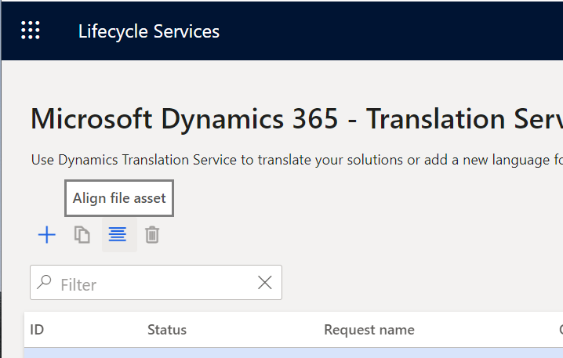

---
# required metadata

title: Translation memory files
description: This topic describes when and where translation memory files can be created, edited, and used to result in a quality translation output file.
author: abmotgi
ms.date: 10/24/2021
ms.topic: article
ms.prod: 
ms.technology: 

# optional metadata

# ms.search.form: 
# ROBOTS: 
audience: Developer, IT Pro
# ms.devlang: 
ms.reviewer: sericks
# ms.tgt_pltfrm: 
ms.custom: 6154
ms.assetid: 
ms.search.region: Global
# ms.search.industry: 
ms.author: abmotgi
ms.search.validFrom: 2018-03-27
ms.dyn365.ops.version: AX 7.3.0

---

# Translation memory files

[!include [banner](../includes/banner.md)]

Microsoft Dynamics 365 Translation Service (DTS) uses a bilingual XML Localization Interchange File Format (XLIFF) file to store pairs of source languages and target languages. Because XLIFF is based on XML, you can open XLIFF files in any text editor. However, we recommend that you use XLIFF editors that are specifically designed to work with this format. For example, you can use the free Microsoft Multilingual Editor that is available in the [Multilingual App Toolkit (MAT)](https://developer.microsoft.com/windows/develop/multilingual-app-toolkit).

In DTS, you can obtain an XLIFF translation memory (TM) in two ways:

+ **Run the Align tool** – When you have files that were previously translated, and you also have corresponding source files, you can use the Align tool to create an XLIFF TM. For more details, see the [Creating a translation memory](#creating-a-translation-memory) section later in this topic.
+ **Complete a translation request** – When a DTS translation request is completed, it provides the XLIFF TMs as part of the request output. You can then use the files the next time that you submit a new translation request that includes the updated source files.

XLIFF files contain a series of translation units (TUs) that are extracted from the source files. The following illustration shows an example of a TU.

The following illustration shows the same TU (highlighted in blue) in the Multilingual Editor.

## State
Each translation in the XLIFF file is associated with a state value. The state value that DTS assigns to each translation depends on the way that the string is translated. When an XLIFF TM is created by using the Align tool, all translations are marked as **Translated**, because the aligned TUs are produced from known good translations, such as a previous product version.

However, when the XLIFF files are generated through a translation request, two types of state values can be used:

+ **Needs Review** – The string has been machine-translated.
+ **Translated**, **Final**, or **Signed off** – The string has been recycled. The state value is inherited from the XLIFF TM.

During the post-editing process, you can immediately identify the strings that are marked as **Needs Review**. After you've finished reviewing those strings, you should mark them as **Translated**, **Final**, or **Signed off**, so that they can be used for recycling. Translations that are marked as **Needs Review** aren't included for recycling.

Inherited state values for recycled strings are helpful, because you won't have to review the same string (that is, a string that has the same ID) again.

## Creating a translation memory
If you have files that were previously translated, you can recycle the translated files for a newer version of the source files by creating a TM that uses XLIFF.

1. On the DTS dashboard, select the **Align** button to start the Align tool.

    

    > [!NOTE]
    > - The Align tool currently supports only user interface (UI) files.
    > - To start the Align tool, you might have to explicitly allow pop-up windows in your browser.

2. On the **Align** page, select the source language, the target language, and the files to align.
3. Select **Align** to complete the alignment. When the alignment is completed, a message summarizes the results.

To create the best XLIFF TM, make sure that the following conditions are met:

- Both the source file and the target file have the same number of resources.
- The resources are in the same order in both the source file and the target file.
- There are no empty strings. The following illustration shows examples of empty strings in the source and the target.

    

    Empty strings are inherited by the XLIFF TM. If a **Rebate** string in the source has an empty string in the target, it will likely be translated as an empty string if this XLIFF TM is used.

    

Although the Align tool can resolve some of these issues, it's easier if you prevent them before you see unexpected results in the output.

Review the aligned XLIFF file before you use it as a TM. TUs that have been reviewed should be marked as **Final** or **Signed off**, so that they aren't mistaken for unreviewed TUs.

## Editing an XLIFF translation memory

We recommend that you use the free Multilingual Editor, or another XLIFF editor, to review and edit the translations in the XLIFF file that DTS provides. At a minimum, you should review the translations to verify that the translation output meets your product's quality standards.

When you open an XLIFF file in the Multilingual Editor, it resembles the following illustration. If you encounter an error when you open the file, ignore the message, and select the **Strings** tab in the lower-left corner of the window.

Notice that there is a circle near the beginning of each line. The color of the circle indicates the state of the translation. DTS automatically assigns these states, depending on where the string came from.

+ **Red circle** – The string was machine-translated. DTS assigns the **Needs Review** state.

    > [!NOTE]
    > The state value that is shown might differ slightly, depending on the XLIFF editor that you're using.

+ **Yellow, green/yellow, or green circle** – The string was recycled. DTS inherited the state from the XLIFF TM that was used in the request.

To verify the translations, you can apply a filter to show only strings that are in the **Needs Review** state.

Strings that have been reviewed should be marked as **Translated**, **Final**, or **Signed off**, so that they can be used for recycling. Translations that are marked as **Needs Review** aren't included for recycling.

After you've finished editing the XLIFF TM, remember to have DTS regenerate the refreshed output file in the source format. For more information about how to regenerate the file, see [Translate user interface files](./use-translation-service.md#regenerate-output-files).

[!INCLUDE[footer-include](../../../includes/footer-banner.md)]
