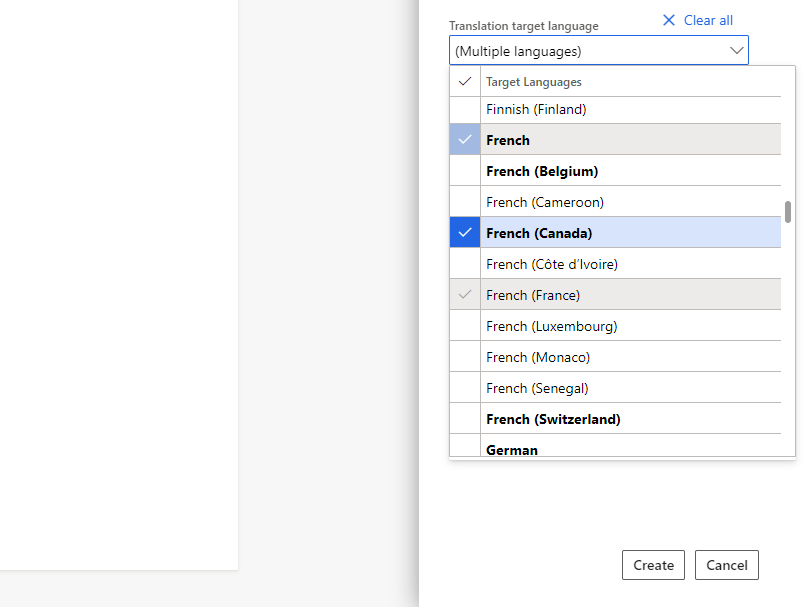
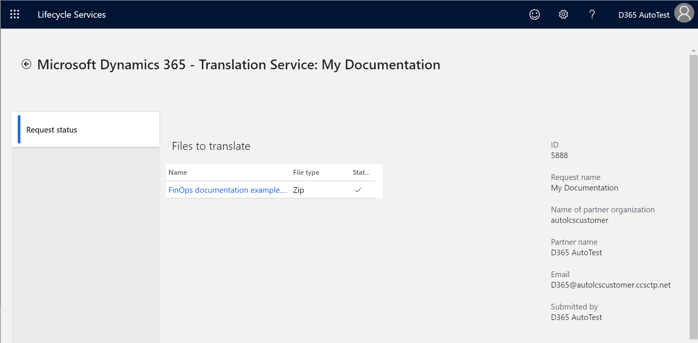
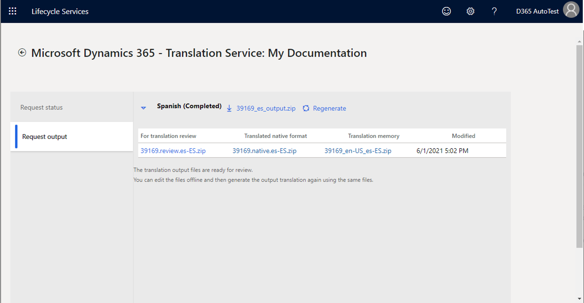

# Translate documentation files

[!include [banner](../includes/banner.md)]

This article explains how to translate a documentation file for Microsoft Dynamics products and solutions.

## Create a translation request
1. In Microsoft Dynamics Lifecycle Services (LCS), on the DTS dashboard, select **Add** to create a new translation request.

    

    You can open the DTS dashboard either from the LCS home page or from within a project. For more information, see [Accessing DTS](./translation-service-overview.md#accessing-dts).

2. Enter the required information for the request.

    | Field | Description |
    |-------|-------------|
    | Request name | Enter a name for the request. |
    | File type | Select **Documentation**. |
    | Product name | Select a product name. If you accessed DTS from within an LCS project, this field is automatically filled in and is read-only. |
    | Product version | Select a product version. If you accessed DTS from within a LCS project, this field shows the default product version information from the project. However, you can select a different version. |
    | Translation source language, Translation target language | Select the set of source and target languages to translate from and to. If your business requires that multiple target languages be translated for the same source language, you can select all the target languages in one request. Make sure that you select each target language by using the checkbox next to the language's name. This approach helps you save time when you must submit multiple translation requests. It also lets you track the translation status of all the target languages in one request. Language names that are shown in **bold** are General Availability (GA) languages for Microsoft Dynamics products. Therefore, product-specific machine translation (MT) models are available in those languages, and the MT model is trained on the terminology for Microsoft Dynamics. For non-GA languages, the MT model uses the general domain training. |

    

3. Select **Create**.

    > [!NOTE]
    > To take advantage of the product-specific model that is trained on Microsoft Dynamics linguistic assets, you must select **English – United States** as either the source language or the target language. Here is an example.
    >
    > | Translation source language | Translation target language | MT model that is used |
    > |-----------------------------|-----------------------------|------------------------|
    > | English – United States | Japanese | Product-specific trained MT model |
    > | Japanese | English – United States | Product-specific trained MT model |
    > | German | Japanese | Generic MT model |

## Upload files
Select the plus sign (**+**) in each section to open the **File upload** page.

### Upload files to translate (Required)
Currently, only files in Microsoft Word (.docx) format are accepted for translation. Create a zip file that includes all the .docx files in the source language that you want to translate from. You can upload only one zip file. Note that DTS doesn't change the source files that you upload. The source files are only used to create files in the corresponding target languages you requested.

### Upload XLIFF or TMX translation memory files (Optional)
If you have a TM in Translation Memory eXchange (TMX) format from a previous DTS request, and/or if you have a XLIFF TM from UI file translation, you can attach those TMs so that they can be recycled in the new document that you're submitting. Create a zip file that includes all the TM files. You can upload only one zip file. If you created the translation request for multiple target languages, you must select which target language the TM file is for. 

With the translation memory file you are providing, you have an option to decide whether you want to create a custom MT system trained with it. This option may take longer time to complete the request. You must choose Yes or No to be able to continue with the TM file upload.  

After you've finished uploading file, select **Submit** to start the translation process. 

After you submit the request, a new request ID is created on the DTS dashboard. If you submitted the request with multiple target languages, you will see each target language status is displayed in a separate line with the same request ID. Selecting a line on the dashboard will extend the dashboard window to the right to show the request summary information.

To view the request status, select a request ID link on the dashboard. The **Request status** tab shows the list of source files that you uploaded, together with a summary of the request information.

Note that the processing time depends on the number of requests that are in the DTS queue and the word count in the source files that you submit.

## After translation is completed
When processing of your translation request is completed, you receive an email notification from DTS. You can then view the result on the **Request output** tab of the request details page. If your request was submitted for multiple target languages, there may be a difference between languages when each language process is done. Expand each language name to see the status. 

For documentation translation requests, three types of output file are available after the translation process is completed:

+ **For translation review** – Download this file to review and edit the translated document strings in a table view. The file shows the source and target languages segments side by side.
+ **Translated native format** – Download this file if you don't intend to review or edit the translations, but intend to use the translated file as it is. This file has the same formatting style (title, headings, tables, and so on) as the source .docx file that you submitted, and it's ready to be used.
+ **Translation memory** – Download this file to recycle these translations the next time that you submit a translation request that uses a newer version of the source document.

### Review and edit the translations
DTS provides the translation review file in .docx format. You can download the file from the **Request output** tab of the request details page and open it in Word. The file provides a convenient table view, as shown in the following illustration. Therefore, you can easily compare the text in the source and target languages side by side. After you've finished reviewing the file, you must save it and upload it back to DTS to generate the updated .docx file output in the original formatting style that you submitted.

 
When you edit the .docx review file, note of the following guidelines:

+ Edit only the text in the **Target segment** column.
+ Don't add or remove rows.
+ Don't change the order of the rows or columns.
+ Don't add or remove the red tags. Most red tags represent formatting and styles.
+ If you must move the red tags, be careful that you don't switch a start tag (for example, **\<116\>**) and its end tag (**\</116\>**).

### Regenerate output files
When you've finished reviewing and editing a .docx review file, you must regenerate the output file in the source document style. You can then apply the latest translations (that is, your edited versions of the translations) to the documentation files in the target language.

1. Click the **Regenerate** icon next to the target language section. It brings in the **File upload** slider.
2. Zip the edited .docx files, and then select **Upload**. Don't change the file names that DTS originally provided for the .docx review file.
3. You're prompted to confirm the upload action. 
4. Once the regenerate is processed, the **Request output** tab refreshes the content. This process may take some time to complete. 

You can repeat the regeneration process as many times as you require.

For more information about the Microsoft Dynamics 365 Translation Service (DTS), see [Dynamics 365 Translation Service overview](./translation-service-overview.md). For information about how to translate a user interface (UI) file, see [Translate user interface files](./use-translation-service.md).

[!INCLUDE[footer-include](../../../includes/footer-banner.md)]
