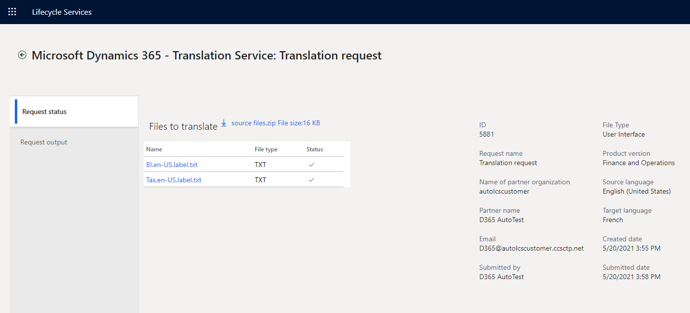
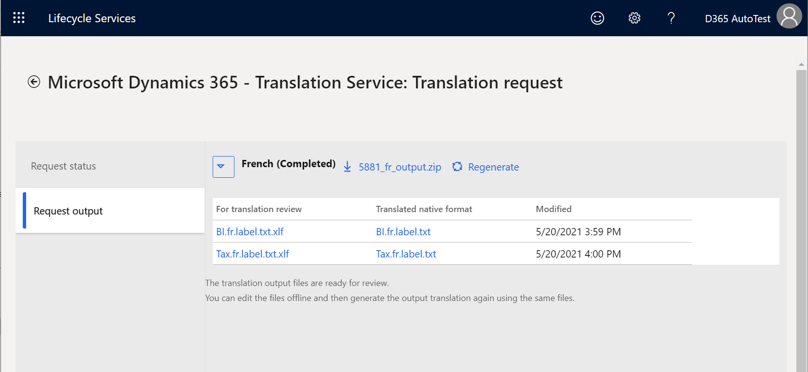

---
# required metadata

title: Translate user interface files
description: This topic explains how to use the UI translation service for Microsoft Dynamics 365 products.
author: abmotgi 
ms.date: 10/24/2021
ms.topic: article
ms.prod: 
ms.technology: 

# optional metadata

# ms.search.form: 
# ROBOTS: 
audience: Developer, IT Pro
# ms.devlang: 
ms.reviewer: sericks
# ms.tgt_pltfrm: 
ms.custom: 6154
ms.assetid: 
ms.search.region: Global
# ms.search.industry: 
ms.author: abmotgi
ms.search.validFrom: 2016-02-28
ms.dyn365.ops.version: AX 7.0.0

---

# Translate user interface files

[!include [banner](../includes/banner.md)]

This topic provides information about how to translate a user interface (UI) file for Microsoft Dynamics products or solutions.

For more information about the Microsoft Dynamics 365 Translation Service, see [Dynamics 365 Translation Service overview](translation-service-overview.md). For information about how to translate a documentation file, see [Translate documentation files](use-translation-service-ua.md).

## Create a translation request
1. In Microsoft Dynamics Lifecycle Services (LCS), on the DTS dashboard, select **Add** to create a new translation request.

    

    You can open the DTS dashboard either from the LCS home page or from within a project. For more information, see [Accessing DTS](./translation-service-overview.md#accessing-dts).

2. Enter the required information for the request.

    | Field | Description |
    |-------|-------------|
    | Request name | Enter a name for the request. |
    | File type | Select **User Interface**. |
    | Product name | Select a product name. If you accessed DTS from within an LCS project, this field is automatically filled in and is read-only. |
    | Product version | Select a product version. If you accessed DTS from within a LCS project, this field shows the default product version information from the project. However, you can select a different version. |
    | Translation source language, Translation target language | Select the set of source and target languages to translate from and to. If your business requires that multiple target languages be translated for the same source language, you can select all the target languages in one request. Select each target language by using the checkbox next to the language's name. This approach helps you saves time and also lets you track the status of all the target language translations in one request. The fields list all the languages that are supported for the selected product name and version. Language names that are shown in **bold** are General Availability (GA) languages for Microsoft Dynamics products. Therefore, product-specific machine translation (MT) models are available in those languages, and the MT model is trained on the terminology for Microsoft Dynamics. For non-GA languages, the MT model uses the general domain training. |

    

3. Select **Create**. Verify the request details were selected correctly and then click **Yes** to continue. 

    > [!NOTE]
    > To take advantage of the product-specific model that is trained on Microsoft Dynamics linguistic assets, you must select **English – United States** as either the source language or the target language. Here is an example.
    >
    > | Translation source language | Translation target language | MT model that is used |
    > |-----------------------------|-----------------------------|------------------------|
    > | English – United States | Japanese | Product-specific trained MT model |
    > | Japanese | English – United States | Product-specific trained MT model |
    > | German | Japanese | Generic MT model |

## Upload files
Select the plus sign (**+**) in each section to open the **File upload** page.

### Upload the files to translate (Required)
Create one zip file that contains all the UI files in the source language that you want to translate from. The zip file can include different file types, provided that the file types are supported for the product. For more information about supported file types, see [Supported products](translation-service-overview.md#supported-products). Note that DTS doesn't change the source files that you upload. The source files are only used to create files in the corresponding target languages you requested.

### Upload XLIFF translation memory files (Optional)
If you have XLIFF TM files from a previous UI translation request, or if you used the [Align tool](use-translation-service-tm.md) to create an XLIFF TM, create a zip file that contains all TM files before you upload them. Strings that match are then recycled to help guarantee consistency between product versions. For more information about XLIFF TMs, see [Translation memory files](use-translation-service-tm.md).

If you created the translation request for multiple target languages, you must select which target language the TM file is for. 

You have an option to create a custom [MT model](translation-service-overview.md#custom-trained-mt-model) that is trained with the translation memory file that you're providing. If you use this option, the request might take longer to be completed. You must select either **Yes** or **No** before you can continue with the TM file upload.  

After you've finished uploading files, select **Submit** to start the translation process. 

After you submit the request, a new request ID is created on the DTS dashboard. If you submitted the request for multiple target languages, the status of each target language is shown on a separate line that has the same request ID. If you select a line on the dashboard, the dashboard page will be extended to the right to show a summary of the request information.  

To see the request status, click a request ID link on the dashboard. The **Request status** tab shows the source files list you uploaded with the summary of the request information.

Note that the processing time depends on the number of requests that are in the DTS queue and the word count in the source files that you submit.

+ UI translation requests that don't have an XLIFF TM can be completed in a few minutes, depending on the file size.
+ If a UI translation request does have an XLIFF TM, the time that is required depends on the type of MT model:

    + Creation of a custom MT model requires two to three business days.
    + If you're using a generic MT model, requests can be completed in a few minutes, depending on the file size.

## After translation is completed

When your translation request has been processed, you will receive an email notification from DTS. You can then view the result on the **Request output** tab of the **Request details** page.

For UI translation requests, two types of output file are available after the translation process is completed. 

+ **For translation review** – Download the XLIFF file to review and, as required, edit the translations. The file shows the source and target languages side by side.
+ **Translated native format** – Download this file if you don't intend to review or edit the translations. *Native format* means that the file is in the same format as the source file that you submitted.

Click an individual file link or the download links to download a single file, all files for one target language, or all files for all target languages in one zip for convenience.  

### Review and edit the translations in the XLIFF file
We recommend that you review and edit the translations in the XLIFF file that DTS provides, to verify that the translation output meets your product's quality standards. For more information about how to edit the XLIFF file, see [Translation memory files](use-translation-service-tm.md#editing-an-xliff-translation-memory).

### Regenerate output files
When you've finished reviewing and editing the translation files in XLIFF, you must regenerate the translated native format files next. You can then apply the latest translations (that is, your edited versions of the translations) to the UI files in the target language. You can regenerate any number of files from the output files set per target language.  

1. Click the **Regenerate** icon next to the target language section. The **File upload** slider will open.
2. Zip the edited XLIFF files, and then click **Upload**. Don't change the XLIFF file name that DTS originally provided. 
3. In the prompt, confirm the upload. 
4. The **Request output** tab promptly refreshes the content. Expand the target language node you just regenerated to verify the **Modified** timestamp and then download the updated output files. 

You can repeat the regeneration process as many times as you require.

[!INCLUDE[footer-include](../../../includes/footer-banner.md)]
