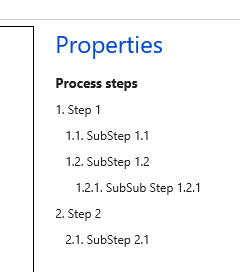

# Work with activity diagrams in Business process modeler libraries

[!include [banner](../includes/banner.md)]

You can associate an activity diagram with a business process. Activity diagrams are used to describe how a business process or task is completed in a proposed software solution.

There are three types of activity diagrams:

- **Task recordings** – Business processes that are associated with task recordings for Finance and Operations, include activity diagrams and process steps that are automatically generated.
- **Microsoft Visio** – You can associate a business process with a Visio diagram by manually uploading a Visio file.
- **User-defined** – You can manually create or edit a Business process modeler (BPM) activity diagram.

In addition to activity diagrams, you can describe a business process by using detailed process steps.

## Browse activity diagrams
The **Diagrams** column in your BPM library indicates whether a particular business process is associated with an activity diagram. The number in the column indicates the number of child processes that include diagrams. The symbol next to the number indicates whether the current node or process is associated with a diagram. These indicators don't apply to Visio diagrams.

[](./media/browse_activity_diagrams.JPG)

To view or edit an activity diagram, select the business process, and then, in the right pane, on the **Overview** tab, select **Diagrams**. The **Flowchart** page appears.

## Upload Task Recording
To upload a task recording, open the business process library that you want to upload to. Select the process step that you want to upload the task recording to, and then click **Upload**.

[](./media/activity_diagrams_01.jpg)


In the right pane, click **Browse** to choose a file, and then click **Upload**.

[](./media/activity_diagrams_02.jpg)


## Activity diagrams that are created from task recordings
You can create a task recording in your environment and save it directly to Microsoft Dynamics Lifecycle Services (LCS). In this way, you can associate the task recording with a business process in a BPM library. For more information, see [Connecting the help system](../../fin-ops/get-started/help-connect.md) and [Create documentation or training with Task Recorder](../user-interface/task-recorder-training-docs.md).

The Task recorder tool lets you create a distributable recording file. Recording files have the .axtr file name extension. You can associate a business process in BPM with a task recording by manually uploading the recording file. 

To upload a recording file, select the business process, and then, in the right pane, on the **Overview** tab, select **Upload**.

BPM automatically generates an activity diagram and detailed process steps for all task recordings that are created. The following illustration shows an example.


## Edit activity diagrams
To edit an activity diagram, right-click on a blank area of the flowchart, and then, on the bottom toolbar, select **Edit**. For more information about BPM flowcharts, see [Flowcharts in Business process modeler (BPM)](flowcharts-business-process-modeler.md).

## Visio files
You can associate a business process with a Visio diagram. Typically, this functionality is used for high-level processes that can't be represented by a task recording. BPM supports .vsd and .vsdx files. However, it doesn't support .vsdm files (macro-enabled Visio drawing files). If a .vsd file contain macros, BPM disables the execution of the macros.

To view or upload a Visio file, follow these steps.

1. Select the business process, and then, in the right pane, on the **Overview** tab, select **Diagrams**.
2. On the **Flowchart** page, select the **Visio** tab. For more information, see the "Unconnected flowcharts" section in [Flowcharts in Business process modeler (BPM)](flowcharts-business-process-modeler.md).

## Edit process steps
1. To edit process steps, right-click on a blank area of the flowchart, and then, on the bottom toolbar, select **Edit**.
2. In the **Process steps** field, enter the process steps. Enter one step per line.
3. To indent a step, add an equal sign (=). By indenting steps, you define them as substeps. You can add more than one equal sign to indicate a deeper level of indentation and therefore a deeper level in the hierarchy.

    For example, you want to create the following process steps.

    

    In this case, enter the following text in the **Process steps** field.

    ```Text
    Step 1
    =SubStep 1.1
    =SubStep 1.2
    ==SubSub Step 1.2.1
    Step 2
    =SubStep 2.1
    ```
