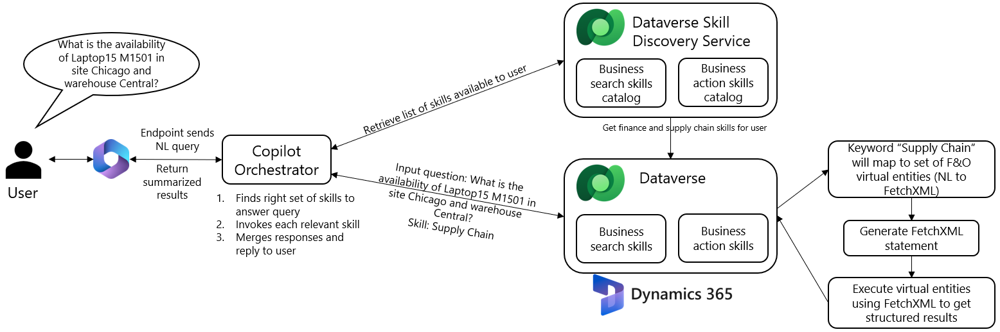

# Chat with finance and operations data on Microsoft 365 Copilot

> [!IMPORTANT]
> The method outlined in this article for adding the ability to chat with finance and operations data in Microsoft 365 Copilot is no longer applicable or supported. You can now add finance and operations data as a knowledge source to a declarative agent that is published to Microsoft 365 Copilot to enable chat experiences with the data. For more information, see [Chat with finance and operations data](../copilot/chat-with-fno-data.md).

[!include[banner](../includes/banner.md)]

This article explains how to use Microsoft 365 Copilot to chat with finance and operations data through virtual entities in Dataverse.

A Microsoft 365 Copilot license enables authorized users to engage in a natural-language conversation with finance and operations data. For example, they can ask the following questions:

- I need six Southridge Video Laptop16 M1601 in Silver color and 5 Laptop15 M1501 in Red color, can you check the availability? Give me the details by product name, site, warehouse, color, available quantity.
- Do we have red Laptop15 M1501 model in warehouses other than Chicago within the site Central? Give me the details by product name, site, warehouse, color, available quantity.

Microsoft 365 Copilot summarizes the information that's spread across emails, chats, and documents, and reconciles it with the relevant data that resides inside finance and operations apps. The reconciled summary is presented as the response to the user.

## Types of supported data

Data that resides inside tables is referred to as *structured data*. Data that's present in static documents, such Microsoft Word files, PDF files, and publicly available content, is referred to as *unstructured data*. Microsoft 365 Copilot supports data inquiries against both structured and unstructured data. For this release, the scope for finance and operations apps is limited to structured data only.

## Out-of-box scenarios

**Microsoft Dynamics 365 Supply Chain Management scenario – Inquire about on-hand inventory by using Microsoft 365 Copilot**

:::image type="content" source="media/scenario-1.gif" alt-text="An animated GIF demonstrating how to ask Copilot about the availability of laptops.":::

:::image type="content" source="media/scenario-1.gif" alt-text="An animated GIF demonstrating how to ask Copilot about the colors that are available.":::

Example questions:

- What is the inventory availability of Laptop15 M1501 in Silver color in Site Central, Warehouse Chicago? Give me the details in table format by product name, site, warehouse, color, available quantity.
- What colors do you have for Laptop15 M1501 other than Silver color in Site Central, Warehouse Chicago? Any other new colors coming?
- I need six Laptop15 M1501 in Silver color. Can you check the inventory availability in site Central, warehouse Chicago in company Contoso Retail USA? Give me the details by product name, site, warehouse, color, available quantity.
- Do we have red Laptop15 M1501 in warehouses other than Chicago within the site Central in company Contoso Retail USA? Give me the details by product name, site, warehouse, color, available quantity.
- I'm looking for laptop15 M1501. What's the item number? Include item number, product name, and company name.
- What is inventory availability for Laptop15 M1501 in company Contoso Retail USA?
- I need six Southridge Video Laptop16 M1601 in Silver color and 5 Laptop15 M1501 in Red color. Can you check the availability in company Contoso Retail USA? Give me the details by product name, site, warehouse, color, available quantity.
- I need six Southridge Video Laptop16 M1601 in Silver color and 5 Laptop15 M1501 in Red color. Can you check the availability in site Central, warehouse Chicago in company Contoso Retail USA? Give me the details by product name, site, warehouse, color, available quantity.

## Behind the scenes

The user's question is translated into a FetchXML query and run against the finance and operations database through virtual entities. The results are summarized and presented as the response to the user. The following illustration shows the architecture that works behind the scenes.

## Adding custom scenarios

You aren't limited to the supported customer scenarios. Think of those scenarios as patterns that Microsoft 365 Copilot can process. All finance and operations entities that follow those patterns can be enabled for Microsoft 365 Copilot and support virtual entities. See the [supported list of entities that are eligible for Copilot](copilot-data-entities.md). However, this release doesn't include a user experience (UX) for using the virtual entities for custom plugin management.

Microsoft 365 Copilot is available only for en-us language settings.

## Set up Microsoft 365 Copilot for finance and operations data

Before you can set up Microsoft 365 Copilot for your finance and operations data, you must have the following software versions installed:

- Finance and operations version 10.0.35 PU60 (7.0.7036.112) or later
- Dataverse version 9.2 or later, and finance and operations virtual entity solution provider version 2.8.7 or later

If you want to try the built-in scenarios, install the following two AppSource packages:

- **Supply Chain Management package:** [Copilot in Microsoft Dynamics 365 Supply Chain Management](https://appsource.microsoft.com/product/dynamics-365/mscrm.dynamicsscmai-preview?flightCodes=f42a7338c806438f8fca820c4ed82b7c&tab=Overview)
- Enable a security role to query inventory data via Microsoft 365 Copilot.

If you want to try your entities, enable them as virtual entities, stay tuned for updates. In the meantime, if you want to learn about virtual entities or how to enable Finance and Operations entities as virtual entities on Dataverse, see [Enable Microsoft Dataverse virtual entities](../power-platform/enable-virtual-entities.md).

## Enable Dynamics 365 roles to query inventory data via Microsoft 365 Copilot

To query inventory data via Microsoft 365 Copilot, user roles should contain the **companyinfoentityview** privilege.

To add this privilege to Dynamics 365 role, follow these steps:

1. In Dynamics 365, go to path **System administrator** > **Security** > **Security configuration**.
1. Select the **Privileges** tab. In the privileges list table, search for **companyinfoentityview**.
1. Select **Roles** in the references table, and select the **Add references** button.

    > [!NOTE]
    > The role to be extended should have access to inventory on hand list form.

    :::image type="content" source="media/security-configuration.png" alt-text="A screenshot of the Security configuration page with Add references highlighted.":::

1. Select the roles that you want to extend in the pop-up **Select roles** table, and then select **OK**.
1. Select the **Unpublished objects** tab, publish roles with update by selecting either the **Publish all** button, or **Publish selection**.

For more information, see [Role-based security](../sysadmin/role-based-security.md)

## Best practices

When you use Microsoft 365 Copilot to chat with finance and operations data, follow these best practices. These are revised continuously to improve the product experience. 

- Be specific with your question to copilot and avoid ambiguity. If your question is about a customer, then use the keyword "customer" in your question. For example, don't ask, "Who is the contact person for Forest Wholesales?" Instead, ask, "Who is the contact person for customer Forest Wholesales?"
- Be specific about the expected outcomes. If you want results in table format, then use the key phrase "in table format." If you want a consolidated result or a summary, make sure you call it out explicitly. For example, you can ask, "What is the availability of Surface Pro 128 GB? Give me the details by site, warehouse, and color in table format."
- Be granular with your question as much as possible to avoid partial results. For example, when the item Surface Pro 128 GB is available in multiple legal entities and each has a set of sites, warehouses, then you can ask "what is the inventory availability of Surface Pro 128 GB in Site Central, Warehouse Chicago in company Contoso Retail USA?" You can also use inventory dimensions like size, color, style etc. for more granularity.
- If you know the name or label that's associated with the required data in finance and operations apps, use that name when you search, to make the search easier. For example, you can ask, "What is the inventory availability for item number 1104?" To inquire on-hand inventory stock availability details, use the following keywords whenever possible.

    | Keywords | &nbsp; |
    |----------|--------|
    | product availability | inventory availability |
    | color | site |
    | warehouse | inventory |
    | stock | item |
    | product | available quantity |
    | price | selling price |

- If you have access to multiple companies, add "list results by company" to your questions. Alternatively, you can add "in company…" at the end of your question. For example.

    - What is the availability for Laptop15 M1501? List the results by company.
    - What is the availability for Laptop15 M1501 in company Contoso Retail USA?

- Use letter casing correctly:

    - Use lowercase letters for field or attribute names, such as "site" or "amount due." Capitalized words are more likely to be treated as literals. 
    - If you're unsure about the spelling for string literals, try using lowercase letters. In this way, spelling correction is more likely to be triggered. Words that have capital letters are more likely to be treated as special names, and the spelling might not be checked. 

- Use precise terms for concepts that can be referenced in multiple ways.

    - A company can be referred to by company name or company code:

        - What is the inventory availability of Laptop15 M1501 in company Contoso Retail USA?
        - What is the inventory availability of Laptop15 M1501 in company code USRT?

    - A product can be referred to by product name or item number:

        - What is the inventory availability of Laptop15 M1501 in company Bank of House?
        - What is the inventory availability of item number 1104 in company Bank of House?

    - A customer can be referred to by customer name or customer account number:

        - Who is the contact person for customer Forest Wholesales?
        - Who is the contact person for customer account US-003?
