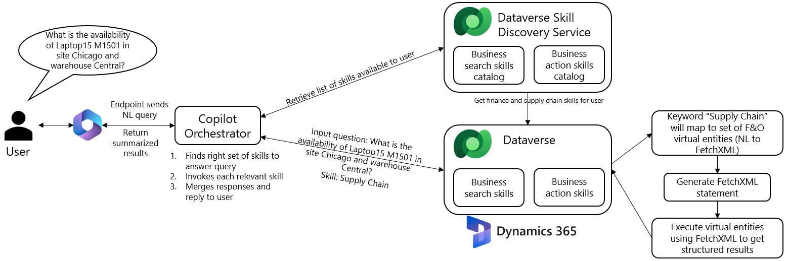

---
# required metadata

title: FAQ for chat with finance and operations data on Microsoft 365 Copilot
description: This article explains how to use Microsoft 365 Copilot to chat with finance and operations data through virtual entities in Dataverse.
author: ramasri
ms.date: 09/09/2023
ms.topic: article
ms.prod:
ms.technology: 

# optional metadata

# ms.search.form:
audience: Developer, IT Pro
# ms.devlang: 
ms.reviewer: johnmichalak
# ms.tgt_pltfrm: 
# ms.custom: NotInToc
ms.search.region: Global
# ms.search.industry:
ms.author: ramasri
ms.search.validFrom: 09/01/2023
ms.dyn365.ops.version: 10.0.35 PU59
---

# FAQ for chat with finance and operations data by using Microsoft 365 Copilot

[!include[banner](../includes/banner.md)]

This article explains how to use Microsoft 365 Copilot to chat with finance and operations data through virtual entities in Dataverse.

A Microsoft 365 Copilot license enables authorized users to engage in a natural-language conversation with finance and operations data. For example, they can ask the following questions:

- What is the overdue balance for customer Forest Wholesales?
- Summarize the collection status.
- What is the on-hand inventory for product Southridge Video Laptop 16 M1601 in Silver color?

Microsoft 365 Copilot summarizes the information that's spread across emails, chats, and documents, and reconciles it with the relevant data that resides inside finance and operations apps. The reconciled summary is presented as the response to the user.

## What types of data are supported?

Data that resides inside tables is referred to as *structured data*. Data that's present in static documents, such Word files, PDF files, and publicly available content, is referred to as *unstructured data*. Microsoft 365 Copilot supports data inquiries against both structured and unstructured data. For this release, the scope for finance and operations apps is limited to structured data only.

## What are the supported customer scenarios?

**Dynamics 365 Finance scenario – Inquire about collection status by using Microsoft 365 Copilot**

> [!VIDEO 2ea4ece0-c783-4410-8042-55569c5bb9f1]

Example questions:
1. What is the amount due for customer Forest Wholesales?
1. When was Forest Wholesales' last payment amount and date? 
1. How many open invoices does customer Forest Wholesales have?
1. What is the credit limit for Forest Wholesales?
1. What is the credit limit remaining for Forest Wholesales? 
1. Does Forest Wholesales have any disputed invoices? How many? 
1. How many open invoices does Forest Wholesales have and What is the open order balance for Forest Wholesales?*
1. What is the open order balance for Forest Wholesales?

**Dynamics 365 Supply Chain Management scenario – Inquire about on-hand inventory by using Microsoft 365 Copilot**

> [!VIDEO 7f051a6f-0d45-41b4-b4c7-cd5d4166b38d]

Example questions:
1. I need 6 Southridge Video Laptop16 M1601 in Silver color, can you check the availability in site Central, warehouse Chicago in company Contoso Retail USA? Give me the details by product name, site, warehouse, color, available quantity. 
1. What is the availability of Southridge Video Laptop16 M1601 in Silver color in site Central, warehouse Chicago in company Contoso Retail USA? Give me the details by product name, site, warehouse, color, available quantity. 
1. What is the inventory availability for Southridge Video Laptop16 in silver color in site Central, warehouse Chicago in company Contoso Retail USA? Give me the details by product name, site, warehouse, color, available quantity. 
1. I need 6 Southridge Video Laptop16 M1601 in Silver color, can you check the availability in site Central for stores, warehouse Chicago inventory in company Contoso Retail USA? Give me the details by product name, site, warehouse, color, available quantity. 
1. What colors do you have for Laptop15 M1501 other than Red in site Central, warehouse Chicago in company Contoso Retail USA?  Give me the details by product name, site, warehouse, color, available quantity. 
1. Do we have red Laptop16 M1601 in warehouses other than Chicago within the site Central in company Contoso Retail USA? Give me the details by product name, site, warehouse, color, available quantity. 

## What is happening behind the scenes?

The user's question is translated into a FetchXML query and run against the finance and operations database through virtual entities. The results are summarized and presented as the response to the user. The following illustration shows the architecture that works behind the scenes.

## Are we limited to the supported customer scenarios?

No, you aren't limited to the supported customer scenarios. Think of those scenarios as patterns that Microsoft 365 Copilot can process. All finance and operations entities that follow those patterns can be enabled for Microsoft 365 Copilot and support virtual entities. Here's the list of entities that are eligible for virtualization.

Nevertheless, for the preview, only US English (en-us) language translation support is available.

## How can I set up Microsoft 365 Copilot for my finance and operations data?

Before you can set up Microsoft 365 Copilot for your finance and operations data, you must have the following software versions installed:

- Finance and operations version 10.0.35 PU59 (10.0.1627.75) or later
- Dataverse version 9.2 or later, and finance and operations virtual entity solution provider version 2.8.7 or later

If you want to try the built-in scenarios, install the following two AppSource packages:

- **Finance package:** [Copilot in Microsoft Dynamics 365 Finance](https://appsource.microsoft.com/product/dynamics-365/mscrm.d365-financeai-preview?flightCodes=9b882e82e59c4f35a1b0a5368d42ea92&tab=DetailsAndSupport)
- **Supply Chain Management package:** [Copilot in Microsoft Dynamics 365 Supply Chain Management](https://appsource.microsoft.com/product/dynamics-365/mscrm.dynamicsscmai-preview?flightCodes=f42a7338c806438f8fca820c4ed82b7c&tab=Overview)

If you want to try your entities, enable them as virtual entities. For more information about how to enable virtual entities, see [Enable Microsoft Dataverse virtual entities](../power-platform/enable-virtual-entities.md).

Configure the following properties at the entity level:

- `ChangeTrackingEnabled`=*1*
- `CanEnableSyncToExternalSearchIndex`=*1*
- `SyncToExternalSearchIndex`=*1*

Configure the following property at the entity field level:

- `IsSearchable`=*1*

## Best practices

When you use Microsoft 365 Copilot to chat with finance and operations data, follow these best practices:

- If your question is about a customer, use the keyword "customer" in your question. For example, don't ask, "What is the amount due for Forest Wholesales?" Instead, ask, "What is the amount due for customer Forest Wholesales?"
- If you want the results to be shown in table format, use the key phrase "in table format" in your question. For example, ask, "What is the availability of Surface Pro 128 GB? Give me the details by site, warehouse, and color in table format."
- If you know the name or label that's associated with the required data in finance and operations apps, use that name when you search, to make the search easier. For example, the amount that customers owe is shown in the **Balance due** column on pages in finance and operations apps. Therefore, don't ask, "How much does customer Forest Wholesales owe?" Instead, ask, "What is the balance due of customer Forest Wholesales?"
- If you have access to multiple companies, add "list results by company" to your questions. Alternatively, you can add "in company…" at the end of your question. 

  Examples: 

    + What is the availability for Laptop15 M1501? List the result by company.    
    + What is the availability for Laptop15 M1501 in company Contoso Retail USA?

- To inquire collection status details, use the following keywords whenever possible to guide the copilot to route your question to Finance: 

| Keywords | &nbsp; |
|----------|--------|
| collections status | payment date |
| overdue | amount due | 
| open invoices | remaining credit | 
| credit balance | discount |
| credit limit | disputed invoices |
| order balance | outstanding invoice|
| invoice amount | last payment |

 - To inquire on-hand inventory stock availability details, use the following keywords whenever possible to guide the copilot to route your question to Supply Chain: 
 
| Keywords | &nbsp; |
|----------|--------|
| product availability | inventory availability|
| color | site |
| warehouse | inventory | 
| stock | item | 
| product | available quantity | 
| price | selling price | 

- Use letter casing correctly:
    + Use lower case for field or attribute names, like 'site', 'amount due'. Capital cased words are more likely to be treated as literals. 
    + If you're unsure about the spelling of string literals, try using lower case letters so that spelling correction is more likely to kick in. Capital-lettered words are more likely treated as special names and may not be spell checked. 

- Use precise terms for concepts with multiple ways of referencing.
    + Company can be referred to using company name or company code:
      + What is the inventory availability of Xbox in company Bank of House?
      + What is the inventory availability of Xbox in company code BOH?
    + Product can be referred to using product name or item number:
      + What is the inventory availability of Xbox in company Bank of House?
      + What is the inventory availability of item number xb001 in company Bank of House?
    + Customer can be referred to using customer name or customer account number:
      + What is the amount due for customer Laminar Hospitals?
      + What is the amount due for customer account 208705?

