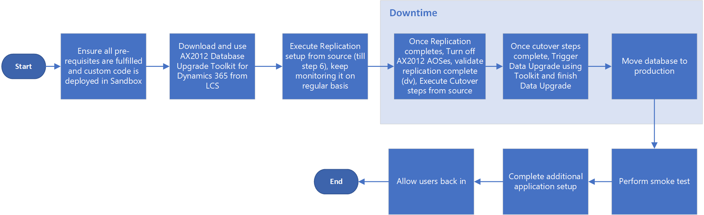

# Upgrade from AX 2012 - Go live (Cutover)

[!include [banner](../includes/banner.md)]

[!include [upgrade banner](../includes/upgrade-banner.md)]

After you have successfully completed upgrade testing in a Standard or Premier Acceptance Test environment (Sandbox Tier 2 or higher), and you have also completed a successful test cutover, the time has arrived to upgrade your production environment and go live.

> [!NOTE]
> The AX 2012 upgrade process should be run on the sandbox environment, not the production environment.

*Cutover* is the term that we use for the final process of getting a new system live. This cutover process consists of the tasks that occur after Microsoft Dynamics AX 2012 is turned off but before finance and operations is turned on. Before you plan your final cutover, you need to successfully complete one successful mock cutover as described in [Cutover testing](./upgrade-cutover-testing.md).

The following illustration shows the overall process for cutover to go-live as it will occur in the production environment.

> [!NOTE]
> In this article, we use the term *sandbox* to refer to a Standard or Premier Acceptance Testing (Tier 2 or 3) or higher environment connected to a SQL Azure database.

## Overall process

The high-level steps of the production environment upgrade process are the same as the Mock cutover process, refer to [Upgrade from AX 2012 - Cutover testing (Mock cutover)](./upgrade-cutover-testing.md) for detailed instructions.

1. Be sure you've completed the [pre-upgrade checklist for data upgrade](prepare-data-upgrade.md) and custom code is deployed in a sandbox environment. The sandbox environment must only be used for data upgrade.
2. Download the **AX 2012 Database Upgrade Toolkit for Dynamics 365** from Microsoft Dynamics Lifecycle Services (LCS) in the **Shared asset library > Model** area. Use this toolkit from the source SQL Server.
3. Execute replication setup and keep monitoring it on a regular basis using the toolkit.
4. Turn off the AX 2012 AOS instances at the time of downtime/cut-over.
5. Ensure replication completes. Validate replication completion by comparing the number of records between source and target using this toolkit. For more information about how to validate the replication, see [Reporting section of the application](data-upgrade-self-service.md#reporting-section-of-the-application).
6. Execute cutover steps using the toolkit and ensure its completion.
7. Trigger the data upgrade using the toolkit and finish the data upgrade.
8. Use [Self-service database refresh process](../database/database-refresh.md#self-service-database-refresh) to copy your upgraded database from the sandbox environment into your production environment. 
9. Complete application configuration and complete smoke test.
10.	Allow users to access the finance and operations app again.

## Prerequisites 
Before you can perform an upgrade in the production environment, the following prerequisites must be met:
-	Complete the code upgrade and data upgrade in a sandbox environment and successfully complete a functional test pass.
-	Deploy the production environment. Before the option to request the deployment of the production environment is an option, you must have completed:
    - The Subscription estimator in LCS. We use this to help us size your production environment because it provides details of the throughput you’ll require.
    - The Test phase of the methodology in LCS. This is to help ensure that you’re at the stage in your project where you’re ready to start testing in the production environment.
    - After a request is submitted to Microsoft to deploy the production environment, it will take roughly 24 hours to deploy, so ensure that you leave enough time for this to happen.
-	Apply all necessary updates and customizations (AOT deployable packages) to the production environment. There should not be any code change after signing off on a Mock cutover.

## Additional resources
- [Onboarding](../../fin-ops/imp-lifecycle/onboard.md)
- [Self-service database refresh](../database/database-refresh.md#self-service-database-refresh)
- [Upgrade from AX 2012 - Cutover testing (Mock cutover)](./upgrade-cutover-testing.md)

[!INCLUDE[footer-include](../../../includes/footer-banner.md)]

