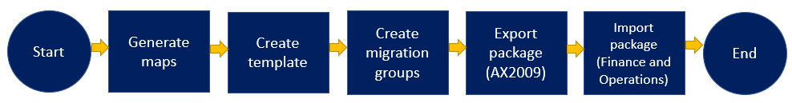

# AX 2009 upgrade - Use the Data migration tool to migrate from Dynamics AX 2009 to finance and operations 

[!include [banner](../includes/banner.md)]

You can use the Microsoft Dynamics AX 2009 Data migration tool (DMT) to migrate your data from AX 2009 to finance and operations. Using the DMT is the only supported upgrade path from AX 2009. The DMT helps you find and fill gaps between the table schemas for each version, as well as helping you move your data. 

> [!NOTE]
> Start your cloud migration journey with a no-charge, no-obligation migration assessment though the [Dynamics 365 Migration Program](https://dynamics.microsoft.com/migration-program/).

## Architecture
The following illustration describes the architecture of the DMT, and how data from the source system (AX 2009) is processed and moved to the target system (finance and operations).

## Data migration process

The following illustration shows the overall process of collecting and preparing the data in your AX 2009 instance and then importing that data into your new environment.

Before you can use the DMT to export data from the source environment (AX 2009), you must complete the following pre-processing tasks:

- Mapping the table fields between the source and target environments
- Applying conversions to the source data
- Setting up default values for the source data
- Applying query filters

Because there can be multiple legal entities in the source system, you must select the legal entities that contain the data to migrate. For the selected legal entities, you can review the source tables and their row counts. You can also view any virtual companies. Finally, you can analyze virtual companies that legal entities are attached to and the related tables.

Successful migration of exported data requires that a source table be mapped to an equivalent target data entity. You set up the mapping by using a Microsoft Excel mapping file that allows for automatic mapping of the source and target fields of each table. The mapping file also includes the data from the schema of the new data entities and the default data that is required in some tables.

Before you can migrate data from AX 2009, you must complete the following tasks to meet the migration requirements:

- Select target dimensions that correspond to the source dimensions that are populated based on the selected legal entities.
- Review the inventory dimensions that are included with the selected legal entities.
- Select the chart of accounts for each legal entity, or consolidate multiple legal entities into a single chart of accounts.
- Complete the basic ledger setup.
- Apply data conversions to the source data, based on the extended data type (EDT) of the field.

[!INCLUDE[footer-include](../../../includes/footer-banner.md)]
