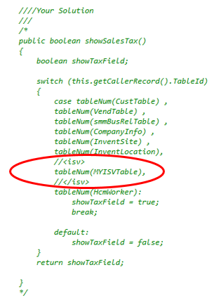
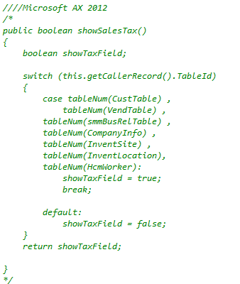
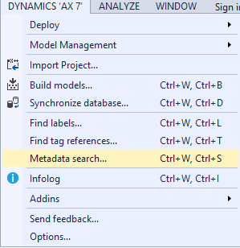
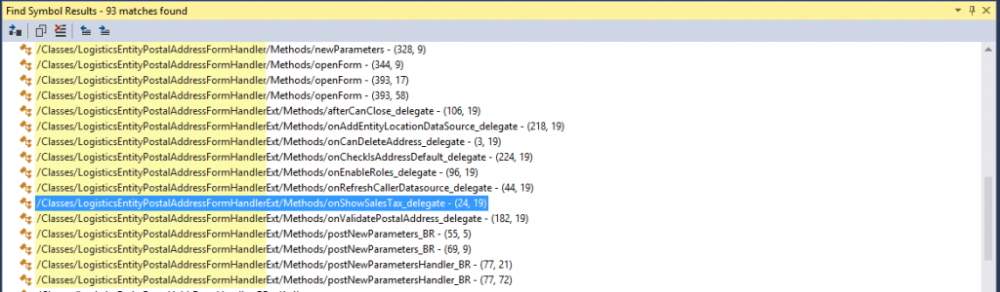

# Solve dependencies among models by using delegates during code migration

[!include [banner](../includes/banner.md)]

This article explains how delegate methods serve as a means for defining a contract between the delegate instance and the delegate handler.

## Overview

Finance and operations is split into several models, with each model in separate package. The principal 3 models are Application Platform, Application Foundation, and Application Suite. With the model split, a hierarchy has been created where a higher model can take dependencies and access elements in the models below, but not in models above. For example, in this setup, Application Suite has full access to its elements, Application Foundation’s elements, and Application Platform’s elements. Application Foundation can access its own elements and those of Application Platform. Finally, Application Platform can only access its own elements. To learn about models and packages, see [Models and packages](../dev-tools/models.md).

[](./media/del1.jpg) 

While the model split provides many benefits, it creates a problem when trying to access elements defined in higher models. Delegates are the recommended method for accessing elements in higher models from a lower model. Delegates are very similar to events in that when a delegate instance is invoked, a handler with compatible signature code is executed. This permits higher layer code, the handler, to be called by lower layer code, the delegate instance.

## Create delegates and handlers
A delegate declaration must have three things:

-   The delegate keyword
-   Type void
-   Empty method

Delegate methods serve as a means for defining a contract between the delegate instance and the delegate handler. A delegate takes no action itself. This is enforced by having a void type and having no code in the method. 

```xpp
delegate void applyDiscountDelegate(real _receiptTotal, EventHandlerResult _result)
{
}
```

Adding the **SubscribesTo** keyword to a method creates a static delegate handler. **SubscribesTo** requires the class name of the delegate, and the string name of the delegate method. 

In order for a delegate to be properly handled, the delegate method declaration, the delegate instance, and the delegate handler must have the *same* method signature. For example, the delegate instance below takes two inputs, a real number and an EventHandlerResult, matching the delegate declaration and handler signatures above. 


Due to the fact that delegates do not have a return value, an EventHandlerResult is passed as a parameter to provide access to the needed result value after the delegate has returned. This article focuses on static delegate handlers using the SubscribesTo. The delegate functionality from Dynamics AX 2012 remains. [How to use X++ Delegates in Dynamics AX 2012](https://blogs.msdn.com/b/x/archive/2011/08/02/how-to-use-x-delegates-in-dynamics-ax-2012.aspx) is a great blog post on MSDN by Microsoft developer Marcos Calderon on delegate concepts in Dynamics AX 2012. These concepts still apply.

## Example scenarios
### Overlaying an existing delegate

In many cases where delegates are needed, the code that was formerly overlayed has already been moved to a delegate handler by Microsoft. In these instances, Microsoft created delegates that can be leveraged and the code can be overlayed in a similar manner in the delegate handler. In this scenario, an Independent Software Vendor (ISV) is migrating code from Dynamics  AX 2012 R3 where they have overlayed the showSalesTax() method in the LogisticsEntityPostalAddressFormHandler class. After migration, the CodeUpgrade project will contain the LogisticsEntityPostalAddressFormHandler with the *Your Solution*, *Microsoft AX 2012,* and *Microsoft AX* sections to resolve for the showSalesTax() method. The commented Your Solution section shows that the showSalesTax() method was overlayed by adding an additional table to approve showing sales tax from. This overlay is shown between the &lt;isv&gt; tags circled in red below. 

[](./media/41.png)

When comparing this overlay with the code from Dynamics AX 2012, this is a simple change. The overlay has added an additional table to the switch statement. 

[](./media/51.png) 

However, the section for finance and operations does not appear to resemble either of the Dynamics AX 2012 code snippets. 

[](./media/61.png) 

Upon deeper inspection, the code is calling a delegate method, showSalesTax\_delegate(). 

[](./media/showsalestax_delegate.png) 

The use of a delegate implies that code has been moved to another location. The showSalesTax\_delegate() has been declared in the Application Foundation and handled in the Application Suite. To view the code that has been moved, find the delegate handler. The **Finding Delegates and Handlers** section contains methods to locate delegates and handlers. After finding the delegate handler method in the Application Suite, we see the code that has been moved from the showSalesTax() method. The same overlayered changes applied in Dynamics AX 2012 can be applied in the delegate handler. 

[](./media/findingdelegatesandhandles.png) 

After adding the new table to the switch statement in the delegate handler, the code will function as it did in Dynamics AX 2012. 

[](./media/showsalestaxmethod.png)

### Adding a new delegate

In this scenario, we will modify an existing tax calculation method that resides in the Application Foundation to account for discounts created in the Application Suite. The following class in the Foundation layer calculates the tax based on the gross total. 


In the Application Suite, we have introduced the notion of discounts by adding a ProductDiscount class that contains the current discount. 

[](./media/112.png) 

The TaxCalculator class, in the lower Foundation layer, does not have access to the DiscountRate in the Suite layer and must use a delegate to update receipt total to use in the tax calculation. In the SimpleTax class, we create a delegate method, applyDiscountDelegate, with the state information that is needed by the handler in the signature. A delegate method is always empty because its only purpose is to define the contract between the delegate instance and the handler. 

```xpp
delegate void applyDiscountDelegate(real _receiptTotal, EventHandlerResult _result)
{
} 
```

> [!NOTE]
> The signature for the delegate declaration, the delegate instance, and the delegate handler must match. We now have to create an instance of the delegate at the point in the code where we would like the delegate handler to be run. The changes in between the &lt;isv&gt; tags represent the added code. 


With the delegate in place, we now add a handler method in the Application Suite layer that has access to the discount information. 


Using the SubscribesTo keyword, we tie the applyDiscountDelegateHandler method as a handler to the applyDiscountDelegate delegate.

> [!NOTE]
> There can be more than one handler per delegate. There is **not** a defined order in the processing of handler methods. If order is important, delegate handler pairs should be chained together. With the final classes below, when the calculateTotalTax() method is run, the applyDiscountDelegate is fired and handled, updating the receiptTotal to provide an accurate tax calculation.

#### Full Code

##### SimpleTax class in the Application Foundation Layer


##### ProductDiscount class in the Application Suite layer


## Find delegates and handlers
There are three key ways to find delegates and handlers

-   Metadata search
-   Class references
-   SubscribesTo references

The Metadata search tool, described on the [Metadata search in Visual Studio](../dev-tools/metadata-search-visual-studio.md) page, is the best way to find either delegates or their handlers. In Visual Studio, go to **Dynamics 365 &gt; Metadata Search** to open the metadata search tool. 

[](./media/del15.png) 

In the search field, type “code:&lt;delegate name&gt;” which will restrict the search to code and find any use of the delegate name, returning both the delegate and handler. Metadata search will search the entire code base and may take some time to complete, but will return any use of the search term in code. 

[](./media/del16.png) 

Methods two and three can be used in parallel to the metadata search. The class where a delegate is defined can also serve as a means to narrow down the search for a delegate or handler. The SubscribesTo keyword requires the class name where the delegate was defined. Visual Studio’s find references (right-click the class name &gt; find references) will return a list of files that reference the class. This list will include both the class definition where the delegate is declared and the handler referencing the class. Finding class references is not a perfect method and will require some manual searching through class references. However, it produces a smaller subset of files and can be faster than a metadata search. 

[](./media/del17.png) 

Similar to finding class references, finding all references can be done on the SubscribesTo keyword. The resulting list will include all static delegate handlers. Manually going through this list provides another means for finding static delegate handlers. This will not return dynamically declared delegate handlers that do not use the SubscribesTo keyword. 

[](./media/del18.png)


[!INCLUDE[footer-include](../../../includes/footer-banner.md)]
