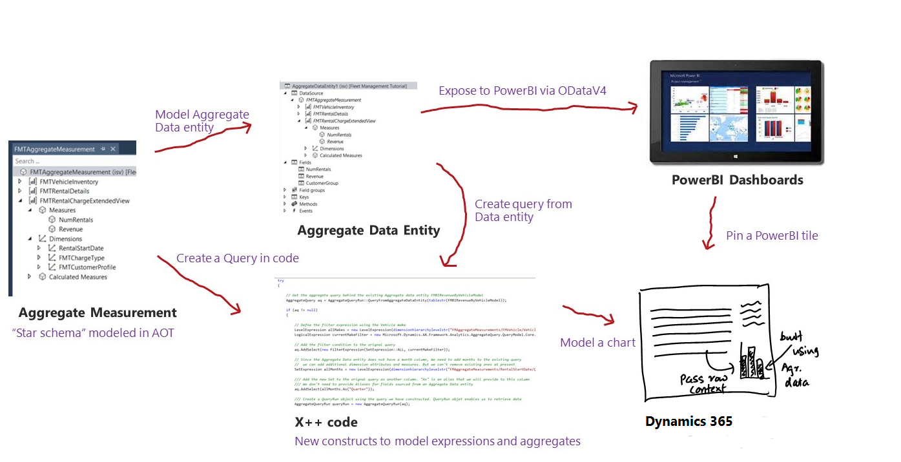

---
# required metadata

title: Transition from Analysis Services cubes to aggregate models
description: This article explains how in-memory, real-time aggregate models are used for analytics, and why we transitioned from using Server Analysis Services (SSAS) cubes.
author: MilindaV2
ms.date: 06/20/2017
ms.topic: article
ms.prod: 
ms.technology: 

# optional metadata

# ms.search.form: 
# ROBOTS: 
audience: Developer, IT Pro
# ms.devlang: 
ms.reviewer: sericks
# ms.tgt_pltfrm: 
ms.assetid: 877db646-da4b-48b5-83ab-61ae59d91921
ms.search.region: Global
# ms.search.industry: 
ms.author: milindav
ms.search.validFrom: 2016-02-28
ms.dyn365.ops.version: AX 7.0.0

---

# Transition from Analysis Services cubes to aggregate models

[!include [banner](../includes/banner.md)]

This article explains how in-memory, real-time aggregate models are used for analytics, and why we transitioned from using Server Analysis Services (SSAS) cubes.

The world is moving to real-time, proactive analytics. Reporting and trending on historical data is being replaced by up-to-the-second visualizations and proactive guidance. In-memory, real-time aggregate models now replace the perspectives that were previously used for analytics.

## A historical look at perspectives and cubes
We envision embedded insights playing a key role in the finance and operations user experience. This vision has driven us to invest in building analytic capabilities within the product. In Dynamics AX 4.0, we introduced the concept of *perspectives*. The objective was to present a simpler view of the ERP schema, specifically modeled for reporting. This simpler view was referred to as perspectives. In Dynamics AX 4.0, the system generated reporting models (SMDL models) that enabled you to create ad-hoc reports with SQL Server Report Builder. In Dynamics AX 2009, we added the capability to generate SQL Server Analysis Services (SSAS) projects using metadata definitions in perspectives. These projects become cubes when deployed to an SSAS server. In Dynamics AX 2012, we improved modeling in perspectives and improved tooling support for managing the lifecycle of SSAS projects. You could use Excel, as well as Power View, to explore data and create reports with cubes in Dynamics AX 2012. The SMDL technology was also deprecated. In Dynamics AX 2012, we stopped generating SMDL models.

## How perspectives are used now
As a developer, your “contract” with the system was a perspective. The system generated “stuff” to help you achieve your end goal. In Dynamics AX 2012, the "stuff” that was generated was SSAS projects. So the contract between you (the  developer) and the system (the BI framework), was as follows:

-   You modeled perspectives.
-   The system generated the "stuff" needed to enable you to build visuals and reports.

Perspectives are now modeled using add-ins for Visual Studio. (Visual Studio is now the development environment.) Perspectives are comprised of *aggregate measurements* and *aggregate dimensions*. As a developer, you have the ability to model simpler schemas for answering business questions using aggregate measurements and aggregate dimensions. Aggregate measurements can be used to define data entities (called *aggregate data entities*) which can be directly bound to finance and operations forms as a data source. Aggregate data entities can also be used to

-   Expose data to PowerBI.
-   Access data programmatically using the AXQuery object.

  

[!INCLUDE[footer-include](../../../includes/footer-banner.md)]
