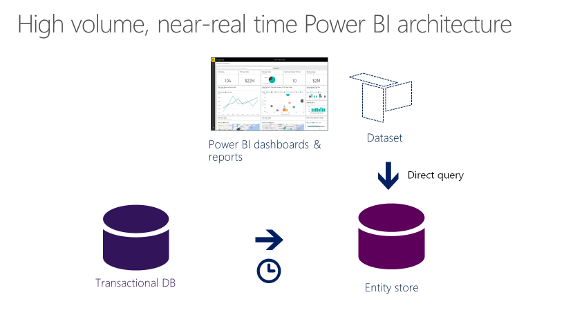

---
# required metadata

title: Migrate upgraded AX 2012 R3 sales cubes to the entity store
description: In this tutorial, you'll migrate an upgraded Microsoft Dynamics AX 2012 R3 cube schema to the entity store in a finance and operations application. 
author: MilindaV2
ms.date: 08/01/2022
ms.topic: article
ms.prod: 
ms.technology: 

# optional metadata

# ms.search.form: 
# ROBOTS: 
audience: Developer, IT Pro
# ms.devlang: 
ms.reviewer: sericks
# ms.tgt_pltfrm: 
ms.assetid: e992cdd8-abe8-42d0-97ad-6165822abbba
ms.search.region: Global
# ms.search.industry: 
ms.author: milindav
ms.search.validFrom: 2016-05-31
ms.dyn365.ops.version: Platform update 1

---

# Migrate upgraded AX 2012 R3 sales cubes to the entity store

[!include [banner](../includes/banner.md)]

In this tutorial, you'll migrate an upgraded Microsoft Dynamics AX 2012 R3 cube schema to the entity store in a finance and operations application. You'll use the sales cube that was included in Dynamics AX 2012 R3 as an example.

The entity store will support near real-time Microsoft Power BI integration scenarios, as shown in the following diagram. For an overview of Power BI integration with entity store, see [Power BI integration with entity store](/archive/blogs/dynamicsaxbi/power-bi-integration-with-entity-store-in-dynamics-ax-7-may-update). [](./media/powerbiarchitecture.png)

## New Power BI features included in the May 2016 and November 2016 updates
This tutorial requires the Dynamics 365 for Operations May 2016 update or later. You will use the following new capabilities in this tutorial:

-   Stage an aggregate measurement in the entity store and refresh the data from Dynamics AX. You might prefer this option over in-memory real time aggregate measurements when:
    -   You upgrade a Dynamics AX 2012 cube.
    -   Your aggregate measurements are very large.
    -   Data freshness (latency) from a few minutes up to a few hours is acceptable for reporting.
-   Use the batch framework to schedule a recurring refresh. For this release, only a full refresh is enabled.
-   Create reports using Power BI desktop in a developer/test environment.
-   Leverage the direct query option when creating Power BI content. For example, you can create larger models without relying on OData as the data refresh mechanism.
-   Migrate reports from your development environment to a production environment using Lifecycle Services (LCS).
-   As a partner or an ISV you can distribute Power BI content as part of an LCS solution to your customers.
-   **If you're using the November update (platform release 1611)** or later, some steps in this document are part of the process to refresh the entity store - you do not need to perform them manually.

## Change upgraded aggregate measurement properties
As part of the code upgrade process, analysis services projects from the Application Object Tree (AOT) in Dynamics AX 2012 can be migrated to the new aggregate measurements metadata format.

1.  Launch Visual Studio and create a new project in Application Suite.

    > [!NOTE]
    > You can create a model and include the customized aggregate measurement within that model. For more information, see [Customize through extension and overlayering](../extensibility/customization-overlayering-extensions.md).

2.  Open Application Explorer. Go to **Analytics** &gt; **Perspectives** &gt; **Aggregate measurements**. You will notice a set of aggregate measurements that were upgraded from Dynamics AX 2012 R3, as well as the measurements that ship in the current version.
3.  Select **SalesCube**. Right-click and select **Duplicate in project**.
4.  An aggregate measurement with the name **SalesCubeCopy** will be added to the project.
5.  Rename this measurement. Select **SalesCubeCopy** in Solution Explorer. Right-click and select **Rename**. Enter **SalesCubeV2** as the new name.
6.  Double-click **SalesCubeV2** to launch the Aggregate measurement designer. Notice the structure of the aggregate measurement that was migrated from Dynamics AX 2012.
7.  The sales cube in Dynamics AX 2012 encompassed a broad subject area related to Sales. In this case, let’s create a smaller, more focused Power BI model using the metadata that was upgraded. Expand the **Sales Order Lines** measure group and review the list of measures and dimension references.

    > [!NOTE]
    > Leveraging the modeling capabilities you can quickly make a few enhancements to this model. Suggestions for improvements:
    >
    > -   Replace views/tables that have been used to model the measure group (and/or dimensions) with an entity. You can model an entity using the underlying view and replace the view with the corresponding entity. This will enable you to leverage upcoming features such as incremental refresh and security.
    > -   Remove unwanted dimension references by adding the corresponding field to the attributes node. For example, the Sizes dimension reference can be removed because the **Size** field in the measure group is sufficiently descriptive. This will improve the runtime performance of queries as well as refresh times.

8.  Select the **SalesCubeV2** root node in the Aggregate measurement designer. Right-click and select **Properties**.
9.  During upgrade, aggregate measurements are set to the legacy property flag, **SSASCube**. You need to change this property to one of two supported usage types. Previously, **InMemoryRealTime** was supported as usage for aggregate measurements. **StagedEntityStore** is supported as a new usage type.

    > [!NOTE]
    > Modify the usage property to InMemoryRealTime if you plan to use the Aggregate measurement for embedded BI scenarios as well as Power BI integration. If you are using the Aggregate measurement only for Power BI or Cortana Intelligence Suite integration, select **StagedEntityStore**.

10. Save the project. Right-click the project in Solution Explorer and select **Rebuild**.
11. After the rebuild operation is finished, save the project, and then close Visual Studio. This completes the development work. You will author reports as a report developer or a power user.

## Refresh the entity store
As an administrator you can configure the refresh of the aggregate measurement using the client.

1.  Launch the Dynamics AX client and navigate to **System Administration** &gt; **Setup** &gt; **Entity Store**. The **Entity Store** form shows a list of aggregate measurements that are available for deployment to the entity store.
2.  Notice that **sales cube** (which was upgraded from Dynamics AX 2012) is not available for deployment to the entity store. **SalesCubeV2**, which you created in the previous step, can be deployed to the entity store.
3.  Select **SalesCubeV2** from the list, and click the **Refresh** button. The **Refresh** dialog box will display. Expand the **Run in the background** tab.
4.  Provide a descriptive name in the **Task description** field. Optionally, you can select the **Recurrence** tab and create a recurring schedule instead of a one-time refresh. Click **OK**.
5.  The system will create a batch job for refresh of the aggregate measurement in the entity store.

## Authoring a report on Sales by State with Power BI desktop
This step requires that you the install Power BI desktop tool that can be downloaded from [Microsoft Power BI Desktop](https://www.microsoft.com/download/details.aspx?id=45331).

1.  Launch Power BI desktop. You may need to apply updates. A welcome page will display. Click **Get data**.
2.  Alternatively, when Power BI desktop launches, on the **Home** tab select **Get Data** &gt; **SQL Server**.
3.  In the **SQL Server Database** dialog box, enter the server name and the name of the entity store database. If you deployed a developer environment, you can enter “.” as the server name and **AxDW** as the database name. If you are working in a test environment, you need to get these parameters from your system administrator
4.  Select the **DirectQuery** option. In this exercise, you will create Power BI reports that are executed directly on the entity store. If you had used the **Import** option, Power BI would cache data from the entity store and you would need to periodically refresh the Power BI model. **Import mode is currently not supported with reports written using entity store**. Click **OK**.
5.  Next you will see the **Navigator** dialog box. Navigator enables you to select tables and views from the entity store that you want to report on. Enter **Sales** in the search box. The system will filter entities that are related to the **SalesCubeV2** aggregate measurement that was previously created.

    > [!NOTE]
    > The entity store stages the aggregate measurements that have been created. While entities within each aggregate measurement are prefixed and stored as individual tables, Power BI desktop enables you to combine data from multiple aggregate measurements.

6.  You will create a report that shows sales by state. Select **SalesCubeV2\_Customer** and **SalesCubeV2\_CustomerInvoices** from Navigator and click **Load**.
7.  You will notice Power BI designer with **Fields** present in the entities that you have chosen (on the far right), as well as available visualization.

### Create a surrogate key that links customers and invoices (applies to Platform versions before November 2016 update)

> [!NOTE]
> Surrogate keys are generated in aggregate measurements staged into entity store. Power BI desktop does not enable you to relate table joins using multiple fields (also known as, composite keys). The **SalesCubeV2\_Customer** entity does not have a surrogate key (such as AX RecID) defined in it. Next, you will create a surrogate key that enables relating a customer entity to invoices.

1.  Select the ellipsis (…) icon next to the **SalesCubeV2\_CustomerInvoices** entity. Right-click and select **New Column**.
2.  Enter the following expression in the **Formula editor** window.

    ```xpp
    FKCustomer = CONCATENATE(CONCATENATE(SalesCubeV2_CustomerInvoices[DATAAREAID], "-"), SalesCubeV2_CustomerInvoices[ORDERACCOUNT])
    ```

    > [!NOTE]
    > When you enter the first few letters of the field name or function, the editor will display a list of candidate fields. This is called a type-ahead feature. You can either copy and paste this expression or use the type-ahead feature.

3.  When completed, your formula should look similar to the following.

    [](./media/powerbiformula.png)

4.  Notice that a new field, **FKCustomer**, is shown in the list of fields for the **SalesCubeV2\_CustomerInvoices** table. Because this field is used to relate two tables, you can hide it from end users by right-clicking the field and selecting the **Hide** option.
5.  Next, create a similar field in the **SalesCubeV2\_Customer** table. Select the ellipsis (…) icon next to **SalesCubeV2\_Customer** entity. Right-click and select **New Column**.
6.  Enter the following expression in the **Formula editor** window.

    ```xpp
    FKCustomer = CONCATENATE(CONCATENATE(SalesCubeV2_Customer[DATAAREAID], "-"), SalesCubeV2_Customer[CUSTOMER])
    ```

7.  Notice that the field **FKCustomer** is shown in the list of fields for the **SalesCubeV2\_Customer** table. Because this field is used for relating two tables, you can hide it from end users by right-clicking the field and selecting the **Hide** option.

### Relate invoices and customers

> [!NOTE]
> You can relate the surrogate keys already created within entity store. If not, you must relate the surrogate keys that you created manually. Next you will create a relationship between **SalesCubeV2\_CustomerInvoices** and **SalesCubeV2\_Customers** entities.

1.  Click the **Manage Relationships** button on the Power BI ribbon. You will see the **Manage Relationships** dialog box. Click the **New** button.
2.  In the **Create Relationship** dialog box, select **SalesCubeV2CustomerInvoices** as the first table in the drop-down list. Scroll to the right and select the **FKCustomer** field as the column to relate to.
3.  In the second drop-down list select **SalesCubeV2Customer** as the table. Scroll to the right and select **FKCustomer** as the column to relate to.
4.  Select the **Make this relationship active** option if it is not already selected. Click **OK** to continue.
5.  You will notice the newly created relationship in the **Manage Relationships** dialog box. Click the **Close** button.

### Create a Sales by state report

1.  To create a report that shows sales by customer group, drag the **CustomerInvoiceAmountAccountingCurrency** field from the **SalesCubeV2\_CustomerIncoices** table and drop it on the Power BI desktop canvas. Next, drag the **CustomerGroupName** field in the **SalesCubeV2\_Customer** table to the same grid.
2.  Change the chart type to a doughnut chart. You should see a report similar to the following.

    [](./media/doughnut-chart.png)

3.  You can create additional visuals using the Power BI desktop. When you save, you will notice that the file has a **PBIX** extension.
4.  Save the report to your desktop.
5.  At this point the report is fully functional (with data from your environment) and you can continue to use the Power BI desktop or upload this report to PowerBI.com and continue with data exploration.
6.  Next, you will migrate this report to a production environment using LCS so that you can see this report with production data and share it with other users.

## Publish the report and the model
Publishing a report and model requires uploading the report to Lifecycle Services, migrating the aggregate measurement to your production environment, configuring the client to point to the correct LCS library, and publishing your reports in your production environment.

### Upload the report to Lifecycle Services

Microsoft Dynamics Lifecycle Services (LCS) is the tool used to migrate development artifacts from developer to production environments. In the May 2016 update, LCS supports migrating PBIX files (authored using the entity store) between environments.

1.  Open [LCS](https://lcs.dynamics.com/) from the developer environment. If you haven’t created a project in the LCS environment, create a project.
2.  Scroll to the right and you will notice the **Asset Library** icon. Click the icon and launch **Asset Library**.

Notice that the asset library enables adding **PowerBI report models** (PBIX files) as implementation artifacts to a project.

1.  Select the plus (+) icon to add a new asset.
2.  Provide a name and a description. Click **Upload** and then locate the file that you saved in an earlier step.
3.  After you successfully upload the file, click **Confirm**. Notice that the file is uploaded into LCS as an implementation asset. LCS supports managing versions and releases for Power BI reports. You can maintain several versions and publish reports to other environments, just as you would for other implementation artifacts. Because you added the PBIX files as an asset within an LCS project, environments that you deployed using that project will have access to this report.
4.  Optionally, you can publish this report so that all of your projects can access the shared assets. If you are a partner or an ISV, and want to share this report with your customers, you would share this asset to your global library and enable your customers to import the asset into their respective LCS projects. To do this, select the **Save to my library** option.

### Migrate the aggregate measurement to a production environment

1.  You need to migrate the aggregate measurement that you modified in the developer environment to the production environment. You can follow the instructions in Generate a deployable package. create-apply-deployable-package.md.
2.  After you successfully publish the model, perform the steps outlined in the **Refresh the entity store** section of this tutorial, so that the entity store is updated with data.

### Configure an LCS project

If you haven’t already done so, associate your environment with an LCS project so that finance and operations apps can consume assets within the project.

1.  Launch the client from the instance that you want to use to deploy the Power BI reports. Typically this is the test or a production instance where you want to see a report with a different set of data than what you worked with as a report developer.
2.  Open **System Administration** &gt; **Setup** &gt; **System parameters**. Select the **Help** tab. Using the **Lifecycle services help configuration** list box, select the LCS project that you uploaded the PBIX file to. Click **Save**.

    > [!NOTE]
    > This form will only show the LCS projects that the current user has access to. If this step is being performed by an administrator, either the administrator needs to have access to the project, or the PBIX artifacts need to be imported into a project that the administrator has access to.

### Publish Power BI reports to a production environment

1.  Open **System Administration** &gt; **Setup** &gt; **Deploy PowerBI** from the client. You will see the file that you uploaded to LCS.
2.  Select the **Sales Report** file and select the **Deploy Power BI files** option on the menu bar.

    > [!NOTE]
    > You may be asked to consent publishing to the PowerBI.com service. Click the link to provide consent. When consent is complete, you need to go back to the original browser window and click the **Close** button.

3.  After you successfully publish the file, the Power BI report will appear in your PowerBI.com subscription. You will notice that the report now points to the entity store in the production environment.

## Continuing with PowerBI.com
As an administrator or a power user, you have successfully authored and published a Power BI report to the production environment using the entity store. You can perform several additional steps using Power BI functionality.

-   Optionally, you can apply record-level security to the dataset to restrict users from seeing data they are not allowed to view in Power BI.
-   You can create an organizational content pack and share it among users in a group.
    -   You can export datasets, reports, and dashboards from your PowerBI.com instance as a new content pack to a selected group of users.
    -   Note that organizational content packs adhere to any record-level security rules that you defined at the dataset level.
-   Users can personalize their workspaces by adding Power BI tiles or reports.


## Additional resources

[Model aggregate data](../analytics/model-aggregate-data.md)


[!INCLUDE[footer-include](../../../includes/footer-banner.md)]
