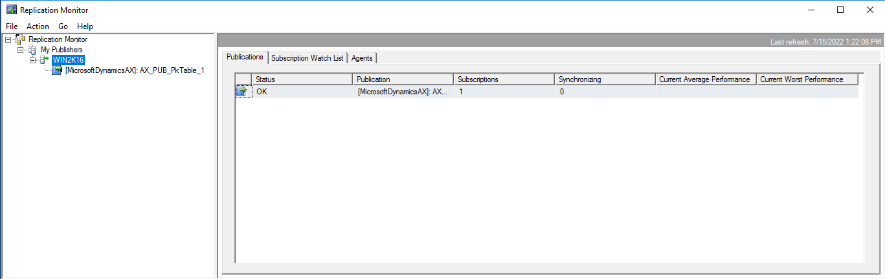

---
# required metadata

title: Monitor replication for the Data migration toolkit
description: This article describes how to monitor replication for the Data migration toolkit for Microsoft Dynamics 365.
author: ttreen 
ms.date: 04/26/2023
ms.topic: article
audience: Developer, IT Pro
ms.reviewer: v-chgriffin
ms.search.region: Global
ms.author: ttreen
ms.search.validFrom: 
ms.search.form: 2022-04-08

---

# Monitor replication for the Data migration toolkit

[!include[banner](../includes/banner.md)]

The Data migration toolkit for Microsoft Dynamics 365 is used for self-service environments. It uses SQL replication to transfer data from the customer's on-premises SQL Server instance to the Azure SQL database that's used for Dynamics 365.

The toolkit is used both in upgrades from Dynamics AX 2012 to Dynamics 365 and in migrations from Dynamics 365 (on-premises) to Dynamics 365 in the cloud.

For more information, see the following articles:

- [Upgrade from AX 2012 - Data upgrade in self-service environments](data-upgrade-self-service.md)
- [Move Lifecycle Services implementation projects from on-premises to the cloud](../lifecycle-services/move-on-prem-to-cloud.md)

The toolkit has an **RS** command that lets you monitor the replication status. For more information, see [Toolkit Reporting Section](data-upgrade-self-service.md#reporting-section-of-the-application). However, you might want to monitor the replication directly in SQL Server Management Studio (SSMS). This article explains how to monitor replication and describes the specific steps of replication.

## Replication overview

By default, when you run the Data migration toolkit, two publications are created for tables that have primary keys, one publication is created for other objects (functions), and one publication is created for tables that don't have primary keys. Additionally, one final publication can be created for locked tables or record count mismatches, if it's required.

Each publication has two SQL agent jobs:

- **Snapshot agent** –  This agent is responsible for the initial snapshot of the tables (articles) in the publication. It will create files in the snapshot folder for each table. For more information about these files, see the [File type details](#file-type-details) section of this article.
- **Log reader agent** – This agent is responsible for pushing the snapshot to the target database (subscriber) and for any ongoing changes to the tables. 

> [!NOTE]
> The publication for tables that don't have primary keys only pushes up the snapshot.

## Replication Monitor

To monitor the replication in SSMS, connect to the source on-premises database server, expand the **Replication** folder, select and hold (or right-click), and then select **Launch Replication Monitor** to open Replication Monitor.

> [!NOTE]
> As the preceding illustration shows, there's only one publication for tables that have primary keys, whereas there are usually two.

### Snapshot generation

There are a few ways to view the snapshot agent details.

1. Select the publication on the left.
2. On the **Agents** tab, select and hold (or right-click) **Snapshot Agent**, and then select **View Details**.

The **Snapshot Agent** window is opened.

The process of generating a snapshot has four steps:

1. Update statistics on indexes.
2. Create bulk copy files.
3. Customize object scripting.
4. Generate scripts.

The snapshot files are created in the folder that you specified when you set up the Data migration toolkit. In File Explorer, open that folder, and drill down through the folders to the publications that you're reviewing.

### File type details

The following table explains the different types of snapshot files.

| File name | Type of file | Description |
|---|---|---|
| \*.bcp | SQL Server replication snapshot bulk copy file | A binary file that contains the data in the table. There can be one or several of these files for each table, depending on the size of the table. |
| \*.dri | SQL Server replication snapshot constraint script | An SQL script that contains the constraints on the table. |
| \*.idx | SQL Server replication snapshot index script | An SQL script that contains the indexes on the table. |
| \*.pre | SQL Server replication snapshot script | An SQL script that's used to move existing objects in the target database. |
| \*.sch | SQL Server replication snapshot schema script | An SQL script that creates the table and stored procedures that are used to replicate the data to the subscriber database. This script doesn't include constraints or indexes. |
| \*.xpp | SQL Server replication snapshot extended properties script | An SQL script that contains any extended properties on the table. For AX 2012 tables, this script tends to be empty. |

After the snapshot is completed, the following message is shown: "A snapshot of \<number of articles\> article(s) was generated."

At this stage, the snapshot is only in the file share. In the next step, the distributor will move it to the target (subscriber) database.

### Distributor to subscriber

You can use the distributor-to-subscriber details to monitor the following information:

- The push of the generated snapshot to the target (subscriber) database
- Any ongoing transactions that were created during snapshot generation
- Ongoing transactions

To view the distributor-to-subscriber logs, on the **All Subscriptions** tab, select **View Details**.

Follow these steps to move a snapshot.

1. Run the .pre files. These scripts drop existing objects in the target.

    

2. Run the .sch files. These scripts create the tables.
3. After the tables have been scripted in the subscriber (target) database, the bulk copy files are imported into the target.

    The process of importing .bcp files can take several hours.

4. Create the indexes.
5. Apply constraints and extended properties.

On the **Undistributed Commands** tab, you can monitor the progress of the distribution, including the number of outstanding commands to apply and the estimated remaining time.

After the snapshot is delivered, the following message is shown: "Delivered snapshot from the \\\\unc\\server\\folder."

If there are no more outstanding commands, the **Undistributed Commands** tab shows the number of outstanding commands to apply as **0** (zero) and the estimated remaining time as **00:00:00**.

## Transaction replication

After the snapshot is delivered, any new transactions that were created in the database during or after the push of the snapshot are delivered to the subscriber (target). After the database is stabilized, and there's nothing to replicate, the following message is shown: "No replicated transactions are available."

### Network bandwidth

While the snapshot is being pushed, you can monitor the bandwidth from the distributor process to the target database. This information is useful if upload performance issues occur.

1. Open Task manager.
2. Select **Open resource monitor**.
3. In Resource Monitor, on the **Network** tab, filter on **DISTRIB.exe**. The send bandwidth speed is shown.

