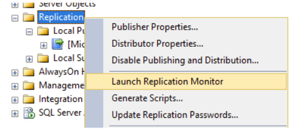

---
# required metadata

title: Monitor replication
description: This article describes how to monitor replication in Microsoft Dynamics AX 2012.
author: ttreen 
ms.date: 04/26/2023
ms.topic: article
audience: Developer, IT Pro
ms.reviewer: v-chgriffin
ms.search.region: Global
ms.author: ttreen
ms.search.validFrom: 
ms.search.form: 2022-04-08

---

# Monitoring replication for the data migration toolkit for Dynamics 365 Finance

[!include[banner](../includes/banner.md)]

The Data migration toolkit for Dynamics 365 is used for self-service environments. This tool uses SQL replication to transfer the data from the customer's on-premises SQL Server to the Azure SQL database used for Dynamics 365.

This tool is used in both AX 2012 to Dynamics 365 upgrades, and also in Dynamics 365 on-premises to Dynamics 365 cloud migrations.

   See: 
   - [Upgrade from AX 2012 - Data upgrade in self-service environments](/data-upgrade-self-service.md)
   
   - [Move Lifecycle Services implementation projects from on-premises to the cloud](/lifecycle-services/move-on-prem-to-cloud.md)

The migration tool has a command called **RS** for monitoring the replication status, but the details in that are limited see: [Toolkit Reporting Section](/data-upgrade-self-service.md#reporting-section-of-the-application)

You may want to monitor the replication directly in SQL server management studio. The details in this document explains how to monitor and the specific steps of the replication.

## Replication overview
By default, when you run the toolkit, we create two publications for tables with primary keys. A single publication for other objects (fuctions) and a single publication for tables without primary keys. Optionally, a final publication for locked tables, or record count mismatches can be created if needed.

Each of these publications has two SQL agent jobs:
1. Snapshot agent
    - The snapshot agent is responsible to the initial snapshot of the tables (articles) in the publication. This will create files in the snapshot folder for each table, more details on these are later in this document. 
2. Log reader agent
    - The log reader agent is responsible for pushing the snapshot to the target database (subscriber) and any ongoing changes to the tables. 
 >[!Note]
 >The non-primary key publication only pushes up the snapshot.

## Replication monitor

To monitor the replication in SQL management studio, connect to the source on-premise database server, expand **Replication**. Select **Launch replication monitor**

The **Replication monitor** window will open:

> [!Note] 
> You can see above, there is a single primary key table publication whereas the default is normally two. 

### Snapshot generation

There are a few ways to get to the snapshot agent details. 
To view the snapshot agent details: 
1. Select the publication on the left. 
2. Select the **Agents** tab, right-click **Snapshot Agent** and select **View Details**.
The **Snapshot agent details** window will display:

There are four steps when generating a snapshot:

1. Update statistics on indexes   
2. Create bulk copy files
3. Customize object scripting 
4. Generate scripts

The snapshot files are created in the folder that was specified during the toolkit setup.
Open **File explorer** to this folder, and drill down the folders to the publications you're reviewing.

### Files type details

 - *.BCP – SQL Server replication snapshot bulk copy file 
    - Binary file containing the data in the table. There can be one or several for each table depending on the size of the table. 
 - *.DRI – SQL Server replication snapshot constraint script
    - SQL Script containing the constraints on the table.  
 - *.IDX – SQL Server replication snapshot index script
    - SQL Script containing the indexes on the table.
 - *.PRE – SQL Server replication snapshot script
    - SQL Script used to move existing objects in the target database.
 - *.SCH – SQL Server replication snapshot schema script
    - SQL Script for creating the table and stored procedures used to replicate the data to the subscriber database. This doesn't include constraints or indexes. 
 - *.XPP  – SQL Server replication snapshot extended properties script
    - SQL Script containing any extended properties that may be on the table. This tends to be empty for AX 2012 tables. 

Once the snapshot is completed, a message will display **"A snapshot of XXX article(s) was generated"**.

At this stage, the snapshot is only in the file share, the next step is the distributor will move the snapshot to the target (subscriber) database. 

### Distributor to subscriber

The distributor to subscriber details can be used to monitor:
 - the push of the generated snapshot to the target (subscriber) database 
 - any ongoing transactions that were created during the snapshot generation 
 - ongoing transactions

To view the distributor to subscriber logs, click **All Subscriptions** tab and then click **View Details**.
1. The first step in moving the snapshot is running the PRE files (these drop existing objects in the target).

2. The SCH scripts are run and create the tables.
3. After the tables have been scripted in the subscriber (target) database, the bulk copy files are imported to the target.
The BCP file import process can take several hours.
4. The next step is to create the indexes.
5. The final step is applying constraints and extended properties.

You can check on the **Undistributed commands** to see how much is outsatnding:

Once the snapshot is delivered, the message "Delivered snapshot from the \\unc\server\folder...." will be displayed.
If there are no further outstanding commands, the following will display in the **Undistributed commands**:

## Transaction replication

After the snapshot is delivered, any new transactions created on the database during or after the push of the snapshot are delivered to the subscriber (target).
After the database stabilizes, and there is nothing to replicate, the message **No replicated transactions are available** will be displayed.

### Network bandwidth

While the snapshot is being pushed, you can monitor the bandwidth from the distributor process to the target DB. This is useful for upload performance issues.
Open **Task manager**:
Click **Open resource monitor**
In **Resource monitor**, click **Network**, filter on **DISTRIB.exe**. This will display the send bandwidth speed.

