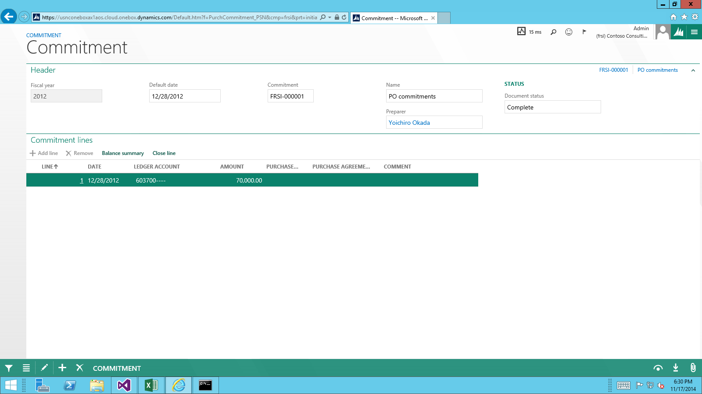
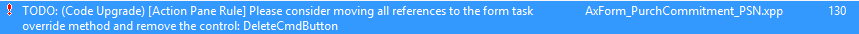
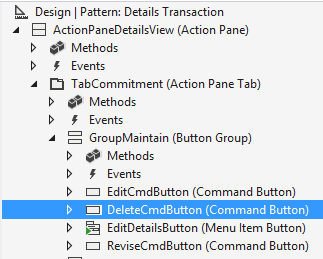
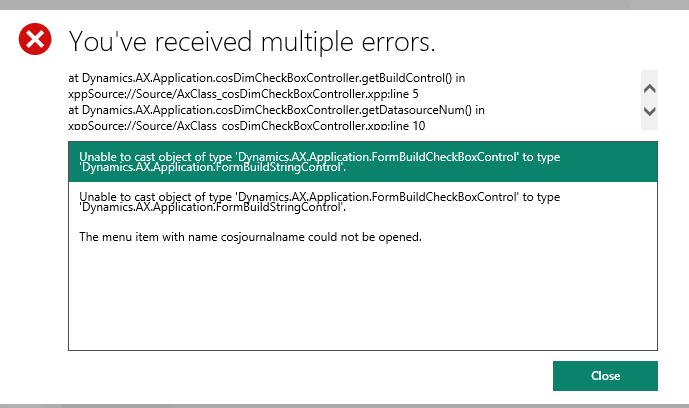
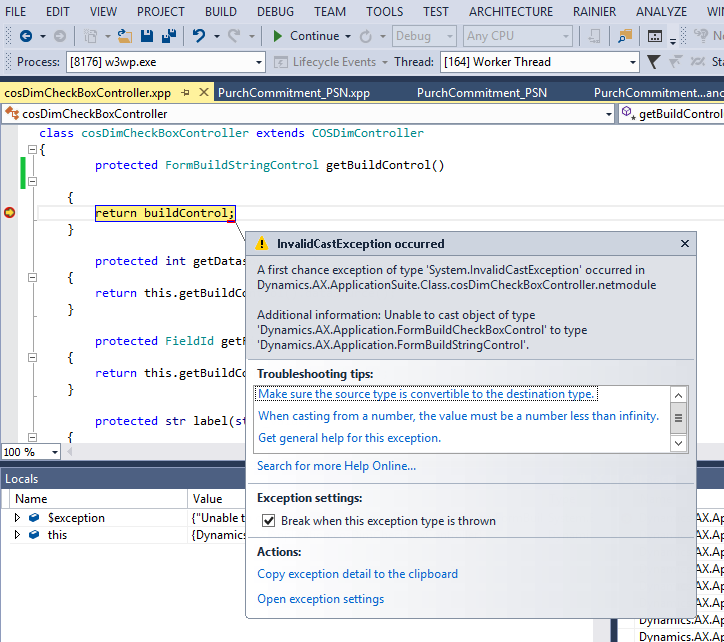

# Prepare to migrate code to finance and operations

[!include [banner](../includes/banner.md)]

This article describes how the Lifecycle Services code upgrade service and Visual Studio tools help you migrate your code and metadata from Dynamics AX 2012 R3 to finance and operations. Most of these steps also apply to code migration between two major versions of finance and operations. 

## Prerequisites

You will need access to a finance and operations development environments using Remote Desktop, and be provisioned as an administrator on the instance. We recommend you become familiar with some of the Finance and  Operations development, customization, and user interface concepts before you upgrade your code. Here are some references.

-   [Development tools](../dev-tools/developer-home-page.md)
-   [Models and packages](../dev-tools/models.md)
-   [X++ programming language](../dev-ref/xpp-language-reference.md)
-   [Extensions and Overlayering](../extensibility/extensibility-home-page.md)
-   [User interface development](../user-interface/user-interface-development-home-page.md)

## Overview of the code migration process
### Model split

The finance and operations apps are split into several packages, or assemblies: 

**Platform Packages**

-   Application Platform
-   Application Foundation
-   Test Essentials

**Application Packages**

-   Application Suite
-   Other application packages.

ISV and customer code that is migrated from Dynamics AX 2012 R3 will be re-baselined into the correct package.

### Auto-migration using the LCS Code Upgrade service

The LCS code upgrade service takes a Dynamics AX 2012 R3 model store as input and completes the following tasks:

-   Converts metadata into the latest format.
-   Re-baselines metadata, by moving and merging, into the right model.
-   Provides an estimation to understand the effort required to upgrade the solution.
-   Runs migration rules that auto-migrate parts of a solution.
-   Runs migration rules that inform developers what to manually fix by using TODOs.
-   Automatically checks-in the upgraded solution into your Azure DevOps project.

To configure and run the code upgrade service, see [Configure the code upgrade service in Lifecycle Services (LCS)](../lifecycle-services/configure-execute-code-upgrade.md).

### Manual migration steps

After you upgrade your code using the LCS code upgrade service configure your developer VM and Azure DevOps to connect to the upgraded code branch.

-   [Configure one-box development environments](../dev-tools/configure-developer-vm.md)
-   [Configure the Azure DevOps mapping during code migration](configure-vso-solution.md)

The code upgrade service will provide with Visual Studio solutions that you can open to compile your code. A **code merge** solution for all elements that contain conflicts and an **upgraded** solutions for all your upgraded elements. Typically, you can compile the application by fixing compilation errors in the order shown below. The order is determined based on the package dependencies graph, start with the lowest package in the graph. To determine package dependencies, see [Models and packages](../dev-tools/models.md). A typical order is Application Platform, Application Foundation, Directory, ...etc., Application Suite. For each of your upgraded models:

-   Fix merge conflicts.
-   Fix compilation errors related to a model split (references across packages).
    -   Typical error messages are:
        -   &lt;Element Type&gt; X refers to &lt;Element Type&gt; Y which does not exist.
        -   The name &lt;Name&gt; does not denote a class, a table or an extended data type.
    -   For example, your overlayering customizations may be referencing elements or code that are higher in the package dependency graph:
        -   A method in the Directory model is referencing a table in the Application Suite package.
        -   A form in the Directory package is referencing a data source in the Application Suite package.
    -   You will have to refactor your code to address these dependencies by moving model elements or business logic to higher level packages.
    -   [Solve dependencies among models by using delegates during code migration](delegates-migration.md) describes how to use delegates to solve some of these issues.
-   Fix compilation errors.

After you have resolved all of the compilation errors, all packages will compile. Next, you must complete the following tasks:

1.  Address guided code upgrade TODOs and code upgrade-specific best practice warnings. Some examples and details are in the sections below.
2.  Replace deprecated controls, for example, ActiveX or find an alternative.
3.  Apply form patterns and sub patterns to all forms.
4.  Validate that all scenarios work in multiple browsers with different sizes for custom patterns.
5.  Write and run tests.

## Best practice setup
In the Best Practice framework, there is a subset of Best Practice warnings that need to be resolved to complete migration. This applies if you are migrating from Dynamics AX 2012 R3 or earlier.

1.  In Visual Studio, click **Dynamics 365 &gt; Options &gt; Best Practices**.
2.  In the **Model** drop-down menu, select **Application Suite** (Repeat with all models you are working on)

These rules should be set to “ON” while migrating your solution. The setting is driven by an XML file in the AxRuleSet folder. For example, see the Application Suite xml file, BPRules.xml, located under C:\\Packages\\ApplicationSuite\\Foundation\\AxRuleSet. 

[](./media/bpupgraderules.png) 

To complete the migration, you need to fix all migration-specific Best Practice rules. The errors will show up in the error list as warnings. In the error list, you will see compiler warnings and best practice errors. Best Practice errors are prefixed with the text **BP**. For example, **BPErrorFormControlPatternUnspecified**.

## Debugging
By default, finance and operations optimizes the debugging experience for the files that you are working on. As a result, when you step into a file (F11) that is not in your project, the PDBs are not loaded and you can’t debug the code. To work around this, change the project debugging setting by clicking <strong>Dynamics 365 **&gt; **Options</strong> &gt; <strong>Debugging</strong>. Verify that the <strong>Load symbols only for items in the solution</strong> check box is not selected. This option is selected by default because it improves the debugger speed significantly. Another debugging setting that you may want to turn off is Intellitrace. Intellitrace collects the complete execution history of an application. It creates a lot of noise in the IDE when debugging. To turn off Intellitrace, click <strong>Options</strong> &gt; <strong>IntelliTrace</strong> &gt; <strong>Enable IntelliTrace</strong>, clear the check box, and then click <strong>OK</strong>. Note that Intellitrace is only available in the Enterprise version of Visual Studio.  

## Address code migration tasks
When metadata is migrated to finance and operations apps, multiple auto-upgrade scripts are run. In the case where developers need to complete manual migration tasks, TO DOs and Best Practices (BP) have been added.

-   TO DOs are prefixed with `/* TODO: (Code Upgrade)`, and need to be fixed as a part of code migration.
-   BP migration specific rules also need to be fixed as part of code migration.

This example below uses the **PurchCommitment\_PSN** form to walk you through the migration task of fixing navigation. Specifically, you will see examples of duplicate buttons and Action Pane TODOs.

### Setup

1.  In Visual Studio, open **Application Explorer**, and search for the form, PurchCommitment\_PSN.
2.  Click **OK**.
3.  Right-click the project and select **Properties**.
4.  In the Model property, select **Application Suite**.
5.  In the Company property, select FRSI.
6.  Note: The form is located in the French demo data company FRSI.
7.  Press **Ctrl+F5 to** see the form.

While the form looks complete, there are still code migration tasks necessary to be migration-complete. 

[](./media/i1.png)

### Navigation migration tasks

1.  In Visual Studio, build the project, and then on the toolbar, click **View** &gt; **Task List**.
2.  Click the **Comments** drop-down list to view the TO DO: (Code Upgrade) tasks.
3.  In the list, find the ActionPane TODOs.

[](./media/j1.png)

### Code upgrade rule - Action Pane

In finance and operations apps, the following core actions are provided as system-defined buttons:

-   New
-   Delete
-   Edit
-   Export

As part of the auto-migration, the Action Pane rule is run to identify redundant buttons. To complete this part of migration, you need to manually:

-   Remove or move the code.
-   Delete redundant controls in the application code.

> [!NOTE]
> In the section below, we will provide examples of how to migrate and modify the code on modeled buttons that replicate system-defined buttons. However, in practice, before making changes similar to those made in this article, the code must first be evaluated with respect to the scenario to determine if it is still needed. First, fix the TODO for the DeleteCmdButton, which duplicates the system-defined Delete button.

1.  In Visual Studio, find the TODO shown below, and then double-click the TODO.

    [](./media/k1.png)

2.  Replace the TODO and the line of code as shown below.
    -   The state of the system-defined **Delete** button is controlled by the AllowDelete property on the firstmaster datasource. By setting AllowDelete to false, the delete task is kept from executing when the keyboard shortcut is used.

        ```xpp
        // Delete button
        /* TODO: (Code Upgrade) [Action Pane Rule] Please consider moving all references to the form task override method and remove the control: DeleteCmdButton */
        deleteCmdButton.enabled(purchCommitmentHeader && purchCommitmentHeader.canDelete());
        PurchCommitmentHeader_DS.allowDelete(purchCommitmentHeader && purchCommitmentHeader.canDelete());
        ```

3.  In the editor, find and remove DeleteCmdButton from the form design. 

    [](./media/l1.png)

4.  Press **Ctrl+S** to save the form.
    -   Next, we will focus on the EditCmdButton that duplicates the system Edit button, handing the two TODOs associated with this button as well as removing this button.

5.  In Visual Studio, find the TODO shown below, and then double-click the TODO.

    [](./media/m1.png)

6.  Because the visibility of the **Edit** button is controlled by the View/Edit mode of the form, you will need to modify this code so it sets that property. Replace the TODO and the line of code as shown in the following graphic.

    ```xpp
    /* TODO: (Code Upgrade) [Action Pane Rule] Please consider moving all references to the form task override method and remove the control: EditCmdButton */
    editCmdButton.enabled(purchCommitmentHeader && isInDraftOrUnderRevisionStatus && !isInWorkFlowReviewState && !isLineReferenced);

    if(purchCommitmentHeader && isInDraftOrUnderRevisionStatus && !isInWorkFlowReviewState && !isLineReferenced)
    {
        element.design().ViewEditMode(ViewEditMode::Auto);
    }
    else
    {
        element.design().ViewEditMode(ViewEditMode::View);

    }
    ```

7.  Double-click the other TODO for this button.

    [](./media/n1.png)

8.  Inspect the code on the modeled **Edit** button. This logic will need to be moved to the form’s task() method.

    ```xpp
    [Control("CommandButton")]
    class EditCmdButton
    {
        /* TODO: (Code Upgrade) [Action Pane Rule] Please consider moving this button code to the task override method and remove the control EditCmdButton. */
        void clicked()
        {
            if (purchCommitmentHeader.WorkflowApprovalState ==     
                PurchCommitmentWorkflowApprovalState_PSN::Approved)
            {
                if (Box::yesNo(strFmt("@SPS2140", purchCommitmentHeader.CommitmentNumber), 
                    DialogButton::No) == DialogButton::Yes)
                {
                    super();

                    PurchCommitmentHeader_PSN::setWorkflowState(purchCommitmentHeader.RecId, 
                        PurchCommitmentWorkflowApprovalState_PSN::NotSubmitted);
                }
            }
            else
            {
                super();
            }
        }
    }
    ```

9.  On the left side of the Visual Studio designer, right-click **Methods** &gt; **Override**, and select **Task**, to add an override for the form’s Task method.
10. Update the task method as shown below so that the code from above is triggered when the system-defined **Edit** button is clicked.

    ```xpp
    /// 
        ///
        /// 
        /// 
        /// 
        public int task(int _taskId)
        {
            #Task
            int ret;

            switch (_taskId)
            {
                case #taskEditRecord:

                    if (purchCommitmentHeader.WorkflowApprovalState == PurchCommitmentWorkflowApprovalState_PSN::Approved)
                    {
                        if (Box::yesNo(strFmt("@SPS2140", purchCommitmentHeader.CommitmentNumber), DialogButton::No) == DialogButton::Yes)
                        {
                            ret = super(_taskId);

                            PurchCommitmentHeader_PSN::setWorkflowState(purchCommitmentHeader.RecId, PurchCommitmentWorkflowApprovalState_PSN::NotSubmitted);
                        }
                    }
                    else
                    {
                        ret = super(_taskId);
                    }

                    break;

                default:
                    ret = super(_taskId);
                    break;
            }

            return ret;
        }
    ```

11. In the Editor, find and remove the **EditCmdButton** from the form design. 

    [](./media/o1.png)

12. Press **Ctrl+S** to save the form.
13. Press **Ctrl+F5** to view the form. Notice the **Delete** and **Edit** buttons in the **Commitment** tab have been removed.

## Resolve casting exceptions
In finance and operations apps, X++ is completely intermediate-language (IL) based and therefore has a stricter runtime type behavior than the interpreted Dynamics AX2 012. This stricter runtime type behavior can generate exceptions in migrated Dynamics AX 2012 R3 metadata. It is likely you will encounter these exceptions during your migration. The casting exceptions can be raised in different runtime scenarios, such as down-casting, casting runtime to design time objects, and side-casting. In the section below, we will walk through an example where a form, CosJournalName, is generating controls at runtime, and has a type mismatch which causes a .NET exception because it is strongly typed.

### Example: Side-casting exception

1.  In Visual Studio, select and right-click **Project Properties**, and verify that USMF is the default company.
2.  Add the display menu item CosJournalName to your project, and set the menu item as your Startup object.
3.  Add the CosJournalName form to your project.
4.  Add the cosDimCheckBoxController class to your project.
5.  Rebuild your project.
6.  Press **Ctrl+F5** to run the form.
7.  Note that you will get an exception, similar to the following, when running the form.

    [](./media/u1.png)

8.  Right-click the class, cosDimCheckBoxController, and then select **View Code**.
9.  Set a breakpoint on the cosDimCheckBoxController::getBuildControl().
10. Press **F5**.
    -   The breakpoint will be hit. This is where the casting error occurs. The reason for the casting error is because we are trying to return a control of type: FormBuildCheckboxControl and the object is expecting FormBuildStringControl.

11. Hover over the buildcontrol to see the type and notice the differences.

    [](./media/v1.png)

12. Press **F10** to hit the exception.

    [](./media/w2.png)

13. Stop debugging.
14. To fix the exception, change the method declaration from FormBuildStringControl to FormBuildCheckBoxControl.

    ```xpp
    protected FormBuildStringControl getBuildControl()
    protected FormBuildCheckBoxControl getBuildControl()
    ```
    
15. Rebuild the project, and press **Ctrl+F5**. The form should open successfully because the casting error is resolved.

    [](./media/a.png)

## Migrating context menus and mouse double-click code
Refer to these topics to migrate code Dynamics AX 2012 that deals with context menus and mouse double-click actions.

-   [Code migration - Context menu code](code-migration-context-menus.md)
-   [Code migration - Mouse double-click logic](code-migration-double-click.md)


[!INCLUDE[footer-include](../../../includes/footer-banner.md)]
