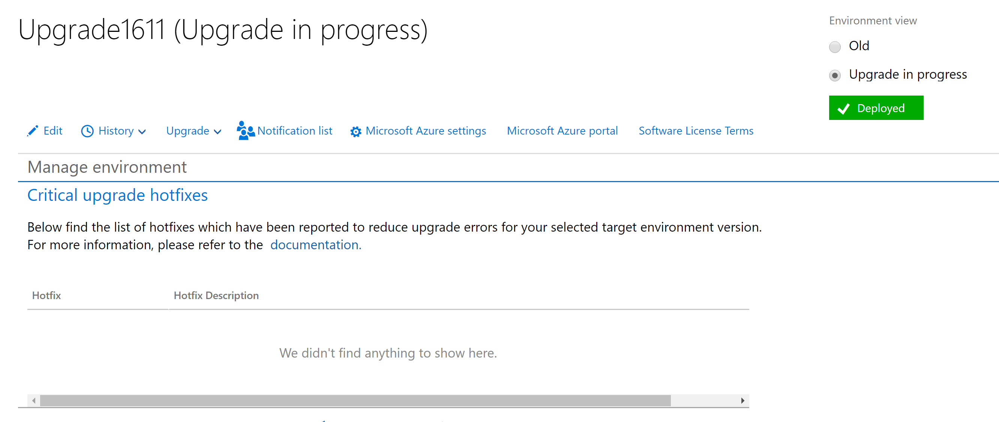
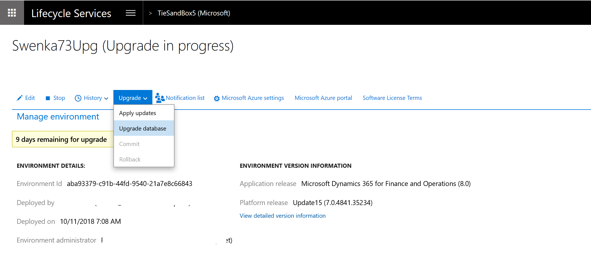
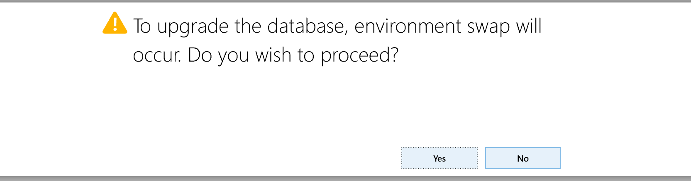

# Self-service upgrade to the latest version

[!include [banner](../includes/banner.md)]

> [!IMPORTANT]
> The process that is described here is now deprecated for data upgrade between older versions of finance and operations apps and the latest version. For more information about Dynamic AX 2012 upgrades, see [Upgrade from AX 2012 to finance and operations](upgrade-overview-2012.md).
>
> This article applies to the following starting versions:
>
> - Microsoft Dynamics 365 for Operations version 1611 (November 2016) (also known as version 7.1)
> - Microsoft Dynamics 365 Finance and Operations, Enterprise edition (July 2017) (also known as version 7.2)
> - Microsoft Dynamics 365 Finance and Operations, Enterprise edition 7.3

In this tutorial, you will learn how to perform these tasks:

> * Understand which version to select.
> * Refactor your customizations as extensions.
> * Run the data upgrade in a development environment.
> * Do a self-service upgrade in a sandbox user acceptance testing (UAT) environment.
> * Do a self-service upgrade in a production environment.

## Understand which version to select for upgrade

To align the self-service upgrade process to support continuous updates, each new release will cause the oldest release version to be discontinued.

For example, you have application version 7.3 with Platform update (PU) 23. Currently, the supported upgrade versions are 8.1.3 with PU 23, 10.0.0 with PU 24, and 10.0.1 with PU 25. When the next release, 10.0.2 with PU 26, is made generally available, it will be added to the available upgrade options, and 8.1.3 with PU 23 will be removed.

Because of this continuous process of adding a new version and removing the oldest version, we recommend that customers upgrade to the latest version that is available. In that way, you have two months in which you can upgrade your sandbox environment and then later upgrade your production environment to the same version.

If you choose to upgrade your sandbox environment to version 8.1.3 with PU 23 and Microsoft then releases version 10.0.2 with PU 26, so that version 8.1.3 with PU 23 is removed as an upgrade option, **you will be blocked** from upgrading your production environment. In this case, you must start over in the sandbox environment and upgrade to a newer supported version.

### Targeted release schedule

> [!NOTE]
> The dates in this table are subject to change. Upgrades are available a minimum of two weeks and a maximum of six weeks after the date of general availability (GA) for new customers. In addition, **support for upgrades that have a target version of application 7.3 ends in March 2020**.

| Selectable versions | GA of the latest version for new customers | GA of the latest version for upgrade |
|---|---|---|
| 7.3 with PU 23 – PU 25 8.1.3 with PU 23 – 10.0.1 with PU 25 | Week of April 8, 2019 | Week of April 29, 2019 |
| 7.3 with PU 24 – PU 26 10.0.0 with PU 24 – 10.0.2 with PU 26 | Week of May 13, 2019 | Week of May 27, 2019 |
| 7.3 with PU 25 – PU 27 10.0.1 with PU 25 – 10.0.3 with PU 27 | Week of June 10, 2019 | Week of June 24, 2019 |
| 7.3 with PU 26 – PU 28 10.0.2 with PU 26 – 10.0.4 with PU 28 | Week of July 8, 2019 | Week of July 29, 2019 |
| 7.3 with PU 27 – PU 29 10.0.3 with PU 27 – 10.0.5 with PU 29 | Week of September 17, 2019 | Week of September 30, 2019 |
| 7.3 with PU 28 – PU 30 10.0.4 with PU 28 – 10.0.6 with PU 30 | Week of October 11, 2019 | Week of October 28, 2019 |
| 7.3 with PU 29 – PU 31 10.0.5 with PU 29 – 10.0.7 with PU 31 | Week of November 29, 2019 | Week of December 30, 2019 |
| 7.3 with PU 30 – PU 32 10.0.6 with PU 30 – 10.0.8 with PU 32 | Week of January 17, 2020 | Week of February 17, 2020 |
| 7.3 with PU 31 – PU 33 10.0.7 with PU 31 – 10.0.9 with PU 33 | Week of March 3, 2020 | Week of March 30, 2020 |
| 10.0.8 with PU 32 – 10.0.10 with PU 34 | Week of April 8, 2020 | Week of April 27, 2020 |

## Refactor your customizations as extensions

To prepare for upgrade, you must refactor any customizations that were overlays as extensions. We recommend that you deploy a new development environment on the latest version, create a new branch in version control, and follow the guidance in [Migrate from overlayering to extensions](../extensibility/migrate-overlayer-extension.md).

If you have no overlays and are already using extension for 100 percent of your customizations, we still recommend that you create a new branch for the upgrade effort in version control. If any Microsoft X++ hotfixes are installed, you must delete them from version control, because they aren't applicable to the latest version.

## Run the data upgrade in a development environment

Run the data upgrade process on a copy of your source database. If your environment is already live in production, the source database is a copy of the production database. Otherwise, it's your most current database that is running the old version.

Run this process in the development environment that is running the release that you're upgrading to. This step is a validation process that is done by a developer. It helps the developer verify that the data upgrade can be successfully completed by using the specific set of customizations in the environment, without requiring any manual intervention.

To make a copy of your production database, follow the steps in [Export a copy of the standard user acceptance testing (UAT) database](../database/dbmovement-scenario-exportuat.md).

To run the data upgrade process, follow the steps in [Upgrade data in development or demo environments](../migration-upgrade/upgrade-data-to-latest-update.md).

> [!IMPORTANT]
> - Data upgrade in a development environment is a required step. It helps reduce the risk of extended downtime and upgrade errors later, when you upgrade sandbox UAT and production environments.
> - Several application hotfixes might be required before you can upgrade data. Before you redeploy your existing development environment, verify whether these hotfixes are required. Install the required hotfixes, and check them in to Microsoft Azure DevOps. This step can be completed only in the old version of your development environment. For a list of the hotfixes that are required in various situations, see [Upgrade data in development or demo environments](upgrade-data-to-latest-update.md#before-you-begin).
 
## Upgrade your Tier 2+ Standard Acceptance Test sandbox environment

When you've completed the code upgrade and have been able to do an end-to-end data upgrade in your development environment without having to manipulate data in Microsoft SQL Server, you can begin the process in your sandbox environment.

### Prerequisite

Before you begin your upgrade, we highly recommend that you make sure that your sandbox environment has the latest production data. If the data set is up to date, you can have more confidence that the upgrade will work in the production environment. To complete this step, use the [Refresh for training purposes](../database/dbmovement-scenario-general-refresh.md) tutorial.

> [!IMPORTANT]
> Changing Integrated Software Vendor (ISV) solutions, including changing the ISV license code/metadata, during upgrade is strictly not supported. If you are installing a new ISV solution or removing an existing ISV solution, you should do this before or after your upgrade. It cannot be performed during self-service upgrade.  

### Begin the upgrade

In your sandbox environment, on the **Maintain** menu, select **Upgrade**.

A dialog box appears, where you can select the latest combination of an application version and a platform update.

> [!IMPORTANT]
> If you receive an error that states that preparation failed, see the [Known issues](#known-issues) section later in this article.

### Preparation

The environment details page is refreshed, and options for two sandbox environments now appear in the upper-right corner. By selecting the options, you can switch between your old sandbox environment and your new upgrade-in-progress sandbox environment.

The preparation stage can take eight hours or longer, because it resembles a full environment deployment. The upgrade-in-progress environment is connected to an empty Azure SQL database to speed up deployment, and it runs on the newer version that you selected to deploy.

During this time, your original sandbox environment is left untouched. There is no downtime impact at this stage.

> [!IMPORTANT]
> If you receive an error that states that staging deployment failed, the Microsoft Dynamics Service Engineering (DSE) team will be notified and will proactively resolve the issue for you. This issue can occur if Azure doesn't have the required resources available in your region. Microsoft DSE will work with the Azure engineers to allocate more resources. When staging deployment is successfully completed, you will receive an email.

### Package application

After staging deployment is completed, go back to the environment details page, and switch to the **Upgrade in progress** view. In this view, you will now see an **Upgrade** menu.

The **Upgrade** menu includes an **Apply updates** option. You can select this option to apply your software deployable packages to the new environment. These packages include any binary packages, whether they are from an independent software vendor (ISV) solution, your own customization packages, or platform binary update packages.

**We highly recommend** that you apply the latest platform update as your first step. If you're upgrading to version 8.1, we recommend that you get the latest binary update package, such as 8.1.3. This package will also include the latest platform update. In this way, you help guarantee that you have the latest hotfixes that are available and help reduce errors later in the process.

When you apply a new package to the environment, the process is the same as the process for regular environment servicing. When package application is completed, you must use the **Sign Off** button for that package before you can move on or apply another package.

If package deployment fails, you can use the **Rollback** button to reverse it. Note that this button is **not** the same as the **Rollback** option on the **Upgrade** menu.

### Critical hotfixes

As use of the self-service upgrade process has increased, Microsoft has found that several hotfixes are critical to success for various target versions. For example, if you're upgrading to version 7.3, a list of Microsoft Knowledge Base (KB) articles that have consistently resolved issues with data upgrade, Retail components, or performance will appear.

The goal is that this list should be empty before you begin the **Data Upgrade** step of the process. The hotfixes in these KB articles must be installed in your upgrade-in-progress environment.

### Data upgrade and environment swap

After all packages are applied to your upgrade-in-progress sandbox environment, and you've signed off on them, you can begin the data upgrade.

> [!IMPORTANT]
> This stage begins the downtime for your original sandbox environment.

On the **Upgrade** menu, select **Data upgrade**.

Your original sandbox environment is turned off, and the database connection is swapped so that your new environment is connected to the original database. This process can take up to one hour.

Next, the data upgrade package for your target version is automatically applied. The time that is required to apply the data upgrade package varies, depending on the size of your database.

If the data upgrade fails, you must select **Rollback** on the **Upgrade** menu to restore your database to the point that it was at before the data upgrade began. Before you do a rollback, we highly recommend that you download the logs to determine the root cause of the failure. In this way, you can help guarantee that your next data upgrade execution will go more smoothly.

### Upgrade days remaining

Because the self-service upgrade process provides a parallel environment at no additional cost to you, there is a time limit on how long this environment can be used. Currently, this time limit is set to 10 calendar days and begins when you select **Upgrade** on the **Maintain** menu to start the process.

#### What happens when the time limit expires?

There are three possible outcomes when the timer reaches 0 (zero):

- If you haven't yet started the **Data Upgrade** step, the new environment is queued for deletion. In this scenario, the upgrade-in-progress environment was provisioned, and customizations and packages were optionally applied. However, no data was upgraded, and the original environment never incurred downtime.
- If you ran the **Data Upgrade** step but then later performed a rollback, the new environment is queued for deletion. In this scenario, the old environment is the primary environment, because the data upgrade was rolled back.
- If you've run the **Data Upgrade** step but haven't yet committed the upgrade, no actions are performed, and no environments are deleted. You can remain in this state until you commit or do a rollback. If you decide to do a rollback, and the timer is at 0 (zero), the new environment will be deleted.  

> [!IMPORTANT] 
> **Rollback is only available, at maximum, for 30 calendar days. This is due to the nature of point-in-time restore.**  If you try to perform a rollback after 30 days have passed, you will be forced to commit the upgrade, delete the environment, and redeploy on the previous version.

The original environment is queued for deletion only after you commit the upgrade as a success.

### Commit or roll back

After the data upgrade package is applied, you can review the environment, and your users can perform business validation activities. If this validation is successful, you can mark the whole upgrade as a success by selecting **Commit** on the **Upgrade** menu. You must commit the upgrade before you can move on to your production environment. After you commit the upgrade, the original environment is queued for deletion.

If the business validation fails, you can select **Rollback** on the **Upgrade** menu. This option will do a point-in-time restore of the database, swap the database connection back to your original sandbox environment, and bring your original sandbox environment back online. The sandbox environment will then be back in its previous state.  Be aware, as stated above, that rollback is only possible for up to 30 calendar days.

### Post-upgrade actions

After you've signed off on your upgrade, you must update aggregate measurements. Aggregate measurements must be updated after every major upgrade. To update them, go to **System Administration** \> **Setup** \> **Entity Store**, and then select **Refresh**.

> [!NOTE]
> You can schedule this update to run by using batch processing.

### Upgrade production

After you've committed the upgrade in the sandbox UAT environment, you've finished the upgrade process in the sandbox environment. You can now begin the same process in your production environment. The steps that you follow are the same.

If you encounter an issue that causes excessive downtime during your production upgrade, use the [Report production outage](/business-applications-release-notes/April18/dynamics365-finance-operations/report-production-outage) process to alert Microsoft and get help.

### Upgrade additional environments

You can upgrade additional sandbox environments in the same way. You also can deallocate and delete your other sandbox environments, and then redeploy on the newer version. By using the [Refresh database](../database/database-refresh.md) self-service action, you can copy in the upgraded database from another sandbox or production environment.

### Known issues

**Prepare operation could not start. Microsoft support has been notified. If the issue persists, please contact support with this ID.**

This known issue involves environment certificates on the Microsoft Dynamics Lifecycle Services (LCS) back end. If it affects you, submit a support ticket, and include the activity ID from the error message. Microsoft will work to resolve the issue. Microsoft is compiling a list of affected environments and intends to proactively fix this issue in the future.

**I want to cancel the upgrade and try again later.**

To cancel an upgrade, you can select **Cancel Upgrade** on the **Maintain** menu. The **Maintain** menu is available in the **Old** view (for the original sandbox environment), not in the **Upgrade in progress** view (for the new sandbox environment).

**Upgrade failed at step X: DVT script for service model: MRProcessService.**

This DVT error is intermittent and can be resolved by using the **Resume** button for your data upgrade package. When you select **Resume**, the process resumes at the same step. Microsoft is trying to reliably reproduce this issue and intends to produce a fix in the future.

**Application configuration sync failed. Call to TTSCOMMIT without first calling TTSBEGIN.**

This TTSCOMMIT error is intermittent and can be resolved by using the **Resume** button for your data upgrade package. When you select **Resume**, the process resumes at the same step. (This issue is fixed in PU 21.)

[!INCLUDE[footer-include](../../../includes/footer-banner.md)]

