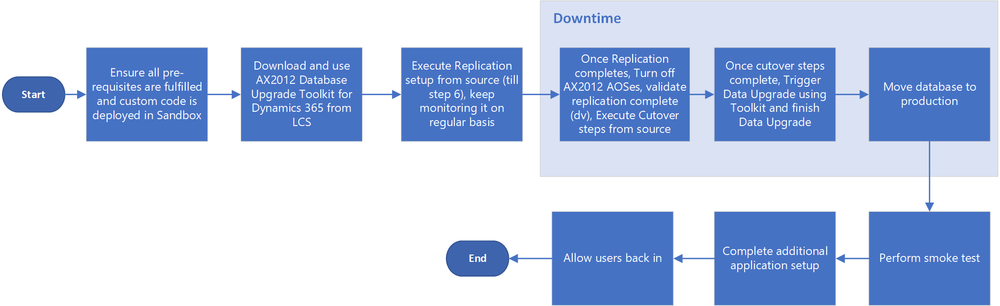

---
# required metadata

title: Upgrade from AX 2012 - Cutover testing (Mock cutover)
description: This topic explains how to test the cutover process between turning off a Microsoft Dynamics AX 2012 environment and turning on Finance and Operations. 
author: jorisdg
ms.date: 08/27/2021
ms.topic: article
ms.prod: 
ms.technology: 

# optional metadata

# ms.search.form: 
audience: Developer, IT Pro
# ms.devlang: 
ms.reviewer: sericks
# ms.tgt_pltfrm: 
# ms.custom: 
ms.search.region: Global
# ms.search.industry: 
ms.author: jorisde
ms.search.validFrom: 2017-06-16
ms.dyn365.ops.version: Platform update 8
---

# Upgrade from AX 2012 - Cutover testing (Mock cutover)

[!include [banner](../includes/banner.md)]

[!include [upgrade banner](../includes/upgrade-banner.md)]

*Cutover* is the term that we use for the final process of getting a new system live. The cutover process consists of the tasks that occur after Microsoft Dynamics AX 2012 is turned off, but before Finance and Operations is turned on. The purpose of upgrade cutover testing (mock cutover) is to practice the cutover process, to help guarantee a smooth experience for everyone who is involved during the actual cutover to go-live.

There are three main workstreams during a cutover:

- **Technical workstream** – This workstream includes the data upgrade execution process. Your business will enforce a limit on the amount of downtime that is allowed. During this downtime, neither AX 2012 nor Finance and Operations will be available. This workstream might have to tune the data upgrade procedure to meet the business's downtime limit.
- **Functional workstream** – This workstream includes the configuration tasks that are performed after the data upgrade is completed. All these tasks must be documented and quantified, and a resource must be assigned, because both the functional workstream and the technical workstream must fit within the business's downtime limit.
- **AX 2012 rollback** - This workstream includes rolling back to an AX 2012 environment. Although it's unlikely that you will have to roll back, it's very important that you have a tested process in case you require it.

The following illustration shows the overall process for cutover to go-live as it will occur in the production environment.

The mock cutover process is very similar to data upgrade validation in a sandbox environment. We assume that you are familiar with that process, and have already performed it. Mock cutover differs in the following ways:

- After you perform a data upgrade in the sandbox environment, see the instructions in [Self-service database refresh](../database/database-refresh.md#self-service-database-refresh) to copy your upgraded database from the data upgrade sandbox environment into your production environment. 

- We added the following tasks:
    - Perform a smoke test.
    - Complete application setup tasks. This step can be large, depending on the functionality that is used. During this step, the functional team configures new application functionality so that it's ready to be used in the upgraded system.
    - Allow users back in. Notify your user base that the upgrade is completed and that they can use the system again.

> [!NOTE]
> In this topic, we use the term *sandbox* to refer to a Standard or Premier Acceptance Testing (Tier 2 or 3) or higher environment connected to a SQL Azure database.

## Technical workstream

The technical workstream involves various technical team members: the database administrator (DBA), the AX 2012 system administrator, server administrators, and developers who are familiar with AX 2012 and Finance and Operations. 

During cutover testing, the technical team is focused on performance and reliability testing of the data upgrade process, to make sure that it meets the business's downtime limit. Many elements of hardware and software are involved in this process. Some of these elements are on-premises, whereas others are in the Microsoft cloud. In addition, many elements of custom application code and standard code are involved. The result of this testing should be confidence in the cutover process for your environment.

### Technical workstream process

> [!NOTE]
> For the technical workstream, the cutover testing process is the same as the high-level steps of the actual/go-live cutover process.

For the technical workstream, the cutover testing process is the same described in [Upgrade from AX 2012 - Data upgrade in self-service environments](data-upgrade-self-service.md).

## Functional workstream

After data upgrade, several configuration tasks will be required in the new environment. The goal of this workstream is to document and quantify all configuration tasks, and to assign a resource to each task, to help guarantee that these tasks can be done together with the technical workstream during the downtime window.

Typically, functional tasks involve changing the values of specific system parameters or other configuration data. These tasks are identified through the full functional test pass, which is a separate activity from the cutover testing. When a task of this type is identified, it should be reviewed together with the functional resource and your developer.

Larger changes might require that a new custom data upgrade script be written to update the data during the data upgrade process. However, the functional resource can manually run smaller changes through the new system after data upgrade.

Larger changes that have new data upgrade scripts must be tested. Therefore, one or more additional iterations of the MajorVersionDataUpgrade.zip package will have to be run. It's important that you weigh the cost of running the package again against the cost of manual data entry.

For each manual change, a task must be added to the cutover plan document. This task must show the following details:

-	What is the task, and what must be done?
-	Who must do it?
-	How long does it take?

### Add users, and perform functional tests
When you have fully configured your environment, add users, and perform appropriate testing. 

## Roll back to AX 2012

The goal of this task is to restore the database by using the backup that was made when AX 2012 was turned off, and then turn AX 2012 back on. The state of integrated systems might also have to be restored. However, because integrated systems vary from business to business, you must plan for this scenario independently, based on your specific circumstances. Although it's unlikely that you will have to roll back, it's very important that you have a tested process in case you require it.

[!INCLUDE[footer-include](../../../includes/footer-banner.md)]
