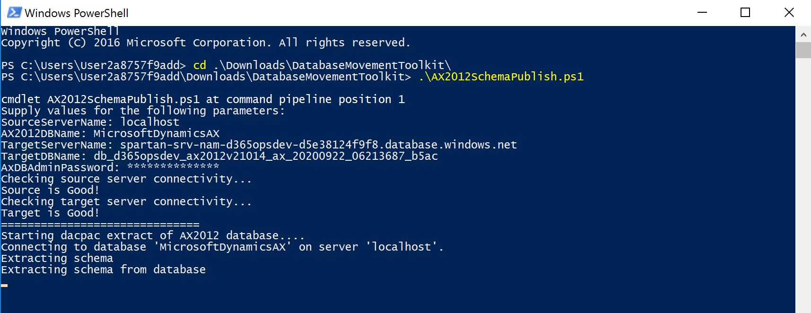
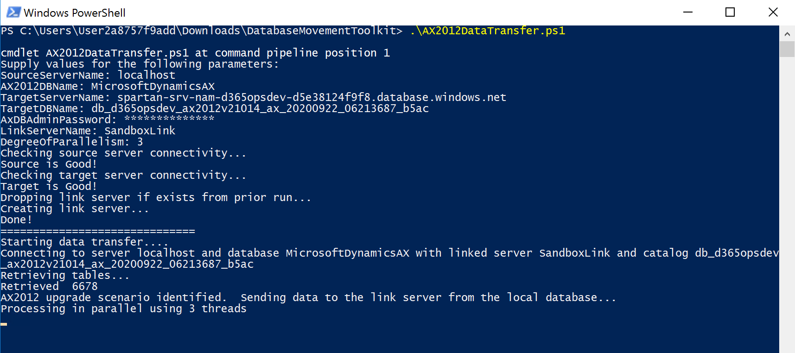

---
# required metadata

title: Upgrade from AX 2012 - Dacpac process to upgrade data in Sandbox Tiers 2-5 environments
description: This topic will help customers who no longer have Remote Desktop protocol (RDP) access to their Tier-2 through Tier-5 sandbox environments when they upgrade from Microsoft Dynamics AX 2012 to Finance and Operations apps.
author: laneswenka
manager: AnnBe
ms.date: 12/02/2020
ms.topic: article
ms.prod: 
ms.service: dynamics-ax-platform
ms.technology: 

# optional metadata

# ms.search.form: 
audience: Developer, IT Pro
# ms.devlang: 
ms.reviewer: sericks
# ms.search.scope: Operations
# ms.tgt_pltfrm: 
# ms.custom: 
ms.search.region: Global
# ms.search.industry: 
ms.author: laswenka
ms.search.validFrom: 2017-06-16
ms.dyn365.ops.version: Platform update 20
---

# Upgrade from AX 2012 - Dacpac process to upgrade data in Sandbox Tiers 2-5 environments

[!include [banner](../includes/banner.md)]

[!include [upgrade banner](../includes/upgrade-banner.md)]

This topic is a process guide that will help customers who no longer have Remote Desktop Protocol (RDP) access to their Tier-2 through Tier-5 sandbox environments when they upgrade from Microsoft Dynamics AX 2012 to Finance and Operations apps. By using a new file format this is based on data-tier application packages (DACPACs), and the [Database movement toolkit](../database/database-movement-toolkit.md), customers can bring their AX 2012 schema and data into an existing empty database in a sandbox environment.

We **strongly recommend** that you run the data upgrade process in a development environment before you run it in a shared sandbox environment. This approach will help reduce the overall time that is required for a successful data upgrade. For more information, see [Upgrade from AX 2012 - Pre-upgrade checklist for data upgrade](prepare-data-upgrade.md).

In this process guide, you will learn how to complete the following steps:

> [!div class="checklist"]
> * Open firewall access to your sandbox environment database.
> * Clear the sandbox database of all objects.
> * Publish the schema from your AX 2012 database to the sandbox database.
> * Transfer the data from the source database to the target database.
> * Apply the data upgrade package from Microsoft Dynamics Lifecycle Services (LCS).
> * Copy the database to production for mock go-live validation and actual go-live.

## Before you get started
Network latency is a critical component to the data transfer.  If your source SQL Server is geographically far or has poor network latency to your sandbox Azure datacenter, then the process can take many additional hours or potentially timeout.  Latency under 75 miliseconds is preferred.  You can find your latency using a tool such as [Azure Speed Test](https://www.azurespeed.com/).  If your latency is poor, you may optionally backup your AX 2012 database and restore it on a cloud-hosted DevTest environment deployed to the same Azure datacenter as your target sandbox, and perform the steps from there.

## Open firewall access to your sandbox environment database

By default, all sandbox Standard Acceptance Test environments use Azure SQL Database as their database platform. The databases for these environments are protected by firewalls that restrict access to the Application Object Server (AOS) that they were originally deployed with.

However, your public IP address can be used to grant access to your source system. Different methods can be used to grant this access, depending on your environment type and RDP access. Regardless of the method, connection to the database requires that the server and the database be explicitly specified. You can find this information on the environment details page in LCS. 

Find the user name record for **axdbadmin**, and make a note of the server and the database in the format **{sqlServer\\sqlDatabase}**, such as **spartan-nam-opsprod365433\\DBOpsProd365_SandboxUAT_d2145fe**. In this case, the server value for Microsoft SQL Server Management Studio (SSMS) is **spartan-nam-opsprod365433.database.windows.net**, and the database value is **DBOpsProd365_SandboxUAT_d2145fe**. To specify the database, you must select **Options** in the SSMS connection dialog box. Use the **axdbadmin** credentials (user name and password).

### Microsoft-managed environments where RDP access is available

If you have RDP access to your sandbox, sign in to the sandbox AOS virtual machine (VM), and open SSMS. In SSMS, enter the server, user name, and password. On the **Options** tab, explicitly enter the database name from the **axdbadmin** record in LCS.

After you're connected, open a query against the database, and enter your IP address in the following Transact-SQL (T-SQL) command.

```sql
-- Create database-level firewall setting for IP a.b.c.d 
EXECUTE sp_set_database_firewall_rule N'AX 2012 Upgrade via RDP', 'a.b.c.d', 'a.b.c.d'; 
```

Back in your source environment, open SSMS, and try to connect by using the same **axdbadmin** credentials against the User Acceptance Testing (UAT) database. You must verify that you can connect before you move on to the next steps.

Note that firewall rules are deleted whenever you do a database refresh or whenever you do a database import from LCS.

### Microsoft-managed environments without RDP access

Follow the process for [Enable just-in-time database access](../database/database-just-in-time-JIT-access.md) to allow-list your IP address to the database.

Before the allow-list entry expires, connect to the sandbox database by entering the server, user name, and password. On the **Options** tab, explicitly enter the database name from the **axdbadmin** record in LCS.

After you're connected, open a query against the database, and enter your IP address in the following Transact-SQL (T-SQL) command.

```sql
-- Create database-level firewall setting for IP a.b.c.d 
EXECUTE sp_set_database_firewall_rule N'AX 2012 Upgrade without RDP', 'a.b.c.d', 'a.b.c.d'; 
```

A second entry is created in the firewall rules. This entry won't expire. Note that these firewall rules are deleted whenever you do a database refresh or whenever you do a database import from LCS.

### Self-service environments

Unfortunately, sandbox environments of the self-service type aren't supported for AX 2012 upgrade scenarios, because they don't currently support data upgrade packages. Microsoft is working to add this support and will update this topic when more information is available.

## Clear the sandbox database of all objects

In versions of the Database Movement Toolkit prior to Version 5, this was an explicit step that customers had to take via SSMS on the target database.  However, this is now incorporated in to the toolkit in Version 5 and onwards, and is handled via the Powershell scripts.

## Publish the schema from AX 2012 to the sandbox database

Now that the database is empty, you can publish your non-upgraded 2012 schema. For this step, you should download the latest version of the [Database movement toolkit](../database/database-movement-toolkit.md) into your source environment.

Use Windows PowerShell to change the directory to the folder location where you unzipped the Database movement toolkit (for example, C:\\dbmovement-toolkit\\). Then run the **AX2012SchemaPublish.ps1** script. Use the following parameters:

* **SourceServerName** – The location where your source AX 2012 database is hosted. This location can be **localhost**.
* **AX2012DBName** – The name of your AX 2012 database (for example, **MicrosoftDynamicsAX**).
* **TargetServerName** – The server value of your sandbox database server (for example, **spartan-srv-12345.database.windows.net**). You retrieved this value in a previous step.
* **TargetDBName** – The name of your AXDB database (for example, **d365opsprod-12345**). You retrieved this value in a previous step.
* **AxDBAdminPassword** – The password for the **axdbadmin** database account.



During execution, the script performs a cleanup on the source and the target databases.  For the source database, it removes any non-essential users and non-essential schemas.  If there are errors here, it will halt the script and those need to be reviewed.  The source for the script is available in the toolkit called **Step1_CleanupSourceDB.sql**. For the target database, it removes all objects in a more thorough manner than was previously documented via SSMS.  Any errors here need to be reviewed, and would halt the script.  The source for the target cleanup is available in the toolkit called **Step0_CleanupTargetDB.sql**.

After cleanup, the toolkit uses SqlPackage.exe to extract only the database and schema definitions from your AX 2012 database as a 2012DBSource.dacpac file in the working directory. Next, it publishes this file to your sandbox environment by using the Profile.publish.xml publishing profile that is included in the Database movement toolkit. This publishing profile will skip several object types, such as SQL Views, SQL Users, Statistics, and other objects that aren't required for the upgrade.  If there are issues with the dacpac publish, you can find a detailed log in the working directory called **PublishDiag.log**.

When the script has finished running, open SSMS, and verify that you can see the tables in the sandbox database. Also confirm that the tables are empty and have no data.

> [!NOTE]
> If you must start over because of an error, this script is designed to be run over again as it will cleanup both the source and target databases.

### Populate legacy stored procedures 
The data upgrade scripts require the legacy stored procedures and functions to be in place prior to running the upgrade.  To transfer these we will use SSMS.

Open SSMS, and connect to your source AX2012 database.  Right-click the database name, and then select **Tasks -> Generate scripts**. On the **Introduction** page, select **Next**. On the **Choose Objects** page, select the **Select specific database objects** option, and then select the following check boxes:

* Stored procedures
* User-defined functions

On the **Set Scripting Options** page, select **Advanced**, and ensure the value is set to **Script DROP and CREATE** Select **OK**, and then select the **Save to new query window** option. Select **Next** to move through the summary. The query window that appears contains a script that lists all the objects in the correct order so that the objects can be dropped from the database.

Taking the script that was generated, connect to your target database using SSMS and execute the script.  This will create the AX2012 stored procedures and functions in the target spartan database.  

## Transfer data from AX 2012 to the sandbox database

Now that the schema is in place, you must transfer the data to the target tables. A SQL-linked server will be used for this transfer. The transfer will also take advantage of parallelism features that are available in the instance of Windows PowerShell version 7.0 or later that is included in the Database Movement toolkit.

Use Windows PowerShell to change the directory to the folder location where you unzipped the Database movement toolkit (for example, C:\\dbmovement-toolkit\\). Then run the **AX2012DataTransfer.ps1** script. Use the following parameters:

* **SourceServerName** – The location where your source AX 2012 database is hosted. This location can be **localhost**.
* **AX2012DBName** – The name of your AX 2012 database (for example, **MicrosoftDynamicsAX**).
* **TargetServerName** – The server value of your sandbox database server (for example, **spartan-srv-12345.database.windows.net**). You retrieved this value in a previous step.
* **TargetDBName** – The name of your AXDB database (for example, d365opsprod-12345). You retrieved this value in a previous step.
* **AxDBAdminPassword** – The password for the axdbadmin database account.
* **LinkedServerName** – The name of the SQL-linked server to create (for example, **AX2012Link**).
* **DegreeOfParallelism** – The number of tables that should be processed in parallel (for example, **3**). The value should be no more than half of the number of cores that are available in the source environment, because the script is CPU-intensive and RAM-intensive.



During execution, if a linked server between the source server and the sandbox server doesn't already exist, the script creates one. It then copies data from all the AX 2012 tables to the target database. It uses the **DegreeOfParallelism** parameter to process multiple tables at the same time.

> [!NOTE]
> If you must start over because of an error, go back to the [Publish the schema from AX 2012 to the sandbox database](#publish-the-schema-from-ax-2012-to-the-sandbox-database) step.

## Apply the data upgrade package from LCS

Now that the schema and the data have been moved to the sandbox environment, you can start the data upgrade process. As a prerequisite, make sure that your LCS project has been configured for AX 2012 upgrade. For more information, see [Identify the project as an AX 2012 upgrade](upgrade-overview-2012.md#identify-the-project-as-an-ax-2012-upgrade).

On the environment details page for your environment, select **Maintain** \> **Apply updates**, and wait for the list of packages to be loaded. If you scroll to the bottom of the list, you will see that data upgrade packages are added to it as they are pulled in from the Shared asset library. It might take some time for all the available upgrade packages to be loaded.

Select the upgrade package that matches the version that you want to upgrade to. For example, to upgrade to version 10.0.14, select **AX2012DataUpgrade-10-0-14**.

### Troubleshooting data upgrade errors

There are several ways to troubleshoot data upgrade errors. In some cases, you can view the error in the deployable package logs from LCS. For example, you can use this approach when the error is related to starting/stopping services and database synchronization.

If the upgrade fails while an upgrade script is running, you can view the errors in the ReleaseUpdateScriptsErrorLog table in the sandbox database. To access this table, connect to the sandbox database by using the information in previous steps.

If you can fix the data, you can resume the upgrade from LCS. However, note that you can't resume from LCS more than eight times. Any attempt to resume more than eight times will cause another failure, because the servicing systems don't allow more attempts. In this case, you can use the **Abort** button to cancel the upgrade package and try again later.

> [!NOTE]
> If you must start over because of an error, go back to the [Publish the schema from AX 2012 to the sandbox database](#publish-the-schema-from-ax-2012-to-the-sandbox-database) step.

## Copy the database to production for mock go-live and actual go-live

After the data upgrade is completed, apply the same customization packages from your sandbox environment to your production environment. You can then copy your sandbox environment AXDB database to the production environment.

For information about how to perform the copy operation, see [Copy the sandbox database to production](../database/dbmovement-scenario-goldenconfig.md#copy-the-sandbox-database-to-production).
