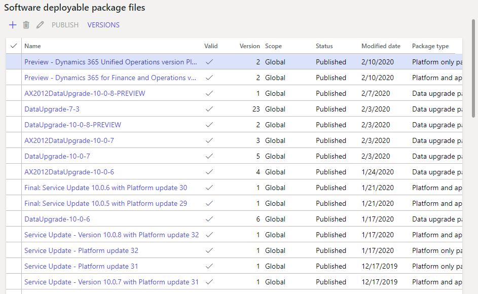

---
# required metadata

title: Apply the latest platform update to environments
description: This topic explains how to apply the latest platform update to your Finance and Operations environment.
author: tariqbell
ms.date: 08/16/2019
ms.topic: article
ms.prod: 
ms.technology: 

# optional metadata

# ms.search.form: 
# ROBOTS: 
audience: Developer, IT Pro
# ms.devlang: 
ms.reviewer: sericks
# ms.tgt_pltfrm: 
ms.custom: 253274
ms.assetid: a70a4f28-9269-4b35-bc29-1edba0b92d83
ms.search.region: Global
# ms.search.industry: 
ms.author: sericks
ms.search.validFrom: 2016-11-30
ms.dyn365.ops.version: Platform update 3
---

# Apply the latest platform update to environments

[!include [banner](../includes/banner.md)]

This topic explains how to apply the latest platform release to your Finance and Operations environment.

## Overview

In Finance and Operations, the platform consists of the following components:

-   Binaries such as Application Object Server (AOS), the data management framework, the reporting and business intelligence (BI) framework, development tools, and analytics services.
-   The following Application Object Tree (AOT) packages:
    -   Application Platform
    -   Application Foundation
    -   Test Essentials

> [!IMPORTANT]
> To move to the latest platform, your Finance and Operations implementation **cannot** have any customizations (overlayering) of any of the AOT packages that belong to the platform. This restriction was introduced in Platform update 3, so that seamless continuous updates can be made to the platform. 

## Overall flow
The following illustration shows the overall process for upgrading the platform to the latest update.

[](./media/flownocustomisations.jpg)

If you are already running on Platform update 4 or later, updating to the latest release is a simple servicing operation. After the platform update package is in your LCS asset library, follow the flow to apply an update from the LCS environment page. Select **Apply updates** under **Maintain**, then select the platform update package.

[](./media/applyupdates.jpg)

Learn how to **get the latest platform package and apply it to an environment deployed through LCS** in the next section.

## Apply the latest platform update package
There are two ways to get the latest platform update package in LCS from your environment page.
- Click the **Platform binary updates** tile 
- Click the **All Binary Updates** tile to see a list of combined package of application and platform binary updates. (As of Platform update 4, binary updates from LCS include an upgrade to the latest platform).

> [!NOTE]
> Tiles on an environment's page in LCS show only the updates that are applicable to your environment based on the current version and state of the environment.

Get the latest platform update package by clicking on one of the two tiles as mentioned above. After reviewing the fixes included in the platform, click **Save Package** to save the package to the project asset library.

From a process perspective, deploying a platform upgrade package resembles a binary hotfix deployable package.

-   To apply a platform update package to your cloud development, build, demo, tier-2 sandbox, or production environment, update directly from LCS.

    [](./media/applyupdates.jpg)

For more details, follow the instructions for applying a binary hotfix in [Apply updates to cloud environments](../deployment/apply-deployable-package-system.md).

> [!NOTE]
> **Migrate files for Document management**: After upgrading to Platform update 6 or later, an administrator needs to click the **Migrate Files** button on the **Document management parameters** page to finish the upgrade process. This will migrate any attachments stored in the database to blob storage. The migration will run as a batch process and could take a long time, depending on the number and size of the files being moved from the database into Azure blob storage. The attachments will continue to be available to users while the migration process is running, so there should be no noticeable effects from the migration. To check if the batch process is still running, look for the **Migrate files stored in the database to blob storage** process on the **Batch jobs** page.

## Apply a platform update to environments that are not connected to LCS
This section describes how to apply a platform update package to a *local development environment* (one that that is not connected to LCS).

### How to get the platform update package
Platform update packages are released by Microsoft and can be imported from the Shared asset library in Microsoft Dynamics Lifecycle Services (LCS). The package name is prefixed with **Dynamics 365 Unified Operations Platform Update**. Use these steps to import the platform update package:

1.  Go to your LCS project's Asset library.
2.  On the **Software deployable package** tab, click **Import** to create a reference to the platform update package. 

    [](./media/importupgradepackage.png)

3.  Select the desired platform update package.

> [!NOTE]
> The package in the Shared Asset library may not correspond to the latest build (with hotfixes) of the desired platform release. To guarrantee the latest build, use the LCS environment page as described earlier in this article.

### Apply the platform update package to your development environment
> [!NOTE]
> These instructions apply only to environments that cannot be updated directly from LCS.

### Install the deployable package

1.  Download the platform update package (AXPlatformUpdate.zip) to your virtual machine (VM).
2.  Unzip the contents to a local directory.
3.  Depending on the type of environment that you're upgrading, open the PlatformUpdatePackages.Config file under \\AOSService\\Scripts, and change the **MetaPackage** value.
    -   If you're upgrading a development or demo environment that contains source code, change the **MetaPackage** value to **dynamicsax-meta-platform-development**.
    -   If you're upgrading a runtime environment, such as a tier-2 sandbox environment or another environment that doesn't contain source code, the default value, **dynamicsax-meta-platform-runtime**, is correct.

    > [!NOTE]
    > Step 3 is not applicable when upgrading to Platform update 4 or later.

4.  Follow the instructions for installing a deployable package. See [Install deployable packages from the command line](../deployment/install-deployable-package.md).
5.  If you're working in a development environment, rebuild your application’s code.

#### Example

```powershell
AXUpdateInstaller.exe generate -runbookid="OneBoxDev" -topologyfile="DefaultTopologyData.xml" -servicemodelfile="DefaultServiceModelData.xml" -runbookfile="OneBoxDev-runbook.xml"

    AXUpdateInstaller.exe import -runbookfile=OneBoxDev-runbook.xml

    AXUpdateInstaller.exe execute -runbookid=OneBoxDev
```

### Install the Visual Studio development tools (Platform update 3 or earlier)

> [!NOTE]
> Skip this section if you are updating to Platform update 4 or later, development tools are automatically installed as part of installing the deployable package.

Update the Visual Studio development tools as described in [Update the Visual Studio development tools](../dev-tools/update-development-tools.md).

### Regenerate form adaptor models

Form adaptor models are required for test automation. Regenerate the platform form adaptor models, based on the newly updated platform models. Use the xppfagen.exe tool to generate the form adaptor models. This tool is located in the package's bin folder (typically, j:\\AosService\\PackagesLocalDirectory\\bin). Here is a list of the platform form adaptor models:

-   ApplicationPlatformFormAdaptor
-   ApplicationFoundationFormAdaptor
-   DirectoryFormAdaptor

The following examples show how to generate the form adaptor models.

```powershell
xppfagen.exe -metadata=j:\AosService\PackagesLocalDirectory -model="ApplicationPlatformFormAdaptor" -xmllog="c:\temp\log1.xml"

xppfagen.exe -metadata=j:\AosService\PackagesLocalDirectory -model="ApplicationFoundationFormAdaptor" -xmllog="c:\temp\log2.xml"

xppfagen.exe -metadata=j:\AosService\PackagesLocalDirectory -model="DirectoryFormAdaptor" -xmllog="c:\temp\log3.xml"
```

### Install the Data Management service (Platform update 3 or earlier)

> [!NOTE]
> Skip this section if you are updating to Platform update 4 or newer, the data management service is automatically installed as part of installing the deployable package.

After the deployable package is installed, follow these instructions to install the new Data Management service. Open a **Command Prompt** window as an administrator, and run the following commands from the .\\DIXFService\\Scripts folder.

```Console
msiExec.exe /uninstall {5C74B12A-8583-4B4F-B5F5-8E526507A3E0} /passive /qn /quiet
```

If you're connected to Microsoft SQL Server Integration Services 2016 (13.0), run the following command.

```Console
msiexec /i "DIXF_Service_x64.msi" ISSQLSERVERVERSION="Bin\2012" SERVICEACCOUNT="NT AUTHORITY\NetworkService" /qb /lv DIXF_log.txt
```

If you're connected to an earlier release of Microsoft SQL Server Integration Services, run the following command.

```Console
msiexec /i "DIXF_Service_x64.msi" ISSQLSERVERVERSION="Bin" SERVICEACCOUNT="NT AUTHORITY\NetworkService" /qb /lv DIXF_log.txt
```

## Apply the platform update package on a build environment (Platform update 6 or earlier)

> [!NOTE]
> Skip this section if you are updating to Platform update 7 or newer. This was a prerequesite step for build environments.

If the build machine has been used for one or more builds, you should restore the metadata packages folder from the metadata backup folder before you upgrade the VM to a newer platform update. You should then delete the metadata backup. These steps help ensure that the platform update will be applied on a clean environment. The next build process will then detect that no metadata backup exists and will automatically create a new one. This new metadata backup will include the updated platform. To determine whether a complete metadata backup exists, look for a BackupComplete.txt file in I:\\DynamicsBackup\\Packages (or C:\\DynamicsBackup\\Packages on a downloadable virtual hard disk \[VHD\]). If this file is present, a metadata backup exists, and the file will contain a timestamp that indicates when it was created. To restore the deployment's metadata packages folder from the metadata backup, open an elevated Windows PowerShell **Command Prompt** window, and run the following command. This command will run the same script that is used in the first step of the build process.

```powershell
if (Test-Path -Path "I:\DynamicsBackup\Packages\BackupComplete.txt") { C:\DynamicsSDK\PrepareForBuild.ps1 }
```

If a complete metadata backup doesn't exist, the command will create a new backup. This command will also stop the Finance and Operations deployment services and Internet Information Services (IIS) before it restores the files from the metadata backup to the deployment's metadata packages folder. 
You should see output that resembles the following example. 

```powershell
6:17:52 PM: Preparing build environment...* <em>6:17:53 PM: Updating Dynamics SDK registry key with specified values...</em> <em>6:17:53 PM: Updating Dynamics SDK registry key with values from AOS web config...</em> <em>6:17:53 PM: Stopping Finance and Operations deployment...</em> <em>6:18:06 PM: **A backup already exists at: I:\\DynamicsBackup\\Packages. No new backup will be created</em><em>.</em> <em>6:18:06 PM: **Restoring metadata packages from backup...</em>** <em>6:22:56 PM: **Metadata packages successfully restored from backup</em><em>.</em> <em>6:22:57 PM: Preparing build environment complete.</em> <em>6:22:57 PM: Script completed with exit code: 0</em> 
```

After the metadata backup has been restored, delete (or rename) the metadata backup folder (DynamicsBackup\\Packages), so that it will no longer be found by the build process.

### Apply the platform update package

After you've prepared your build environment for this update, apply the platform update package by using the same method that you use on other environments.

## Additional resources

[Process for moving to the latest update of Finance and Operations](upgrade-latest-update.md)


[!INCLUDE[footer-include](../../../includes/footer-banner.md)]