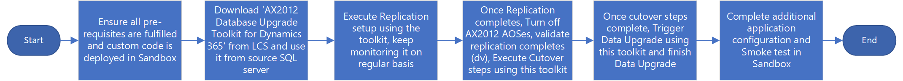

---
# required metadata

title: Upgrade from AX 2012 to finance and operations 
description:  This article describes the process that customers who currently run Microsoft Dynamics AX 2012 can use to move their data and code to finance and operations.
author: LaneSwenka
ms.date: 07/21/2023
ms.topic: overview
ms.prod: 
ms.technology: 

# optional metadata

# ms.search.form:  
audience: Developer, IT Pro
# ms.devlang: 
ms.reviewer: twheeloc
# ms.tgt_pltfrm: 

ms.search.region: Global
# ms.search.industry:
ms.author: laswenka
ms.search.validFrom: 2017-06-16
ms.dyn365.ops.version: Platform update 8
---

# Upgrade from AX 2012 to finance and operations

[!include [banner](../includes/banner.md)]

[!include [upgrade banner](../includes/upgrade-banner.md)]

Finance and operations apps provide an upgrade path that customers who currently run Microsoft Dynamics AX 2012 can use to move their data and code to finance and operations apps. Currently, upgrades from Dynamics AX 2012 R3 and AX 2012 R2 are supported. The upgrade process is built on the following elements:

- Tools to help you bring forward existing custom application code from AX 2012.
- A data upgrade process that you can use to bring your database forward. Therefore, you can upgrade your full transactional history.

> [!IMPORTANT]
> Dynamics AX 2012 implementations that are running some [deprecated features](deprecated-features.md) can't currently be upgraded. For example, upgrade is not possible from systems that are using either virtual companies or data partitions. If you aren't sure whether your system can be upgraded, run the Upgrade analyzer tool. 

> Start your cloud migration journey with a no-charge, no-obligation migration assessment though the [Dynamics 365 Migration Program](https://dynamics.microsoft.com/migration-program/).

## Overview

The overall upgrade process can be visualized as three overarching phases: Analyze, Execute, and Validate.

The following diagram shows the end-to-end upgrade process, and the activities that we consider part of each phase. 

To learn the most important elements and best practices for successfully upgrading your Dynamics AX 2012 solution to finance and operations apps, see [Upgrade Dynamics AX 2012 to finance and operations apps](/training/paths/upgrade-ax-2012-finance-operations/).

> [!IMPORTANT]
> Upgrades from Microsoft Dynamics AX 2012 are complex. It shouldn't be assumed that the process will run end-to-end without some level of effort, data clean-up, tuning and customization. The tools and code for the upgrade should be seen as a framework rather than a complete solution. There are many variables in the AX 2012 database and metadata (code) that make it impossible for all potential issues to be handled by the upgrade process. 

## Analyze

The activities in the Analyze phase help you estimate the effort that is required for the upgrade. They also help you prepare a project plan. These activities can be done before you buy finance and operations. They will help you make an informed purchase decision by providing a data point about the effort and resources that you will require.

### Sign up for a preview subscription

To sign up for a preview subscription, see [Sign up for preview subscriptions](../dev-tools/sign-up-preview-subscription.md).

### Append the upgrade methodology
In your new LCS project, append the project methodology with **Upgrade AX 2012 to Dynamics 365 for Finance and Operations**. This methodology is specifically for AX 2012 customers who are upgrading. It describes the three phases in detail and provides links to all the supporting documentation about the process.
 
### Run the upgrade analysis report
The upgrade analysis report is run against your AX 2012 database and identifies tasks to prepare the AX 2012 environment, to help make the upgrade experience smoother and less expensive:

- **Data cleanup** – This process helps you identify data that you can remove without causing loss of functionality. The tool identifies various types of data that you can reduce by running a cleanup process. For each type of data, an explanation is given about the impact of the cleanup. You then decide whether to run the cleanup process. Part of the cost of your subscription is based on database size. Therefore, by reducing the size, you reduce that component of the subscription cost and also help reduce the time that is required for the upgrade go-live process. A smaller database helps guarantee a faster upgrade.
- **Database settings** – This section of the report reviews the database configuration and recommends optimizations. By making sure that SQL performs optimally, this section helps reduce the time that's required for the upgrade go-live process.
- **Application settings** – This section identifies settings that must be adjusted, fixed, or reconfigured to upgrade.
- **Deprecated features** – This process identifies features that you're currently using, but that aren't available in finance and operations. Therefore, the process helps you discover gaps in functionality early. It also provides suggestions for alternatives.

The output of the upgrade analysis report becomes the upgrade project plan for the AX 2012 system administrators. For more information, see [Upgrade from AX 2012 - Plan by using the Upgrade analysis report](upgrade-analyzer-tool.md).

### Pre-upgrade checklist

As part the upgrade, the pre-upgrade checklist must be installed in your AX 2012 environment to upgrade data. Use this checklist to enter required data for the upgrade. For example, one pre-upgrade checklist task is to provide the Azure Active Directory (Azure AD) sign-in information for each current AX 2012 user. Each user will have to sign in to Dynamics 365 finance and operations apps. 

- If upgrading from AX 2012 R3, install [KB 4035163](https://go.microsoft.com/fwlink/?linkid=852255).
   
   > [!NOTE]
   > KB 4035163 is already included in Cumulative Update 13. 
   
- If upgrading from AX 2012 R2, install [KB 4048614](https://go.microsoft.com/fwlink/?linkid=869025).

### Run the code upgrade estimation tools
This step takes your code from AX 2012, converts it to the new format, and provides feedback about conflicts that a developer must resolve later. This step forms the basis for the estimate of the cost of your code upgrade.

To complete this step, you must export your code from AX 2012 as a model store export and upload it to the LCS Code upgrade tool. The Code upgrade tool will produce an upgraded version of your code and a report about the remaining conflicts that must be resolved. Your developer can then review both the upgraded code and the report to determine the effort that will be required in order to upgrade your code base.

The output of this step represents the workstream in the upgrade project plan for your Microsoft Dynamics AX developers.

For more information, see [Upgrade from AX 2012 - Estimate effort by using the Code upgrade service](analyze-code-upgrade.md).

### Deploy a demo environment
Demo environments are default environments that contain demonstration data (not your own data) and standard code (no customizations). We recommend you deploy a demo environment to evaluate new features, and to perform a basic fit gap analysis of standard processes that are used in AX 2012 but that might have changed in finance and operations. You can either deploy these demo environments in Azure or downloaded them as a virtual machine (VM) you run on your own hardware. If you deploy them in Azure, you must provide your Azure subscription, because you're still using a public preview project and haven't yet purchased a subscription.

> [!IMPORTANT]
> It is recommended that before you run the upgrade, that you apply the latest **Quality update** for the Dynamics 365 version you are using.

The output of this step represents the workstream in the upgrade project plan for your functional users or business users.

For more information, see [Upgrade from AX 2012 - Deploy a demo environment for analysis](analysis-sandbox.md).

### Create a project plan
A template for a project plan is provided in the upgrade methodology. In this step, the output from the previous steps of the Analyze phase is used to fill the project plan for the upgrade project. The project plan will also contain all testing details: data upgrade testing, cutover testing (mock cutover), the functional test pass iterations, and details about the various resource assignments for those tasks.

At this stage, the project plan provides a data point that can help you understand the time and cost of an upgrade.

## Execute
During the Execute phase, you work through the tasks that you planned during the Analyze phase. To move to the Execute phase, you must purchase finance and operations apps, and you must have available resources that can work on the upgrade.

### Switch to the LCS implementation project
The public preview project that you used for the Analyze phase has served its purpose. You can now discard it. For the remaining steps, you require only the project plan that you created in the final step of the Analyze phase.

When you purchase a finance and operations subscription, you will receive details about how to sign up for a new LCS project. This project is known as an implementation project and will be the new permanent LCS project for your tenant, for as long as you have that subscription. This project differs from the public preview project in that it's managed by Microsoft. Therefore, this project has these characteristics:

- This project supports deployment of Sandbox and Production type environments.
- The Sandbox and Production type environments are maintained by the Microsoft team, not your staff. 
- All DevTest or Demo environments must still be deployed on an Azure subscription.  It is recommended to redeploy these environments from your LCS Implementation project so that they are all contained in the same project as your sandbox and production environments. 

### Identify the project as an AX 2012 upgrade
When you first sign in to your LCS implementation project, you're guided through the **Project Onboarding** wizard. You can always visit the **Project Onboarding** wizard later using the navigation menu next to **Project Settings** in your project.

In the Project Onboarding wizard, in the **Project Scope** section, you can use the **Legacy System** field to identify the project as an AX 2012 upgrade. It's crucial that you identify the project in this way.

### Perform the AX 2012 preparation tasks
Complete the tasks that the upgrade analyzer tool discovered, and that are documented in your upgrade project plan. Your Microsoft Dynamics AX system administrator and database administrator (DBA) must complete these tasks.

[Upgrade from AX 2012 - Pre-upgrade checklist for data upgrade](prepare-data-upgrade.md)

### Perform code upgrade
Complete the tasks that were planned during the code upgrade estimation step of the Analyze phase. Your developers must run these tasks.

From this point onward, code changes in AX 2012 should be frozen. Only emergency code changes should be allowed in AX 2012. If a change is made, it must be ported manually to the new code base.

### Develop new code
Complete the tasks from the fit gap analysis that was performed during the "Deploy a demo environment" step of the Analyze phase. These tasks will probably be a mixture of functional tasks that define the configuration and development tasks for customizations that are related to new features that are being taken up.

### Data compression
For larger databases, we recommend compressing the largest tables. Tables in Dynamics 365 Finance are typically compressed with PAGE or ROW compression. Compressing beforehand can help with the upgrade process and reduces the need for the table to be compressed as part of an automated backend process once upgraded. For more information, see [Compress tables in Microsoft Dynamics AX 2012 environments](compress-tables-ax-2012.md).

### Data cleanup
Over time, the Dynamics AX 2012 database can grow to a large size. Before the upgrade, you can reduce the size of the database by purging or archiving data. This will help reduce the time that is required to complete the data upgrade. For more information, see [Clean up source data for upgrade from Microsoft Dynamics AX 2012 to Dynamics 365 Finance + Operations](clean-up-source-data-upgrade.md).

### Document attachments
In Dynamics AX 2012, attachments are stored in several locations, such as a file share, a database, or a local SharePoint server. In Dynamics 365 finance and operations, attachments are mostly stored in a private Azure Blob Storage location that is assigned to the environment. Alternatively, they are linked to a SharePoint online site that is under the customer's tenant.

Attachments will be available in Dynamics 365 finance and operations after an upgrade from Dynamics AX 2012 only if they are migrated to the Dynamics AX 2012 database before the upgrade is done. The pre-upgrade step to move these into the database requires testing and planning, as it can take time to migrate based on the volume of the attachments. A post-upgrade step then migrates them to the Blob Storage location. For more information, see [Migrate document attachments from Dynamics AX 2012](migrate-doc-attachments-ax-2012.md).

### Data upgrade (development environment)
After your code upgrade tasks are completed, you can upgrade your database for the first time. This first upgrade occurs in a development environment, so that you can more easily remediate or debug any issues that are found at this stage. In a development environment, an issue can be debugged immediately, code can be adjusted, and the upgrade can be rerun within minutes. Sandbox environments don't offer this agility, and a minimum of several hours will be required in order to debug and remediate issues, update code, deploy the updated code, and rerun the upgrade.

> [!IMPORTANT]
> It is recommended that before you run the upgrade, that you apply the latest **Quality Update** for the Dynamics 365 finance and operations version you are using.

The following illustration shows the process. Just back up the AX 2012 database, upload it to Azure, restore it to the finance and operations environment, and then run the data upgrade.

 
Data upgrade is done through a special type of deployable package. 

The underlying framework that is used to convert the data in the database during this process is largely the same as the upgrade framework in AX 2012 that is based on X++ batch jobs that run **ReleaseUpdatexxx** classes.

For details, see [Upgrade from AX 2012 - Data upgrade in development environments](data-upgrade-2012.md).

> [!NOTE]
> If you are using Commerce functionality and in-store components as part of the AX 2012 R3 upgrade, we recommend that you review the Dynamics 365 Commerce [Phased rollout (N-1) installation, configuration, and cutover guide](../../../commerce/dev-itpro/n-1-installation-configuration.md). For development environments, the user will need to initialize retail parameters, reinitialize the CDX schedule, and then after applying the data upgrade package, the latest quality updates and channel extensions will need to be applied to the environment. 

### Data upgrade (sandbox environments)
When data upgrade in a development environment is completed, you must perform data upgrade in a sandbox environment. For more information about sandbox deployment, see [Self-service deployment overview](../deployment/infrastructure-stack.md). The sandbox environment is the environment where business users and functional team members can test business processes by using the upgraded AX 2012 data and code.

> [!IMPORTANT]
> Ensure that you have completed a successful upgrade in the development environment with the same application version and customizations, before you attempt to run the upgrade in sandbox. 

> [!IMPORTANT]
> It is recommended that before you run the upgrade, that you apply the latest **Quality Update** for the Dynamics 365 finance and operations version you are using.

The following illustration shows the process for running data upgrade in a sandbox environment. The difference here is that the **AX 2012 Database Upgrade Toolkit for Dynamics 365** is used instead of a traditional SQL backup. This toolkit is required to move your AX 2012 data to Azure SQL Database (using SQL Transaction Replication) as well as to run the data upgrade. In this case, your source is AX 2012 database and target is the finance and operations sandbox environment.

For more information, see [Upgrade from AX 2012 - Data upgrade in self-service environments](data-upgrade-self-service.md).

> [!NOTE]
> If you are using Commerce functionality and in-store components as part of the AX 2012 R3 upgrade, we recommend that you review the Dynamics 365 Commerce [Phased rollout (N-1) installation, configuration, and cutover guide](../../../commerce/dev-itpro/n-1-installation-configuration.md). For sandbox and development environments, the user will need to initialize retail parameters, reinitialize the CDX schedule, and then reinitialize the CSU after data upgrade. For more information about reinitializing the CSU, see [Initialize Commerce Scale Unit (cloud)](../deployment/Initialize-Retail-Channels.md).
 
## Validate
When you enter the Validate phase, you will have available environments that include your upgraded custom code and your upgraded data. This phase describes the process of validating and testing that the upgraded environment works as desired. It also describes the process of preparing for go-live.

### Perform cutover testing and create a cutover plan
The term _cutover_ is used here to describe the final process of putting the new system live. This process consists of the tasks that occur after AX 2012 is turned off and before finance and operations is turned on. 

The goal of the testing, or *mock cutover* is to practice the cutover process. In this way, you can help guarantee that everyone who is involved in the actual cutover to go-live will have a smooth experience.

There are two main workstreams:

- **Technical workstream** – This workstream is the process of running the data upgrade. Your business will enforce a limit on the amount of downtime that is allowed. During this downtime, neither product database will be available. The technical workstream might have to performance-tune its data upgrade procedure to meet the business's downtime limit. 
- **Functional workstream** – After data upgrade, several configuration tasks will be required in the finance and operations environment. All these tasks must be documented and quantified, and a resource must be assigned to them, because they must fit together with the technical tasks within the business's downtime limit.

For additional details, see: 
- [Upgrade from AX 2012 - Post-upgrade tasks](app-validation-process.md)
- [Upgrade from AX 2012 - Cutover testing (Mock cutover)](upgrade-cutover-testing.md)

### Functional test pass
Complete a full functional test pass of all business processes. This test pass will be an extensive retest of all business processes that involve finance and operations. These business processes include both old processes that were brought forward from AX 2012 and new processes that involve new features that were taken up for the first time in finance and operations. 

Depending on code quality, issue remediation and retesting might require several iterations of the functional test pass. When an issue is fixed, be sure to retest all processes that are involved, to help guarantee that the downstream or upstream process isn't affected by the change.

For details, see [Upgrade from AX 2012 - Functional test passes](upgrade-functional-validation.md).

### Pre go-live checklist
The pre go-live checklist is a recommended procedure that can help reduce the chance of errors during the final cutover to go-live. One week before go-live is due, stop configuration changes in AX 2012 (under \<module\>\\Setup). This restriction on configuration changes is merely procedural. The Microsoft Dynamics AX system administrators just agree to put changes of this type on hold at this point.

We recommend that you also freeze code changes in the finance and operations code base. No further changes should be allowed unless they have been evaluated and have been shown not to block go-live.  

After the configuration restriction and code freeze are in place, data upgrade should be run for the last time before cutover. In this way, you can make sure that everything still works as expected. 

For more information, see [Validate: Prepare for go live](upgrade-go-live-prep.md).

### Go live
After you have successfully completed upgrade testing in a Standard or Premier Acceptance Test environment (Sandbox Tier 2 or higher), and you have also completed a successful test cutover, the moment has arrived to upgrade your production environment and go live. 

*Cutover* is the term that we use for the final process of getting a new system live. This cutover process consists of the tasks that occur after Dynamics AX 2012 is turned off but before finance and operations is turned on. 

For details, see [Upgrade from AX 2012 - Cutover process (Go live)](2012-upgrade-cutover.md).

## Supported upgrade paths
Upgrade to the cloud version of finance and operations apps is supported from AX 2012 R2 and AX 2012 R3. 

Upgrade from Dynamics AX 2012 RTM isn't currently supported. Upgrade to the on-premises version is supported, as documented in [Data upgrade process for AX 2012 to Dynamics 365 Finance + Operations (on-premises)](on-prem-upgrade-2012.md). 

[!INCLUDE[footer-include](../../../includes/footer-banner.md)]
