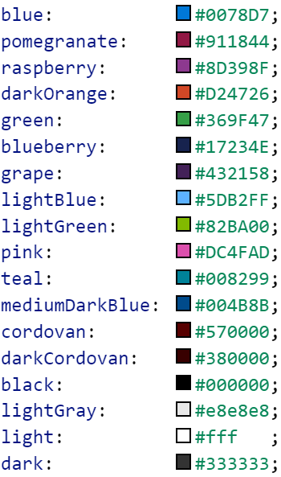

# ListDesign type

[!include [banner](../../../../includes/banner.md)]
[!include [mobile app deprecated](../../../../includes/mobile-app-deprecation-banner.md)]

List design object type.

### Hierarchy

[ContainerControlDesign](view-model-control-container-icontainercontrol-icontainercontroldesign.md)  &nbsp;&nbsp;&nbsp;└─ ListDesign  

## Index

### Properties

* [alignItems](view-model-control-list-ilist-ilistdesign.md#alignitems)
* [alignSelf](view-model-control-list-ilist-ilistdesign.md#alignself)
* [allowScroll](view-model-control-list-ilist-ilistdesign.md#allowscroll)
* [background](view-model-control-list-ilist-ilistdesign.md#background)
* [bindings](view-model-control-list-ilist-ilistdesign.md#bindings)
* [border](view-model-control-list-ilist-ilistdesign.md#border)
* [color](view-model-control-list-ilist-ilistdesign.md#color)
* [design](view-model-control-list-ilist-ilistdesign.md#design)
* [flexFlow](view-model-control-list-ilist-ilistdesign.md#flexflow)
* [flexSize](view-model-control-list-ilist-ilistdesign.md#flexsize)
* [fontSize](view-model-control-list-ilist-ilistdesign.md#fontsize)
* [fontWeight](view-model-control-list-ilist-ilistdesign.md#fontweight)
* [hideArrow](view-model-control-list-ilist-ilistdesign.md#hidearrow)
* [hideSearchBar](view-model-control-list-ilist-ilistdesign.md#hidesearchbar)
* [itemBorder](view-model-control-list-ilist-ilistdesign.md#itemborder)
* [items](view-model-control-list-ilist-ilistdesign.md#items)
* [justifyItems](view-model-control-list-ilist-ilistdesign.md#justifyitems)
* [label](view-model-control-list-ilist-ilistdesign.md#label)
* [labelPosition](view-model-control-list-ilist-ilistdesign.md#labelposition)
* [name](view-model-control-list-ilist-ilistdesign.md#name)
* [padding](view-model-control-list-ilist-ilistdesign.md#padding)
* [type](view-model-control-list-ilist-ilistdesign.md#type)

## Properties

### alignItems

alignItems: string (optional) 

This property is an alias for the CSS property "align-items".
Please refer to [this web page](https://css-tricks.com/snippets/css/a-guide-to-flexbox) for documentation on the "align-items" property.

> Inherited from [Design](view-model-ipage-idesign.md).[alignItems](view-model-ipage-idesign.md#alignitems)

### alignSelf

alignSelf: string (optional) 

> Inherited from [Design](view-model-ipage-idesign.md).[alignSelf](view-model-ipage-idesign.md#alignself)

### allowScroll

allowScroll: string (optional) 

True if the container will allow scrolling when its items do not fit into the container's available space.
If a container has an item which may scroll, then set this property to false to prevent nested scrolling areas.

> Inherited from [ContainerControlDesign](view-model-control-container-icontainercontrol-icontainercontroldesign.md).[allowScroll](view-model-control-container-icontainercontrol-icontainercontroldesign.md#allowscroll)

### background

background: string (optional) 

The background color of the container.
Consider modifying the color attribute in the same container so that fonts overlaying the background color will appear appropriately.
Note: if background is set to "theme", the theme color of the app will be used.
The following colors are available:  

> Inherited from [ContainerControlDesign](view-model-control-container-icontainercontrol-icontainercontroldesign.md).[background](view-model-control-container-icontainercontrol-icontainercontroldesign.md#background)

### bindings

bindings: any (optional) 

> Inherited from [Design](view-model-ipage-idesign.md).[bindings](view-model-ipage-idesign.md#bindings)

### border

border: "none" &#124; "solid" &#124; "left" &#124; "right" &#124; "top" &#124; "bottom" (optional) 

The border behavior of a control. This property will not be inherited by the children.

> Inherited from [Design](view-model-ipage-idesign.md).[border](view-model-ipage-idesign.md#border)

### color

color: string (optional) 

The foreground color of the container.
This will modify the color of all headers, items, labels, and icons within the container. 
Consider setting the background color at the same time as necessary when setting this attribute. 
Note: if color is set to "theme", the theme color of the app will be used. 
The following colors are available:  

> Inherited from [Design](view-model-ipage-idesign.md).[color](view-model-ipage-idesign.md#color)

### design

design: [GroupDesign](view-model-control-group-igroup-igroupdesign.md) (optional) 

The design object that will be applied to each row.

### flexFlow

flexFlow: string (optional) 

Specifying this property makes the component a flex container component.
This property is an alias for the CSS property "flex-flow".
Please refer to [this web page](https://css-tricks.com/snippets/css/a-guide-to-flexbox) for documentation on the "flex-flow" property.

> Inherited from [Design](view-model-ipage-idesign.md).[flexFlow](view-model-ipage-idesign.md#flexflow)

### flexSize

flexSize: string (optional) 

One number or two numbers written as a string. For example, "(size to grow) [(size-to-shrink)]" to accommodate available space in the immediate flex container.
This property is an alias for the CSS property "flex". Please refer to
[this web page](https://css-tricks.com/snippets/css/a-guide-to-flexbox) for documentation on the "flex" property.

> Inherited from [Design](view-model-ipage-idesign.md).[flexSize](view-model-ipage-idesign.md#flexsize)

### fontSize

fontSize: "medium" &#124; "xx-small" &#124; "x-small" &#124; "small" &#124; "large" &#124; "x-large" &#124; "xx-large" (optional) 

The proportional text size

> Inherited from [Design](view-model-ipage-idesign.md).[fontSize](view-model-ipage-idesign.md#fontsize)

### fontWeight

fontWeight: "normal" &#124; "bold" (optional) 

Normal or bold text.

> Inherited from [Design](view-model-ipage-idesign.md).[fontWeight](view-model-ipage-idesign.md#fontweight)

### hideArrow

hideArrow: boolean (optional) 

Allows an arrow ( > ) on a default styled navigation control to be hidden.
Note that if the list has DetailsPageId, navigationHandler, or OnNavigate in the metadata then by default the arrows
are present in each row of the list to show that the rows are clickable.

 This property can only be added through the design object.

### hideSearchBar

hideSearchBar: boolean (optional) 

If true, the search bar will be hidden.

### itemBorder

itemBorder: "solid" &#124; "none" (optional) 

If true, a border will appear around each row in the list.
This property is equivalent to applying the border property individually to all items in the container.

> Inherited from [ContainerControlDesign](view-model-control-container-icontainercontrol-icontainercontroldesign.md).[itemBorder](view-model-control-container-icontainercontrol-icontainercontroldesign.md#itemborder)

### items

items: string &#124; [Design](view-model-ipage-idesign.md) \[ \] (optional) 

An array containing the components to place inside of the container.

> Inherited from [ContainerControlDesign](view-model-control-container-icontainercontrol-icontainercontroldesign.md).[items](view-model-control-container-icontainercontrol-icontainercontroldesign.md#items)

### justifyItems

justifyItems: "flex-start" &#124; "flex-end" &#124; "center" &#124; "space-between" (optional) 

This property is an alias for the CSS property "justify-content".
Please refer to [this web page](https://css-tricks.com/snippets/css/a-guide-to-flexbox) for documentation on the "justify-content" property.

> Inherited from [Design](view-model-ipage-idesign.md).[justifyItems](view-model-ipage-idesign.md#justifyitems)

### label

label: string (optional) 

> Inherited from [Design](view-model-ipage-idesign.md).[label](view-model-ipage-idesign.md#label)

### labelPosition

labelPosition: "stacked" &#124; "hidden" &#124; "inline" (optional) 

Determines how a label is positioned, if at all. By default, labelPosition is set to stacked.

> Inherited from [Design](view-model-ipage-idesign.md).[labelPosition](view-model-ipage-idesign.md#labelposition)

### name

name: string (optional) 

> Inherited from [Design](view-model-ipage-idesign.md).[name](view-model-ipage-idesign.md#name)

### padding

padding: "none" &#124; "small" &#124; "std" (optional) 

Allows specifying the component's padding behavior.
A component will inherit the padding behavior specified by its parent container components.

> Inherited from [Design](view-model-ipage-idesign.md).[padding](view-model-ipage-idesign.md#padding)

### type

type: [ControlType](../modules/view-model-control-basecontrol-icontrol.md#controltype) (optional) 

The type of the control as a string.

> Inherited from [Design](view-model-ipage-idesign.md).[type](view-model-ipage-idesign.md#type)

[!INCLUDE[footer-include](../../../../../../includes/footer-banner.md)]
