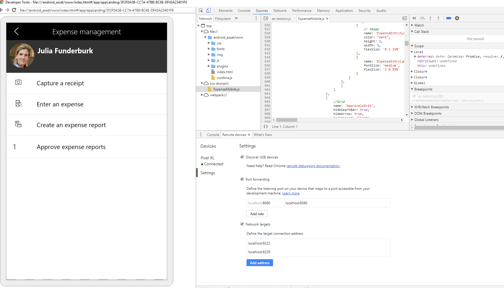

# Mobile platform resources

[!include [banner](../../includes/banner.md)]
[!include [mobile app deprecated](../../includes/mobile-app-deprecation-banner.md)]

By using mobile apps, you can reuse business logic and modeling. Mobile apps enable rich offline and mobile interactions, and provide an easy-to-use designer experience. Developers can create simplified forms in Microsoft Visual Studio and then design mobile apps that expose this functionality. The mobile platform makes it easy to change the forms and mobile app definitions to include customizations that are made to your cloud app. 

## Get started

+ [Getting started](mobile-platform-getting-started.md) 
+ [Architecture](mobile-platform-architecture.md) 
+ [Page design guidelines](page-design-guidelines.md)
+ [Action design guidelines](action-design-guidelines.md)
+ [Form design requirements](form-design-requirements.md)

Check out the following series of how-to videos that show how to create a mobile app.

+ [Tutorial 1: Building the sales order page](https://youtu.be/PdegfBxifl8)
+ [Tutorial 2: Building the sales order details page](https://youtu.be/mF-vlbnRte0)
+ [Tutorial 3: Building the create new sales order action](https://youtu.be/VYw9oTv9t3o)
+ [Tutorial 4: Adding a lookup to the create new sales order action](https://youtu.be/eNJKd0IYmZk)
+ [Tutorial 5: Adding a lookup and hiding pages using mobile business logic](https://youtu.be/kIJKk9J8FvI)

## Common configurations
These topics describe some common customizations that you can add to your mobile app.

+ [Localize mobile workspaces](scenarios/localize-workspaces-on-server.md)
+ [Help secure mobile workspaces](scenarios/secure-mobile-workspace.md)
+ [Set up clickable fields](scenarios/make-workspace-field-clickable.md)
+ [Set up mandatory fields through workspace classes](scenarios/make-field-mandatory.md)
+ [Display item counts in a field](scenarios/display-count-workspace.md)

## Client-side development

Client-side APIs are used in the business logic file, which provides an extensibility layer to the mobile workspace that allows for customization. Some things that you can access and influence through the client-side APIs include:
+ Metadata
+ Runtime control/page instances
+ Business data
+ Offline-first business behaviors
+ Layout and style

The process for client-side development is described in these topics:
+ [Client-side design APIs overview](scenarios/client-api-design-overview.md)
+ [Business logic events overview](business-logic-events-overview.md)
+ [Client APIs](client-apis/client-apis-reference.md)

You can download a sample business logic file (with a .js file name extension) for the Reservation management workspace. Go to [Dynamics365-for-Operations-mobile-FleetManagementSamples](https://github.com/Microsoft/Dynamics365-for-Operations-mobile-FleetManagementSamples), open the **business_logic folder**, and locate the FM.js file

## Server-side development

Workspace attributes and classes are used to create, configure, and publish workspaces on the server. These server-side X++ APIs can be used instead of using the task recorder-based mechanism to build a workspace. Workspaces created using either mechanism can then be styled and augmented using the client-side APIs.

Server-side development is described in these topics:
+ [Workspace class overview](scenarios/mobile-workspace-configuration.md)
+ [Server APIs (X++)](mobile-workspace-server-apis.md)

You can download the sample project (with an .axpp file name extension) for the Fleet Management mobile app. Go to [Dynamics365-for-Operations-mobile-FleetManagementSamples](https://github.com/Microsoft/Dynamics365-for-Operations-mobile-FleetManagementSamples) and download the **FMMobileApp.axpp** file.

## Debugging during development

During development it can be useful to attach a debugger to get more detailed information and insight into what is happening in the background. A web debugger can be used with the client-side JavaScript logic and styling and the Visual Studio debugger can be used with the server-side X++ business logic.

### Debugging the client side 

#### Prerequisites
- Android device plus PC
- Azure-hosted development machine (so the mobile device can point to it)

#### Steps to debug the client side
1. On the web client that is exposed by the Azure-hosted development machine, ensure that there are mobile workspaces published for the finance and operations app. For information about publishing a mobile workspace, see [Publish mobile workspaces](../publish-mobile-workspace.md).

2. Install the Android debug apk for the finance and operations app on an Android device:
    - One time only, allow the installation of apk files -  Go to **Menu** > **Settings** > **Security** and then check **Unknown Sources** to allow the phone to install apps from sources other than the Google Play Store.
    - Uninstall the finance and operations app - Ensure that any previous version of the finance and operations app has been uninstalled.
    - Download the apk file - From the device’s browser, navigate to the latest [finance and operations Android debug apk on GitHub](https://github.com/Microsoft/Dynamics365-for-Operations-mobile-FleetManagementSamples/blob/master/android-debug.apk) and click **Download** (or use [this direct link to the file](https://github.com/Microsoft/Dynamics365-for-Operations-mobile-FleetManagementSamples/raw/master/android-debug.apk)).
    - Install the finance and operations apk file - Confirm install of the finance and operations app via the apk file.
    - Run the debug finance and operations app on the device and sign in.

3. Connect to the device from the debugging machine.

    - On the Azure-hosted development machine or a separate PC, follow Android developer instructions to [Get Started with Remote Debugging Android Devices](https://developers.google.com/web/tools/chrome-devtools/remote-debugging/). You can also find a wide selection of instructional videos on YouTube by searching for [Chrome for Android remote debugging](https://www.youtube.com/results?search_query=chrome+for+android+remote+debugging). 
    
4. After you connect the debugger, find the active tab on your device. You may need to click **View more tabs** on Android. One of the tabs should look similar to `/www.index.html#/app/appList` or `/www.index.html#/app/app_landing`. 

    Expand the nodes to find the workspace JavaScript, such as **File** > (no domain) > **ExpenseMobile.js**. Click the JavaScript file to view it and add breakpoints.
    
    
    
5. Reflect the mobile device on your desktop so that you can interact with it on the desktop screen. 

6. Go to through the desired workspace and forms.

7. If breakpoints are encountered, then the browser developer tools will allow you to control the flow of execution and see the values and parameters being passed. 

8. To change styling at runtime, use the elements tab to alter the styling. This will help you determine what elements JavaScript should target and how those elements should be styled.

9. If a needed change is identified, make those changes in JavaScript, and then push those changes into the environment.

10. If more changes or validation is needed, repeat the process.

### Debugging the server side

#### Prerequisites
- Azure-hosted development machine (so the mobile device can point to it)

#### Steps to debug the server side
1. On the web client exposed by the Azure-hosted development machine, ensure that there are mobile workspaces published for the finance and operations app. For information about publishing a mobile workspace, see [Publish mobile workspaces](../publish-mobile-workspace.md).

2. Open the app on your device, point to the Azure-hosted development machine, and sign in.

3. Open Visual Studio on the Azure-hosted development machine and attach the debugger to the w3wp process.

4. After you connect the debugger, find the desired business logic, and insert breakpoints as needed.

5. Either use the app on your device as usual, or reflect the mobile device on your desktop so you can interact with it on the desktop screen.

6. Navigate through the desired workspace and forms.

7. If breakpoints are encountered, then Visual Studio will allow you to control the flow of execution and see the values and parameters being passed. 

8. If a needed change is identified, make those changes in X++, and push those changes into the environment.

9. If more changes or validation is needed, repeat the process.

## Troubleshooting the app

### **[Resolved]** - No support for iOS14 due to issues with date and time controls
Version 2.2.8 of the finance and operations mobile app fixes the known issues with the date and time pickers in iOS14. Ensure that you have the latest version of the app if you are experiencing issues running the application on iOS14.  

### The Mobile Client app is not working on particular devices
Sometimes the cache associated with the app becomes corrupt or obsolete and needs to be cleared. Unfortunately, the only way to clear the data associated with the app is to uninstall the app.
To completely uninstall the app, don't use the "long-press wiggle and x on the app icon" method. Instead, completely uninstall the app by navigating to **Settings** > **General** > **iPhone Storage** > **Finance and operations (Dynamics 365)**, and then click **Delete App**. After 10-15 seconds, the app can be reinstalled.

### On Android devices with non-English regions, the comma can't be used as the decimal separator in an amount field
On Android devices with non-English regions, using a comma as the decimal separator is standard practice. Problems using a comma in an amount field is an Android-specific problem because iPhone works as expected. On Android, use of the comma in an amount field is a problem with the default "gboard" keyboard and some other keyboards. Installing the SwiftKey keyboard (published by Microsoft) allows the entry of commas just like on iPhone: [SwiftKey Keyboard](https://www.microsoft.com/swiftkey).

### Change needed for ADFS to support Mobile Client in on-premises environments 
If Active Directory Federation Services (ADFS) is in use on the domain and the environment is on-premises, then **ADFS must be configured to provide a regular forms-based authentication screen** instead of using Windows Integrated Authentication (WIA). The finance and operations apps for iOS and Android require the regular forms-based authentication screen. ADFS should be configured to only provide WIA for browser clients (use cases). For more information, see [Configure intranet forms based authentication for devices that do not support WIA](/windows-server/identity/ad-fs/operations/configure-intranet-forms-based-authentication-for-devices-that-do-not-support-wia).

### Using multi-factor authentication with the finance and operations app
The finance and operations (Mobile Client) app facilitates user authentication with Azure Active Directory (Azure AD) by presenting the Azure AD sign-in web page within an embedded browser. After a successful sign in, it will retrieve the user token from the cookies and use that when communicating with the user interaction service that it shares with the web client. Some multi-factor authentication mechanisms that involve switching to a different app on the same device will cause the embedded browser to close, so the sign in will fail. The workarounds for this include:

- Different device - Use a different device for the multi-factor authentication response so the app remains active on the original device.
- Multi-factor authentication via phone call - Use a phone call for the multi-factor authentication response so an app switch is not needed.
- Use the "touch and hold" gesture on the authentication notification and then select the **Accept** option. Because the notification acceptance will not require an app switch, the sign in will proceed as usual.

If there are continued problems with MFA authentication, it is helpful to [submit the Microsoft Authenticator app logs](https://github.com/AzureAD/azure-activedirectory-library-for-objc/wiki/Instructions-on-Collecting-Microsoft-Authenticator-Logs) and provide support with the resulting Incident ID.

### Intune support and conditional access
The finance and operations (Mobile Client) app does not have Microsoft Intune policies implemented, so it does not support Intune. Manually adding the app (following [Add iOS store apps to Microsoft Intune](/mem/intune/apps/store-apps-ios)) is also not supported because the device identifier cannot be passed.

### Trouble signing out of the app and signing in with new credentials
If you experience trouble signing out of the app and signing in with new credentials, then you might need to "forget old credentials" on the Azure AD sign-in screen.
- To sign out of the app, follow these steps:
    - Open the app.
    - Sign out of the app.
    - Force close the app.
- To forget old credentials, follow these steps:
    - Open the app.
    - Connect to the server.
    - On the Azure AD sign-in screen, if there are saved credentials, select the ellipsis (...) button on that card, and then select **Forget the credential**.
    - Force close the app.
- To sign in to the app, follow these steps:
    - Open the app.
    - Connect to the server
    - Sign in using the Azure AD sign-in screen.

## Troubleshooting app content

### I can't figure out how to build or change something in my Mobile Client content
There are many resources that you can leverage to figure out how to build or change content for the Mobile Client.
- Review the documentation provided in the Help system.
- Review the [Fleet Management Samples](https://github.com/Microsoft/Dynamics365-for-Operations-mobile-FleetManagementSamples) for examples.
- Publish and review the Expense Management workspace, and other standard workspaces, for examples. Demo data for the USSI company is useful when using the Expense Management workspace. The forms and X++ code that make up the Expense Management workspace can be found in the Application Explorer by searching for the "ExpenseMobile" prefix.
- Leverage the [Dynamics Community forums](https://community.dynamics.com/ax/f/33) by searching for answers and asking questions when needed.

### Tips for workspace creation and modification
Here are some tips for workspace creation and modification:
- Create new simplified forms for recording rather than recording large complex forms.
- After recording a form, you have to close the form instead of clicking **Done**, otherwise the form remains open.
- Verify that recordings are correct using the "Job steps".
- Play back recordings using task recorder playback to verify them.
- Don't navigate to a page before starting the recording, because the context from the previous page might need to be captured.
- If you re-record a page with a grid then you need to re-record the link to the Details page because otherwise it won't be there.
- When recording an action, change the value of the fields to add them. When recording is complete, close the form instead of clicking **Save**.
- Lookups in mobile are list pages that have been recorded. **Select field data** and **Select field to display** are used to select the **field to use as the value to save** (data) and the **field to show the user** (display).
- When adding a lookup field, select a value in a lookup instead of just adding the lookup field. This will ensure that the correct value is selected.
- If you re-record a lookup, all the references also need to be re-recorded because the GUID for the lookup will change.
- If you want to add a field to a page, you need to add all the fields again, because the list is cleared at the beginning of each edit. This is a limitation of task recorder. Note that reordering is also not possible.
- In the workspace XML, GUIDs are used as references to forms and controls instead of names. GUIDs are used to ensure uniqueness, but this comes at the cost of maintainability. Those GUIDs are regenerated on each modification, so partial edits are very difficult. The use of GUIDs would be very costly to change, so it is unlikely that changes would be made in the future to use simpler string name references.
- Relationships between form datasources need to be via RecordId instead of string. For example, primary keys of the datasources should not be strings.
- Customers and partners can fork a workspace by creating a copy of it and then make changes as needed.
- There is no check box in mobile. You have to manually bind the field to a Yes/No enum in JavaScript.

### Common problems with form recordings
Avoid using forms with these patterns and controls when creating workspace recordings:
- Datasources with DelayedJoin (common on transaction forms).
- FastTabs (common on existing forms).
    - Recorded forms should not have FastTabs because the FastTabs expansion state can interfere with playback.
- Any user interface (UI) that has state, like an expandable or hide/show region.
- There is no check box in mobile. You have to manually bind the field to a Yes/No enum in JavaScript.

[!INCLUDE[footer-include](../../../../includes/footer-banner.md)]

