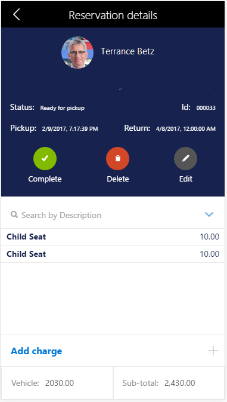

# Client-side design APIs

[!include [banner](../../../includes/banner.md)]
[!include [mobile app deprecated](../../../includes/mobile-app-deprecation-banner.md)]

This article provides an overview of the application programming interfaces (APIs) for client-side design and includes recommendations for using them.

## Terminology
The following list includes some frequently used terms that apply to the client-side design APIs.

- **Design** – A property that can optionally be specified on a Page, Action, or other component object to override its default design.
- **Component** – A component can be one of four types:

  - **Block container** (default) – A container that has CSS block behaviors. (In other words, the container is equivalent to an element that has a CSS **display: block** style declaration.)
  - **Flex container** – A container that has CSS flex behaviors. (In other words, the container is equivalent to an element that has a CSS **display: flex** style declaration.)
  - **Control reference** – A component that refers to a control that exists in the static metadata (XML) of the Page or Action.
  - **New control** – A component that instantiates a new control. (In other words, the control doesn't already exist in the static metadata [XML] of the Page or Action.)

    A component is represented in the design by a JavaScript Object Notation (JSON) object, and the properties of this JSON object represent the properties of the component. Almost every JSON object in the design property hierarchy is a component.

- **Item** – A component that is nested in a container.
- **Property** – Several types of properties can be set on a component:

  - Container-specific
  - Item-specific
  - Control-specific
  - List-specific
  - Generic (non-specific)

    Properties are specified as key-value pairs on the component's JSON object. The properties that are applicable depend on the type of component that the property is applied to.

    For properties that have a predefined list of possible values, the first value that is shown in the documentation is the property's default value. In most cases, if you don't specify a property at all (that is, if you omit the property from the JSON object), the property behaves as if you had set its default value.

    Generic properties can be applied to all component types.

	When you specify properties, follow these guidelines:

  - You should not enclose property names in quotation marks.
  - You must enclose all property values in double quotation marks, unless the documentation specifies otherwise.

- **Inheritance** – If a color, font size, or font weight is applied to a control, all descendant controls inherit the same property, unless they are reassigned. If padding is applied to a control, it's inherited by the item (non-container) descendants of the control. No other properties are inherited.

## Using design APIs
The following code is a modified segment of business logic code from a Reservation Management example. Specifically, this code is from a variable that specifies the design for a reservation details page. Comments are included in the code to highlight a few possibilities.

> [!NOTE]
> Any color, font size, or font weight that is applied to a control is also applied to all children of that control. Padding is inherited by non-container children. No other properties are inherited. Containers include lists, pages, groups, and parts.

After a control is created that doesn't have any children or items, the control name just has to be written in quotation marks (see **FMCustomer\_FullName** in the following code). However, if any customization will be applied to that control, the code must be blocked, and the **name** label must be used (see **FMCustomer\_Image** in the following code).

```json
// Page root container
"flexFlow":"column nowrap",
"items":[
    // Upper third of page, contains 4 rows
    {
        "flexFlow":"column nowrap",
        "background":"theme", // set background color to the theme color
        "color":"light",      // set the foreground (e.g. font) color to light
        "fontSize":"small",
        "border": "none",
        "padding":"small",
        "items":[
            // Row 1/4 with customer image and name
            {
                "flexFlow":"row nowrap",
                "alignItems":"center",
                "justifyItems":"center",
                "labelStyle":"hidden", // don't show label for field
                "fontSize":"large",
                "fontWeight":"bold",
                "items":[
                    {
                    // Customer image – since we're modifying the imageStyle, etc., this
                    // code must be blocked and the "FMCustomer_Image" must be labeled
                    // with "name".
                        "name":"FMCustomer_Image",
                        "imageStyle":"circular",
                        height:3,
                        width:3
                    },
                    // don't need to create a new object or use the "name" label if
                    // there is no customization
                    "FMCustomer_FullName",
                ]
            },
            // Row 2/4 with vehicle description
            . . .
        }
    }
```

The following illustration shows the customer image, customer name, font, background color, and so on, that preceding code produces.




[!INCLUDE[footer-include](../../../../../includes/footer-banner.md)]
