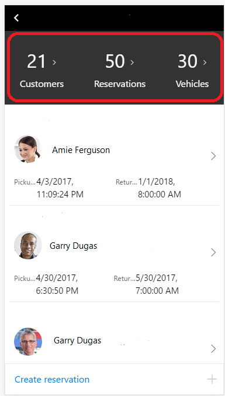
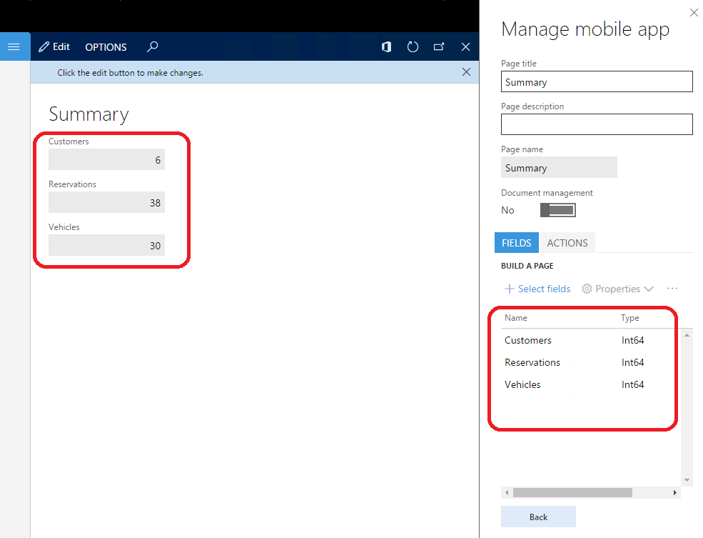

---
# required metadata

title: Show counts in fields
description: This topic explains how to calculate a count that is correct and that appears quickly. 
author: tonyafehr
ms.date: 07/01/2017
ms.topic: article
ms.prod: 
ms.technology: 

# optional metadata

# ms.search.form: 
# ROBOTS: 
audience: Developer, IT Pro
# ms.devlang: 
ms.reviewer: tfehr
# ms.tgt_pltfrm: 
ms.custom: 255544
ms.assetid: 
ms.search.region: Global
# ms.search.industry: 
ms.author: tfehr
ms.search.validFrom: 2017-07-20
ms.dyn365.ops.version: Platform update 3

---

# Show counts in fields

[!include [banner](../../../includes/banner.md)]

Although a **pageLink** control can be used to show counts (totals), it can be slow, because it must load the target page before it counts the number of rows. Additionally, the count that is calculated can be incorrect, because there is a limit on the number of rows that are retrieved.

If you want to make mobile workspaces work more quickly, we recommended that you use a regular field to show the count and then model the field as a **pageLink** control in the mobile client.

The following example uses the Fleet Management app. In the Fleet Management app, the workspace shows the total number of customers, reservations, and vehicles. Previously, these counts came from a **pageLink** control that had AllCustomers, AllReservations, and AllVehicles as targets. The **pageLink** control loaded the rows and did the count. (This approach isn't the recommended approach.)

Follow these steps to configure the workspace page to use the recommended approach.

1. On the server, create a new form to contain fields that are also on the server. (You can also add the new fields to an existing form). In the following illustration, a new **FMMobSummary** form is created that has three fields.

    

2. Create a page by using the mobile app designer for the **FMMobSummary** form.

    

3. Update the business logic to transform the fields into a **pageLink** control. Use the **configureControl** method to add a navigation target to the fields. The fields are then configured as **pageLink** controls. The arguments for the **configureControl** method are the page name, the control name, and an object of properties that must be updated.
4. Update the workspace design. Embed the summary page as a part in the workspace page. Reference the fields that are now configured as **pageLink** controls. Provide a style, and set the **showCount:true** property, so that the count is shown on the **pageLink** control.

    

By using this approach, you also get the localized labels for **pageLink** controls. The result is a much faster experience when workspaces are loaded.

[!INCLUDE[footer-include](../../../../../includes/footer-banner.md)]