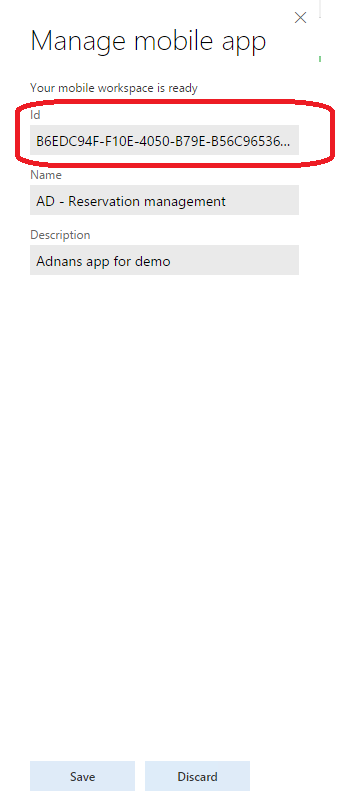

# Localize mobile workspaces

[!include [banner](../../../includes/banner.md)]
[!include [mobile app deprecated](../../../includes/mobile-app-deprecation-banner.md)]

You can use workspace classes in several ways to provide localization support to workspaces.

## Use config objects to pass localized labels
A config object can be added to the workspace metadata when it's requested by the mobile app. Later, the config object can be used to provide localization support. 

For example, the following workspace requires localized labels for the **pageLink** control that you added via the business logic.

 

The business logic for the app contains a call to the **addLink** method, as shown in the following illustration. This **addLink** method adds a link to the **Rentals** page for the current customer. In this case, the label for the link is **Rentals**. However, because there isn't a localized label for the link, the link always appears as **Rentals**.

To use a config object to provide localized labels, follow these steps.

1. Create a config class that contains the fields for the labels. One field, **rentalLinkLabel**, is added to the class that will contain the label for the **pageLink** control. The config class must be a data contract class.

    

2. The config class is used by a workspace class for the workspace. The workspace class requires the **appId** value of the workspace. You can find the app ID in the App designer, as shown in the following illustration.

    

    The following illustration shows what the workspace class looks like when the **appId** value is set on the attribute. The class also contains a method, **addConfig**, that sets a config object that contains the value for the label.

    

    The following illustration shows the config object in the **appInit** call in the mobile app.

    

3. The config object can now be used and passed to the **addLink** method instead of the hard-coded label.

    

## Use a workspace class to update the workspace title and description
A workspace class can be used to provide localized strings for the workspace title and description. If you don't localize the title and description, the fields will be in the language that you implemented them in. In this example, we will localize a workspace where **MyWorkspace** is the title and **A sample workspace** is the description.

 

1. If you don't have a workspace class for your workspace, create a workspace class.
2. Override the **getWorkspaceMetadata** method to get the workspace metadata. You must have the workspace metadata to provide labels for the workspace title and description fields.
3. Use the **workspaceTitle** and **workspaceDescription** properties to set the workspace title and description from a label. In the following illustration, placeholders are assigned to the **workspaceTitle** and **workspaceDescription** properties.

    

4. Build the workspace class.
5. Update the app list on the mobile client.

The following illustration shows the title and description on a phone that uses English and Danish.

[!INCLUDE[footer-include](../../../../../includes/footer-banner.md)]
