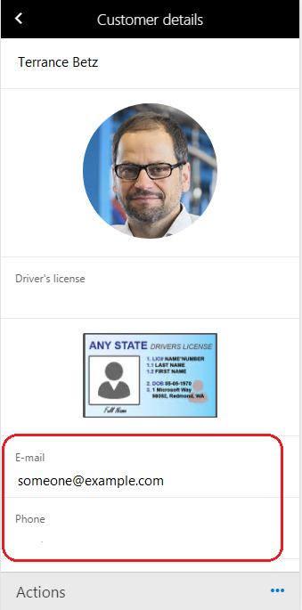
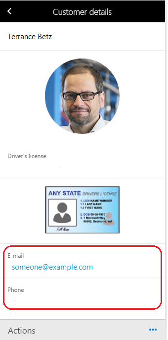

# Make fields on mobile app pages clickable

[!include [banner](../../../includes/banner.md)]
[!include [mobile app deprecated](../../../includes/mobile-app-deprecation-banner.md)]

The fields on a mobile app page can be customized so that they are shown as email addresses, phone numbers, or URLs.

## Email field
You can mark a field as an email address field by using business logic. Then, when a user clicks the field, the default mobile email app starts, and the field value appears as the email address in the app.

## Phone field
You can mark a field as a phone number field by using business logic. Then, when a user clicks the field, the mobile dialer app starts, and the field value appears as the phone number in the app.

> [!NOTE]
> On iOS, if the phone number isn't valid, it might not trigger the mobile dialer app.

## URL field
You can mark a field as a URL field by using business logic. Then, when a user clicks the field, the URL opens in the default mobile browser, and the field value appears in the address bar.

> [!NOTE]
> On iOS, you must provide a complete URL (that is, a URL that starts with a protocol, such as <strong>https</strong>). Otherwise, the URL isn't opened in the browser. A URL such as `www.microsoft.com` doesn't work. Instead, the URL must be specified as `https://www.microsoft.com`.

## Example
This example shows how to configure the customer email address and phone number fields so that they can clicked and opened in the appropriate iOS apps.

Before the fields are customized, they can't be clicked, as shown in the following image.



Follow these steps to specify that a field is a link.

1. Add the following lines to the **appInit** method. You call the **configureControl** method, and pass in the page name and control name. You then supply the **LinkType** value for the control. The following values are supported: **Telephone**, **Email**, and **Url**.

    ```xpp
    metadataService.configureControl('PageName', 'ControlName', { LinkType: 'Telephone' });
    metadataService.configureControl('PageName', ' ControlName ', { LinkType: 'Email' });
    metadataService.configureControl('PageName', ' ControlName ', { LinkType: 'Url' });
    ```

2. Upload the updated business logic file by using the mobile app designer.
3. Update the workspace metadata in the mobile client.

The fields now appear as links.




[!INCLUDE[footer-include](../../../../../includes/footer-banner.md)]
