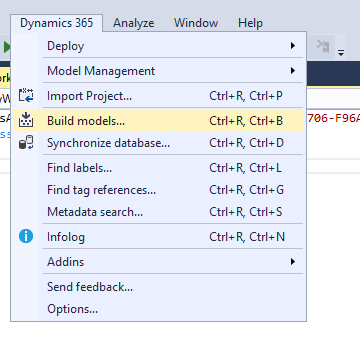

# Configure workspaces by using the SysAppWorkspace class

[!include [banner](../../../includes/banner.md)]

Workspace class, **SysAppWorkspace**, is the starting point to create, configure and publish workspaces on the server. The following categories of APIs are available for use in sysAppWorkspace

- **Workspace attributes** - This is used to create pages, tasks, entities, lookups, relationships in order to build mobile workspaces. 
    - Download the sample project for Fleet Management Mobile App. This is an .axpp file found at [Dynamics365-for-Operations-mobile-FleetManagementSamples](https://github.com/Microsoft/Dynamics365-for-Operations-mobile-FleetManagementSamples).
    - After downloading the file, open Visual Studio on your Operations development environment, select **Dynamics 365 > Import Project**, and browse for the downloaded project file. On the same dialog box, select **Overwrite** and select **Create a new solution**. After the import is complete, build the solution (or build the Fleet Management model). 
    - To review the example, start by reviewing the FMReservationManagementWorkspace class to see all the pages and actions included in the workspace. Use Solution Explorer to find page and task classes, and all the assets included in each. Use the API reference for more details on each API.
    - A mobile workspace can be created through designer pane, using X++ attribute APIs or a combination of both. See the "Use the workspace class to publish workspaces from AOT resources" section below for more details about how to import mobile app metadata from designer to AOT. The sample project Fleet Management Mobile App is a complete mobile app built using X++ attribute APIs.

- **Workspace metadata classes** - This is used to inspect and apply server-side business logic to metadata for mobile workspaces. 

For a complete list of server-side APIs, see [Server-side development (workspace X++ APIs)](../mobile-workspace-server-apis.md).

## Create a new workspace class
To use the **SysAppWorkspace** class for your workspace, you must create a new class for the workspace by extending the **SysAppWorkspace** class. You can then use the new class to modify workspace metadata. The new class also provides hooks for life cycle management of the mobile app.

Follow these steps to create a new workspace class for your workspace.

1. Create a new class for your workspace, and extend it from the **SysAppWorkspace** class.

    

2. Add the **SysAppWorkspaceAttribute** attribute to the new class, and provide the **AppID** value of your workspace. You can find the app ID for your app on the **Summary** page in the mobile app designer.

    

    

3. Optional: If your workspace is an Application Object Tree (AOT) resource, provide the AOT resource name as the second parameter for the **SysAppWorkspaceAttribute** constructor.

    

## Use the workspace class to publish workspaces from AOT resources
Workspaces can reside in the database. They can also reside in the AOT as resources. To provide visibility into workspaces that are stored in AOT resources, you must create a workspace class and point it to the name of the AOT resource that contains the workspace. Workspaces that are stored as AOT resources can't be edited or deleted by using the mobile app designer. Those workspace can only be exported.

Follow these steps to publish a workspace that resides in an AOT resource.

1. When you're developing a workspace that is stored in the database, you must export it from the mobile app designer so that it can be stored as an AOT resource. The workspace is exported as an XML file.

    

2. Delete the workspace from the mobile app designer. You will load it from an AOT resource later.

    

3. Create a new AOT resource, and select the exported workspace for the resource.

    

4. Create a new class for your workspace. This class should extend **SysAppWorkspace**. Apply the **SysAppWorkspaceAttribute** attribute to the class, and provide the app ID and the AOT resource name that contains the resource.

    

5. Build the class, and reopen the mobile app designer.

    The workspace is now published. It appears in the designer, but can't be edited or deleted. Note that the workspace is loaded from metadata.

    

## Update a workspace that has already been published
If your workspace is part of an AOT resource, you can't edit it by using the mobile app designer. In the following example, a workspace that is named **MyWorkspace** exists in the AOT, and it has a backing class that is named **WorkspaceInAOT**.

Follow these steps to edit the workspace.

1. Export the workspace by using the mobile app designer. The designer automatically creates new app IDs for workspaces that are stored in the AOT.
2. Import the newly exported workspace by using the mobile app designer.

   1. Optional: Change the name so that the newly added workspace can be distinguished from other workspaces.
   2. Copy the app ID of the newly created workspace.

      

      

3. Create a new class that extends your backing class, apply the **SysAppWorkspaceAttribute** attribute, and specify the new app ID.

    

You can now continue to work with your new workspace and the backing class. After you've finished making your changes, you can merge them with the AOT-based workspace.

## Delete a workspace that is an AOT resource
When a mobile workspace is stored as an AOT resource, you can't delete it by using the mobile app designer. Follow these steps to delete a workspace that exists as an AOT resource.

1. Delete the AOT resource that contains the workspace.

    

2. Delete the workspace class that was created for the workspace.

    

3. Do a full model build that contains the AOT resource and the class. The following illustrations shows a full build of the Application Foundation model. The Application Foundation model also contains the AOT resource and workspace class. To speed up the full build, you can clear all the selections on the **Options** tab.

    

    

4. When the build is completed, reopen the mobile app designer, and verify that the workspace is no longer there.

[!INCLUDE[footer-include](../../../../../includes/footer-banner.md)]