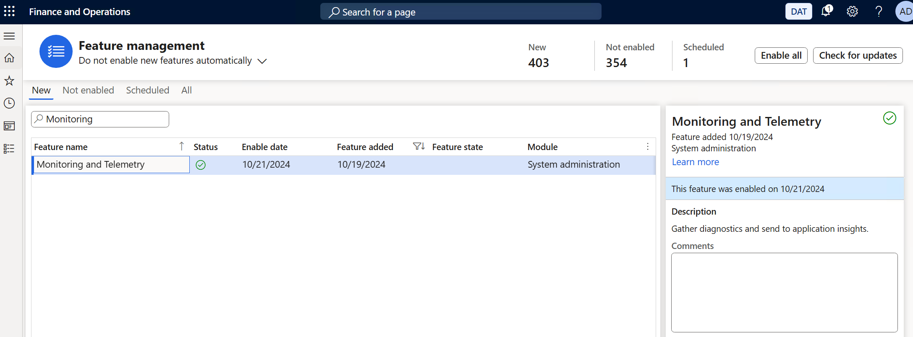
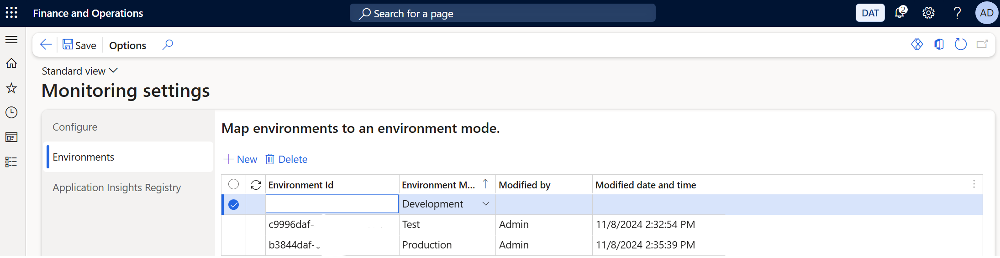
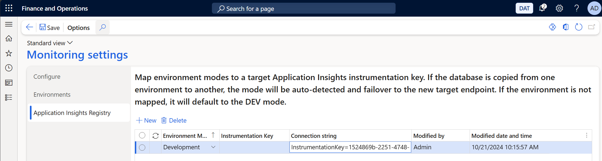
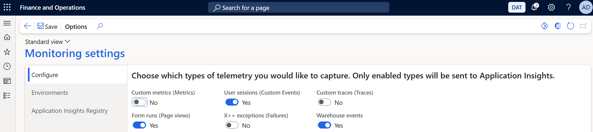

# Getting started with telemetry for Dynamics 365 Finance & Supply Chain Management

This article describes how to get started to send telemetry from Dynamics 365 Finance & Supply Chain Management environments to Azure Application Insights.

Configuring your environments to send telemetry to Application Insights requires the following steps: 

1. Set up an Application Insights resource in Azure.
1. Enable the Monitoring and Telemetry feature in Dynamics 365 Finance & Supply Chain Management.
1. Configure environments to link to the right Application Insights resources.
1. Configure the type of telemetry to be send to Application Insights.

# Set up Application Insights resource in Azure

The first thing needed to get started is to create an Application Insights resource in Azure if you do not have one. for more information, see [Workspace-based Application Insights resources](https://learn.microsoft.com/en-us/azure/azure-monitor/app/create-workspace-resource?tabs=bicep).

# Enable the Monitoring and Telemetry feature
Complete the following steps to enable the Monitoring and Telemetry feature.

1. In Dynamics 365 for Finance and Supply Chain Management, go to the **Feature Management** workspace.
2. In the **Feature list**, filter the list to find the **Monitoring and Telemetry** feature and click **Enable**.

# Configure environments and link to Application Insights
Environments are categorized into either of the following environment modes: development, test and production. Follow these steps to link environments to specific modes:

1. In Dynamics 365 for Finance and Supply Chain Management, go to **System administration** \> **Monitoring and Telemetry parameters**.
2. In the **Environments** tab, create one record for each environment want to emit telemetry for. Multiple environments can be entered here. This ensures that database refresh operations would include this configuration and be synchronized across environments.  
Provide the following configuration:

| Field name | Description |
| ---------- | ----------- |
| **Environment ID** | The unique idendifier for your environment |
| **Environment Mode** | Specifies whether this environment is a Development, Test or Production environment.  This is used to separate telemetry in different Application Insight instances intented for Development, Test or Production. |

3. On the **Application Insights Registry** tab, create a record for each of the used environment modes.

| Field name | Description |
| ---------- | ----------- |
| **Environment Mode** | Specifies whether this environment is a Development, Test or Production environment. |
| **Instrumentation Key** | The instrumentation key used for connecting to Application Insights. If a connection string is specified, the instrumentation key will be ignored. |
| **Connection String** | The connection string used to connect to Application Insights.  |

# Configure the type of telemetry to be emitted

1. In Dynamics 365 for Finance and Supply Chain Management, go to **System administration** \> **Monitoring and Telemetry parameters**.
2. On the **Configure** tab, enable each of the types of telemetry that need to be emitted.

