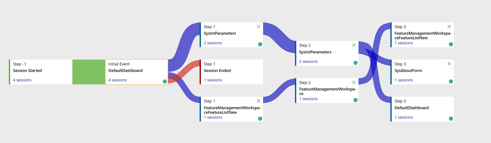

# Monitoring and telemetry overview

[!include [banner](../includes/banner.md)]

The [!INCLUDE[monitoringtelemetry](includes/finops-monitoring-feature-name.md)] feature is a direct, point-to-point integration between an instance of [!INCLUDE[d365foscm](./includes/finops-product-name-long.md)] and the target [!INCLUDE[appinsights](includes/azure-application-insights-name.md)] destination. [!INCLUDE[appinsights](includes/azure-application-insights-name.md)] is a service that is hosted in Azure, and that gathers telemetry data for analysis and presentation. 

This feature addresses the following needs:

- Gather telemetry to gain insights into how the application is used.
- Let developers and admins gather additional information in diagnosing scenarios.
- Improve efficiency in issue detection, diagnosis, and troubleshooting, and therefore reduce the overall time to resolution.
- Enable proactive alerting through standard capabilities that [!INCLUDE[appinsights](includes/azure-application-insights-name.md)] provides.

> [!NOTE]
> Microsoft doesn't collect the emitted telemetry for support or other operational reporting. Instead, the data is customer-owned and customer-driven.

## Gather monitoring requirements

It's easy and straightforward to configure and enable telemetry signals so that you can get the signals that are provided out of the box. However, before you can build the right experience for your team, it's important that you define the correct set of requirements that the monitoring solution must meet. Learn more in [Gather monitoring requirements](monitoring-gathering-requirements.md).

## Get started

Learn how to start to configure and use [!INCLUDE[monitoringtelemetry](includes/finops-monitoring-feature-name.md)] in [Get started with telemetry for finance and operations apps](monitoring-getting-started.md).

## Available telemetry

[!INCLUDE[d365foscm](includes/finops-product-name-short.md)] provide a set of telemetry signals out of the box. You can get a list of available signals in [Available telemetry](monitoring-available-telemetry.md).

## Extend telemetry

On top of the out-of-box telemetry signals, you can add custom telemetry signals that emit information about your specific processes. Learn more in [Add custom telemetry signals](monitoring-developer-add-custom-signals.md).

## Understand cost and pricing options

There is a cost to store telemetry in [!INCLUDE[appinsights](includes/azure-application-insights-name.md)]. Learn about associated costs and pricing options in [Understand and control costs](monitoring-understanding-and-controlling-cost.md).

[!INCLUDE[footer-include](../../../includes/footer-banner.md)]
