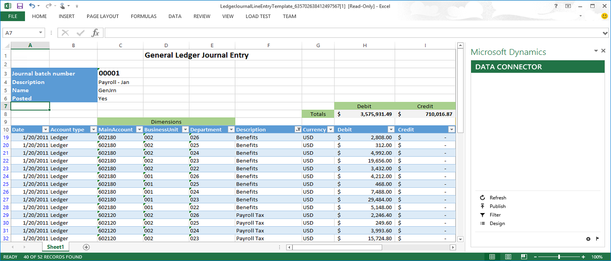
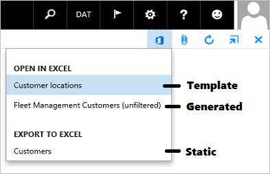
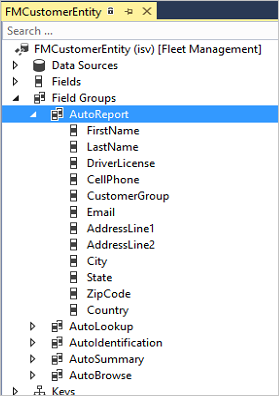
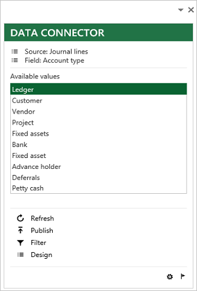
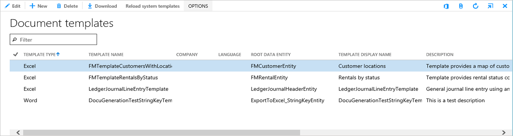
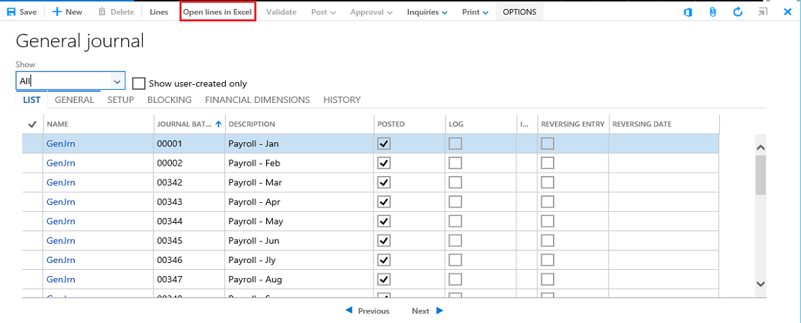
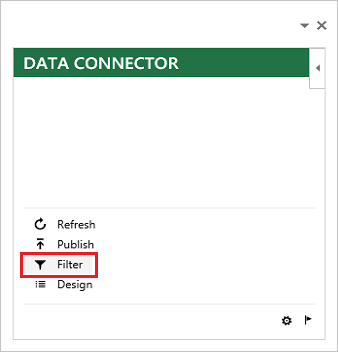
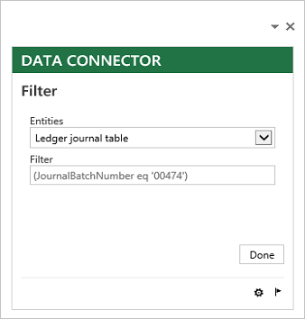
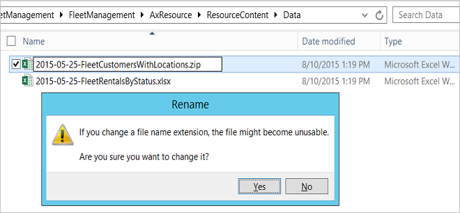
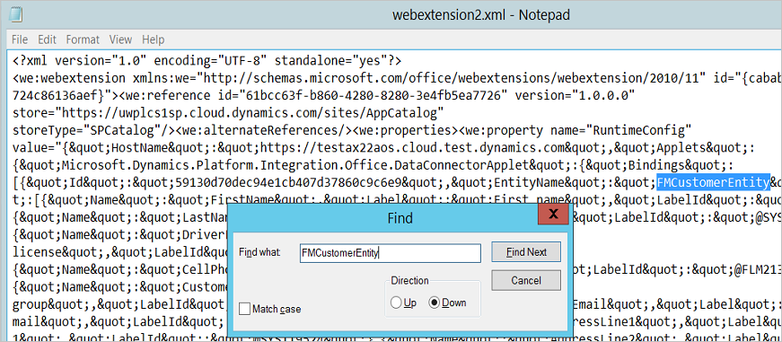

---
# required metadata

title: Open in Excel experiences FAQ
description: Learn about creating Open in Office experiences for Excel and Word.
author: jasongre
ms.date: 03/18/2022
ms.topic: article
ms.prod: 
ms.technology: 

# optional metadata

# ms.search.form: 
# ROBOTS: 
audience: Developer
# ms.devlang: 
ms.reviewer: twheeloc
# ms.tgt_pltfrm: 
ms.assetid: 05d8f7af-df6a-452f-a532-0f059eba4377
ms.search.region: Global
# ms.search.industry: 
ms.author: jasongre
ms.search.validFrom: 2016-02-28
ms.dyn365.ops.version: AX 7.0.0

---

# Open in Excel experiences FAQ

[!include [applies to](../includes/applies-to-commerce-finance-hr-scm.md)]

[!include [banner](../includes/banner.md)]


[!INCLUDE [PEAP](../../../includes/peap-3.md)]

Learn about creating Open in Office experiences for Excel and Word.

## What are Open in Excel experiences?

Open in Excel experiences are:

-   Based on entities and the OData services that they create.
-   Dynamically-generated or based on a pre-defined template.
-   Editable and refreshable via the Excel Add-in.

The following image shows the **Excel Add-in** being used for Journal entry.

[](./media/off101a.png)

## Where are the Open in Excel experiences?
Open in Excel experiences are usually found under in the Open in Excel section of the Open in Microsoft Office menu, but an explicit button can be added for these experiences.

## What's the difference between Export to Excel and Open in Excel?
The Export to Excel options and experiences are both found in the Open in Microsoft Office menu:

-   The Export to Excel options are static exports of grid data. Each one corresponds to a visible grid. All the grid data for the current filter is placed into a workbook.
-   The Open in Excel experiences utilize the Excel Add-in to facilitate refresh and publish.

The following image shows the **Open in Microsoft Office** menu on the **Fleet Customers** form with a template **Open in Excel** option, a generated **Open in Excel** option, and a static **Export to Excel** option.

[](./media/off101b.png)

## When will an entity show as an Open in Excel option?
When an entity has the same root datasource (table) as a form, it will be added as an option in the Open in Excel section of the Open in Microsoft Office menu. This is referred to as a “generated” option.

> [!NOTE]
> The user must have security access to the underyling entity for that option to appear in the Open in Excel menu. See [Security and data entities](../data-entities/security-data-entities.md) for more details.

## What fields will be shown in the workbook?
The default fields that will be added into the workbook are the key and mandatory fields of the entity. If a different set of fields should be provided by default, then those fields can be added into the **AutoReport field group** on the entity. The following image shows the Visual Studio view of the AutoReport field group for the FMCustomerEntity.

[](./media/off101c.png)

## What fields will be shown when an entity is the target of a lookup?
When a relationship is defined between two entities, if the identifier for one entity is shown on the other entity, then the fields that will be shown in that lookup are either the key fields, or the fields in the **AutoLookup field group** if it is not empty. Relationship lookups are not currently supported, but they will eventually be displayed in the app in a similar way to the enumeration lookups. The Excel Add-in with an enumeration lookup is shown below.

[](./media/off101d.png)

## What should be done to make an entity ready for use in Excel?
Define the AutoReport and AutoLookup field groups and test them using the Excel App design experience.

## Why does an automatically added entity option have “(unfiltered)” after the entity name?
Currently, a filter is not added to these options, hence the term “(unfiltered)”. In the future, an attempt will be made to apply the filter from the form to these options. For example, if a list of Customers was filtered to just Customers in the state of California, then, in the future, the entity will be scanned for the state field and if it is found then a filter would be added automatically.

## How can an entity be added as an Open in Excel option on a form that doesn’t share the same root datasource?
A generated Open in Excel option can be added on any form by implementing the OfficeIGeneratedWorkbookCustomExporter interface. When adding a generated option programmatically, the set of fields can be explicitly specified. For more information, see [Modifying the Open in Office menu through interfaces](./customize-open-office-menu.md#modifying-the-open-in-office-menu-through-interfaces).

## What are the region-specific considerations for defining entities?
The Open in Excel generated experiences can be made region-specific by adding region-specific fields into the AutoLookup group. These region-specific fields will then be included in the generated workbook.

## How can I create a custom lookup for an entity field in Excel?
A custom lookup can be shown for an Entity field.

-   Name - The method needs to have a name that is “lookup\_&lt;fieldname&gt;” e.g. a field “MyField” could have a lookup method “lookup\_MyField”.
-   Attributes – Attributes need to be added to the method:
    -   SysODataActionAttribute(str &lt;name&gt;, Boolean &lt;isInstanceMethod&gt;)
    -   SysODataCollectionAttribute(str &lt;name&gt;, Types &lt;type&gt;, “Value”)
-   Return – The method should return a list of strings.

**Example** 

```xpp
public class ExportToExcel_SimpleEntity extends common
{
    [SysODataActionAttribute("Lookup_StringLookupField", true),
    SysODataCollectionAttribute("return", Types::String, "Value")]
    public List lookup_StringLookupField()
    {
        List lookupList = new List(Types::String);
        const int items = 5;

        for (int item = 0; item < items; item++)
        {
            lookupList.addEnd(strfmt('%1 - %2 (%3)', this.StringField, this.IntField, item));
        }

        return lookupList;
    }
}
```

## How does the app get injected into a workbook to start building a template?

The Excel Add-in is injected into a workbook when a generated Open in Excel experience is triggered or when a workbook is created using the **Common** &gt; **Common** &gt; **Office integration** &gt; **Excel workbook designer** form.

-   The **Create workbook** button will add the selected entity and fields, a pointer to the server, and the app into a workbook.
-   The **Create blank workbook** button will simply add a pointer to the server and the app into a workbook.
-   The **View related** form will navigate to the form relating to the currently selected entity to more easily review the effect of data changes made in Excel.
-   The **Get entity record count** button will show the record count for the currently selected entity. The Excel Add-in will handle large sets of data within the memory limits of a user's machine. By default, the Excel Add-in has a data governor that restricts the data size to one million cells but, depending on the performance abilities of the user's machine, this can usually be extended to around 2.5 million cells.

The following image shows the **Excel workbook designer** form.

[](./media/off101e.png) 

After obtaining a workbook containing the Excel Add-in, additional datasources can be added using the **Design** button. Currently, datasources cannot be removed. 

## When will a template show as an Open in Excel option?
When a template listed in the **Common** &gt; **Common** &gt; **Office integration** &gt; **Document templates** form (DocuTemplate) has ShowInOpenInOfficeMenu set to Yes and has the same root datasource (table) as the current form, it will be added as an option in the Open in Excel section of the Open in Microsoft Office menu. The following image shows the **Document templates** form.

[](./media/off101g.png)

## Will a filter be added to the template?
In the **Document Templates** form, the standard filter for “current record” can be turned on and off. If the filter is on, when the template is invoked as an Open in Excel option, then a filter for the current record will be added to the workbook. The filter will be the key fields and their values.

## How can templates be defined in metadata and code and loaded automatically?
When adding a template into the **Document Templates** form, it is added for that instance and is referred to as a “user-defined” template. Templates can also be defined in metadata and code and loaded automatically, thus making them “system-defined” templates. To create a system-defined template using metadata and code, you need to do the following:

-   Define the template.
-   Create a new resource in a project.
-   Define a new class that extends the DocuTemplateRegistrationBase class and add an implementation of the registerTemplates method.

The LedgerJournalLineEntryTemplateRegistration and FMTemplateRegistrations classes are good examples of template registrations defined in code. The LedgerJournalLineEntryTemplate and FMTemplateCustomersWithLocations resources are the corresponding templates stored in metadata as resources. When a template has a registration class, it will be loaded when the **Reload system templates** button is clicked in the **Document Templates** form.

## How do templates get loaded into a fresh deployment?
To load system defined templates, click the **Reload system templates** button in the **Common** &gt; **Common** &gt; **Office integration** &gt; **Document templates** form, as shown below.

[](./media/off101h.png) 

In the future, we will do the equivalent of clicking that button during deployment.

## How do I decide if I should create a template?
A template is an artifact that needs to be maintained and versioned. If you can avoid defining a template without sacrificing much from the user experience, then you probably should use a template. Create a template if:

-   You need additional content or formatting in the template.
-   You want to combine multiple entities/datasources in the same workbook.

Don’t create a template if:

-   You can just specify a set of fields to show in a table binding.

## What are the region-specific considerations for templates?
When creating a template for an entity that has region-specific fields, you should leave those region-specific fields out of the template, otherwise all users will see the region-specific fields. Templates should cater to the majority of users by default and region-specific users can add those fields using the easy-to-use design experience of the Excel Add-in.  The region-specific fields and columns can be added by users as needed. That template can be either saved to local computer for reuse by a single user or uploaded via the Document Templates form for reuse by any user of that instance. A couple of other considerations:

-   If a region has a region-specific entity, then a region-specific template could be created.
-   If a region is important enough, then you could define a region-specific template as well as a region-generic template.

## How do I add an explicit button for a template Open in Excel option?

An explicit button can be added for Open in Excel experiences. The label shown on the button should usually be “Open target in Excel” where target is the name of the target data like “lines” or “catalog”. The code behind such a button will:

-   Obtain the template to be used.
-   Add a filter.
-   Pass the template to the user.

An example of this code can be found on the **LedgerJournalTable** form (**General ledger** &gt; **Journals** &gt; **General journal**) in the **Clicked** method on the **OpenLinesInExcel** button.

```xpp
[Control("Button")]
class OpenLinesInExcel
{

    /// <summary>
    /// Opens the current journal in Excel for line entry and editing
    /// </summary>
    public void clicked()
    {
        super();

        const str templateName = resourceStr(LedgerJournalLineEntryTemplate);
                DocuTemplate template = DocuTemplate::findTemplate(OfficeAppApplicationType::Excel, templateName);

        // Ensure the template was present
        if (template && template.TemplateID == templateName)
        {
            Map filtersToApply = new Map(Types::String, Types::String);

            // Create lines filter
            ExportToExcelFilterBuilder filterBuilder = new ExportToExcelFilterBuilder(tablestr(LedgerJournalLineEntity));
            str filterString = filterBuilder.areEqual(fieldstr(LedgerJournalLineEntity, JournalBatchNumber), LedgerJournalTable.JournalNum);
            filtersToApply.insert(tablestr(LedgerJournalLineEntity), filterString);

            // Create header filter
            filterBuilder = new ExportToExcelFilterBuilder(tablestr(LedgerJournalHeaderEntity));
            filterString = filterBuilder.areEqual(fieldstr(LedgerJournalHeaderEntity, JournalBatchNumber), LedgerJournalTable.JournalNum);
            filtersToApply.insert(tablestr(LedgerJournalHeaderEntity), filterString);

            // Generate the workbook using the template and filters
            DocuTemplateRender renderer = new DocuTemplateRender();
            str documentUrl = renderer.renderTemplateToStorage(template, filtersToApply);

            // Pass the workbook to the user
            if (documentUrl)
            {
                Browser b = new Browser();
                b.navigate(documentUrl, false, false);
            }
            else
            {
                error(strFmt("@ApplicationFoundation:DocuTemplateGenerationFailed", templateName));
            }
        }
        else
        {
            warning(strFmt("@ApplicationFoundation:DocuTemplateNotFound", templateName));
        }
    }

}
```

The following image shows the **General ledger** &gt; **Journals** &gt; **General journal** form with the **Open lines in Excel** button highlighted. 

[](./media/off101i.png)

To programmatically add generated and template Open in Excel options, Open in Excel options can be added by implementing the ExportToExcelIGeneratedCustomExport and ExportToExcelITemplateCustomExport interfaces. This allows the addition of options to forms where the entity or template doesn’t have the same table as the root datasource. An example of when you would use this capability is on forms without a datasource, potentially containing only a collection of form parts. The following example adds generated and template Open in Excel options programmatically to the **FMRental** form.

```xpp
[Form]
public class FMRental extends FormRun implements ExportToExcelIGeneratedCustomExport, ExportToExcelITemplateCustomExport
{    
...

    public List getExportOptions()
    {
        List exportOptions = new List(Types::Class);

        ExportToExcelExportOption exportOption = ExportToExcelExportOption::construct(ExportToExcelExportType::CustomGenerated, int2str(1));
        exportOption.setDisplayNameWithDataEntity(tablestr(FMRentalEntity));
        exportOptions.addEnd(exportOption);

        ExportToExcelExportOption exportOption2 = ExportToExcelExportOption::construct(ExportToExcelExportType::CustomTemplate, int2str(2));
        exportOption2.displayName("Analyze rentals");
        exportOptions.addEnd(exportOption2);

        return exportOptions;
    }

    public ExportToExcelDataEntityContext getDataEntityContext(ExportToExcelExportOption _exportOption)
    {
        ExportToExcelDataEntityContext context = null;

        if (_exportOption.id() == int2str(1))
        {
            context = ExportToExcelDataEntityContext::construct(tablestr(FMRentalEntity), tablefieldgroupstr(FMRentalEntity, AutoReport));
        }

        return context;
    }

    public System.IO.Stream getTemplate(ExportToExcelExportOption _exportOption)
    {
        System.IO.Stream stream = null;

        if (_exportOption.id() == int2str(2))
        {
            stream = Microsoft.Dynamics.Ax.Xpp.MetadataSupport::GetResourceContentStream(resourcestr(FMRentalEditableExportTemplate));
        }

        return stream;
    }

    public void updateTemplateSettings(ExportToExcelExportOption _exportOption, Microsoft.Dynamics.Platform.Integration.Office.ExportToExcelHelper.SettingsEditor _settingsEditor)
    {
    }
...
```

## How do I add a filter for a programmatically-added template Open in Excel option?

A template Open in Excel option can be programmatically added by implementing the ExportToExcelITemplateCustomExport interface and providing a template in the getTemplate method. A filter for that option can be programmatically added by using the ExportToExcelFilterBuilder API in the updateTemplateSettings method.

```xpp
public void updateTemplateSettings(ExportToExcelExportOption _exportOption, Microsoft.Dynamics.Platform.Integration.Office.ExportToExcelHelper.SettingsEditor _settingsEditor)

{

_settingsEditor.SetFilterExpression(tableStr(RetailTmpBulkProductAttributeValueEntity), element.getExportToExcelFilterExpression());

DictDataEntity dictDataEntity = new DictDataEntity(tableNum(RetailTmpBulkProductAttributeValueEntity));

_settingsEditor.SetFilterExpressionByPublicName(dictDataEntity.publicEntityName(), element.getExportToExcelFilterExpression());

}
```

After a filter has been added programmatically, the resulting filter can be viewed in the Excel Add-in using the **Filter** button. The following image shows the Excel Add-in with the **Filter** button highlighted.

[](./media/off101j.png) 

The following image shows the Excel Add-in with the **Filter** dialog box opened.

[](./media/off101k.png)

## How do I enable relationship lookups in Excel?
To enable relationship lookups in the Excel Data Connector, you must ensure that the following metadata is set.

- The Role and Related Data Entity Role defined on the relationship need to be unique among all relationships on both the source and target entity. Also, the relation role properties must be unique across all entities. This is particularly important for relationships involving entities with many relationships, such as DimensionCombinationEntity. If you're not seeing an expected lookup, try changing the role names to the following format:

   - **Role**: \[this entity's public name\] + \[target entity's public name\] + \[target entity field\] + "Source"
   - **Related Data Entity Role**: \[this entity's public name\] + \[target entity's public name\] + \[target entity field\] + "Target"

  - The Cardinality and Related Data Entity Cardinality need to be set appropriately.
  -  At least one constraint must be added to the relationship. With the exception of dimension relationships, which are a special case, the properties constrained must both be public.

## How can I enable users to create new header records as well as lines in a workbook?
To enable creation of header records and related lines, the header data source must be added as a set of "fields" and the lines data source must be added as a related table. This pattern can work well for document data entry scenarios such as Journal entry.

To learn more about header records and related lines, watch the short [Create an Excel template for header and line patterns in Dynamics 365 Finance](https://youtu.be/RTicLb-6dbI) video.

To design a workbook with header fields and a lines table that enables header creation:
1. In the Excel Add-in, click **Design** to open the Designer. Select **Add fields** to add a header data source.
2. Select the header fields that you want to use. Be sure to include all the key fields or the **New** button won't be enabled.
3. For all of the string header value fields, manually apply "Text" format for that cell using **Excel ribbon > Home tab > Number group > set "Number"** in the format drop-down menu. If the Text format isn't manually set on a string field and there's a string value with leading zeros like "00045", then Excel will automatically change it to "45" and an error will be shown like: *"Unable to change the value of PurchaseOrderHeader's PurchaseOrderNumber field as it is a key field"*. Currently, the API doesn't allow for automatically applying the text formatting on individual cells (versus table columns).
4. In the Designer, on the header data source, click the **Add related table** button represented by a double plus icon.
5. Select the line fields that you want to use.

Here's an example of a header data source with a related table data source.
- PurchaseOrderHeader (Fields)
   - dataAreaId
   - PurchaseOrderNumber
   - PurchaseOrderName
   - OrderVendorAccountNumber
- PurchaseOrderLine (Table - related)
   - LineNumber
   - ItemNumber
   - LineDescription
   - OrderedPurchaseQuantity
   - LineAmount

To use a header and lines workbook to create a new header and lines, follow these steps:
1. In the workbook, move the focus to a cell with a header value.
2. In the Excel Add-in, click **New**.
3. Enter header values and lines as needed.
4. Select **Publish**.

## How can fields be added, removed, or moved within an existing template workbook?
Fields can be added into an existing template workbook by editing the workbook stored in **Document Templates**.

1. Get the original template workbook.
   1. Open the **Document Templates** form.
   2. Find the existing template workbook.
   3. Download the workbook.
   4. Open the workbook and enable editing so that the Excel Add-in runs.
2. Make changes to the template. 
   1. In the Excel Add-in, select **Design**.
   2. Click the **Edit** button (pencil icon) next to the datasource that you want to add a field into.
   3. Add fields by moving them from the **Available fields** list into the **Selected fields** list. Double-clicking a field will move it. Remove fields by moving them from the **Selected fields** list into the **Available fields** list.Move fields using the **Up** and **Down** buttons.
   6. After changes are complete, select **Update**, select **Yes** to confirm, and then select **Done** to exit the Designer (if appropriate, select **Refresh** to verify that the data is correctly populated).
   7. Clear the data from the template before upload by clicking **Options** (gear icon), expand the **Data Connector** section, then click the **Clear binding data** button.
   8. Use **Save As** to store the template somewhere temporarily.
3. Upload the changed template.
   1. Return to the **Document Templates** form and upload the changed template.
   2.  Click **New** and browse to find the changed template.
   3. Select the saved template file and click **Open**.
   4. In the **Upload template** dialog box, remove the underscore and trailing random number from the name For example, "CustInvoiceJournalTemplate_636564840743000567" becomes "CustInvoiceJournalTemplate".
   5. A confirmation dialog box should show that "A template with this name already exists...", click **Yes** to confirm replacement of the previous template. Note that if this confirmation is not shown, then the template name is different and it is being uploaded as a new template.
4. Open the form that the template is used on and use the changed template.

## Troubleshooting

If you are not seeing an expected lookup, validate relationship metadata by checking the metadata feed available at \[YourSiteURL\]/data/$metadata. Search the $metadat feed for the public name of your entity to find its EntityType element, then make sure there is a child NavigationProperty element with a name equal to the Role value of the relationship. If the navigation property exists, it will be used by the Excel Data Connector to show a relationship lookup. Lookups are not shown under the following conditions:

  - All of the entity's key fields are included as constraints in the relationship.
  - The selected field is a key and the selected record is not new.
  - The authenticated user does not have permission to access the entity targeted by the lookup.

## How do dimensions work?
The easiest way to set up dimension metadata on data entities is to use the data entity creation wizard, which will automatically create the private relationships and public display value fields exactly as the dimensions framework needs them. If you want to customize your dimensions setup, see [Add dimensions to Excel templates](../financial/dimensions-overview.md). Lookups, are only generated automatically for non-ledger dimensions. Custom dimensions are not supported currently. If you want to enable lookups for ledger dimensions (MainAccount, Department, CostCenter, etc.), see [Add dimensions to Excel templates](../financial/dimensions-overview.md) for guidance on creating relationships on DimensionCombationEntity and DimensionSetEntity fields. When those relationships are present, relationship lookups will be displayed in the Excel Data Connector. The Excel Data Connector supports two types of dimension data entry: editing the display value directly or editing each attribute of the display value in a separate column. If both the display value column and the individual attribute columns are bound, they can both be edited and published separately. If both the display value and an individual attribute are edited in the same row, the individual attribute change overrides the display value change.

## How do I create formula table columns?
If a formula is needed in a table, then add a formula column. When in the field selection page for a table binding, click the **Formula** button above the Selected fields list to add a new formula column. The label and value for the formula are entered in the fields immediately below the Selected fields list. After adding a new formula column, leave the value empty and click **Update**. After the field has been added to the table, use standard Excel capabilities to create a formula, then copy the formula and paste it into the formula column value field. When defining a formula, make sure there is more than one row in the table, otherwise the formula that Excel provides may be for ALL rows instead of THAT row. To specify just the current row, the at sign (@) is needed. For example, sum of four columns for all rows "=SUM(Table1\[\[ColumnA\]:\[ColumnD\]\])" versus sum of four columns for the current row "=SUM(Table1\[@\[ColumnA\]:\[ColumnD\]\])".

## Known issues
### Error triggered when selecting custom Excel templates

This issue occurs when the user selects an Excel template from an **Open in Excel** button and receives the following error: `Record for Id {guid} not found`

The error occurs when a custom Excel template cannot be found. One scenario that could cause this error is moving the finance and operations database between environments, but not copying the Excel templates.  

To resolve this issue, delete the database entry for the template from the **Document templates** page (**Common > Common > Office integration > Document templates**) and then reload the template. 

### Refresh doesn’t automatically occur in old templates

The ability to control “refresh on open” was added as a setting. To add this to the default behavior, existing templates and workbooks need to have the **Refresh on open** check box selected in **Options** &gt; **Data Connector** &gt; **Refresh Options**.

### Error finding entity

The reference to entities changed from using the Private Entity Name (DataEntity.Name) to Public Entity Name (DataEntity.PublicEntityName). If the public and private names for an entity were different and that entity was used in an Excel template or workbook, then this will cause the following error to be displayed in the Excel App: “Error Finding Entity. Details: Entity "&lt;DataEntity.Name&gt;" not found”.

To resolve this, change the binding information in the affected template so that it points to DataEntity.PublicEntityName instead of DataEntity.Name.

1.  For the DataEntity.Name that needs to be replaced, determine the DataEntity.PublicEntityName, for example replace FMCustomerEntity with FleetCustomer.
2.  Find the affected template.
3.  Change the file extension on the template from .xlsx to .zip.

    [](./media/off101m.png)
    
4.  The file to be changed will be one of the webextension\*.xml files in the xlwebextensions directory, such as 2015-05-25-FleetCustomersWithLocations.zipxlwebextensionswebextension2.xml.
5.  Open the file to ensure that you have the correct location.
6.  Find the DataEntity.Name,  such as FMCustomerEntity.

    [](./media/off101n.png)
    
7.  Extract the zip file.
8.  Open the webextension xml file.
9.  Replace the DataEntity.Name with the corresponding DataEntity.PublicEntityName.
10. Save the webextension .xml file changes.
11. Rename the old zip file, for example, add “.old” to the name.
12. Create a new zip file of all the previously extracted content. This usually involves highlighting the content inside the archive/zip folder and creating a zipped folder using that content.
13. Verify that the zip file has the “\_rels”, “docProps”, and “xl” folders in the root of the zip file.
14. Rename the zip file as needed, for example rename the file 2015-05-25-FleetCustomersWithLocations.zip.
15. Change the zip file extension to .xlsx.
16. Re-publish the workbook .xlsx file, if needed.


[!INCLUDE[footer-include](../../../includes/footer-banner.md)]

