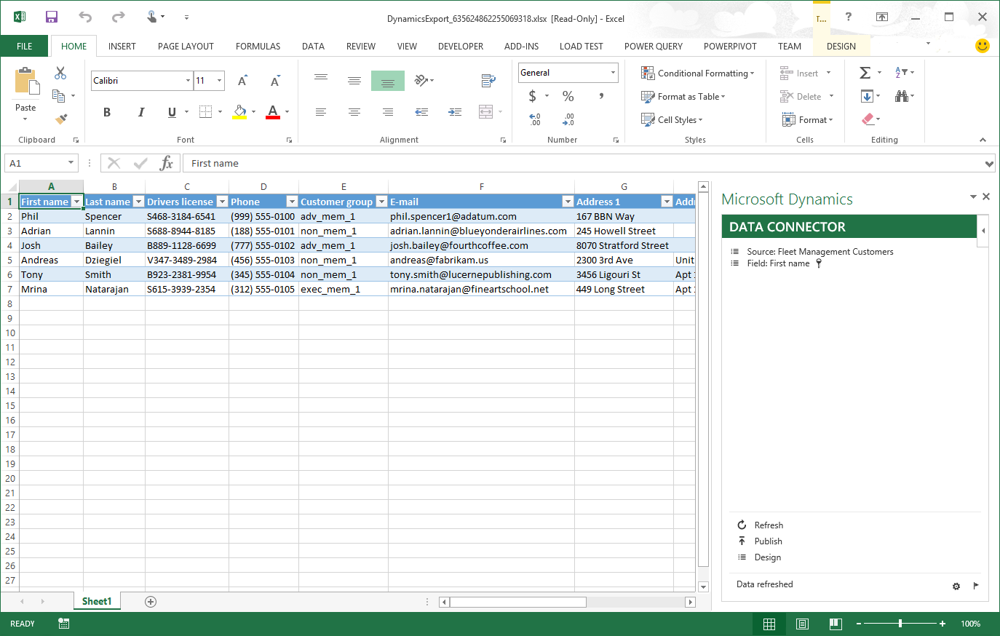
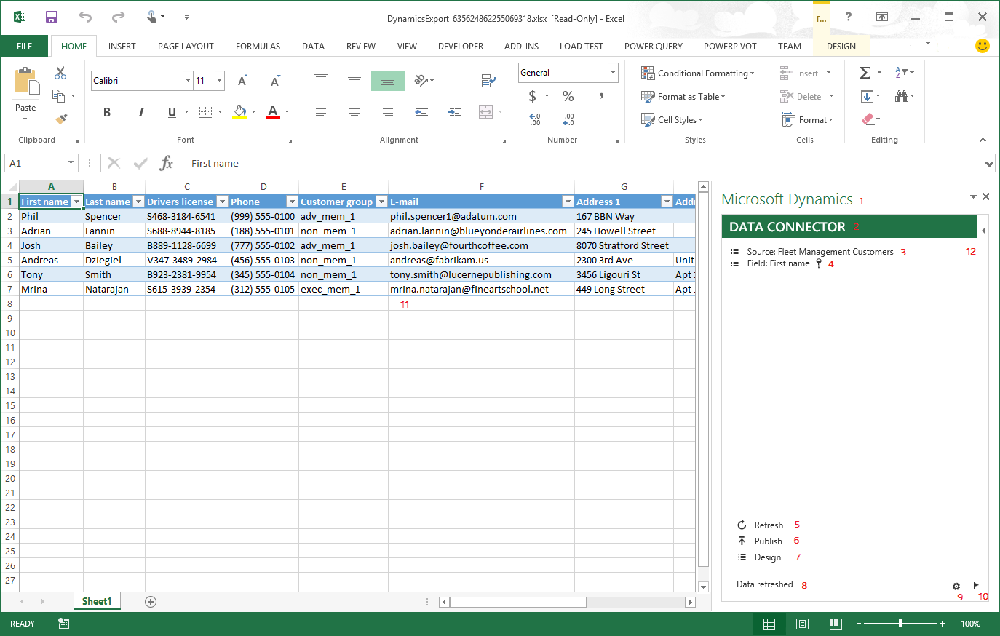
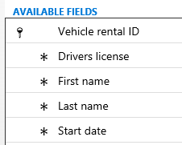

---
# required metadata

title: Office integration overview
description: This article reviews Microsoft Office integration concepts and features.
author: jasongre
ms.date: 07/25/2019
ms.topic: overview
ms.prod: 
ms.technology: 

# optional metadata

# ms.search.form: 
# ROBOTS: 
audience: Developer
# ms.devlang: 
ms.reviewer: sericks
# ms.tgt_pltfrm: 
ms.collection: get-started
ms.assetid: 36ba2da0-ee9b-4f84-b705-751303ccec33
ms.search.region: Global
# ms.search.industry: 
ms.author: jasongre
ms.search.validFrom: 2016-02-28
ms.dyn365.ops.version: AX 7.0.0

---

# Office integration overview

[!include [applies to](../includes/applies-to-commerce-finance-scm.md)]

[!include [banner](../includes/banner.md)]

This article reviews Microsoft Office integration concepts and features. The integration depends on several technologies:

-   Working in Microsoft Azure
-   Working with Azure Active Directory (Azure AD)
-   Running a web client in multiple browsers

The Microsoft Office integration capabilities provide users with a productive environment that helps them get the job done by using Office products.

## Excel Data Connector add-in
Microsoft Excel can change and quickly analyze data. The Excel Data Connector app interacts with Excel workbooks and OData services that are created for publicly exposed data entities. The Excel Data Connector add-in enables Excel to become a seamless part of the user experience. The Excel Data Connector add-in is built by using the Office Web add-ins framework. The add-in runs in a task pane. Office Web Add-ins are web applications that run inside an embedded Internet Explorer browser window. 

### Dynamics AX 2012 architecture vs. Finance and operations architecture

There are several differences between versions. For both, we built lightweight add-ins that run in Excel and use services to connect to the application.

#### Dynamics AX 2012

Excel &gt; VSTO (.NET) Add-in &gt; Windows Communication foundation (WCF) &gt; Authentication through Active Directory (AD) &gt; AIF SOAP services on the AOS &gt; AX Services and Tables &gt; AX query engine &gt; Database

#### Finance and operations

Excel &gt; Office Web Add-in (JS + HTML) &gt; JavaScript OData API (Olingo) &gt; Authentication through Azure Active Directory (AAD) &gt; AX OData services on the AOS &gt; AX Entities &gt; AX LINQ provider &gt; AX Database

### Office Add-in explained

The Excel Data Connector app is located in a task pane on the right side of a workbook.  The following table describes the parts of the add-in. The numbers correspond to the numbers in the preceding screen shot.

| Number | Name                             | Description                                                                                                                                                                                                                                                                          |
|--------|----------------------------------|--------------------------------------------------------------------------------------------------------------------------------------------------------------------------------------------------------------------------------------------------------------------------------------|
| 1      | Add-in primary title             | The title of the add-in that is provided to the Office Web Add-ins framework.                                                                                                                                                                                                        |
| 2      | Add-in secondary title           | The title of the add-in that is provided by the add-in.                                                                                                                                                                                                                              |
| 3      | Source name                      | The label of the entity that provides data for the selected data table. You can hover over the label to see the corresponding name.                                                                                                                                                  |
| 4      | Field name                       | The label of the field that provides data for the selected data table column. You can hover over the label to see the corresponding name and type.                                                                                                                                   |
| 5      | Refresh button                   | Refresh the data in the workbook.                                                                                                                                                                                                                                                    |
| 6      | Publish button                   | Publish the data changes in the workbook.                                                                                                                                                                                                                                            |
| 7      | Design button                    | Open the design-time experience.                                                                                                                                                                                                                                                     |
| 8      | Status bar                       | The status bar provides brief temporary information alerts. Information that is appears in the status bar also appears in the **Messages** dialog box.                                                                                                                               |
| 9      | Options button                   | Open the **Options** dialog box.                                                                                                                                                                                                                                                     |
| 10     | Messages button                  | Open the **Messages** dialog box, which displays the information messages, warnings, and errors that the program provides to the user. A number sometimes appears next to the **Messages** button to provide a count of the warnings or errors that the user might be interested in. |
| 11     | Excel data table containing data | The filter and sort controls in the columns headers can be used on this data. The filters must be removed before data changes are published.                                                                                                                                         |
| 12     | Office Web Add-ins menu          | The Office Web Add-ins menu button provides several standard links. The most important of the links is used to reload the add-in. When the add-in is reloaded, it updates all the data for the workbook that is contained in tables that are associated with the add-in.             |

### Authentication

OData sits on the same authentication stack as the server. The add-in uses OAuth to facilitate authentication.

### Lookups and drop-down lists

When you click in a table cell, any lookup, enumeration drop-down list, or date picker that is associated with that cell will be shown inside the add-in, underneath the source and field information. Any value that you select inside the add-in is put into the currently selected table cell.

### Adding and deleting records

To add a record, either start typing in a row directly below a table, or use the Tab key to tab away from the last cell of the last row in the table. To delete a record, select the row by clicking the row label (1, 2, 3, and so on), and delete all the cells in that row. To publish the changes, click **Publish**. The **Messages** dialog box shows how many records were added, edited, and deleted.

## Workbook Designer
You can use the **Workbook Designer** page to design an editable custom export workbook that contains an entity and a set of fields. To open the **Workbook Designer** (**ExportToExcelWorkbookDesigner**) page, click **Common &gt; Common &gt; Office Integration &gt; Excel workbook designer**. Before you can publish data edits, all the key fields of the entity must be in the Excel table. Key fields have a key symbol next to them. To successfully create or update a record, it must have all the mandatory fields in the Excel table. Mandatory fields have an asterisk (\*) next to them. 

 

To retrieve the resulting workbook, click **Create workbook** in the app bar. 

Click **View related form** to see the data that the entity exposes. This button is only enabled for entities that have a **FormRef** property value.

## Document management
Document management supports saving record attachments in Azure Blob storage and SharePoint Online. Database storage is deprecated. Azure Blob storage is equivalent to storage in the database since documents can only be accessed through the application and it provides the added benefit of providing storage that doesn't negatively affect the performance of the database. Azure blob storage is the default and works immediately. SharePoint storage will work immediately if you have an O365 license since we auto-discover the SharePoint tenant e.g. a user on the TenantA.onmicrosoft.com O365/AAD tenant gets TenantA.sharepoint.com as the SharePoint site. If document management has been turned off by the user, turn it on by clicking **Options &gt; General &gt; Miscellaneous** and setting **Document handling active** to **Yes**. 

 

On any page that has data, an **Attach** button will be available in the upper-right corner. 

 

The **Attachments** page provides a view of the attachments (documents) that are associated with the record that was selected on the previous page. You can add new attachments to the record by clicking the **New** button (**+**) in the app bar. For the **File** and **Image** document types, you will be prompted to provide the associated file.

### Document preview

A preview for supported file types is provided on the **Preview** FastTab. Basic document types, such as PNG images and text files, are supported by default. Office document types, such as Microsoft Word, Excel, and PowerPoint files, must use a production Office Web Apps Server, which might not be available in a OneBox configuration.

## Frequently asked questions

### Office Licensing

#### What Microsoft 365 licenses are available?

There are lots of [Microsoft 365 license options](https://products.office.com/business/compare-office-365-for-business-plans). You should select the license that makes sense for your organization.

#### After purchasing a Microsoft 365 license, what needs to be done to set up SharePoint storage for attachments?

Open the Document Parameters form and ensure that the SharePoint server has been automatically discovered and set. Now open or create a Document Type, set the Document Type's location to "SharePoint" and select the folder that the files should be stored in.

## Additional resources

[Office integration tutorial](office-integration-tutorial.md)

[Troubleshoot the Office integration](office-integration-troubleshooting.md)

[Application stack and server architecture](../dev-tools/application-stack-server-architecture.md)

[!INCLUDE[footer-include](../../../includes/footer-banner.md)]
