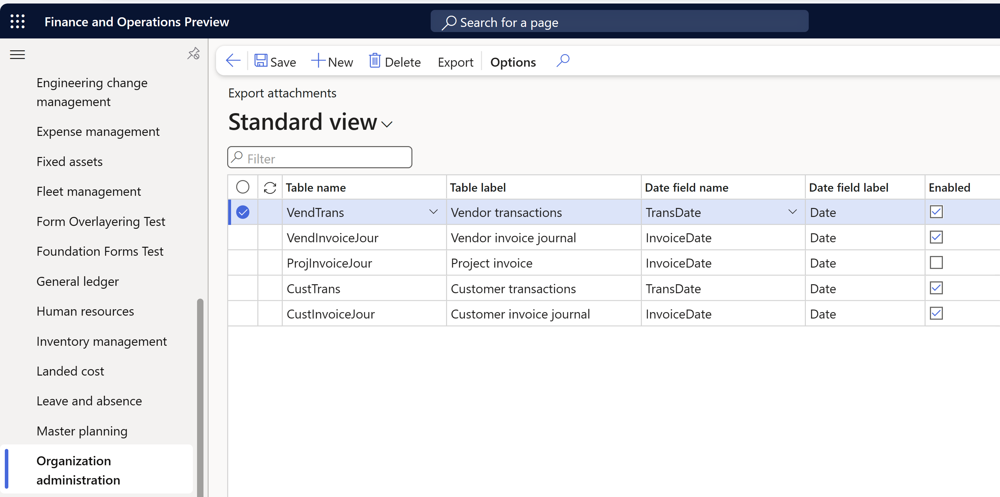
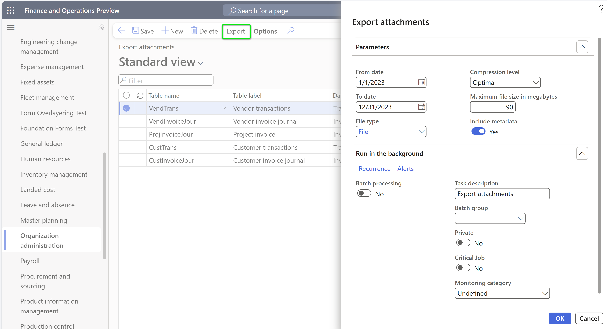

# Configure document management

[!include [banner](../../../finance/includes/banner.md)]

This article explains how to configure document management (document handling) so that it stores file attachments and notes for records. It includes information about the concepts and features that are involved in this functionality.

To learn more about document management, watch the short [Document Management](https://www.youtube.com/watch?v=p4rl1CkiLN4&feature=youtu.be) video.

## Configure document types

Document types are used to categorize the documents that you attach to records or the templates that you create. Each document type can be stored in a unique location.

A default set of document types is provided. You can use these document types to categorize an attachment as a file, image, note, or URL. The **File** and **Image** default document types are configured to use **Azure storage** as the location.

To create a new document type, follow these steps.

1. Go to the **Document types** page.
2. Select **New**.
3. In the **Type** field, enter a short name for the new document type, such as **SharePoint** or **HR Docs**.
4. In the **Name** field, enter a longer name, such as **SharePoint files** or **HR Docs**.
5. In the **Class** field, specify a class to define the behavior for the document type:

    - **Attach file** – The user is prompted for a file.
    - **Attach URL** – The user can enter a URL in the **Notes** field, such as `https://www.microsoft.com`. The **Open** button on the **Attachments** page opens the URL on a browser tab.
    - **Simple note** – The user can add a note in the **Notes** field.

6. If you specified **Attach file** in the **Class** field, in the **Location** field, specify the storage mechanism to use.
7. If you specified **SharePoint** in the **Location** field, specify the Microsoft SharePoint address in the **SharePoint Address** field by selecting the **Edit** button (pencil symbol) and using the **Folder selection** dialog box.

## Configure SharePoint storage

SharePoint Online is a supported storage location for attachments. 

> [!IMPORTANT]
> - SharePoint storage is only available in Microsoft-managed environments.
> - On-premises SharePoint (a local SharePoint server) isn't currently supported.
> - SharePoint managed device policies are incompatible with an integration to finance and operations apps.

### One-time registration process 
In Dynamics 365 finance and operations version 10.0.40 and later, when the **SharePoint user authentication** feature is enabled, your organization needs to perform a one-time setup to use the SharePoint integration for non-interactive batch scenarios. This is because the Microsoft-managed high-trust connection between the finance and operations environment and SharePoint has been deprecated. 

With this updated SharePoint authentication mechanism, batch connections utilize application access. As this access is not granted by default for tenants, an Entra ID tenant administrator needs to be manually grant access one time for the tenant. This can be done by running the following PowerShell commands to provide the required application consent for finance and operations batch scenarios to connect to SharePoint.  

``` powershell

Import-Module Microsoft.Graph
   
# The parameter for TenantId needs to be changed
Connect-MgGraph -TenantId microsoft.onmicrosoft.com -Scopes 'Application.ReadWrite.All'
    
# These AppIds do not change as they are the first party application IDs
$erpServicePrincipal = Get-MgServicePrincipal -Filter "AppId eq '00000015-0000-0000-c000-000000000000'"
$sharePointServicePrincipal = Get-MgServicePrincipal -Filter "AppId eq '00000003-0000-0ff1-ce00-000000000000'"
$spAppRole = $sharePointServicePrincipal.AppRoles | where {$_.Value -eq 'Sites.ReadWrite.All'}
    
# Assign the SharePoint 'Sites.ReadWrite.All' permission to the Microsoft Dynamics 365 finance and operations application
New-MgServicePrincipalAppRoleAssignedTo -ServicePrincipalId $erpServicePrincipal.Id -PrincipalId $erpServicePrincipal.Id -ResourceId $sharePointServicePrincipal.Id -AppRoleId $spAppRole.Id
```
> [!IMPORTANT]
> Interactive connections will utilize the logged-in user's context.
> -  As conditional access can be passed through the finance and operations login to SharePoint, you should ensure that conditional access settings for SharePoint are applied to finance and operations.
> -  Calling SharePoint as a user that isn't the currently logged-in user is no longer supported.

### Setting up SharePoint inside your finance and operations environment

To configure SharePoint storage, follow these steps.

1. Go to the **Document management parameters** page.
2. On the **SharePoint** tab, in the **Default SharePoint server** field, review the host name that was automatically detected for the SharePoint site, such as contosoax7.sharepoint.com. Typically, the SharePoint host name is in the form tenantname.sharepoint.com, and accounts on that tenant are in the form `user1@tenantname.onmicrosoft.com`.

    Typically, if no default SharePoint server is specified, either there's no SharePoint site for the tenant, or a valid Microsoft 365 license isn't associated with the current user (the admin).

3. Optional: Test the SharePoint connection
    -  If the **SharePoint user authentication** feature is disabled, select **Test SharePoint connection** to test the specified SharePoint host name. This action verifies that the security and license are working correctly.
    -  If the **SharePoint user authentication** feature is **enabled**, there are two SharePoint connection types to test. Use the **Test interactive SharePoint connection** action to test interactive scenarios using the logged-in user's context. Use the **Test batch SharePoint connection** action to test batch scenarios using the granted application access.  
5. Optional: Select **Open SharePoint** to open the specified SharePoint host name in a browser. This action doesn't verify security. It just opens the SharePoint path on a browser tab for easy exploration.
6. Optional: On the **General** tab, turn on **Open attachments in new window**. For more information, see the [Other configuration](#other-configuration) section later in this article.

To use SharePoint storage, set the **Location** field for a document type to **SharePoint**. Then, in the **SharePoint Address** field, enter a valid SharePoint address.

### Troubleshooting SharePoint communication

SharePoint communication works for the current user only if the following conditions are met:

- A Microsoft 365 license is associated with the user's account.
- The user is a typical user on the tenant, not an external user (for example, a user from another tenant).
- There's a SharePoint site for the tenant (for example, Contoso.SharePoint.com).
- The SharePoint site is configured to **Allow this site to appear in search results**.
- The SharePoint site doesn't use managed device policies.

    If managed device policies are enabled on the SharePoint instance, the finance and operations SharePoint integration no longer works. Therefore, users can't download, view, or create documents that are stored in SharePoint from finance and operations apps.

- The user has access to the folder that the document is stored in.

If documents that are stored in SharePoint aren't opened or don't appear in preview, follow these steps to troubleshoot the issue.

1. Verify that the Admin account has an associated email account. You can verify or change the associated email account on the **User** page. If an associated email account isn't set up, you must add the email account and provider via the OData Excel add-in. By default, the email address isn't present in the Excel design. The user must edit the Excel design, add all fields, apply the change, and refresh. You can then update the Admin account.
2. After the Admin account has an associated email account, sign in to Dynamics 365 as the admin.
3. Open an attachment that's stored in SharePoint.
4. Sign in by using a different user account that has read access to the attachments page and the configured SharePoint folder. Verify that this user account can open and preview the attachment.

## Configure file types

By modifying the list of file extensions that are allowed, you can control the types of files that users can attach to records.

To specify file types, follow these steps.

1. Go to the **Document management parameters** page.
2. On the **File types** tab, review the default file types.
3. Remove any file types that users shouldn't be able to attach to records. Add any file types that users should be able to attach to records.

## Configure document preview

The attachments preview uses the Web app Open Platform Interface (WOPI) that Office Online Server provides. On the **Document management parameters** page, on the **General** tab, in the **Office Web Apps Server** field, specify the Office Online Server instance to use for attachment previews. The default value is `https://onenote.officeapps.live.com`, which points to the cloud-based WOPI server.

> [!NOTE]
> For the following situations, you must adjust the **Office Web Apps Server** value:
>
> - For environments in China, use `https://onenote.partner.officewebapps.cn`. 
> - For environments in the Government Community Cloud (GCC), use `https://gb4-onenote.officeapps.live.com`.

### For a Dynamics 365 Finance + Operations (on-premises) environment

The default cloud-based WOPI server in Finance + Operations (on-premises) can't read the attachment file to provide a preview. If previews are required, you must [install an on-premises Office Online Server instance](/officeonlineserver/deploy-office-online-server) and configure it inside the environment. Set the **Office Web Apps Server** field to the host name of the installed Office Online Server instance, and then select **Save**.

If previews aren't required, set the **Office Web Apps Server** field to `https://localhost`. The preview then shows the message "No preview available" instead of an error message.

### Document preview (WOPI) doesn't work in environments where an IP safe list is enabled

Document preview (WOPI) doesn't work in environments where an IP safe list is enabled, because the WOPI service that provides the preview can't connect back to the file service to retrieve the file for rendering.

## Other configuration

Here are some other configuration options to consider:

- On the **Document management parameters** page, on the **General** tab, you can use the **Use active document tables** option to enable the **Active document tables** allowlist. If you set this option to **Yes**, you disable attachments on all other tables. Turn on this option only when it's required.
- On the **Document management parameters** page, on the **General** tab, you can use the **Maximum file size in megabytes** field to set the maximum file size for attachments. When SharePoint is used as a document type, users can upload only documents that have a maximum file size of 262 megabytes (MB).
- On the **Document management parameters** page, on the **General** tab, you can use the **Open attachments in new window** option to determine whether attachments are opened in place, or in a new window or on a new tab. You should consider turning on this option especially if you use SharePoint to store attachments, because this option prevents the finance and operations user session from being reset when attachments are opened. This option is available as of version 10.0.23.
- On the **Options** page (**Settings** \> **User options**), on the **Preferences** tab, you can use the **Enable document handling** option to disable document handling (document management).

## Accessing document management attachments

Document management appears to users as the **Attach** button at the top of most pages that contain data. When you select the **Attach** button (or when you use the corresponding keyboard shortcut, **Ctrl**+**Shift**+**A**), the **Attachments** page is opened in the context of the data source of the control that's currently selected on the page. This page shows all the attachments that are related to the corresponding data source.

The **Attach** button also shows a count of the attachments for the currently selected record. Therefore, you can determine whether there are attachments for the current record without having to open the **Attachments** page. The button shows exact counts for zero through nine attachments. If there are more than nine attachments, the button shows **9+** as the count. In this way, the performance impact and visual noise that exact larger counts might cause are reduced.

## Document attachment history

As of version 10.0.16/Platform update 40, a history mechanism is available for record attachments. Therefore, your organization can maintain an audit of actions that are related to individual attachments. You can see when an attachment was created, marked for pending deletion, restored, deleted, or moved. You can also see who performed the action. Attachment history isn't maintained until version 10.0.16/Platform update 40. Therefore, any actions that were performed on attachments in earlier versions aren't available.

### Configuration of document attachment history

To enable (or disable) document attachment history, go to **Document management parameters** \> **General** \> **History** \> **Enable document history**. The default setting of the **Number of days to retain history** field is 180 days, but you can change it as you require.

### Viewing an attachment's history

There are two entry points for viewing the history of a record attachment:

- When you're looking at the attachments for a specific record (see the [Accessing document management attachments](#accessing-document-management-attachments) section), you can view the history for the current set of attachments on the **Attachments** page by selecting **Document history** on the Action Pane.
- Administrators can select the **Document history** button in the **History** section of the **Document management parameters** page. This action opens the **Document history** page, which shows a list of all attachments in the system. You can then drill into any record to view the detailed history for the selected attachment.

## Attachment recovery

In Platform update 29, an attachment recovery feature was added. This feature provides a recycle bin for record attachments, so that they can be recovered within a configured period.

### Configuration of attachment recovery

To enable attachment recovery, go to **Document management parameters** \> **General** \> **Deferred deletion** \> **Deferred deletion enabled**. The default setting for the **Number of days to defer deletion** field is 30 days, but you can change it as you require. If the **Number of days to defer deletion** value is **0** (zero), deleted attachments are recoverable for an indefinite period.

After you enable attachment recovery, a batch job that's named **Scans for deleted references which have reached the end of their retention period** is created. This batch job uses the **Number of days to defer deletion** value to determine how long a deleted attachment should be retained, based on the **Deleted date and time** value.

### Deleting attachments when attachment recovery is active

When a user deletes an attachment, a notification is added to the Message Center to confirm the deletion. The notification also provides an option that lets you undo the deletion if it was unintended.

Table extension support is built in. Therefore, any extension or custom field values on the DocuRef or DocuValue table are retained to enable their recovery.

### Recovering attachments

When attachment recovery is enabled, attachments can be recovered in one of three ways:

- Immediately after deletion, the user can use the undo link in the **Attachment deleted** notification.
- On the **Attachments** page, a **Deleted attachments** button provides access to the list of deleted attachments that can be recovered for a particular record. The deleted attachments can be opened for review, permanently deleted, or restored.
- At **System administration** \> **Inquiries**, the **Deleted attachments** page provides access to the list of deleted attachments that can be recovered for any record. The deleted attachments can be opened for review, permanently deleted, or restored.

## Scanning attachments for viruses and malicious code

When you work with attachments, you might want to scan the files for viruses and malicious code. Therefore, in version 10.0.12 and later, extension points are available so that customers can integrate with the file scanning software of their choice when they work with attachments. A similar extension point is also available for file upload. For more information, see [File upload control](../user-interface/file-upload-control.md).

> [!IMPORTANT]
> Out of the box, finance and operations apps don't scan files for viruses and malicious code, and we don't recommend specific software for file scanning. Instead, customers are responsible for choosing their own file scanning software, and for adding the appropriate code to the delegate handlers so that they can use the software or service of their choice to scan files.

The **Docu** class exposes the following two delegates. Handlers can be implemented for these delegates for document scanning purposes:

- **Docu.delegateScanDocument()** – This delegate applies the file scanning logic when a new document attachment is uploaded, or when a user tries to preview or download an existing attachment. The corresponding action fails if the scanning service determines that the file is malicious.
- **Docu.delegateScanDeletedDocument()** – This delegate applies the file scanning logic to documents in the attachment recycle bin when a user tries to preview or download a file. The corresponding action fails if the scanning service determines that the file is malicious.

### Implementation details

The following example of the **ScanDocuments** class shows boilerplate code for the two handlers. For general information about how to implement handlers for delegates, see [EventHandlerResult classes in request or response scenarios](../dev-tools/event-handler-result-class.md).

```xpp
public final class ScanDocuments
{

    [SubscribesTo(classStr(Docu), staticDelegateStr(Docu, delegateScanDocument))]
    public static void Docu_delegateScanDocument(DocuRef _docuRef, EventHandlerRejectResult _validationResult)
    {
        if (!ScanDocuments::scanDocument(_docuRef))
        {
            _validationResult.reject();
        }
    }

    [SubscribesTo(classStr(Docu), staticDelegateStr(Docu, delegateScanDeletedDocument))]
    public static void Docu_delegateScanDeletedDocument(DocuDeletedRef _docuDeletedRef, EventHandlerRejectResult _validationResult)
    {
        if (!ScanDocuments::scanDeletedDocument(_docuDeletedRef))
        {
            _validationResult.reject();
        }
    }

    private static boolean scanDocument(DocuRef _docuRef)
    {
        /*
        Custom implementation required for connecting to a scanning service
        If document scanning process found an issue, return false; otherwise, return true;
        */
        return true;
    }

    private static boolean scanDeletedDocument(DocuDeletedRef _docuDeletedRef)
    {
        /*
        Custom implementation required for connecting to a scanning service
        If document scanning process found an issue, return false; otherwise, return true;
        */
        return true;
    }

}
```

## [Developer] Specifying valid content types when attaching documents programmatically

The following APIs from the `DocumentManagement` class let developers specify the file content type (MIME type) of the file that's being attached:

- attachFileToCommon()
- attachFile()
- attachFileToDocuRef()

If the file content type isn't specified correctly, the attached document might not behave as expected. Therefore, if you use these APIs, you should consider one of the following courses of action:

- Pass **null** for the `_fileContentType` parameter in any of the preceding APIs. This course of action enables the correct content type to be inferred from the file name.
- Switch to using one of the following methods that don't include a `_fileContentType` parameter. This course of action helps prevent the possibility that incorrect file content types are passed.

    - **attachFileForRecord()**, which replaces **attachFileToCommon()**
    - **attachFileForReference()**, which replaces **attachFile()**
    - **attachFileForDocuRefRecord()**, which replaces **attachFileToDocuRef()**

## <a id="export-attachments"></a>Export attachments

In version 10.0.40 and later, the **Export attachments** feature is available in Document management. Use this feature to export files and metadata that are attached to records of tables in finance and operations apps.

To export attachments, follow these steps.

1. Go to **Organization administration** \> **Document management parameters** \> **Export attachments**.
2. On the **Export attachments** page, on the Action Pane, select **New** to add a row for the first table that you want to export attachments for. Repeat this step until all the tables that you need attachments for are listed. The following table describes the fields that are available on the **Export attachments** page.

    | Field name       | Description | Example value |
    |------------------|-------------|---------------|
    | Table name       | The name of the table that you want to export attachments for. | CustInvoiceJour |
    | Table label      | The label that's assigned to the selected table. Note that multiple tables can share the same label. | Customer invoice journal |
    | Date field name  | A date field of the selected table. The export job uses this field as a criterion to apply the **Date from** and **Date to** range that you specify to export attachments. | InvoiceDate |
    | Date field label | The label that's assigned to the selected date field. | Date |
    | Enabled          | When this checkbox is selected, the system includes the selected table with the next export job. | Selected |

    

3. On the Action Pane, select **Export** to open the **Export attachments** dialog box. The following table describes the fields that are available in the **Export attachments** dialog box.

    | Field name                     | Description | Example value |
    |--------------------------------|-------------|---------------|
    | From date                      | Specify the first date of the period that you want to export attachments for. The export job applies this period to the **Date field name** value of the selected tables that are configured to export attachments. | 1/1/2023 |
    | To date                        | Specify the last date of the period that you want to export attachments for. The export job applies this period to the **Date field name** value of the selected tables that are configured to export attachments. | 12/31/2023 |
    | File type                      | Specify the file type that's used to create an archive of exported attachments. This file type must be set up as described in the [Configure file types](#configure-file-types) section. Select **File** in the list of file types. Alternatively, use a similar custom file type that you set up with an **Attach file** value in the **Class** property of the document type. | File |
    | Compression level              | <p>This parameter determines how much the data in an archive is compressed. Specifically, it defines whether a compression operation emphasizes speed or compression size. Select one of the following options:</p><ul><li>**Fastest** – The compression operation should be completed as quickly as possible, even if the resulting file isn't optimally compressed.</li><li>**No compression** – No compression should be done on the file.</li><li>**Optimal** (default) – The compression operation should optimally balance compression speed and output size.</li></ul> | Optimal |
    | Maximum file size in megabytes | Use this parameter to limit the size of the created archive. The value redefines the value that's set for the **Maximum file size in megabytes** parameter on the **Document management parameters** page for a specific execution of the **Export attachments** job. If the size of the archive file exceeds the value that you set here, multiple files are created and attached. A large **Maximum file size in megabytes** value might affect the performance of job execution. | 90 |
    | Include metadata               | If you set this option to **Yes**, the system includes **Note** and **URL** type attachments and the metadata of **File** type attachments in the export job. Exported metadata is exported as separate JavaScript Object Notation (JSON) files. If you leave this option set to **No** (the default value), only attachments of the **File** type are exported without metadata. | Yes |

4. On the **Run in the background** FastTab, set the **Batch processing** option to **Yes**, and then specify the necessary parameters to run the **Export attachments** job in the background. Attachments are exported for the legal entity where the job is run.
5. Select **OK** to start to run the **Export attachments** job.

    

When the **Export attachments** job is completed, you can find the exported attachments in the archives that are attached for each enabled table. Depending on the volume of the exported attachments in the specified period, and the value of the **Maximum file size in megabytes** parameter in the **Export attachments** dialog box, the archive might be automatically split into several files.

The name of each attached archive is in the format *LE\_TableName\_DateFieldName\_Period_SeqNum.zip* and contains the following information:

- **LE** – The ID of the legal entity.
- **TableName** – The name of the referenced table.
- **DateFieldName** – The date field that's selected as a criterion.
- **Period** – The values of the **Date from** and **Date to** parameters.
- **SeqNum** – The sequential number of the archive, in case several archive files are created.

The name of each attachment that's included in an archive is in the format *RecID\_AttachmentName\_AttachmentDate\_SeqNum.xxx* and contains the following information:

- **RecID** – The ID of the referenced record in the selected table.
- **AttachmentName** – The original file name of the attachment.
- **AttachmentDate** – The date when the attachment was attached to the referenced record of the table.
- **SeqNum** – The sequential number, in case there are simultaneous duplicate attachments.
- **xxx** – The attachment file extension.

## Frequently asked questions

### What is the difference between document handling and document management?

There's no difference between document handling and document management. Both terms refer to the same functionality. Different terms are used in different versions of the product.

### What is the difference between document management and print management?

Document management lets you add notes, documents, and other files to records.

Print management lets you control print settings for selected reports. Print settings include the number of copies, the printer destination, and the multilanguage text that can be included on the report. For more information, see [Document Reporting Services](../analytics/document-reporting-services.md).

### What is the difference between document types and file types?

Document types are used to categorize the documents that you attach to records or the templates that you create. Each document type can be stored in a unique location. The table for document types is named DocuType.

File types include Word documents and images. A file type is denoted by the extension of the file, such as .txt, .png, .doc, .xlsx, or .pdf.

### Does document management integrate with Microsoft 365?

Yes. SharePoint storage is supported natively and can be selected as the storage location for a document type. In addition, any URL addressable file can be made an attachment via the **URL** document type.

### What is the default storage location for attachments in Finance + Operations environments?

By default, attachments are saved in Azure Blob storage automatically as part of the product cloud offering.

### If I accidentally delete an attachment stored in Azure Blob Storage, can it be restored?

When you delete attachments that are stored in Azure Blob Storage, they're permanently deleted. The references to those attachments are also deleted. Therefore, if you accidentally delete an attachment, it can't be restored or recovered.

### Is the database information about attachments stored separately from the attachments themselves?

Record attachment information is stored in the DocuRef and DocuValue tables. The DocuRef table is the record that represents the attachment. The DocuRef record points to both the record that's being attached to and a DocuValue record. The DocuValue record points to the file that's the attachment. Files are stored outside the database. Therefore, any database operations, such as restorations from a backup, affect only the database information about the attachment, not the attachment file itself.

### Can attachments be stored in the database?

No. By default, attachments are stored in Azure Blob storage.

### What are the main differences between Azure Blob storage and database storage?

Database storage is Azure SQL Database. File storage is Azure Blob storage. Azure Blob storage is simpler and much less expensive.

### How much storage do we get for Azure Blob storage?

That information is in the [licensing guide](https://go.microsoft.com/fwlink/?LinkId=866544). Currently, you get 40 gigabytes (GB) of storage.

### What is the cost for additional storage?

The cost for additional storage varies, but it's similar to the [standard Azure costs for storage](https://azure.microsoft.com/pricing/details/storage/page-blobs/). In other words, the cost is about $0.05 per GB.

### How do we know how much storage is already used?

There's proactive communication when you're approaching your database and file storage limits. However, Microsoft Dynamics Lifecycle Services provides some information, and you can log support requests for additional information.

### Is there an option to export all document attachments from the system?

Although attachments can be exported, that capability isn't a standard capability, because there isn't a standard attachment entity. Entities that provide attachments for a specific business document or record must be built.

### How can attachments be extracted from the system?

To extract attachments, you must build an Attachments entity for a specific business document or record. There isn't a standard attachment entity because the identity for each record type is different. To learn how to build an Attachments entity, you can review the examples in Application explorer. To find these examples, search for "Attachment" under the **AOT** \> **Data Model** \> **Data Entities** node.

### How does the document preview work for attachments stored in SharePoint?

The WOPI service retrieves the files from SharePoint by using the current user permissions. The files are then rendered in HTML to provide a document preview. The current user must have access to the files to preview or open them.

## Troubleshooting issues

### Issue: When users interact with Document management or Electronic reporting, they receive an error similar to "Invalid length for a Base-64 char array or string."

**Explanation:** Typically, this issue occurs because the token for the Office Web Apps Server is no longer valid.

**Fix:** The admin needs to select the **Token refresh** button to the right of the **Office Web Apps Server** field on the **Document management parameters** page under the **General** tab.

[!INCLUDE[footer-include](../../../includes/footer-banner.md)]
