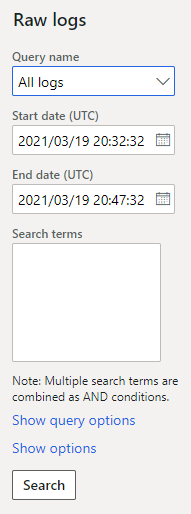

# Production support and monitoring

[!include[banner](../../../finance/includes/banner.md)]

To ensure a good experience during the implementation of a project and after go-live, it's important that you understand the different types of servicing that are available and how you can get the correct support for every scenario. This article explains how to engage each type of support and learn about some of the tools available.

Microsoft tools and support help ensure the stability and effectiveness of your environment by providing infrastructure and application support. However, this support can be effective only if partners and clients correctly develop, test, configure, manage, and monitor the implemented system and its environments.

## Supporting actions

Supporting actions can be grouped into three categories:

- Self-service
- Service request
- Support request

Depending on the category, the actions are triggered in different ways and might involve different lead times.

### Self-service

Self-service actions can be triggered by users at any time and involve no lead time. Here are some of the reasons why a user might initiate a self-service action:

- Promote code (in non-production environments).
- [Move databases between non-production environments](../database/dbmovement-operations.md).
- [Upgrade a production environment](../migration-upgrade/upgrade-latest-update.md).
- [Turn maintenance mode on or off](../sysadmin/maintenance-mode.md)
- Pause upcoming automatic deployment of a service update.
- Restart services in non-production environments.
- Complete performance actions.

### Service request

Service requests are usually triggered by a creating a support ticket. They involve the cooperation of the Dynamics Service Engineering (DSE) team. Each request will involve designated lead time. A service request might be created to request environment deployment, for example.

#### Recommended practices for working with the DSE team

- Consider that there are turnaround times or Service Level Agreements (SLAs) for each type of service request.
- Don't use a service request if a support request is more suitable for your case.
- To ensure that you make the correct type of request, see [Service request types and SLAs](../lifecycle-services/submit-request-dynamics-service-engineering-team.md#service-request-types-and-slas).

### Support request

Other scenarios can usually be resolved by opening a support request. These requests involve lead time. Here are some of the reasons for creating a support request:

- Do a point-in-time restore of a production environment after go-live.
- Flag a regression in a service update, and ask for an exception opt-out.
- Make performance-related requests (for tasks that can't be completed through self-service).
- Activate a flighting feature (for example, customer and vendor master data sharing).
- Resize a production environment. (You must first update and upload a new usage profile in the subscription estimator in Microsoft Dynamics Lifecycle Services \[LCS\].)
- Create an additional LCS project in the same tenant.
- Move the tenant of production environments.

## Requesting support

An effective support process requires that a clear escalation path be defined. Project teams (client or partner) should be able to monitor and read environment telemetry, and they should be capable of doing any initial troubleshooting that is required.

A well-identified issue and a well-defined resolution process can make a difference in the effectiveness of the outcome.

An effective support request should include the following details:

- The environment where the issue occurs
- The process that the issue was identified in
- Reproducible steps to show where the issue occurred
- The expected result and the actual result
- Pre-investigation of the issue
- Additional elements (for example, the error message, screenshots, the session ID, and the trace)

### High-severity support requests

A high-severity support request should include the following information:

- **Business impact:** How does the issue affect your business activities?
- **Financial impact:** How does the issue affect your business at a financial level?

A thorough analysis of each issue should be done before the issue is reported. The incident resolution will be much quicker if the support request includes detailed information, and if all available tools and telemetries have been used. By including all the correct information when you submit a support request, you reduce the amount of back-and-forth communication that is required to identify and replicate the issue. Therefore, you can save lots of time.

There are several [support plans](https://go.microsoft.com/fwlink/?LinkId=871952) to choose from. Therefore, every business should be able to find a plan that meets its needs.

Before you request support, it's important that you choose the correct level of severity. For information about how to identify the correct severity level and estimate the initial response time for your request, see [Support overview](/power-platform/admin/support-overview?toc=/dynamics365/fin-ops-core/dev-itpro/toc.json&amp;bc=/dynamics365/breadcrumb/toc.json#what-is-initial-response-time-and-how-quickly-can-i-expect-to-hear-back-from-someone-after-submitting-my-support-request) and [Report a production outage](/dynamics365/fin-ops-core/dev-itpro/lifecycle-services/report-production-outage).

## Monitoring elements

LCS has an integrated set of tools that you can use to monitor LCS projects.

### Service health dashboard

The [Service health dashboard](https://portal.office.com/servicestatus) provides the health status for Office 365 services.

You can also view the service health through the [Microsoft 365 admin center](https://admin.microsoft.com). Go to **Health** \> **Service health**, or select the **Service health** card on the **Home** dashboard.

By default, the **All services** tab is selected on the **Service health** page. It shows all services and their current health state. A symbol and a value in the **Status** column indicate the state of each service.

If you're experiencing an issue with a Microsoft 365 service, but it isn't listed on the **Service health** page, you can notify Microsoft by selecting **Report an issue** and completing a short form.

The issue reporting will help to identify issues and how widespread they are. After incidents are identified, they will be shown on the dashboard under **service health**.

You can sign up to receive email communication. In this way, you can ensure that you're quickly alerted about issues that are identified in the tenant and their status change.

### Environment monitoring

Environment monitoring is a set of tools that help you monitor and [troubleshoot the health of your environments through LCS](/dynamics365/fin-ops-core/dev-itpro/lifecycle-services/monitoring-diagnostics).

On a specific environment page for a project, the **Monitoring** section includes a **Environment monitoring** link that will take you to the **Environment monitoring dashboard**.

The following subsections describe some of the tools that are available.

#### Overview

The **Overview** section is common to most environment types. It provides a filterable way to trace user activity and to trace load by activity during a defined period.

#### Activity

The **Activity** tab lets you query raw logs. It provides predefined queries for the most common events and metrics to help you monitor your environment. Here are some examples of the predefined queries that are available:

- Slow queries
- Deadlocks
- Crashes
- Financial reporting issues
- Batch throttle
- Distinct user sessions

Additionally, you can add your own custom filters and export the logs to a comma-separated values (CSV) file for analysis.

#### Health Metrics

The **Health Metrics** dashboard provides a series of line charts that are filtered by instance (AOS or Batch AOS) and time frame. On the **AOS** tab, you can observe SQL execution. On the **System** tab, you can observe system memory and CPU utilization over time. This tool lets you easily identify behavioral changes. Therefore, it can help you trace issues over time and the impact of changes in the solution.

For additional content related to monitoring LCS environments, see [Performance troubleshooting using tools in Lifecycle Services (LCS)](../lifecycle-services/performancetroubleshooting.md). 

Although it's important that you monitor your environments, you don't have to be on constant lookout. Microsoft also uses the emails that are provided in the LCS notification list to alert you about important issues and actions that you must take, and to provide preventive guidance for the implementation itself.

[!INCLUDE[footer-include](../../../includes/footer-banner.md)]
