# Deploy and use a continuous build and test automation environment

[!include [banner](../includes/banner.md)]

This article describes how to deploy and use an environment that supports continuous build and test automation.

## Prerequisites

Cloud deployment of virtual machines (VMs) requires a Microsoft Azure DevOps subscription.

## Workflow

After you configure an Azure DevOps subscription in Microsoft Dynamics Lifecycle Services (LCS), you can use LCS to deploy developer VMs or build/test VMs. LCS configures a developer VM that can be mapped to an Azure DevOps project. LCS also configures a build VM that is automatically mapped to an Azure DevOps project and has a build agent/controller that builds modules from the Azure DevOps project and runs automated tests that have an external endpoint for validation. The following illustration shows a typical workflow.

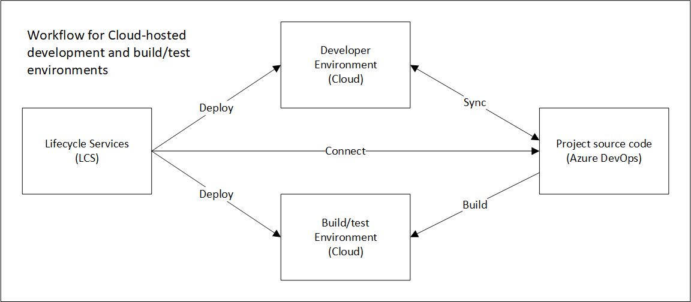

This workflow includes an LCS deployment of a developer VM and a build/test VM in Azure.

+ LCS creates developer and the build/test environments in Azure. To create a build/test environment, LCS must be able to determine where the source code for the Azure DevOps project is.
+ The developer works on source code on the developer VM, and the work is synced to the Azure DevOps project.
+ The build process synchronizes the code from Azure DevOps onto the build/test VM and produces deployable packages that you can apply to sandbox and production environments. The source code doesn't flow directly from the development VM to the build/test VM. They are synced through Azure DevOps.

For information about how to write custom test code or generate automated test code to integrate with the build infrastructure, see [Testing and validations](testing-validation.md).

## Set up Azure DevOps

### Choose a plan

The first step is to [choose an Azure DevOps plan](https://azure.microsoft.com/pricing/details/devops/azure-devops-services) for your organization.

### Set up Azure DevOps

To set up Azure DevOps, follow these steps.

1. [Create a personal access token](../lifecycle-services/synchronize-bpm-vsts.md#lcs-project-settings-set-up-azure-devops). The token is used for all LCS background actions. These actions include upgrade and deployment. When users initiate actions from LCS, LCS expects that those users will be added to Azure DevOps. The users must authorize LCS access to Azure DevOps on their behalf.
1. [Configure LCS](../lifecycle-services/synchronize-bpm-vsts.md#lcs-project-settings-set-up-azure-devops).

Until you authorize LCS access to Azure DevOps, you will see a "setup is not complete" message in action center.

### Suspend current builds

If you're deploying a build environment on an existing Azure DevOps project that already has a build definition, make sure that you don't have any active triggers to queue the build. Additionally, make sure that no builds are scheduled or queued against the build pool.

## Deploy Developer and Build/Test environments from LCS

LCS provides an option to deploy Development and Build/Test environments. With this option, you can deploy developer and build VMs in the cloud that are connected to your Azure DevOps project.

Alternatively, you can make use of [Microsoft-hosted agents](../dev-tools/hosted-build-automation.md) to build and deploy your X++ code.

### Azure DevOps credential setup and linking to LCS project

If you have not already done so, you need to first setup your LCS project to connect to your Azure DevOps project before you deploy a build environment.

1. Login to the LCS portal to connect to Azure DevOps and your LCS project at [https://lcs.dynamics.com/](https://lcs.dynamics.com/).
2. Select a project that you are working on.
3. Click the **Project Settings** tile.
4. Select **Azure DevOps** and enter the Azure DevOps URL where the source code for your module project is located.
5. Specify the Azure DevOps link, authorize, and then click **Choose default project**.

### Check-in migrated or new module code into Azure DevOps

As part of code Migration process or development activities, we expect you to check-in your model source files and the associated test model source files into Azure DevOps. If you have migrated your code using the LCS migration service, this is automatically done for you. If you have not checked in any code into Azure DevOps and work on direct check-in, you must follow certain guidelines for the Azure DevOps folder structure. This will help with setting up correct build definition. All modules should be added to root folder **Metadata**. Under each module, there should be two folders. One folder contains all models. The other folder should contain descriptor XML for that module. 

### Deploy a Build environment

The article [Deploy and access development environments](../dev-tools/access-instances.md) describes how to deploy developer environments. Use the same flow to deploy a build environment. As you are going through the deployment or configuration wizard, when prompted to **Select a Topology**, select **DevTest** then select a **Build and Test** topology.

As part of the deployment wizard, you can configure the build agent name and build agent pool.

Click **Advanced settings**, select **Azure DevOps**
   1.  Build Agent Name: Friendly name for build agent on Azure DevOps
   2.  Build Agent Pool: specify build agent pool name which should be used for build machine deployment. Make sure Azure DevOps contains at least one agent pool. By default, there will be the default pool. If you have deleted the default pool then build deployment will fail.
   3.  Branch Name: Specify your Azure DevOps source code branch which will be default source code sync location for the build VM. Default branch is "Main".

   
## Test integration with the build

There are two ways to integrate test as part of build process for testing and validation:

-   SysTest framework based unit and component level tests.
-   Generate code from Task Recorder recording XML for automated test execution.

The details of these two approaches are mentioned in the [Testing and validation](testing-validation.md) article. Review this article for testing and validation strategy.

## Use the Build VM environment

When a Build VM is deployed in Developer topology through LCS, it is pre-configured and ready to start a build. You can change the default configuration at any time from the Visual Studio IDE or the Azure DevOps interface. On a Build VM, the module source code is synchronized to the build machine for easy build setup. The build machine is also auto-configured with default settings for build agent, build controller, build process template, and build definition. Tests that are integrated with build definition are executed after the build is successful.

### Review a pre-configured customizable build environment

The build VM contains the vNext build agent which was released as part of **Azure DevOps**. When you deploy the Build VM, the build agent is configured by default to connect and sync with the Azure DevOps project. As a part of the Build VM configuration, the default build definition is also created and configured, as shown below. 

[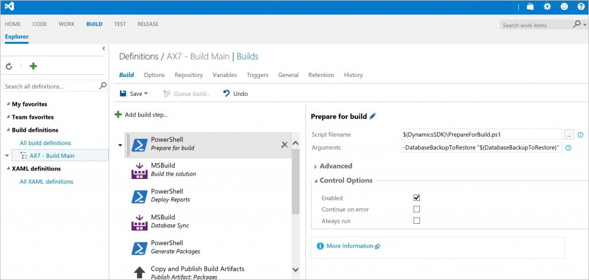](./media/build1.jpg) 

Default build definition contains multiple tasks to perform specific operation, as described below.

1.  Configure the predefined variables parameters that will be passed to the build. To set up a clean database for every build execution, provide the name of the database backup file for the **DatabaseBackupToRestore** variable. The packages folder is restored at every build with a copy of a clean package folder.

    [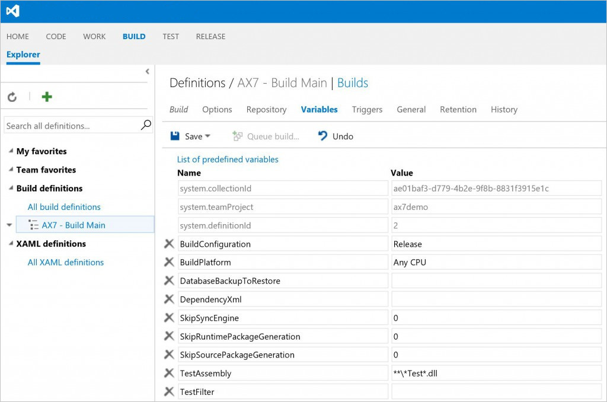](./media/build2.jpg)

2.  Build the solution to discover and build all modules under "Trunk/Main" branch as shown below.

    [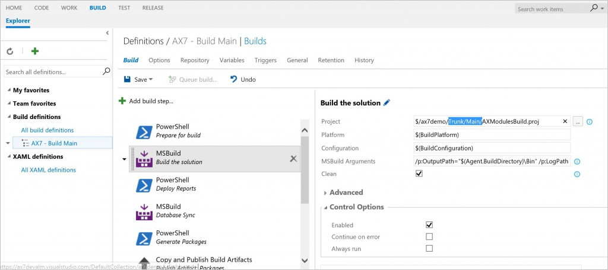](./media/build3.jpg)

3.  Use "Deploy Report" task to generate reports and deploy on build VM.
4.  Use "Database Sync" task to synchronize the database to local SQL on build VM.
5.  After the build is successful, create a deployable package that can be used to update sandbox/ staging environment.

    [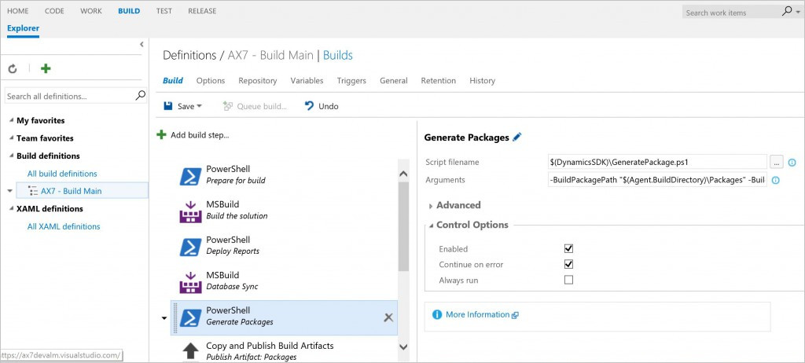](./media/build4.jpg)

6.  "Copy and publish build artifacts" uploads the deployable package to Azure DevOps artifacts location.

    [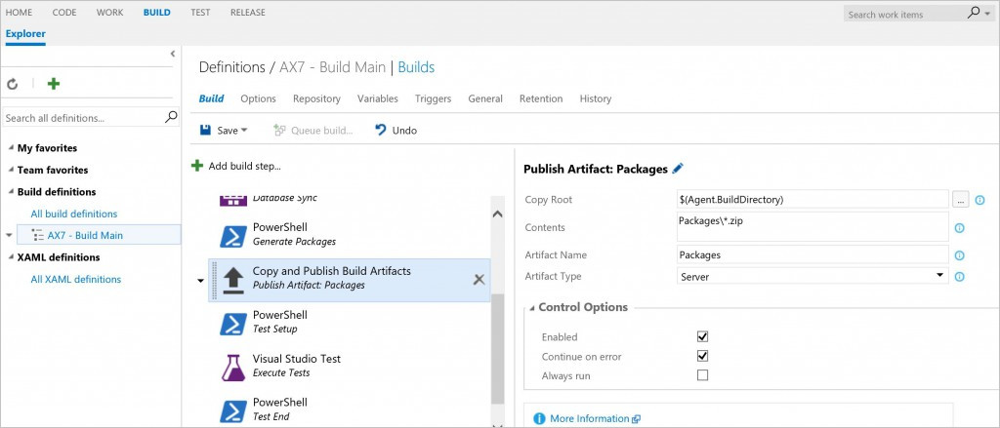](./media/build5.jpg)

7.  For test execution, there are three default tasks "Test Setup", "Execute Test" and "Test End".

    [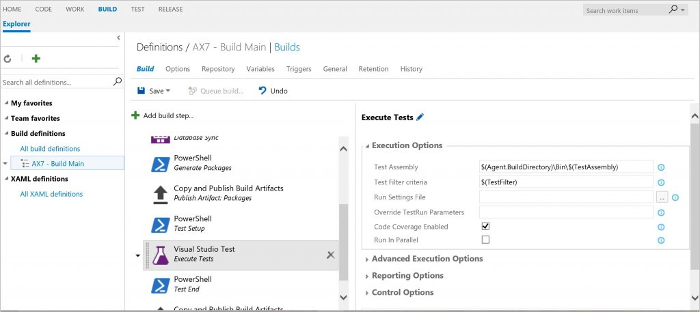](./media/build7.jpg)

8.  The default build is scheduled to trigger start every day at 5 P.M. You can change trigger as per your team's need to "Continuous" for each check-in.

    [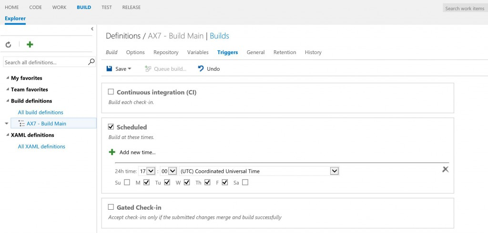](./media/build8.jpg)

You can make changes to the default configuration, and the build VM will be ready to trigger a build.

## Start a build and verify the build and test execution results

After you review the default build configuration, you can manually trigger a build from Visual Studio IDE or Azure DevOps web interface.

1.  Open your browser and connect to the Azure DevOps URL.
2.  Login using your credentials.
3.  On the home page, under **Recent projects and solutions**, select a project.
4.  From top links options, select **BUILD**.
5.  On the left panel, select the default build definition instance.
6.  Right-click and select **Queue Build** to trigger a build for your module and test module that is already checked into the Azure DevOps source control.

Success or failure for the build will display, as shown by the following examples. View all builds. 

[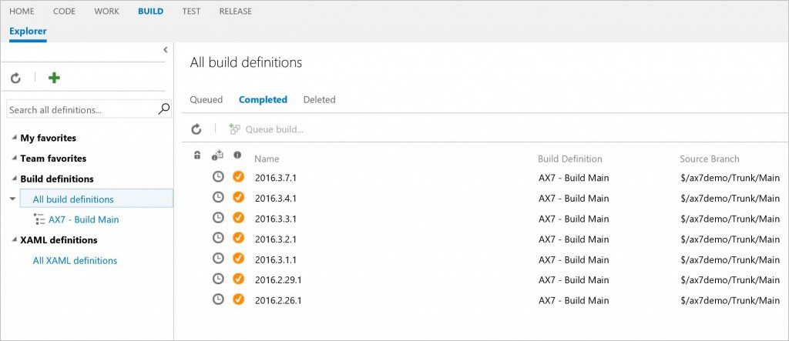](./media/build9.jpg) 

Select specific completed build and view success/ failure details. 

[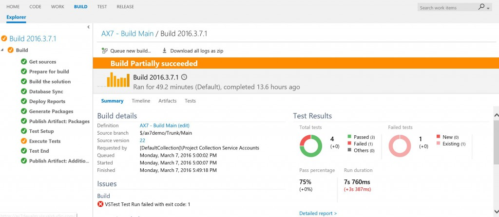](./media/build10.jpg) Click on Test link to visualize test execution failure. 

[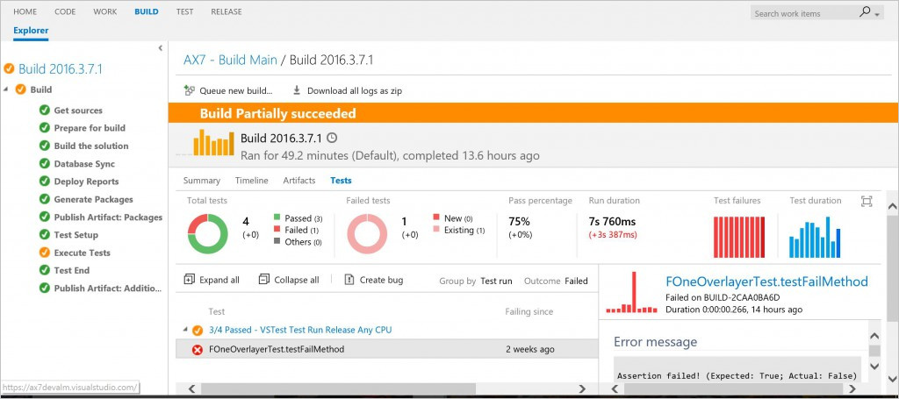](./media/build11.jpg)

[!INCLUDE[footer-include](../../../includes/footer-banner.md)]
