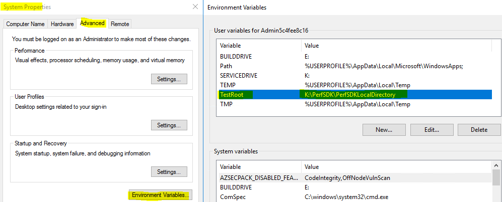
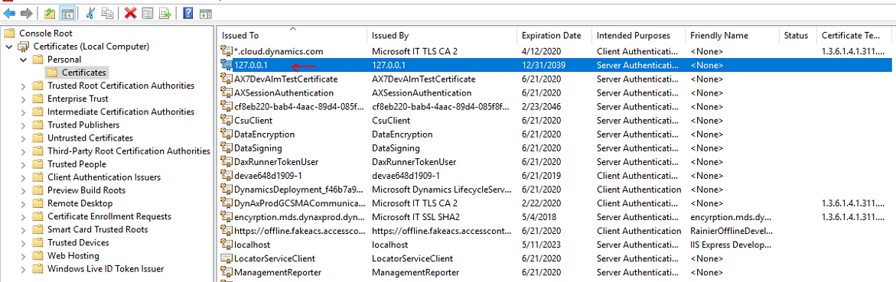
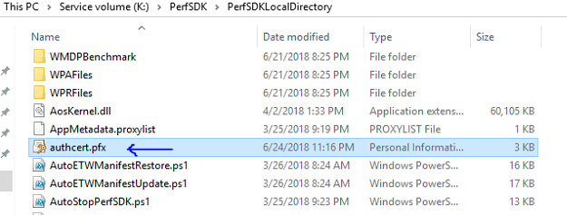
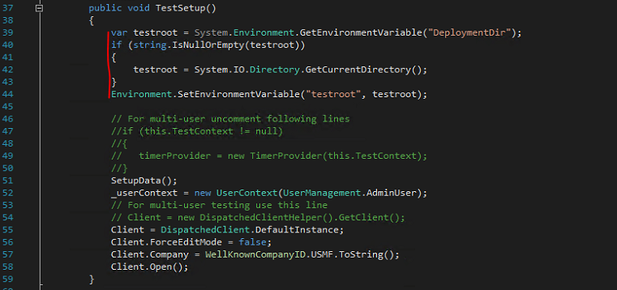
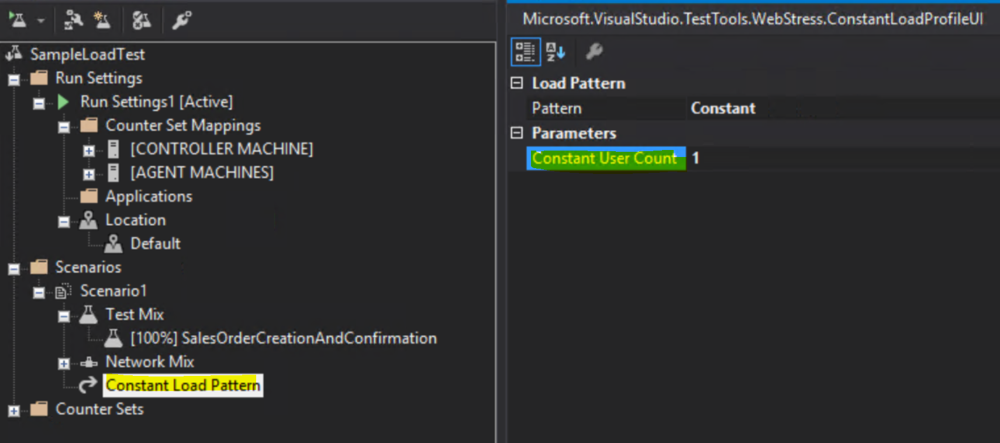
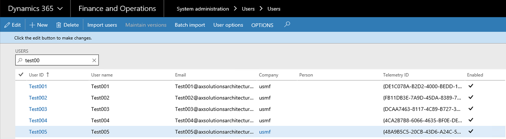
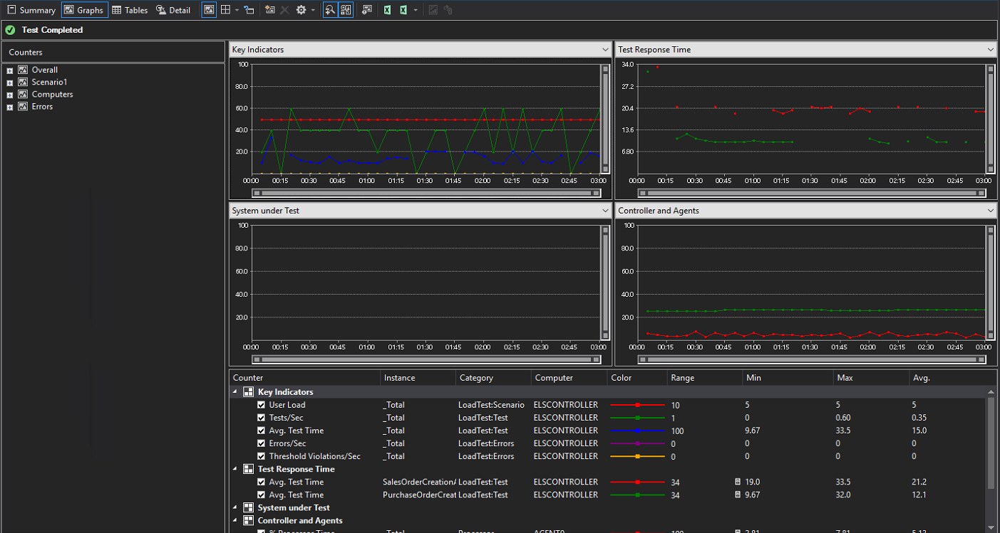

---
# required metadata

title: Multi-user testing with the Performance SDK and a local test controller
description: This topic explains how to do multi-user testing by using Microsoft Visual Studio and the Performance SDK together with performance test scripts that are generated from Task recorder.
author: hasaid
manager: AnnBe
ms.date: 07/07/2020
ms.topic: article
ms.prod: 
ms.service: dynamics-ax-platform
ms.technology: 

# optional metadata

# ms.search.form: 
# ROBOTS: 
audience: Developer
# ms.devlang: 
ms.reviewer: rhaertle
ms.search.scope: Operations
# ms.tgt_pltfrm: 
ms.custom: 9954
ms.assetid: 7b605810-e4da-4eb8-9a26-5389f99befcf
ms.search.region: Global
# ms.search.industry: 
ms.author: jujoh
ms.search.validFrom: 2016-02-28
ms.dyn365.ops.version: AX 7.0.0

---

# Multi-user testing with the Performance SDK and a local test controller

[!include [banner](../includes/banner.md)]

 > [!IMPORTANT]
  > Visual Studio 2019 will be the last version of Visual Studio with web performance and load test features. In the future, we will publish some recommendations for alternative solutions.  
  > - If you are using the Visual Studio and Test Controller/Test Agent for on-premises load testing, Visual Studio 2019 will be the last version. You can continue using it until the end of the support cycle. 
  > - If you are using the cloud-based load testing service, it will continue to run through March 31, 2020. Until then, you can continue to use all of the experiences powered by this service without interruption. Alternatively, you can switch to on-premises load testing. For more information, see [Cloud-based load testing service end of life](https://devblogs.microsoft.com/devops/cloud-based-load-testing-service-eol/).

## Prerequisites

Before you complete the steps in this topic, verify that the following prerequisites are met:

- You have a development environment that has Platform update 21 or later in your Microsoft Azure subscription.
> [!IMPORTANT]
> If your Finance and Operations apps were deployed in 21Vianet, the platform update of your environment must be Platform Update for 10.0.11 or above.
- You have Microsoft Visual Studio Enterprise edition in a development environment.
- You have a tier-2 or above sandbox environment that has the same release (application version and platform update) as your development environment.
- You've configured your development environment by following the steps in [Single-user testing with Task recorder and the Performance SDK](single-user-test-perf-sdk.md).
- C\# performance testing classes have been generated for your end-to-end (E2E) scenarios, and you can run a single-user test by following the steps in [Single-user testing with Task recorder and the Performance SDK](single-user-test-perf-sdk.md).

## Configure a development environment for multi-user testing

1. Download [ODBC Driver 17 for SQL Server](https://docs.microsoft.com/sql/connect/odbc/download-odbc-driver-for-sql-server?view=sql-server-ver15), rename the download file **msodbcsql**, and copy it to the **Visual Studio Online** folder under the **PerfSDK** folder.

    [](./media/multi-user-test-local-01.png)

2. Create an environment variable that is named **TestRoot**, and point it to the **PerfSDK** folder by running the following cmdlet in Microsoft Windows PowerShell.

    ```Console
    [ENVIRONMENT]::SETENVIRONMENTVARIABLE("TESTROOT", "K:\PERFSDK\PERFSDKLOCALDIRECTORY", "USER")
    ```

    To view the new environment variable, in the **System Properties** dialog box, on the **Advanced** tab, select **Environment Variables**.

    [](./media/multi-user-test-local-02.png)
	
3. Open a **Command Prompt** window as an admin, and enter the following commands to generate and install the required certificate. When you're prompted for a private key password, select **None**.

    ```Console
    "C:\Program Files (x86)\Windows Kits\8.1\bin\x64\makecert" -n "CN=127.0.0.1" -ss Root -sr LocalMachine -a sha256 -len 2048 -cy end -r -eku 1.3.6.1.5.5.7.3.1 -sv c:\temp\authcert.pvk c:\temp\authcert.cer

    "c:\Program Files (x86)\Windows Kits\8.1\bin\x64\pvk2pfx" -pvk c:\temp\authCert.pvk -spc c:\temp\authcert.cer -pfx c:\temp\authcert.pfx
    ```

    Here is an explanation of the elements in preceding commands:

    - **-n "CN=127.0.0.1"** gives a human-readable name to the certificate. It's very important that the name of this certificate be **127.0.0.1**. Otherwise, the single-user tests won't be able to run.
    - **-eku 1.3.6.1.5.5.7.3.1** gives the purpose of the certificate. It indicates that the certificate can be used as a Secure Sockets Layer (SSL) server certificate.

    The commands generate the following certificates and save them in C:\\Temp:

    - Authcert.pvk
    - Authcert.cer
    - Authcert.pfx

4. Install the **authcert.pfx** and **authcert.cer** certificates in the **Local Machine\\Personal** certificate store.

    [](./media/multi-user-test-local-04.png)

5. Copy the **authcert.pfx** certificate to the **PerfSDK\\PerfSDKLocalDirectory** folder.

    [](./media/multi-user-test-local-05.png)

6. Replace the **setup.md** file in the **Visual Studio Online** folder with the following.

    ```Console
    setx testroot "%DeploymentDirectory%"
    ECHO Installing D365 prerequisites
    ECHO MSIEXEC /a %DeploymentDirectory%\msodbcsql /passive /norestart IACCEPTMSODBCSQLLICENSETERMS=YES
    MSIEXEC /a %DeploymentDirectory%\msodbcsql /passive /norestart IACCEPTMSODBCSQLLICENSETERMS=YES
    %windir%\sysnative\windowspowershell\v1.0\powershell.exe -File %DeploymentDirectory%\install-wif.ps1
    Md %DeploymentDirectory%\Common\Team\Foundation\Performance\Framework
    %DeploymentDirectory%\CloudCtuFakeACSInstall.cmd %DeploymentDirectory%\authcert.pfx
    ```

7. In the **Visual Studio Online** folder, in the **CloudCtuFakeACSInstall.cmd** file, remove **%TestCertPassword%** from the **Import** command.

    [](./media/multi-user-test-local-07.png)

## Prepare the PerfSDKSample solution for multi-user testing

1. In Microsoft Visual Studio, on the **Test** menu, point to **Test settings**, point to **Default processor architecture**, and then select **x64**.
2. Retrieve the thumbprint of the **authcert.pfx** certificate in your development environment by running the following cmdlets as an admin. Save the thumbprint somewhere, because you will need it when you configure the tier-2 or above sandbox environment.

    ```Console
    cd Cert:\LocalMachine\My
    Get-ChildItem | Where-Object { $_.Subject -like "CN=127.0.0.1" }
    ```

    The following illustration shows an example of a thumbprint that these cmdlets return.

    [](./media/multi-user-test-local-09.png)

    > [!NOTE]
    > In an environment that has Platform update 21 or later, a certificate that has **127.0.0.1** as the issuer is automatically installed. Verify that you retrieve the thumbprint of the certificate that you generated.

3. Update the **CloudEnvironment.config** file to reflect your configurations. As part of this update, follow these steps:

    - Verify that **HostName** and **SOAPHostName** match your tier-2 or above sandbox environment.
    
    > [!NOTE]
    > If you don't know the **HostName** or **SOAPHostName** of your test environment, you can find it in the web.config file for the AOS server in **Infrastructure.HostUrl** or **Infrastructure.SoapServicesUrl**.
    
    - Add the thumbprint of the **authcert.pfx** certificate as a value of **SelfSigningCertificateThumbprint**.
    - Update **UserCount** to reflect the number of test users in your case.
    - Update **UserFormat** to reflect your naming convention for test users.

    [](./media/multi-user-test-local-10.png)

    - If your Finance and Operations apps were deployed in 21Vianet, make sure to specify **NetworkDomain="https://sts.chinacloudapi.cn/"** in **SelfMintingSysUser** and **SelfMintingAdminUser**.

4. Configure **vsonline.testsettings**. In the **Test Settings** dialog box, on the **General** tab, in the **Test run Location** field group, select the **Run tests using local computer or a test controller** option.

    [](./media/multi-user-test-local-11.png)

    > [!NOTE]
    > If you don't see **vsonline.testsettings**, reopen the solution.

5. On the **Deployment** tab, select the **Enable deployment** check box, and then use the **Add Directory** and **Add File** buttons to add the following folders and files to the **Additional files and directories to deploy** field.

    - **K:\\PerfSDK\\PerfSDKLocalDirectory\\SampleProject\\PerfSDKSample\\bin\\Debug** folder
    - **K:\\PerfSDK\\PerfSDKLocalDirectory\\Visual Studio Online** folder
    - **K:\\PerfSDK\\PerfSDKLocalDirectory\\CloudEnvironment.Config** file
    - **K:\\PerfSDK\\PerfSDKLocalDirectory\\authcert.pfx** file
    - **K:\\PerfSDK\\PerfSDKLocalDirectory\\MS.Dynamics.Test.Team.Foundation.WebClient.InteractionService.dll.config** file

    [](./media/multi-user-test-local-12.png)

    > [!NOTE]
    > When you receive a warning that states, "Deployment item not in solution folder," select **OK** to continue.

6. On the **Hosts** tab, in the **Run tests in 32 bits or 64 bits process** field, select **Run test in 64 bits process on 64 bits machine**.
7. Select **Apply**, and then close the **Test Settings** dialog box.
8. Modify your C\# performance class by adding the following statement to your C\# performance tests.

    ```csharp
    using MS.Dynamics.TestTools.UIHelpers.Core;
    ```

    [](./media/multi-user-test-local-14.png)

9. Modify the **TestSetup** method by adding the following lines to the beginning of the **TestSetup()** method.

    ```csharp
    var testroot = System.Environment.GetEnvironmentVariable("DeploymentDir");
    if (string.IsNullOrEmpty(testroot))
    {
        testroot = System.IO.Directory.GetCurrentDirectory();
    }
    Environment.SetEnvironmentVariable("testroot", testroot);
    ```

    [](./media/multi-user-test-local-15.png)

10. In the **TestSetup** method, uncomment lines in the code titled "for multi-user uncomment following lines", and comment out the following line.

    ```csharp
    Client = DispatchedClient.DefaultInstance;
    ```

    [](./media/multi-user-test-local-16.png)

11. Modify the **TestCleanup** method so that it resembles the following example.

    ```csharp
    public void TestCleanup()
    {
        Client.Close();
        Client.Dispose();
        Client = Null;
        //_userContext.Dispose();
    }
    ```

12. Repeat steps 2 through 11 for all the C\# performance test classes that you have.
13. When you've finished, build the solution.
14. In **SampleLoadTest.loadtest**, select your test class under **Test Mix**.

    [](./media/multi-user-test-local-18.png)

14. In **SampleLoadTest.loadtest**, update the **Timing** fields of **Run Settings1 \[Active\]**. These fields include **Warm-up Duration**, **Run Duration**, and **Cool-down Duration**.

    [](./media/multi-user-test-local-19.png)

15. In **Constant Load Pattern**, set the **Constant User Count** parameter to the total number of users that you want to use to run the test.

    [](./media/multi-user-test-local-20.png)
	
## Configure a tier-2 or above sandbox environment for multi-user testing

### If your AOS allows Remote Desktop connections

1. Open Microsoft Internet Information Services (IIS) Manager from **Administrative Tools**, and then, under **Sites**, select **AOSService**.
2. On the right, select **Explore in Actions**, and then find the **wif.config** file at the bottom of the window.
3. Add the thumbprint of the **authcert.pfx** certificate to the bottom of the `https://fakeacs.accesscontrol.windows.net/` authority and save the change.

    [](./media/multi-user-test-local-22.png)

4. Repeat steps 1 through 3 on each AOS computer.
5. Restart all AOS instances.

### If you do not have Remote Desktop access to the server

In cases where your Remote Desktop Protocol (RDP) access is removed, such as Microsoft-managed or self-service type sandboxes, Microsoft will generate the certificate for your environment and have it pre-configured. Follow these steps to retrieve the RSAT certificate, which is necessary to use with PerfSDK.

1. Under **Maintain** on your environment details page in Lifecycle Services you'll see two new options.
  - Download RSAT certificate
  - Regenerate RSAT certificate


Use the **Download** button to retrieve the certificate bundle as a .zip file.

2. You'll receive a warning that a clear-text password will be displayed on your screen. Select **Yes** to continue.

3. Copy the clear-text password for later use. You'll see the .zip file has been downloaded. Inside the .zip file is a certificate (.cer) and a personal information exchange (.pfx) file. Unzip the file.

4. Double-click the certificate to open it, and then select **Install**. Install this certificate to your local machine, and then browse to the **Personal** store. Repeat this process for the local machine, and browse specifically to the **Trusted Root Certification Authorities** store.

5. Double-click the personal information exchange (.pfx) file to open it, and select **Install**. Install this certificate to your local machine, enter the password saved in step 2, and browse to the **Personal** store. Repeat this process for the local machine location, enter the password saved in step 2, and browse specifically to the **Trusted Root Certification Authorities** store.

6. Double-click the certificate file to open it. Browse to the **Details** tab, and scroll down until you see the **Thumbprint** section. Select **Thumbprint**, and copy the ID in the text box. Use this thumbprint for RSAT and to update your PerfSDK **CloudEnvironment.config** thumbprint.


You can now run your tests against the environment using this certificate. The certificate will be auto-rotated by Microsoft before it expires, at which time you will need to download a new version of this certificate starting from step 1 above. For self-service environments this will be rotated every 90 days during a downtime window that is closest to the expiry. These downtime windows include customer initiated package deployment, and database movement operations that target the environment.

## Create test users

Open the **SampleLoadTest.load** test to create test users and import them into your target environment. Then assign the **System Administrator** security role to each user.



> [!NOTE]
> You can also create test users by running **MS.Dynamics.Performance.CreateUsers.exe**. In this case, you don't have to use IISRESET.

## Run multi-user testing by using a local test controller

1. On the devbox, in Visual Studio, select **Run Load Test**.

    [](./media/multi-user-test-local-24.png)

2. Review the test output.

    [](./media/multi-user-test-local-25.png)

## Troubleshooting

For information about single-user or multi-user testing that uses the Performance SDK, see [Troubleshooting guide for single-user or multi-user testing with the Performance SDK](troubleshoot-perf-sdk-user-testing.md).
