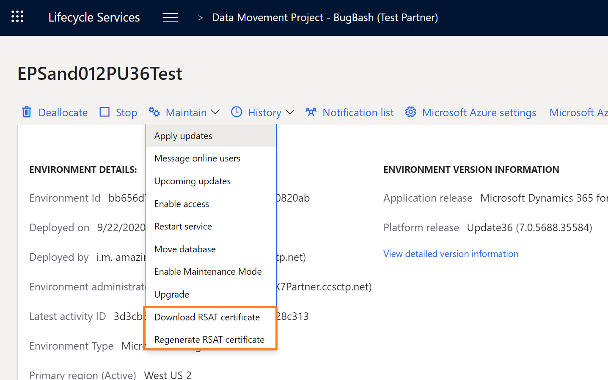
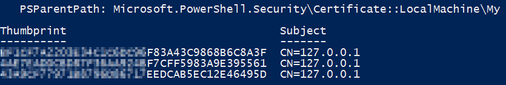
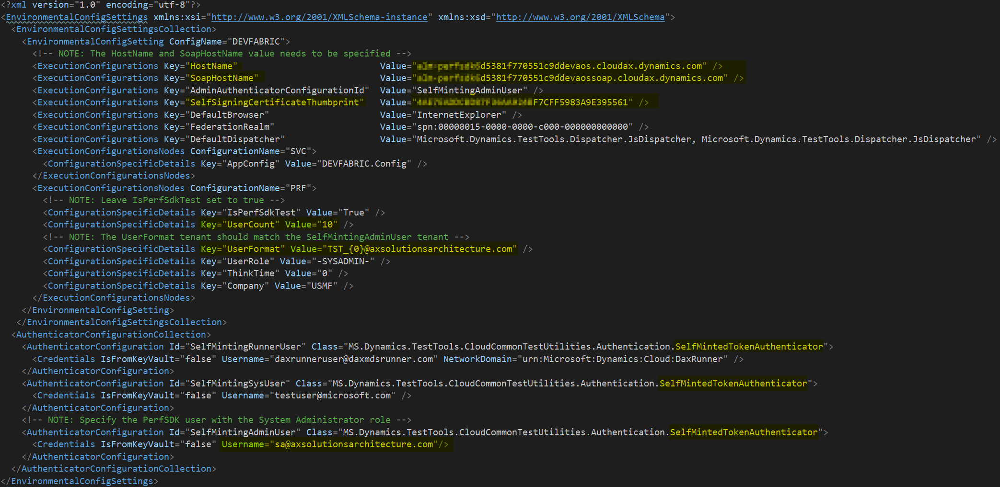
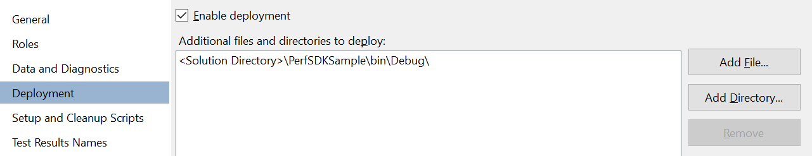
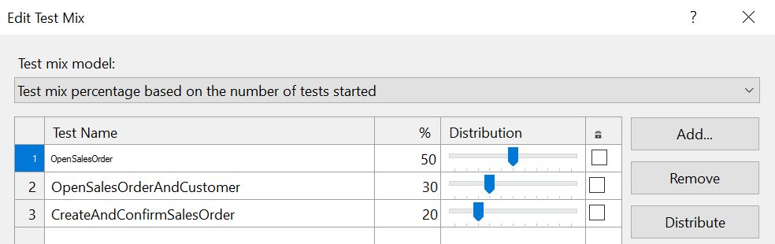
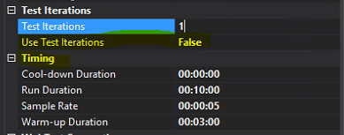
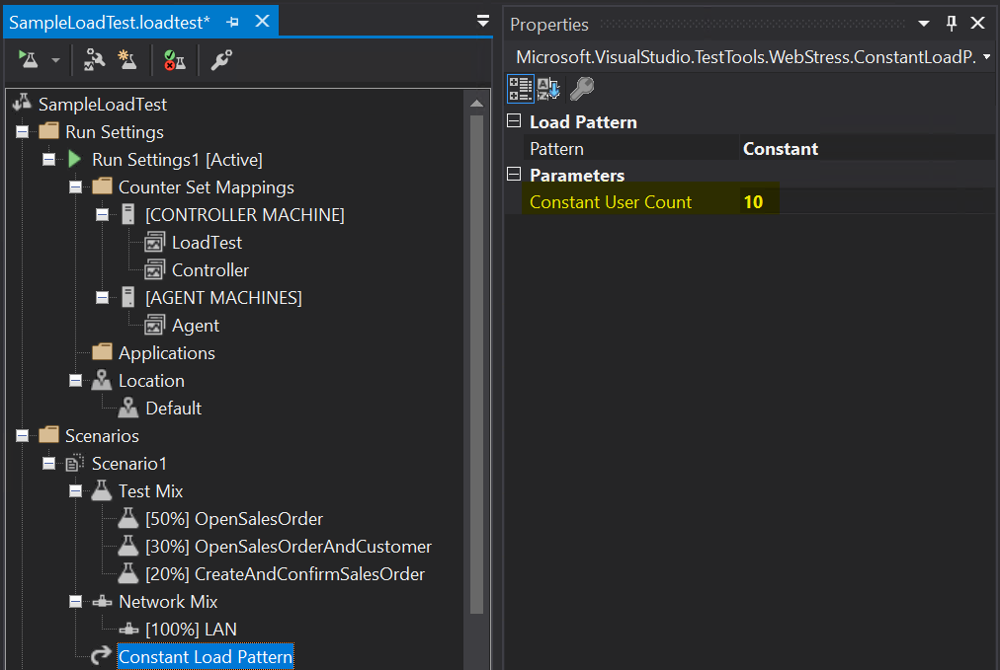
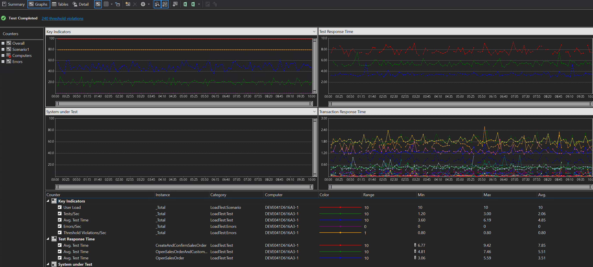

# Run multi-user testing by using the Performance SDK

[!include [banner](../includes/banner.md)]

This article explains how to run multi-user testing by using Microsoft Visual Studio, the Performance software development kit (SDK), and the Task recorder test scripts.

  > [!IMPORTANT]
  > Visual Studio 2019 is the last version of Visual Studio that includes web performance and load testing features and will be deprecated in the future. We suggest using Apache JMeter for performance testing. For more information, see [JMeter](https://jmeter.apache.org/).

## Prerequisites

Before you complete the steps in this article, verify that the following prerequisites are met:

- You have **Visual Studio Enterprise edition** in a development environment. Enterprise edition is required to create load tests. If you're deploying your development box as a cloud-hosted environment through Microsoft Dynamics Lifecycle Services (LCS), be sure to select the appropriate Visual Studio version to deploy.
- The Visual Studio web performance and load testing tools are installed as described in [Install the load testing component](/visualstudio/test/quickstart-create-a-load-test-project#install-the-load-testing-component).
- You have a tier-2 or higher sandbox environment that has the same release (application version and platform update) as your development environment.
- You've configured your development environment by following the steps in [Single-user testing with Task recorder and the Performance SDK](single-user-test-perf-sdk.md).
- C\# performance testing classes have been generated for your end-to-end (E2E) scenarios, and you can run a single-user test by following the steps in [Single-user testing with Task recorder and the Performance SDK](single-user-test-perf-sdk.md).

## Configure a development environment for multi-user testing

The following configurations must be set up on the development machine that is used to locally host the testing controller and agent.

> [!NOTE]
> For all Microsoft-managed sandboxes and sandboxes of the self-service type, Microsoft will generate the certificate for your environment and preconfigure it.

1. Create an environmental variable that is named **TestRoot**, and point it to the **PerfSDK** folder by running the following cmdlet in Windows PowerShell.

    ```powershell
    [ENVIRONMENT]::SETENVIRONMENTVARIABLE("TESTROOT", "K:\PERFSDK\PERFSDKLOCALDIRECTORY", "USER")
    ```

    To verify the variable, run the following command in Windows PowerShell.

    ```powershell
    [ENVIRONMENT]::GETENVIRONMENTVARIABLE("TESTROOT", "USER") | Write-Host
    ```

2. In LCS, open the **Environment details** page for your target sandbox environment.

    On the **Environment details** page, the **Maintain** menu includes two new commands:

    - Download RSAT certificate
    - Regenerate RSAT certificate

    

3. Select **Download RSAT certificate** to retrieve the certificate bundle as a zip file.
4. You're warned that a clear-text password will be shown on screen. Select **Yes** to continue.
5. Copy the clear-text password, because you will need it later.
6. After the zip file is downloaded, unzip it. Inside, you should find a certificate (.cer) file and a personal information exchange (.pfx) file.
7. Double-tap (or double-click) the certificate (.cer) file to open it, and then select **Install**. Install this certificate on your local machine, and then browse to the **Personal** store. Repeat this process for the local machine location, and browse specifically to the **Trusted Root Certification Authorities** store.
8. Double-tap (or double-click) the personal information exchange (.pfx) file to open it, and then select **Install**. Install this certificate on your local machine, enter the password that you copied in step 5, and then browse to the **Personal** store. Repeat this process for the local machine location, enter the password that you copied in step 5, and browse specifically to the **Trusted Root Certification Authorities** store.
9. Double-tap (or double-click) the certificate file to open it. On the **Details** tab, scroll down until you find the **Thumbprint** section. Select **Thumbprint**, and copy the ID in the text box. Save this thumbprint to update the **CloudEnvironment.config** thumbprint for the Performance SDK.

> [!NOTE]
> Microsoft will automatically rotate the certificate before it expires. At that time, you must download a new version of the certificate. For self-service environments, the certificate will be rotated every 60 days, during a downtime window that is closest to the expiry. Downtime windows include customer-initiated package deployment, and database movement operations that target the environment.

## Prepare the PerfSDKSample solution for multi-user testing

Follow these steps to prepare the sample solution for performance testing. You can find the sample solution in the Performance SDK folder in your development environment. By default, the folder is at K:\\PerfSDK\\PerfSDKLocalDirectory.

1. Run the following cmdlets with elevated permissions to verify that the certificate that you installed earlier is correctly installed, and that the thumbprint that you saved earlier is in the **Personal** store on the local machine.

    ```powershell
    cd Cert:\LocalMachine\My
    Get-ChildItem | Where-Object { $_.Subject -like "CN=127.0.0.1" }
    ```

    The following illustration shows a sample result. Make sure that the thumbprint that you saved earlier is in the list.

    

2. Update the **CloudEnvironment.config** configuration file in the Performance SDK folder to describe the targeted environment. As part of this update, follow these steps:

    1. Verify that the settings for **HostName** and **SOAPHostName** match your tier-2 or higher sandbox environment.
    2. Add the thumbprint that you saved earlier as the value for **SelfSigningCertificateThumbprint**. If the entry is missing from your configuration file, you can add it as shown in the illustration that follows.
    3. Update the setting of **UserCount** so that it matches the number of test users in your case.
    4. Update the setting of **UserFormat** so that it matches your naming convention for test users.
    5. In each **AuthenticatorConfiguration** element under the **AuthenticatorConfigurationCollection** element, replace **MS.Dynamics.TestTools.CloudCommonTestUtilities.Authentication.SelfMintedTokenAadAuthenticator** with **MS.Dynamics.TestTools.CloudCommonTestUtilities.Authentication.SelfMintedTokenAuthenticator**.
    6. Comment out the **AzureActiveDirectoryConfiguration** and **KeyVaultConfigurations** elements.

    > [!NOTE]
    > If your finance and operations apps were deployed in 21Vianet, be sure to specify `NetworkDomain="https://sts.chinacloudapi.cn/"` for **SelfMintingSysUser** and **SelfMintingAdminUser**.

    The result should resemble the following example.

    

3. Rename the **vsonline.testsettings** file **local.testsettings**.
4. Open the **local.testsettings** file in Visual Studio, and modify it by following these steps:

    1. In the **Test Settings** dialog box, on the **General** tab, in the **Test run Location** field group, select the **Run tests using local computer or a test controller** option.
    2. On the **Deployment** tab, select the **Enable deployment** checkbox, and then use the **Add Directory** button to add the **bin\debug** folder to the **Additional files and directories to deploy** field.

        

    3. On the **Hosts** tab, in the **Run tests in 32 bits or 64 bits process** field, select **Run test in 64 bits process on 64 bits machine**.
    4. Select **Apply**, and then close the **Test Settings** dialog box.
    5. Open your project configuration, and modify it by setting **Target Framework** to **.NET Framework 4.6.2**.

    > [!NOTE]
    > Whenever you use the Microsoft Dynamics 365 Add-in to generate a C\# performance test from a task recording, it will reload the project in Visual Studio instead of reopening the whole solution. Be sure to reload the solution before you run any load tests, to ensure that the test settings file is visible.

## Modify the performance test sources

Follow these steps for each generated performance test in your solution.

1. Add the following statement at the top in the **using** directives section.

    ```csharp
    using MS.Dynamics.TestTools.UIHelpers.Core;
    ```

2. Modify the **TestSetup** method by replacing the whole body with the following lines.

    ```csharp
    private DispatchedClient Client;
    private UserContext _userContext;
    private TimerProvider timerProvider;
    [TestInitialize]
    public void TestSetup()
    {
        if (this.TestContext != null)
        {
            timerProvider = new TimerProvider(this.TestContext);
        }
        SetupData();
        Client = new DispatchedClientHelper().GetClient();
        Client.ForceEditMode = false;
        Client.Company = WellKnownCompanyID.USMF.ToString();
        Client.Open();
    }
    ```

3. Modify the **TestCleanup** method so that it resembles the following example.

    ```csharp
    public void TestCleanup()
    {
        Client.Close();
        Client.Dispose();
        Client = Null;
    }
    ```

4. Build your solution.

## Add a test to the load test mix

Follow these steps to add a performance test to the test mix.

1. Open the **SampleLoadTest.loadtest** file, and find the **Test Mix** node.
2. Select and hold (or right-click) the **Test Mix** node, and then select **Edit Test Mix**.
3. In the **Edit Test Mix** dialog box, select **Add** to add your tests to the mix.

    

4. In the **Run Settings** node, modify the properties, and update the **Timing** fields for **Run Settings1**. These fields include **Warm-up Duration**, **Run Duration**, and **Cool-down Duration**.

    

5. In the **Scenarios** node, be sure to update the **Load Pattern** property, and set the **Constant User Count** parameter to the total number of users that you want to use to run the test.

    

## Create test users

Test users must be added to the target environment. The naming pattern must match the pattern that is specified in the **CloudEnvironment.config** configuration file. You can either manually create the users in a Microsoft Dynamics 365 environment or use the **MS.Dynamics.Performance.CreateUsers.exe** console application in the Performance SDK folder.

If you manually create the users, make sure that the **System Administrator** security role is assigned to each user.

We recommend that you use the console application to create the users, because it reads the configuration files and calls the appropriate service endpoints.

## Run multi-user testing by using a local test controller

1. In the Visual Studio project, open the **SampleLoadTest.loadtest** file, and select **Run Load Test**.
2. Review the test output.

    

## Troubleshooting

For more information about single-user or multi-user testing that uses the Performance SDK, see [Troubleshooting guide for single-user or multi-user testing with the Performance SDK](troubleshoot-perf-sdk-user-testing.md).

[!INCLUDE[footer-include](../../../includes/footer-banner.md)]

