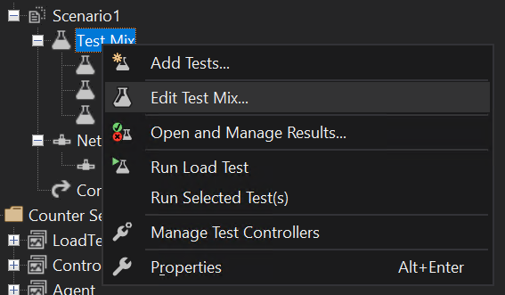
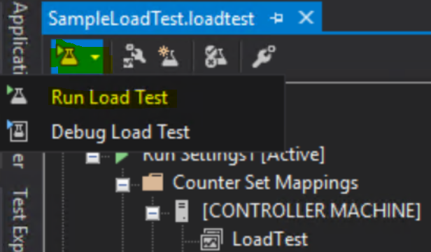

# Multi-user testing using the Performance SDK

[!include [banner](../includes/banner.md)]

This topic explains how to run multi-user testing by using Microsoft Visual Studio, the Performance SDK, and the Task recorder test scripts.

> [!IMPORTANT]
> Visual Studio 2019 will be the last version of Visual Studio with web performance and load test features.
> + If you are using the Visual Studio and Test Controller/Test Agent for on-premises load testing, Visual Studio 2019 will be the last version. You can continue using it until the end of the support cycle. 
> + For more information, see [Cloud-based load testing service end of life](https://devblogs.microsoft.com/devops/cloud-based-load-testing-service-eol/).

## Prerequisites

Before you complete the steps in this topic, verify that the following prerequisites are met:

- You have **Microsoft Visual Studio Enterprise edition** in a development environment. Enterprise edition is required to author load tests. If you are deploying your development box as a Cloud Hosted Environment through LCS, please make sure to select the appropriate Microsoft Visual Studio version to deploy.
- Verify that the Visual Studio Web performance and load testing tools are installed as described in the [quickstart documentation](https://docs.microsoft.com/visualstudio/test/quickstart-create-a-load-test-project?view=vs-2019#install-the-load-testing-component).
- You have a tier-2 or above sandbox environment that has the same release (application version and platform update) as your development environment.
- You've configured your development environment by following the steps in [Single-user testing with Task recorder and the Performance SDK](single-user-test-perf-sdk.md).
- C\# performance testing classes have been generated for your end-to-end (E2E) scenarios, and you can run a single-user test by following the steps in [Single-user testing with Task recorder and the Performance SDK](single-user-test-perf-sdk.md).

## Configure a development environment for multi-user testing

The following configurations need to be set up on the development machine that is used to host the testing controller and agent locally.

> [NOTE]
> For all Microsoft-managed or self-service type sandboxes, Microsoft will generate the certificate for your environment and have it pre-configured.

1. Create an environmental variable named **TestRoot**, and and point it to the **PerfSDK** folder by running the following cmdlet in Microsoft Windows PowerShell.

    ```powershell
    [ENVIRONMENT]::SETENVIRONMENTVARIABLE("TESTROOT", "K:\PERFSDK\PERFSDKLOCALDIRECTORY", "USER")
    ```

    To verify the variable, run the following command in Microsoft Windows PowerShell.

    ```powershell
    [ENVIRONMENT]::GETENVIRONMENTVARIABLE("TESTROOT", "USER") | Write-Host
    ```
2. Open the **environment details page** of your **target sandbox environment** on **Lifecycle Services**.

3. Under the **Maintain** menu option you'll see two new options.
    - **Download RSAT certificate**
    - **Regenerate RSAT certificate**

    

    Use the **Download** button to retrieve the certificate bundle as a .zip file.

4. You'll receive a warning that a clear-text password will be displayed on your screen. Select **Yes** to continue.

5. Copy the clear-text password for later use. You'll see the .zip file has been downloaded. Inside the .zip file is a certificate (.cer) and a personal information exchange (.pfx) file. Unzip the file.

6. Double-click the certificate to open it, and then select **Install**. Install this certificate to your local machine, and then browse to the **Personal** store. Repeat this process for the local machine, and browse specifically to the **Trusted Root Certification Authorities** store.

7. Double-click the personal information exchange (.pfx) file to open it and select **Install**. Install this certificate to your local machine, enter the password saved in step 2, and browse to the **Personal** store. Repeat this process for the local machine location, enter the password saved in step 2 and browse specifically to the **Trusted Root Certification Authorities** store.

8. Double-click the certificate file to open it. Browse to the **Details** tab and scroll down until you see the **Thumbprint** section. Select **Thumbprint** and copy the ID in the text box. Save this thumbprint to update the Performance SDK **CloudEnvironment.config** thumbprint.

> [NOTE]
> The certificate will be auto-rotated by Microsoft before it expires, at which time you will need to download a new version of this certificate. For self-service environments this will be rotated every 90 days during a downtime window that is closest to the expiry. These downtime windows include customer-initiated package deployment, and database movement operations that target the environment.

## Prepare the PerfSDKSample solution for multi-user testing

Perform the following steps to prepare the sample solution for performance testing. The sample solution can be found within the Performance SDK folder on your development environment. By default, the folder is `K:\PerfSDK\PerfSDKLocalDirectory`.

1. Run the following cmdlets with elevated permissions to verify that the certificate you installed earlier is installed correctly and the thumbprint you saved earlier is in the personal store on the local machine.

    ```powershell
    cd Cert:\LocalMachine\My
    Get-ChildItem | Where-Object { $_.Subject -like "CN=127.0.0.1" }
    ```

    The following illustration shows a sample result. Please make sure the thumbprint you saved earlier is in the list.

    

2. Update the configuration file **CloudEnvironment.config** in the Performance SDK folder describing the targeted environment. As part of this update, follow these steps:

    - Verify that the settings for **HostName** and **SOAPHostName** match your tier-2 or above sandbox environment.    
    - Add the thumbprint saved earlier as the value for **SelfSigningCertificateThumbprint**. If the entry is missing from your configuration file, you can add it as illustrated below.
    - Update **UserCount** to reflect the number of test users in your case.
    - Update **UserFormat** to reflect your naming convention for test users.
    - In each **AuthenticatorConfiguration element** under the **AuthenticatorConfigurationCollection element**, replace **MS.Dynamics.TestTools.CloudCommonTestUtilities.Authentication.SelfMintedTokenAadAuthenticator** with **MS.Dynamics.TestTools.CloudCommonTestUtilities.Authentication.SelfMintedTokenAuthenticator**.
    - Comment out the **AzureActiveDirectoryConfiguration** and **KeyVaultConfigurations elements**.

    > [!NOTE]
    > If your Finance and Operations apps were deployed in 21Vianet, make sure to specify **NetworkDomain="https://sts.chinacloudapi.cn/"** in **SelfMintingSysUser** and **SelfMintingAdminUser**.

    The result should look like the following example:

    

3. Rename the **vsonline.testsettings** file to **local.testsettings**. 
4. Open and modify the **local.testsettings** file in **Microsoft Visual Studio** by following these steps. 
    - In the **Test Settings** dialog box, on the **General** tab, in the **Test run Location** field group, select the **Run tests using local computer or a test controller** option.

    - On the **Deployment** tab, select the **Enable deployment** check box, and then use the **Add Directory** button to add the bin\debug folder to the **Additional files and directories to deploy** field.

        [](./media/perfsdk-multi-user-testing-04.png)

    - On the **Hosts** tab, in the **Run tests in 32 bits or 64 bits process** field, select **Run test in 64 bits process on 64 bits machine**.

    - Select **Apply**, and then close the **Test Settings** dialog box.
    - Open and modify your project configuration and set the **Target Framework** to **.NET Framework 4.6.2**.

    > [!NOTE]
    > Whenever you use the Microsoft Dynamics 365 Add-in to generate a C# performance test from a task recording, it will reload the project in Visual Studio instead of reopening the entire solution. Make sure to reload the solution before running any load tests to ensure the test settings file is visible.  

## Modifying the performance test sources

Perform these steps for each of the generated performance tests in your solution.

1. Add the following statement on top in the **using directives section**.

    ```csharp
    using MS.Dynamics.TestTools.UIHelpers.Core;
    ```

2. Modify the **TestSetup** method by replacing the entire body with the following lines.

    ```csharp
    private DispatchedClient Client;
    private UserContext _userContext;
    private TimerProvider timerProvider;
    [TestInitialize​]
    public void TestSetup()
    {
        if (this.TestContext != null)
        {
            timerProvider = new TimerProvider(this.TestContext);
        }

        SetupData();
        
        Client = new DispatchedClientHelper().GetClient();
        Client.ForceEditMode = false;
        Client.Company = WellKnownCompanyID.USMF.ToString();
        Client.Open();
    }
    ```

3. Modify the **TestCleanup** method so that it resembles the following example.

    ```csharp
    public void TestCleanup()
    {
        Client.Close();
        Client.Dispose();
        Client = Null;
    }
    ```

4. Build your solution.

## Adding a test to the load test mix

Perform the following steps to add a performance test to the test mix.

1. Open the **SampleLoadTest.loadtest** file and navigate to the **Test Mix** node.

2. Right-click the **Test Mix** node and select **Edit Test Mix**.

    

3. In the **Test Mix Dialog**, click the **Add tests** button to add your tests to the mix.

    [Test mix dialog](./media/perfsdk-multi-user-testing-06.png)

4. In the **Run Settings node**, modify the properties and update the **Timing** fields of **Run Settings1**. These fields include **Warm-up Duration**, **Run Duration**, and **Cool-down Duration**.

    

5. In the **Scenarios** node, make sure the update the **Load Pattern** and set the **Constant User Count** parameter to the total number of users that you want to use to run the test.

    

## Creating test users

Test users need to be added to the target environment with a matching naming pattern as the one specified in the **CloudEnvironment.config** configuration file. This can be done by either manually creating users in Microsoft Dynamics 365 environment or by using the **MS.Dynamics.Performance.CreateUsers.exe** console application which can be found in the Performnce SDK folder.

If you choose to create the users manually, please ensure the **System Administrator** security role is assigned to each user.

You should create the users through the console application, because it reads the configuration files and calls the appropriate service endpoints.  

## Run multi-user testing by using a local test controller

1. In the Visual Studio project, open the **SampleLoadTest load test file**, select **Run Load Test**.

    

2. Review the test output.

    

## Troubleshooting

For more information about single-user or multi-user testing that uses the Performance SDK, see [Troubleshooting guide for single-user or multi-user testing with the Performance SDK](troubleshoot-perf-sdk-user-testing.md).

[!INCLUDE[footer-include](../../../includes/footer-banner.md)]
