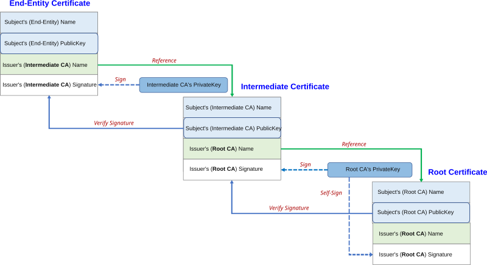

# Creating certificates for the RSAT certificate based authentication

In this article, you learn how to set up the certificate needed for Regression suite automation tool (RSAT) 2.8 certificate based authentication.

## About certificates

Digital certificates are digital "ID cards" that help establish trust online. They bind a public key to an entity's identity. Whether it's a website, an individual, or an organization, using
cryptography, ensuring secure communication across networks, certificates are a fundamental building block in modern security, forming part of a broader public key infrastructure (PKI) that underpins
secure communications across the internet. They provide a way to verify identity and establish encrypted channels, helping protect sensitive data from malicious actors.

Certificates are arranged as trees, with the Root certificate, also called the CA certificate, as shown in this diagram:



Binding intermediate and user certificates to a securely managed root certificate not only secures the foundational trust of your PKI but also makes certificate issuance, management, and eventual revocation more efficient and resilient to potential security breaches. This layered approach is core to modern digital security practices and maintains trust while enabling scalability and flexibility across complex
environments.

## Create certificates

Certificates are often generated by a certificate authority that issues certificates based on the identity of the applicant. You submit a certificate signing request to these providers and in return, they provide an SSL certificate signed using their root certificate and private key. The certificate has a specified life span. If you have a certificate from a CA provider, you can use that certificate instead of creating a self-signed certificate. You can also generate certificates from the Active directory certificate services.

In this section, we generate a self-signed certificate that we need to set up the RSAT system. We create a root certificate, an intermediate certificate, and a user certificate. After the certificates are created, these certificates are uploaded to Entra and installed on the local box running RSAT 2.8.

### Create a root certificate

These are also known as certificate authority (CA) certificates, the trusted authority used to generate the certificate. This CA cert signs any number of intermediate certificates.

 Here's a PowerShell script to generate a self-signed CA certificate:

```
\# Create a Root CA certificate (self-signed)\
\$rootCert = New-SelfSignedCertificate \`\
  -Subject \"CN=ContosoRootCA, O=Contoso, OU=IT, C=US\" \`\
  -KeyExportPolicy Exportable \`\
  -KeyUsage CertSign, CRLSign, DigitalSignature \`\
  -Type Custom \`\
  -KeyAlgorithm RSA \`\
  -KeyLength 2048 \`\
  -HashAlgorithm SHA256 \`\
  -NotAfter (Get-Date).AddYears(10) \`\
  -CertStoreLocation \"Cert:\\LocalMachine\\My\" \`\
  -TextExtension @(\"2.5.29.19={critical}{text}ca=true&pathlength=1\")

Export-Certificate -Cert \$rootCert -FilePath
\"C:\\Temp\\ContosoRootCA.cer\"
```

Each parameter means:

1.  **Creating the certificate**

\$rootCert = New-SelfSignedCertificate \`

This line calls the new self signed certificate cmdlet and assigns the generated certificate object to the variable \$rootCert.

2.  **Subject parameter**

-Subject \"CN=ContosoRootCA, O=Contoso, OU=IT, C=US\" \`

The subject parameter sets the distinguished name (DN) for the certificate. It contains:

- **CN (Common name):** \"ContosoRootCA\": The label for the certificate, typically used as the primary identifier.
- **O (Organization):** \"Contoso": Indicates the organization.
- **OU (Organizational Unit):** \"IT\": Denotes a specific department or division within the organization.
- **C (Country):** \"US\": The country code.

3.  **Key export policy**

-KeyExportPolicy Exportable \`

The key export policy parameter determines if the private key can be exported. Setting it to **Exportable** means the private key can be extracted from the certificate store as needed. 

4.  **Key usage**

-KeyUsage CertSign, CRLSign, DigitalSignature \`

The key usage parameter specifies what the certificate's key can be used for:

- **CertSign** - Allows the certificate to sign other certificates.
- **CRLSign** - Permits signing certificate revocation lists (CRLs).
- **DigitalSignature** - Enables the certificate to be used for creating digital signatures.\ These usages are typical for a certificate authority (CA) certificate.

5.  **Type**

-Type Custom \`

The type custom setting indicates that a certificate was created with customized properties, rather than using a predefined template. 

6.  **Key algorithm**

-KeyAlgorithm RSA \`

This parameter defines the algorithm for creating the key pair. **RSA** is selected, which is one of the most widely used public-key cryptographic algorithms.

7.  **Key length**

-KeyLength 2048 \`

The key length parameter sets the size of the cryptographic key in bits. A 2048-bit key is a common standard offering a strong balance between security and performance.

8.  **Hash algorithm**

-HashAlgorithm SHA256 \`

The hash algorithm parameter specifies the algorithm used during the certificate's creation (when signing the certificate). **SHA256** is a secure and widely adopted hash function.

9.  **Validity period**

-NotAfter (Get-Date).AddYears(10) \`

The not after parameter sets the expiration date of the certificate. Using (Get-Date).AddYears(10) means the certificate is valid for 10 years from the current date. Long lived root certificates are common.

10. **Certificate store location**

-CertStoreLocation \"Cert:\\LocalMachine\\My\" \`

This parameter indicates where in the certificate store the new certificate is placed. \"Cert:\\LocalMachine\\My\" refers to the personal store for the local computer account.

11. **Text extension**

-TextExtension @(\"2.5.29.19={critical}{text}ca=true&pathlength=1\")

The text extension parameter adds custom certificate extensions using a text-based format:

- **2.5.29.19** is the object identifier (OID) for the basic constraints extension.
- **{critical}** marks this extension as critical. If a client doesn't understand this extension, it shouldn't trust the certificate.
- **{text}ca=true&pathlength=1**  - this certificate is a CA certificate (ca=true) with a path length constraint of 1, which limits the number of subordinate certificate issuers that can follow in the chain.

12. **Exporting the certificate**

Export-Certificate -Cert \$rootCert -FilePath
\"C:\\Temp\\ContosoRootCA.cer\"

This command exports the created certificate to a file. This file contains the public portion of the certificate, without the private key. The file is stored at C:\\Temp\\ContosoRootCA.cer in a standard certificate file format (usually Base-64 encoded).

This script creates a self-signed root CA certificate with appropriate settings for a certificate authority: 
 - an exportable key usable for signing operations
 - a strong cryptographic setup (RSA with a 2048-bit key and SHA256)
 - a defined validity period

### Creating an intermediate certificate

To create an intermediate certificate that is signed with the root certificate, follow these steps: 
```
\# Create an Intermediate CA certificate (self-signed)\
\$rootSubject = \"CN=ContosoRootCA, O=Contoso, OU=IT, C=US\"

\$rootCert = Get-ChildItem -Path Cert:\\LocalMachine\\My \|\
    Where-Object { \$\_.Subject -eq \$rootSubject -and
\$\_.HasPrivateKey }

if (-not \$rootCert) {\
    Write-Error \"Root CA certificate with subject \'\$rootSubject\' not
found in LocalMachine\\My.\"\
    return\
}

\$intermediateCert = New-SelfSignedCertificate \`\
  -Subject \"CN=ContosoIntermediateCA, O=Contoso, OU=IT - Americas,
C=US\" \`\
  -KeyExportPolicy Exportable \`\
  -KeyUsage CertSign, CRLSign, DigitalSignature \`\
  -Type Custom \`\
  -KeyAlgorithm RSA \`\
  -KeyLength 2048 \`\
  -HashAlgorithm SHA256 \`\
  -NotAfter (Get-Date).AddYears(5) \`\
  -CertStoreLocation \"Cert:\\LocalMachine\\My\" \`\
  -Signer \$rootCert \`\
  -TextExtension @(\"2.5.29.19={critical}{text}ca=true&pathlength=0\")\
  

Export-Certificate -Cert \$intermediateCert -FilePath \"C:\\Temp\\.cer\"
```

1.  Define the root subject:

\$rootSubject = \"CN=ContosoRootCA, O=Contoso, OU=IT, C=US\"

The \$rootSubject variable stores the distinguished name (DN) of the root CA certificate that you previously created. The DN components include:

- **CN (Common name):** \"ContosoRootCA\"
- **O (Organization):** \"Contoso\"
- **OU (Organizational unit):** \"IT\"
- **C (Country):** \"US\"

2.  Retrieve the root certificate from the certificate store:

\$rootCert = Get-ChildItem -Path Cert:\\LocalMachine\\My \|\
Where-Object { \$\_.Subject -eq \$rootSubject -and \$\_.HasPrivateKey }

This command searches the local machine's personal certificate store (Cert:\\LocalMachine\\My) for certificates that match the subject defined in \$rootSubject and have an associated private key. The private key is critical because you need it to sign the intermediate certificate, establishing a chain of trust. If no matching certificate is found, the script can't proceed with signing.

### Create a user certificate

To create the user certificate that is validated by the intermediate certificate created above, use this PowerShell script:

```
\# Edit the details as needed\
\$account = \"testuser\"\
\$tenant = \"Contoso\"\
\$userUPN = \"<$account@$tenant.onmicrosoft.com>\"\
\$subjectPrefix = \"\$account.\$tenant.\"\
\$subject = \"CN=\$subjectPrefix User Certificate, O=\$tenant, OU=Users,
C=US\"

\# Find the Intermediate CA in the cert store\
\$intermediateSubject = \"CN=ContosoIntermediateCA, O=Contoso, OU=IT -
Americas, C=US\"\
\$intermediateCert = Get-ChildItem -Path Cert:\\LocalMachine\\My \|\
    Where-Object { \$\_.Subject -eq \$intermediateSubject -and
\$\_.HasPrivateKey }

if (-not \$intermediateCert) {\
    Write-Error \"Intermediate CA cert not found in
Cert:\\LocalMachine\\My.\"\
    return\
}

\$userCert = New-SelfSignedCertificate \`\
  -Subject \$subject \`\
  -KeyAlgorithm RSA \`\
  -KeyLength 2048 \`\
  -HashAlgorithm SHA256 \`\
  -CertStoreLocation \"Cert:\\LocalMachine\\My\" \`\
  -Type Custom \`\
  -KeyExportPolicy Exportable \`\
  -TextExtension @(\
      \"2.5.29.19={critical}{text}ca=false\",  \# Basic Constraints (not
a CA)\
      \"2.5.29.37={text}1.3.6.1.5.5.7.3.2\",   \# EKU: Client
Authentication\
      \"2.5.29.17={text}email=\$userUPN\"       \# SAN: RFC822Name
(email)\
  ) \`\
  -Signer \$intermediateCert \`\
  -NotAfter (Get-Date).AddYears(1)\
 

Export-Certificate -Cert \$userCert -FilePath
\"C:\\Temp\\\$subjectPrefix-UserCert.cer\"

\$certpwd = ConvertTo-SecureString -String \'yourreqpwdhere\' -force
-AsPlainText

Export-PfxCertificate -Cert \$userCert -FilePath
\"C:\\Temp\\\$subjectPrefix-UserCert.pfx\" -password \$certpwd
```

This script has these steps:
 - **User Identity Construction:\**
The script builds the necessary identity details (DN, UPN) for a user certificate, ensuring consistency in naming. The certificate is valid for one year after the date of the creation.

 - **Intermediate CA Integration:\**
It locates an existing intermediate CA certificate in the local machine store. This is crucial because it uses the signing the new user certificate, maintaining a chain of trust.

 - **Certificate Creation:\**
With the identity and signer in place, the script creates a new self-signed but subordinate certificate that's intended for client authentication. Custom text extensions clarify the usage and ensure it can't act as a CA.

 - **Export Process:\**
The certificate is exported both as a .cer file (public information only) for distribution/validation and as a .pfx file. This includes the private key and secured by a password for import or backup
purposes.

### Importing the root certificate

After the certificates are generated, configure the Public Key Infrastructure (PKI) importing the root certificate.

1)  Go to the Entra admin center at https://entra.microsoft.com and sign in.
2)  After logging in, under the **Protection** tab, select **Show more**, select **Security center**.
3)  Click **Create PKI**. In the security center, go to **Manage** > **Public key infrastructure (Preview)**.
4)  Click **Create PKI** in the top corner and provide a name for the PKI.


Select the PKI created


4)  Click +Add certificate authority
Select the root CA created above, and set \"Is this certificate authority the root?\" = Yes as shown below:


5)  For the intermediate certificate, set \"Is this certificate authority the root?\" = No
 


Both certificates should be listed:


6)  Set up the authentication methods.  

Go to **Security center** > **Manage** > **Authentication methods**.

 

Select **Certificate-based authentication** > select **Enable**.

Add in the group: 


After adding in the group, click **Configure**.


 - Click **Add Rule**.
 - Select **Certificate issuer (Checked)**.
 - Filter CAs by PKI (optional) if you have a lot of certificates.
 - Select the intermediate certificate.
 - Select multifactor authentication.
 - In **Affinity binding**, select **Low**.


Click **Add** and acknowledge the message:

 

Click **Save**. This enables the certificate based authentication to be classified as MFA.

 

### Install the certificates on the computer running RSAT

On the computer where you run RSAT, install the certificates:
1. Root CA certificates only need to install if self-signed.
2. Import these to the local machine > trusted root certification authorities: Root CA (.cer file) and Intermediate CA (.cer file).
3. Import into Local user > Personal the PFX file for the user certificate.
4. Enable Auto Cert Login for the tenant.
5. Edit the highlighted parts below for the tenant ID, and user certificate subject, and run in PowerShell to create the registry entries.

```
 New-Item -Path
\"HKLM:\\SOFTWARE\\Policies\\Microsoft\\Edge\\AutoSelectCertificateForUrls\"
-Force

New-ItemProperty -Path
\"HKLM:\\SOFTWARE\\Policies\\Microsoft\\Edge\\AutoSelectCertificateForUrls\"
\`\
  -Name \"1\" \`\
  -Value
\'{\"pattern\":\"\[\*.\]microsoftonline.com/f30eb649-d49c-41bc-91af-139e4fd1d9f6\",\"filter\":{\"SUBJECT\":{\"CN\":\"testuser.Contoso.
User Certificate\"}}}\' \`\
  -PropertyType String -Force
```

### Configure RSAT

In this case, the manual selection was used as the authentication method. It's important to provide the thumbprint from the user certificate.

 

When the **Test connection** button is clicked, the system shows that the connection is successful:

 

### RSAT certification modes

**Automated** - RSAT configures registry entries for the policy selection with each test case before running steps, such the CBA auth flow callback from certauth automatically selects a matching user
policy. The policies only store as "current user" because of permissions required for local machine entries. It's advised that no entries exist for local machine entries when using this option, such if someone has been using predefined, single local computer policy and manually deleted this before running automated.

**Predefined** - Users can't use automated but want to control their policies themselves. If filtering by subject from our rule in RSAT won't work, configuring this is feasible. It may be challenging to make a general policy works with all accounts. Predefined means RSAT doesn't touch policy entries in the registry at all. This gives an option for configuring the policy not under current users, but under the local machine to share between users.

**Manual** - RSAT removes any policy entries when playing back a test if one is there in advance, but only from the current user. This means if they have a policy from local machine then execution does fall back on this, so that shouldn't be mixed. The manual method gives a window of 10 seconds for manually selecting the policy when certauth callback for the selection of this.  

 

 

 

 
